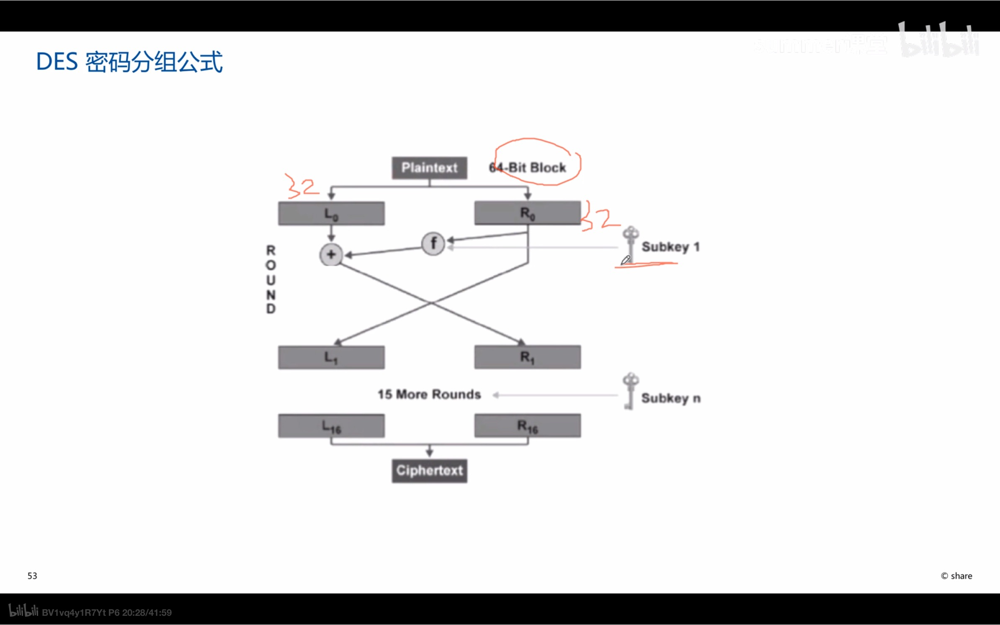
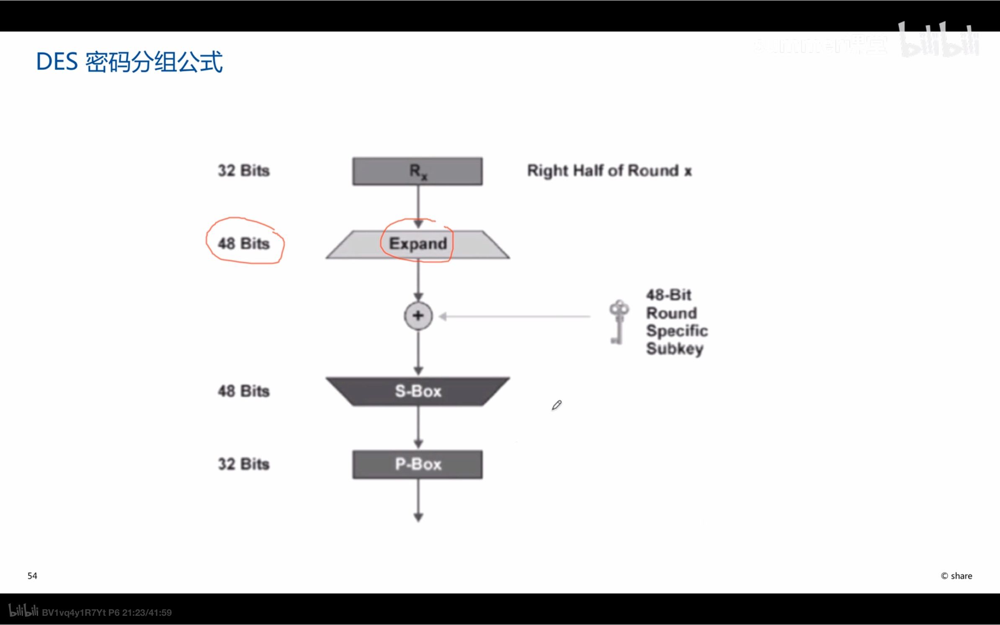
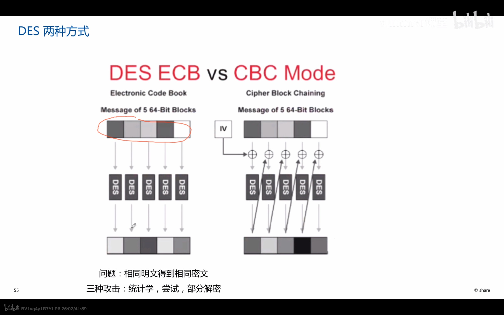
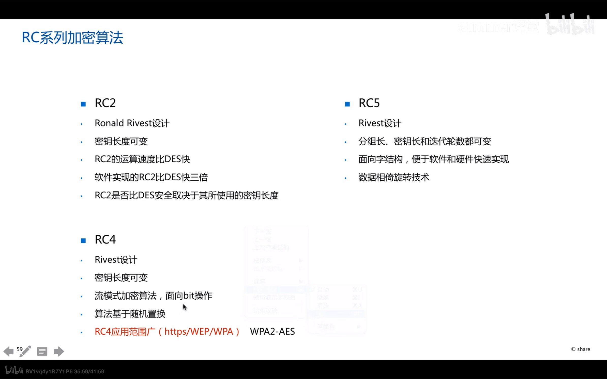

1. 基本：
   1. 使用同一个秘钥进行加密解密
   2. 分类：
      1. 传统秘钥加密
      2. 私钥秘钥加密
   3. 优势：加解密速度快，密文紧凑，安全
   4. 缺点：
      1. 秘钥分发慢，人数增多后秘钥增长太快
      2. 秘钥存储和管理。
      3. 缺乏对数据签名不认可不支持
      4. 传输秘钥过程中可能别监听窃取秘钥
   5. 加解密秘钥和相互推导
2. 算法
   1. DES
      1. 块分组加密算法
      2. 以块模块对64bit的密文块进行操作
      3. 操作
         1. 初始置换ip
         2. 进行16轮迭代
         3. 交换左右32比特
         4. 
         5. 
         6. 扩充后再缩减
      4. 与CBC区别
         1. DES 每个块明文对应的密文均相同，明文的模块之间不联系。易被攻破
         2. CBC先生成一个随机值对不同模块的叠加，使得模块之间的联系更加紧密，不易被破解
      5. 特点：
         1. 56bit的des太短，不安全，需要经常修改秘钥，防止暴力破解
            1. 没有漏洞，只能暴力破解
            2. wep虽然有108位秘钥，但有漏洞
         2. 需要在一个安全的信道交换des秘钥
         3. 3des：秘钥长度夸大三倍，几乎不能暴力破解
            1. 加解密时间延长，延迟较高
            2. 底层
   2. AES，取代des算法
      1. 适合高速网络，适合在硬件上实现
      2. 密码可变，使用拓展
      3. 相对3des，软硬件运行效率高，用于无线/语音视频加密通信
   3. RC
      1. 基于流的加解密算法，面向bit。对软硬件要求低
   4. IDEA
      1. 国际数据加密算法
   5. CAST
   6. Blowfish