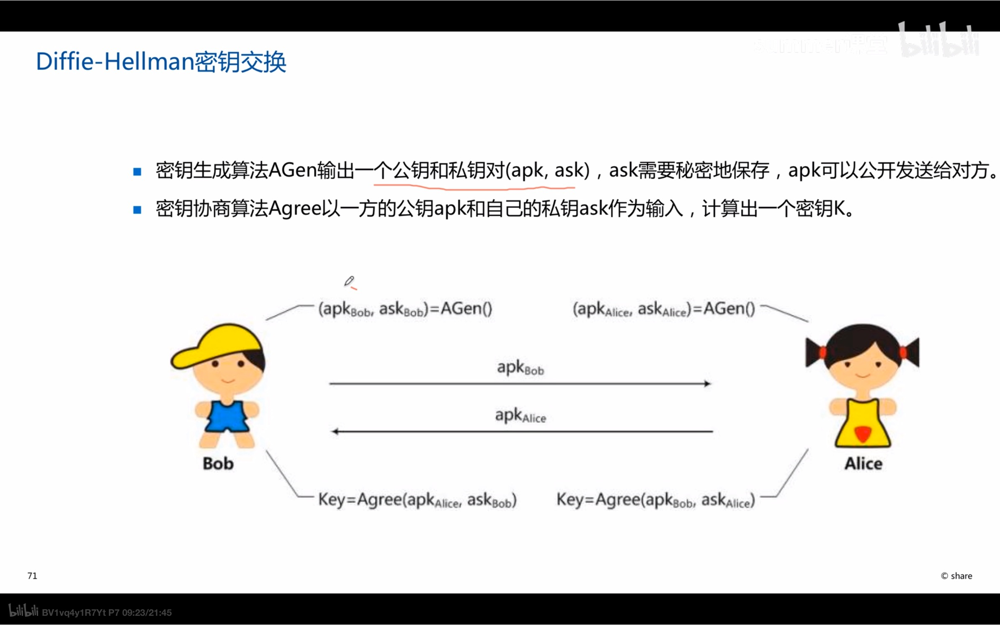
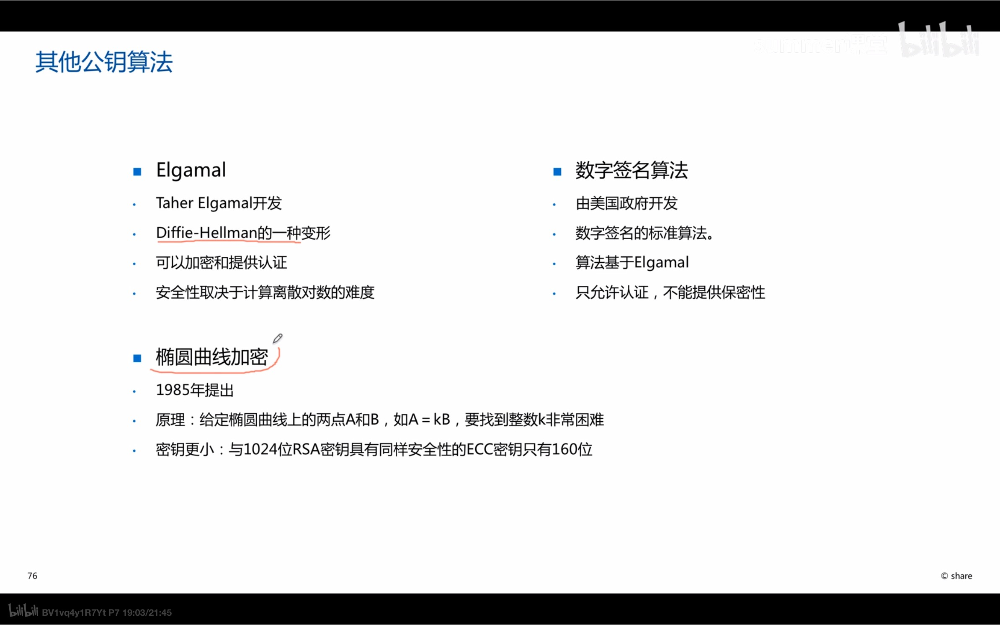

1. 两个秘钥，公钥和私钥，一个用来加密，另一个用来解密
   1. 公钥
      1. 用于其他人给A发生信息加密，收到A发送过来的信息解密
      2. 公开，人们都能看到
      3. 加密，保密性
   2. 私钥
      1. 用于A给其他人发生信息加密，收到其他人发送过来的信息解密
      2. 需安全保存（不通过网络传输）
      3. 签名。数字签名：
      4. 私钥可推出公钥，公钥不能推出私钥，是单向过程
   3. 用途
      1. 加密/解密
      2. 数字签名:发送方用自己的私钥签署报文，接收方用对方的公钥验证对方的签名
      3. 密钥交换:双方协商会话密钥
   
2. 算法特点
   1. 加密速度慢，密文非紧凑
   2. 可以与堆成加密相结合
   
3. 算法
   1. RSA
      1. 具备三种功能，最主流，应用的最多
      2. 安全性基于大素数因数的分解的困难性
      3. 数字签名和秘钥交换
   
   2. DH
      1. 解决对称加密系统中秘钥发布问题
      2. 安全性来源很难计算出很大的理算对数
      3. 通过算法使a的私钥与b的公钥生成的key与a的公钥与b的私钥生成的key相同，产生一个保密值，外人无法得到
   
   3. 其他加密
   
      1. 
   
      