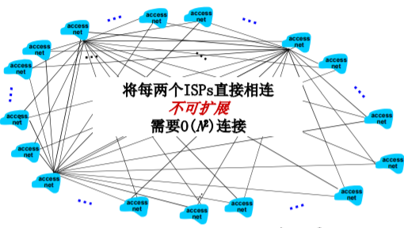

## 0、课程内容

计算机网络和互联网  
应用层  
传输层  
网络层:数据平面  
网络层:控制平面  
数据链路层和局域网  
网络安全  
无线和移动网络  
多媒体网络  
网络管理

功能 服务 实例

E2E end to end  
P2P point to point

IP协议 路由协议

## 1、计算机网络概述

### 1.1 什么是Internet

#### 什么是Internet：从具体构成角度

**零件的角度**

> - **节点**
>
>     - **主机及其上运行的应用程序**
>     - **路由器、交换机等网络交换设备**
> - **边：通信链路**
>
>     - **接入网链路：主机连接到互联网的链路**
>     - **主干链路：路由器间的链路**
> - **协议**
>

**网络互联设备的角度**

> **数以亿计的、互联的计算设备:  主机 = 端系统  运行网络应用程序**  
> ** 通信链路**  
> ** 光纤、同轴电缆、无线电 、卫星**  
> ** 传输速率 = 带宽（bps）**  
> ** 分组交换设备：转发分 组 (packets)**  
> ** 路由器和交换机**

> -  协议控制发送、接收消息
>
>     -  如TCP、IP、HTTP、FTP、 PPP
> -  Internet：“网络的网络”
>
>     -  松散的层次结构，互连的ISP
>     -  公共Internet vs. 专用intranet
> -  Internet标准
>
>     -  RFC: Request for comments
>     -  IETF: Internet Engineering Task Force

**协议**  
定义了在两个或多个通信实体（对等层的实体）之间交换的报文格式和次序，  
以及在报文传输和/或接收或 其他事件方面所采取的动作

语法 语义 时序

#### 什么是Internet：从服务角度

进行通信的分布式应用的角度

> - **使用通信设施进行通信的分布式应用**
>     - Web、VoIP、email、分布式游戏、电子商务、社交网络
> - 通信基础设施为apps提供编程接口(通信服务>
>     - 将发送和接收数据的apps与  
>         互联网连接起来
>     - 为app应用提供服务选择，类似于邮政服务:
>         - 无连接不可靠服务
>         - 面向连接的可靠服务

网络的系统划分

网络的边缘系统 网络的核心系统 网络的接入系统

### 网络结构

 网络边缘：  
 主机  
 应用程序（客户端和服务 器）  
 网络核心：  
 互连着的路由器  
 网络的网络  
 接入网、物理媒体：  
 有线或者无线通信链路

### 1.2 网络边缘

 端系统（主机）：  
 运行应用程序  
 如Web、email  
 在 “网络的边缘”

 客户/服务器模式  
 客户端向服务器请求、接收服务  
 如Web浏览器/服务器；email 客户端/服务器

 对等（peer-peer ）模式  
 很少（甚至没有）专门的服务器  
 如 Gnutella、KaZaA、Emule  
每个节点既是服务器也是客户端，互相请求，分布式系统，无客户/服务器模式的缺陷  
迅雷、电驴等 可以获得带宽的聚集

#### 网络边缘:采用网络设施的面向连接服务

- **目标**:在端系统之间传输数据
    - 握手:在数据传输之前做好准备
        - 人类协议中:你好、你好
        - 两个通信主机之间为连接建立状态
- TCP–传输控制协议(Transmission Control Protocol)  
    Internet上面向连接的服务

> - TCP 服务 \[RFC 793\]
>     - 可靠地、按顺序地传送数据
>         - 确认和重传
> - 流量控制
>     - 发送方不会淹没接收方
> - 拥塞控制
>     - 当网络拥塞时，发送方降低发送速率

#### 网络边缘：采用基础设施的无连接服务

- **目标**：在端系统之间传输数据无
  
    - 连接服务
- UDP – 用户数据报协议 (User Datagram Protocol) \[RFC 768\]:
  
     无连接  不可靠数据传输  无流量控制  无拥塞控制
    

使用TCP的应用：  HTTP (Web), FTP (文件传 送), Telnet (远程登录), SMTP (email)  
使用 UDP的应用：  流媒体、远程会议、 DNS、 Internet电话

### 1.3 网络核心

#### 网络核心：电路交换

端到端的资源被分配给从源端 到目标端的呼叫 “call”：

- 图中，每段链路有4条线路：
    - 该呼叫采用了上面链路的第2 个线路，右边链路的第1个线 路（piece）

- 独享资源：不同享
    - 每个呼叫一旦建立起来就能够 保证性能
- **如果呼叫没有数据发送，被分配 的资源就会被浪费 (no sharing)**
- 通常被传统电话网络采用

为呼叫预留端-端资源  链路带宽、交换能力  专用资源：不共享  保证性能  要求建立呼叫连接

- 网络资源（如带宽）被 分成片
    - 为呼叫分配片
    - 如果某个呼叫没有数据， 则其资源片处于空闲状态 （不共享）
    - 将带宽分成片
        - 频分(Frequencydivision multiplexing)
        - 时分(Time-division multiplexing)
        - 波分(Wave-division multiplexing)

**计算举例**

在一个电路交换网络上，从主机A到主机B发送一个640,000比特的文件需要多长时间?  
所有的链路速率为1.536 Mbps  
每条链路使用时隙数为24的TDM·建立端-端的电路需500 ms  
每条链路的速率（一个时间片): 1.536Mbps/24 =64kbps传输时间:640kb/64kps = 10s  
共用时间:传输时间+建立链路时间=10s + 500ms = 10.5s

**电路交换不适合计算机之间的通信**

- 连接建立时间长
- 计算机之间的通信有突发性，如果使用线路交换，则浪费的片较多
    - 即使这个呼叫没有数据传递，其所占据的片也不能够被别的呼叫使用
- 可靠性不高?

#### 网络核心：[分组交换](https://so.csdn.net/so/search?q=%E5%88%86%E7%BB%84%E4%BA%A4%E6%8D%A2&spm=1001.2101.3001.7020)

以分组为单位存储-转发方式

- 网络带宽资源不再分分为一个个片，传输时使用全部带宽
- 主机之间传输的数据被分为一个个分组

资源共享，按需使用：

- 存储-转发：分组每次移 动一跳（ hop ） **相当于分段使用链路**
- 在转发之前，节点必须收到 整个分组
- 延迟比线路交换要大
- 排队时间

**相当于多个电路交换，延迟更大（排队延迟，存储/转发延迟），而来换取了共享性**

1. 存储-转发  
     被传输到下一个链路之前， 整个分组必须到达路由器： 存储-转发  
     在一个速率为R bps的链路 ，一个长度为L bits 的分组 的存储转发延时： L/R s
    
2. 排队和延迟：
  
    如果到达速率>链路的输出速率:
    
    - 分组将会排队，等待传输
      
    - 如果路由器的缓存用完了，分组将会被抛弃
      

**网络核心的关键功能**

路由: 决定分组采用的源到 目标的路径

转发: 将分组从路由器的输 入链路转移到输出链路

3. 统计多路复用
  
    A&B 时分复用 链路资源 A & B 分组没有固定的模式 统计多路复用
    

#### 分组交换 vs. 电路交换

**同样的网络资源，分组交换允许更多用户使用网络！**

- 1 Mb/s链路口
  
- 每个用户:
  
    - 活动时100 kb/s
    - 10%的时间是活动的
- 电路交换:
  
    - 10用户口
- 分组交换:
  
    - 35用户时，>=10个用户活动的概率为0.0004  
        能支持更多用户

分组交换是“突发数据的胜利者?”

- 适合于对突发式数据传输
    - 资源共享
    - 简单，不必建立呼叫
- 过度使用会造成网络拥塞:分组延时和丢失
    - 对可靠地数据传输需要协议来约束:拥塞控制
- Q:怎样提供类似电路交换的服务?
    - 保证音频/视频应用需要的带宽
    - 一个仍未解决的问题(chapter 7)

Q: 预约服务（线路交换）对比按需服务（分组交换）的例 子?

#### 分组交换按照有无网络层的连接分类

分组交换——分组的存储转发一段一段从源端传到目标端

1. 数据报网络:
    - 分组的目标地址决定下一跳
    - 在不同的阶段，路由可以改变
    - 类似:问路
    - Internent
2. 虚电路网络:
    - 每个分组都带标签（虚电路标识VC ID），标签决定下一跳
    - 在呼叫建立时决定路径，在整个呼叫中路径保持不变
    - 路由器维持每个呼叫的状态信息
    - X.25和ATM

数据报(datagram) 的工作原理

- 在通信之前,无须建立起一个连接,有数据就传输
- 每一个分组都独立路由(路径不一样,可能会失序)
- 路由器根据分组的目标地址进行路由(不维护主机和主机之间的状态)

虚电路(virtual circuit)的工作原理

#### 网络分类

### 1.4 接入网和物理媒体

把网络边缘接入网络核心

Q: 怎样将端系统和边缘路由 器连接？  
 住宅接入网络  
 单位接入网络 （学校、公 司）  
 无线接入网络  
注意：  
 接入网络的带宽 (bits per second) ？  
 共享/专用？

#### 住宅接入：modem

- 将上网数据调制加载音频信号上， 在电话线上传输，在局端将其中的 数据解调出来；反之亦然  
     调频  调幅  调相位  综合调制
    
- 拨号调制解调器
  
    - 56Kbps 的速率直接接入路由器 (通常更低)
      
    - 不能同时上网和打电话：不能 总是在线
      

**接入网: digital subscriber line (DSL)**

- 采用现存的到交换局DSLAM的电话线
    - DSL线路上的数据被传到互联网 （>4kHz，上行、下行再分频率）
    - DSL线路上的语音被传到电话网 （< 4kHz）
- < 2.5 Mbps上行传输速率(typically < 1 Mbps)
- < 24 Mbps下行传输速率(typically < 10 Mbps)

**接入网: 线缆网络**

有线电视信号线缆双向改造  
FDM: 在不同频段传输不同信道的数据， 数字电视和上网数据（上下行）

- HFC: hybrid fiber coax
    - 非对称: 最高30Mbps的下行传输速率, 2 Mbps 上行传输 速率
- 线缆和光纤网络将个家庭用户接入到 ISP 路由器
- 各用户共享到线缆头端的接入网络
    - 与DSL不同, DSL每个用户一个专用线路到CO（central office）

#### 住宅接入：电缆模式

fiber optic transport——光纤传输

#### 接入网: 家庭网络

router, firewall, NAT

#### 企业接入网络(Ethernet)

 经常被企业或者大学等机构采用  
 10 Mbps, 100Mbps, 1Gbps, 10Gbps传输率  
 现在，端系统经常直接接到以太网络交换机上

#### 无线接入网络

 各无线端系统共享无线接入网络\*\*（端系统到无线路由器）\*\*

- 通过基站或者叫接入点

#### 物理媒体

Bit: 在发送-接收对间传播

物理链路：连接每个发送-接 收对之间的物理媒体  
**导引型媒体:信号沿着固体媒介被导引**：同轴电缆、光纤、 双绞线  
**非导引型媒体:开放的空间传输电磁波或者光信号**，在电磁或者光信号中承载数字数据

双绞线 (TP)  
 两根绝缘铜导线拧合  5类：100Mbps 以太网 ，Gbps 千兆位以太网  6类：10Gbps万兆以太网

**同轴电缆、光纤**

同轴电缆：  
 两根同轴的铜导线  
 双向  
 基带电缆：  电缆上一个单个信道  Ethernet  
 宽带电缆：  电缆上有多个信道  HFC

光纤和光缆：  
 光脉冲，每个脉冲表示一个 bit，在玻璃纤维中传输  
 高速：  点到点的高速传输（如10 Gps-100Gbps传输速率 ）  
 低误码率：在两个中继器之 间可以有很长的距离，不受 电磁噪声的干扰  
 安全

**无线链路**

 开放空间传输电磁波，携 带要传输的数据  
 无需物理“线缆”  
 双向  
 传播环境效应：  反射  吸收  干扰

无线链路类型:  
 地面微波  e.g. up to 45 Mbps channels  
 LAN (e.g., WiFi)  11Mbps, 54 Mbps,540Mbps…  
 wide-area (e.g., 蜂窝)  3G cellular: ~ 几Mbps  4G 10Mbps  5G 数Gbps  
 卫星 每个信道Kbps 到45Mbps (或者 多个聚集信道)  270 msec端到端延迟  同步静止卫星和低轨卫星

### 1.5 Internet结构和ISP

按ISP划分互联网

#### 互联网结构：网络的网络

- 端系统通过接入ISPs (Internet Service Providers)连接到互联网
    - 住宅，公司和大学的ISPs
- 接入ISPs相应的必须是互联的
    - 因此任何2个端系统可相互发送分组到对方
- 导致的“网络的网络”非常复杂
    - 发展和演化是通过**经济的和国家的政策**来驱动的
- 让我们**采用渐进方法**来描述当前互联网的结构

问题: 给定数百万接入ISPs，如何将它们互联到一起

选项: 将每个接入ISP都连接到全局ISP（全局范围内覆盖）？ 客户ISPs和提供者ISPs有经济合约

竞争：但如果全局ISP是有利可为的业务，那会有竞争者  
合作：通过ISP之间的合作可以完成业务的扩展，肯定会有互 联，对等互联的结算关系

Internet exchange point

…然后业务会细分（全球接入和区域接入），区域网络将出 现，用与将接入ISPs连接到全局ISPs  
然 后 内 容 提 供 商 网 络 (Internet Content Providers,e.g., Google, Microsoft, Akamai) 可能会构建它们自己的网络，将它们的服务、内容更 加靠近端用户，向用户提供更好的服务,减少自己的运营支出

在网络的最中心，一些为数不多的充分连接的大范围网络（分布广、节点有限、 但是之间有着多重连接）

- “tier-1” commercial ISPs (e.g., Level 3, Sprint, AT&T, NTT), 国家或者国际 范围的覆盖
- content provider network (e.g., Google): 将它们的数据中心接入ISP，方便周边 用户的访问；通常私有网络之间用专网绕过第一层ISP和区域

#### 松散的层次模型

中心：第一层ISP（如UUNet, BBN/Genuity, Sprint, AT&T）国家/国际覆盖，速率极高

- 直接与其他第一层ISP相连
- 与大量的第二层ISP和其他客户网络相连

第二层ISP: 更小些的 (通常是区域性的) ISP

- 与一个或多个第一层ISPs，也可能与其他第二层ISP

第三层ISP与其他本地ISP

- 接入网 (与端系统最近)

一个分组要经过许多网络！

很多内容提供商(如：Google, Akamai )可能会部署自己的网 络,连接自己的在各地的DC（数据中心），走自己的数据  
连接若干local ISP和各级（包括一层）ISP,更加靠近用户

 POP: 高层ISP面向客户网络的接入点，涉及费用结算  
 如一个低层ISP接入多个高层ISP，多宿（multi home）  
 对等接入：2个ISP对等互接，不涉及费用结算  
 IXP：多个对等ISP互联互通之处，通常不涉及费用结算  
 对等接入  
 ICP自己部署专用网络，同时和各级ISP连接

### 1.6 分组延时、丢失和吞吐量

分组丢失和延时是怎样发生的？

在路由器缓冲区的分组队列  
 分组到达链路的速率超过了链路输出的能力  
 分组等待排到队头、被传输

四种分组延时

1. **节点处理延时**：  检查 bit级差错  检查分组首部和决定将分组导向何处
  
2. **排队延时**  在输出链路上等待传输的时间  **依赖于路由器的拥塞程度**
  
3. **传输延时**:  R=链路带宽(bps)  L=分组长度(bits) ** 将分组发送到链路上的时间= L/R  存储转发延时**
  
4. **传播延时**:  d = 物理链路的长度  s = 在媒体上的传播速度 (~2x10^8 m/sec)  **传播延时 = d/s**
  

车队类比

> 情况一、
>
>  汽车以100 km/hr 的速度传播  
>  收费站服务每辆车需 12s(传 输时间)  
>  汽车~bit; 车队 ~ 分组  
>  Q: 在车队在第二个收费站排 列好之前需要多长时间？  
>  即：从车队的第一辆车到达第 一个收费站开始计时，到这个 车队的最后一辆车离开第二个 收费站，共需要多少时间
>
>  将车队从收费站输送到公 路上的时间 = 12\*10 = 120s  
>  最后一辆车从第一个收费 站到第二个收费站的传播 时间： 100km/(100km/hr)= 1 hr  
>  A: 62 minutes

> 情况二、
>
>  汽车以1000 km/hr 的速 度传播汽车  
>  收费站服务每辆车需 1分 钟  
>  Q:在所有的汽车被第一个 收费站服务之前，汽车会到达第二个收费站吗？
>
>  Yes！7分钟后，第一辆汽车 到达了第二个收费站，而第 一个收费站仍有3辆汽车  
>  在整个分组被第一个路由器 传输之前，第一个比特已经 到达了第二个路由器！

#### 节点延时

#### 排队延时

 R=链路带宽 (bps)  
 L=分组长度 (bits)  
 a=分组到达队列的平均速率

流量强度 = La/R  
** La/R ~ 0: 平均排队延时很小**  
** La/R -> 1: 延时变得很大，趋近无穷**  
** La/R > 1: 比特到达队列的速率超过了从该队 列输出的速率，平均排队延时将趋向无穷大！ 设计系统时流量强度不能大于1！**

#### Internet的延时和路由

 Internet 的延时和路由是什么样的呢?  
 Traceroute 诊断程序: 提供从源端，经过路 由器，到目的的延时测量  
 For all i:  
 沿着目的的路径，向每个路由器发送3个探测分组  
 路由器 i 将向发送方返回一个分组  
 发送方对发送和回复之间间隔计时

Traceroute 是 利用 ICMP协议 运作的

 在Windows系统下  
 Tracerert hostname  
 如 Tracerert www.gucas.ac.cn  
 更完整的例子  
 tracert \[-d\] \[-h maximum\_hops\] \[-j computer-list\] \[-w timeout\] target\_name  
 请见帮助： http://www.linkwan.com/gb/broadmeter/article/trace -help.htm

 测试网址：  www.traceroute.org  www.linkwan.com

#### 分组丢失

 链路的队列缓冲区容量有限  
 当分组到达一个满的队列时，该分组将会丢失  
 丢失的分组可能会被前一个节点或源端系统重传，或根本不重传

#### 吞吐量

 吞吐量: 在源端和目标端之间传输的速率（数据量/单位时间）  
 瞬间吞吐量: 在一个时间点的速率  
 平均吞吐量: 在一个长时间内平均值

**瓶颈链路：端到端路径上，限制端到端吞吐的链路(吞吐量最小的链路)**

吞吐量：互联网场景

 链路上的每一段实 际可用带宽Ri’=?  
 端到端吞吐量： min{Ri’}  
** 每个连接上的端到 端吞吐: min(Rc ,Rs ,R/10) 10个人在用**  
 实际上: Rc 或者 Rs 经常是瓶颈

### 1.7 协议层次及服务模型

网络是一个复杂的系统!  
 网络功能繁杂：数字信号的物理信 号承载、点到点、路由、rdt、进 程区分、应用等  
 现实来看，网络的许多构成元素和设备:  
 主机  
 路由器  
 各种媒体的链路  
 应用  
 协议  
 硬件, 软件

#### 问题是： 如何组织和实现这个复杂的网络功能？

模块化分解/分层

例子2:两位异地哲学家的交流  
哲学家/翻译层/邮局

**现实生活中的例子：航线系统**  
票务 (购买) 行李 (托运) 登机口 (登机) 从跑道起飞 按航线飞行  
票务 (投诉) 行李 (认领) 登机口 (离机) 从跑道着陆 按航线飞行  
按航线飞行

航线的功能层次

**层次化方式实现复杂网络功能:**  
 将网络复杂的功能分层功能明确的层次，每一层实现了其中一个或一 组功能，**功能中有其上层可以使用的功能：服务（垂直关系）**  
 **本层协议实体相互交互执行本层的协议动作（水平关系）**，目的是实现本层功能， 通过接口**为上层**提供更好的服务  
 在实现本层协议的时候，直接**利用了下层**所提供的服务  
 本层的服务：**借助下层服务实现的本层协议实体之间交互带来的 新功能**（上层可以利用的）+**更下层所提供的服务**

#### 服务

1. 服务和服务访问点
  
     服务( Service)：**低层实体向上层实体提供它们之间的通信的能力**  
     服务用户(service user)  
     服务提供者(service provider )  
     原语(primitive)：上层使用下层服务的形式，高层使用低层提供的服务，以及低层向高层提供服务都是通过 服务访问原语来进行交互的—形式 **比如socket API（一些类型的函数）**  
     服务访问点 SAP (Services Access Point) ：**上层使用下层提供的服务通过层间的接口—地点**；  
     例子:邮箱  
     **地址(address)：下层的一个实体支撑着上层的多个实体， SAP有标志不同上层实体的作用**  
     可以有不同的实现，队列  
     **例子:传输层的SAP: 端口(port)**  
    **比如：一个 地点/层间接口**
    
2. 服务的类型
  
    面向连接的服务和无连接的服务-方式
    
    - 面向连接的服务(Connection-oriented Service)
        - 连接(Connection):两个通信实体为进行通信而建立的一种结合
        - 面向连接的服务通信的过程:建立连接，通信，拆除连接面向连接的服务的例子:网络层的连接被成为虚电路
        - 适用范围:对于大的数据块要传输;不适合小的零星报文
        - 特点:保序
        - 服务类型:
            - 可靠的信息流传送页面(可靠的获得,通过接收方的确认)
            - 可靠的字节流远程登录
            - 不可靠的连接数字化声音
    
    面向连接的服务和无连接的服务
    
    - 无连接的服务(Connectionless Service)
        - 无连接服务:两个对等层实体在通信前不需要建立一个连接，不预留资源;不需要通信双方都是活跃;(例:寄信)
        - 特点:不可靠、可能重复、可能失序
        - IP分组，数据包;
        - 适用范围:适合传送零星数据;
        - 服务类型:
            - 不可靠的数据报电子方式的函件
            - 有确认的数据报挂号信
            - 请求回答信息查询
3. 服务和协议
  
    服务与协议的区别
    
      服务(Service)：**低层实体向上层实体**提供它们之间的 通信的能力，是通过\*\*原语(primitive)\*\*来操作的，垂直
    
     协议(protocol) ：\*\*对等层实体(peer entity)\*\*之间在相互 通信的过程中，需要遵循的规则的集合，水平  服务与协议的联系
    
      本层**协议的实现**要靠下层提供的服务来实现  
      本层实体通过协议为上层**提供更高级的服务**
    

**数据单元(DU)**

ICI : 接口控制信息 - _Interface_ _Control_ _Information_

**上层的PDU对于本层是SDU，封装后对于本层是PDU**  
两者的封装关系：一对一、一个SDU分成多个再进行封装，成多个PDU（一对多）、多个SDU封装成一个PDU（多对一）

**分层处理和实现复杂系统的好处？**

对付复杂的系统  
 概念化：结构清晰，便于标示网络组件，以及描述其 相互关系  
 分层参考模型  
 结构化：模块化更易于维护和系统升级  
 改变某一层服务的实现不影响系统中的其他层次  
 对于其他层次而言是透明的  
 如改变登机程序并不影响系统的其它部分  
 改变2个秘书使用的通信方式不影响2个翻译的工作  
 改变2个翻译使用的语言也不影响上下2个层次的工作  
 分层思想被认为有害的地方？  
效率相对较低

**Internet 协议栈**

- 应用层:网络应用（实现网络应用）  
    为人类用户或者其他应用进程提供网络应用服务  
    FTP,SMTP,HTTP,DNS
- 传输层:主机之间的数据传输（区分进程，把不可靠变为可靠）  
    **在网络层提供的端到端通信基础上，细分为进程到进程**，将不可靠的通信变成可靠地通信  
    TCP , UDP
- 网络层:为数据报从源到目的**选择路由**（转发、路由）  
    **主机主机之间的通信，端到端通信，不可靠**  
    IP,路由协议
- 链路层:相邻网络节点间的数据传输（相邻两点间，以帧位单位的传输）  
    **2个相邻2点的通信，点到点通信，可靠或不可靠**  
    点对对协议PPP,802.11(wifi),Ethernet
- 物理层:在线路上传送bit（相邻两点间电磁波的承载，以bit的传输）

ISO/OSI 参考模型  
** 表示层: 允许应用解释传输的数据, e.g., 加密，压缩，机器相关的表示转换**  
** 会话层: 数据交换的同步，检查点，恢复**  
 互联网协议栈没有这两层! **（在Internet协议栈在应用层实现）**

 这些服务，如果需要的话，必须被应用实现  
 需要吗?

#### 封装与解封装

> **链路层交换机主要用于组建局域网，而路由器则主要负责连接外网并寻找网络中最合适数据传输的路径。**
>
> 最后需要说明的是：路由器一般都具有防火墙功能，能够对一些网络数据包选择性的进行过滤。现在的一些路由器都具备交换机的功能，也有具备路由器功能的交换机，称为三层交换机。相比较而言，路由器的功能较交换机要强大，但是速度也相对较慢，价格较为昂贵，而三层交换机既有交换机的线性转发报文的能力，又有路由器的路由功能，因此得到了广泛的应用。

各层次的协议数据单元

应用层：报文(message)  
传输层：报文段(segment)：TCP段，UDP数据报  
网络层：分组packet（如果无连接方式：数据报 datagram）  
数据链路层：帧(frame)  
物理层：位(bit)

### 1.8 历史

**1980-1990: 体系结构变化, 网络数量激增，应用丰富**

 1983: TCP/IP部署，标记日  
 NCP分化成2个层次，TCP/IP， 从而出现UDP  
 覆盖式IP解决网络互联问题  
 主机设备和网络交换设备分开  1982: smtp e-mail协议定义  
 1983: DNS 定义，完成域名 到IP地址的转换  
 1985: ftp 协议定义  
 1988: TCP拥塞控制

 其他网络形式的发展  
 新的国家级网络: Csnet, BITnet, NSFnet, Minitel  
 1985年：ISO/OSI提出， 时机不对且太繁琐，

 100,000主机连接到网络联 邦

TCP/IP 极具包容性 IP for everything

**1990, 2000’s: 商业化, Web, 新的应用** Web与超文本

 Internet  
 什么是协议  
 网络边缘，核心，接入网络  
 分组交换 vs. 电路交换  
 Internet/ISP 结构  
 性能: 丢失，延时，吞吐量  
 层次模型和服务模型  
 历史

> 1. 组成角度看什么是互联网  
>     边缘:端系统(包括应用）+接入网核心:网络交换设备+通信链路  
>     协议:对等层实体通信过程中遵守的规则的集合·语法，语义，时序  
>     为了实现复杂的网络功能，采用分层方式设计、实现和调试  
>     应用层，传输层，网络层，数据链路层，物理层  
>     协议数据单位:  
>     报文，报文段，分组，帧，位  
>     从服务角度看互联网  
>     通信服务基础设施  
>     提供的通信服务:面向连接无连接·应用  
>     应用之间的交互  
>     . C/S模式  
>     . P2P模式
> 2. 数据交换  
>     分组数据交换线路交换  
>     比较线路交换和分组交换分组交换的2种方式  
>     虚电路  
>     数据报  
>     接入网和物理媒介  
>     接入网技术:  
>     住宅:ADSL，拨号，cable modem单位:以太网  
>     无线接入方式物理媒介  
>     光纤，同轴电缆，以太网，双绞线  
>     ISP层次结构
> 3. 分组交换网络中延迟和丢失是如何发生的  
>     延迟的组成:处理、传输、传播、排队  
>     网络的分层体系结构  
>     分层体系结构  
>     服务  
>     协议数据单元封装与解封装历史