目标：  
 理解传输层的工作原理  
 多路复用/解复用  
 可靠数据传输  
 流量控制  
 拥塞控制  
 学习Internet的传输层协议  
 UDP：无连接传输  
 TCP：面向连接的可靠传 输  
 TCP的拥塞控制

## 3.1 概述和传输层服务

传输服务和协议

- 为运行在不同主机上的应 用进程提供逻辑通信
- 传输协议运行在端系统
    - 发送方：将应用层的报文分成报文段，然后传递给网络层
    - 接收方：将报文段重组成报文，然后传递给应用层
- 有多个传输层协议可供应用选择
    - Internet: TCP(字节流的服务，不保证界限) 和 UDP

### 传输层 vs. 网络层

- 网络层服务：主机之间的逻辑通信
  
- 传输层服务：进程间的逻辑通信
  
    - 依赖于网络层的服务
        - 延时、带宽
    - 并对网络层的服务进行增强
        - 数据丢失、顺序混乱、 加密

有些服务是可以加强的：不可靠 -> 可靠；安全  
但有些服务是不可以被加强的：带宽，延迟

### Internet[传输层协议](https://so.csdn.net/so/search?q=%E4%BC%A0%E8%BE%93%E5%B1%82%E5%8D%8F%E8%AE%AE&spm=1001.2101.3001.7020)

可靠的、保序的传输： TCP(字节流的服务)

- 多路复用、解复用
- 拥塞控制
- 流量控制
- 建立连接

不可靠、不保序的传输：[UDP](https://so.csdn.net/so/search?q=UDP&spm=1001.2101.3001.7020)(数据包的服务)

- 多路复用、解复用
- 没有为尽力而为的IP服务添加更多的其它额外服务

**都不提供的服务： 延时保证 带宽保证**

## 3.2 多路复用与解复用

多路复用/解复用（一个TCP/UDP实体上有很多应用进程借助其发送）

在发送方主机多路复用  
从多个套接字接收来自多个进程的报文，**根据套接字对应的IP地址和端口号**等信息对报文段用头部加以封装 (该头部信息用于以后的**解复用**)

在接收方主机多路解复用  
根据报文段的头部信息中的**IP地址和端口号将接收到的报文段发给正确的套接字**(和对应的应用进程)

多路解复用工作原理

- 解复用作用：TCP或者UDP实体采 用哪些信息，将报文段的数据部分 交给正确的socket，从而交给正确 的进程
- 主机收到IP数据报
    - 每个数据报有源IP地址和目标地 址
    - 每个数据报承载一个传输层报 文段
    - 每个报文段有一个源端口号和 目标端口号 (特定应用有著名的端口号)
- 主机联合使用IP地址和端口号将报文段发送给合适的套接字

无连接(UDP)多路解复用

当创建UDP段采用端口号，可以指定： • 目标IP地址 • 目标端口号  
当主机接收到UDP段时： • 检查UDP段中的目标端 口号 • 将UDP段交给具备那个端口号的套接字  
**目标IP地址，目标端口号一样发送给同一个进程**

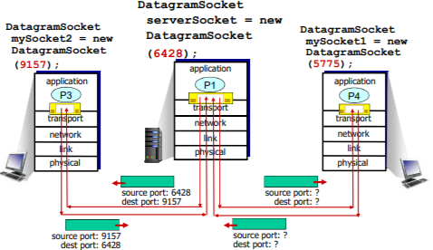

面向连接(TCP)的多路复用

TCP套接字:四元组本 地标识：  源IP地址  源端口号  目的IP地址  目的端口号  
解复用：接收主机用 这四个值来将数据报 定位到合适的套接字

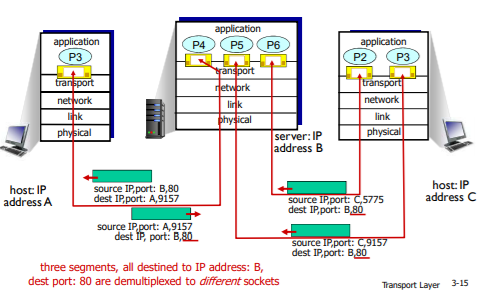

socket 和message

## 3.3 无连接传输：UDP

UDP: User Datagram Protocol 用户数据包协议  
在IP（主机到主机）所提供的基础上增加了一个多路复用/解复用（进程到进程）的服务

- “尽力而为”的服务，报文 段可能
  
    - 丢失
    - 送到应用进程的报文段乱序（延迟不一样）
- 无连接：
  
    - UDP发送端和接收端之间没有握手
    - 每个UDP报文段都被独立地处理
- UDP 被用于:
  
    - （实时）流媒体（丢失不敏感， 速率敏感、应用可控制 传输速率）
    - DNS
    - SNMP
    - 事务性的应用(一次性往返搞定)
- 在UDP上可行可靠传输:
  
    - **在应用层增加可靠性**
    - **应用特定的差错恢复**

### UDP：用户数据报协议

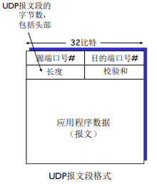

### 为什么要有UDP?

1. 不建立连接 (会增加延时)
  
2. 简单：在发送端和接收端没有连接状态
  
3. **报文段的头部很小(开销小)**
  
4. **无拥塞控制和流量控制**：UDP可以尽可能快的发送报文段
  
5. **应用->传输的速率 = 主机->网络的速率 (忽略头部时)**
  

### UDP[校验和](https://so.csdn.net/so/search?q=%E6%A0%A1%E9%AA%8C%E5%92%8C&spm=1001.2101.3001.7020)

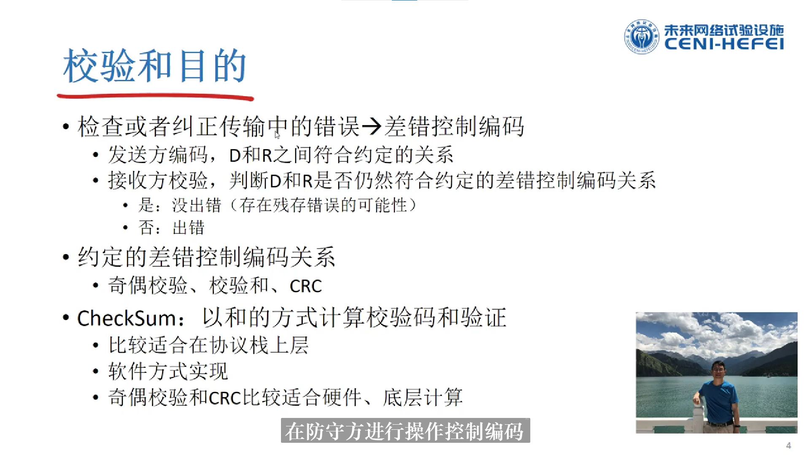

目标： 检测在被传输报文段中的差错 (如比特反转)

方法: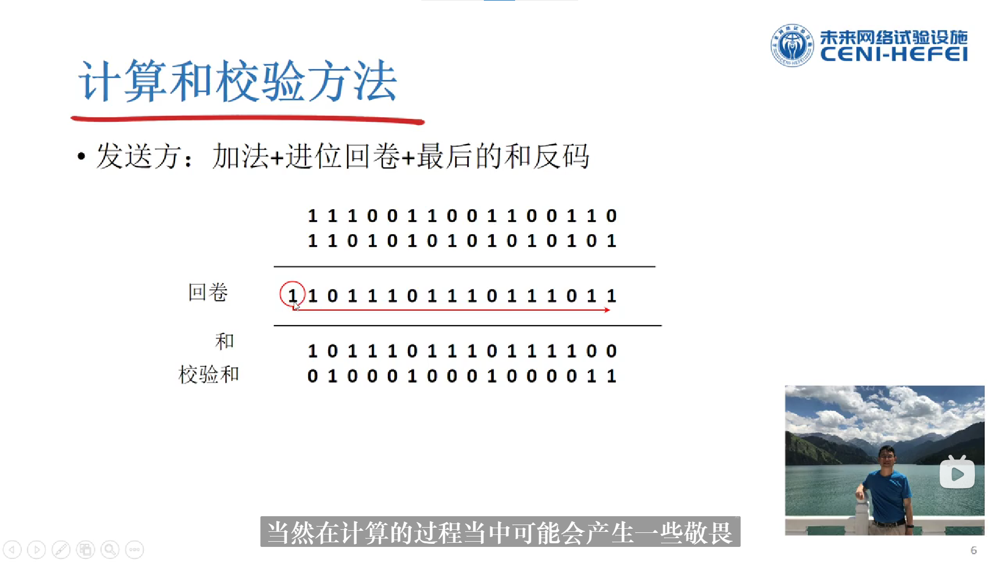

发送发：

​	先分成16位将其进行相加（初始时其校验和均为0，不够十六位进行0在其后补位），而每次产生的进位均加到其最低位，然后将最	后结果求反码，其便为校验和

接受方：对其直接分成16位将其进行相加（将其加上伪头部，同时包括检验和）直接计算，看是否为全一，若是则无错（基本无错，出错后还满足概率较低），若不为全1则出错

​	与其先与不包含检验和的数据进行相加并求反码后再与检验和比较比较：第一种快速，

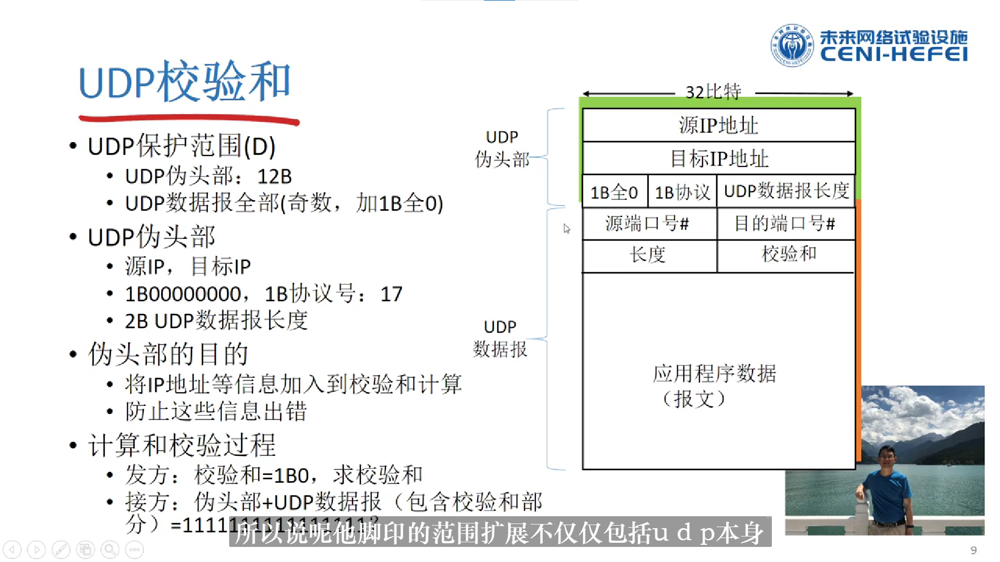

在进行计算校验和时，参与校验的部分需要添加一个伪头部，伪头部包括源IP和目的IP，还有数据长度。在进行保证数据正确的同时也保证了这些信息的正确。伪头部实际存在，不进行数据传输

发送方：  
 将报文段的内容视为16 比特的整数  
 校验和：报文段的加法和（1的补运算）  
 发送方将校验和放在 UDP的校验和字段

接收方：  
 计算接收到的报文段的校验和  
 检查计算出的校验和与校验和字段的内容是否相等：  
 不相等––检测到差错  
 **相等––没有检测到差错 ，但也许还是有差错 (残存错误，为检测出来)**

### Internet校验和的例子

注意：当数字相加时，在最高位的进位要回卷（加到最低位上），再加到结果上

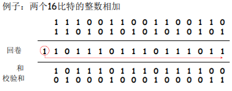

 **目标端：校验范围+校验和=1111111111111111 通过校验**  
 否则没有通过校验  
 注：求和时，必须将进位回卷到结果上

## 3.4 可靠数据传输的原理

可靠数据传输（rdt）的原理 rdt(Reliable Data Transfer)

 rdt在应用层、传输层和数据链路层都很重要  
 是网络Top 10问题之一

 [信道](https://so.csdn.net/so/search?q=%E4%BF%A1%E9%81%93&spm=1001.2101.3001.7020)的不可靠特点决定了可靠数据传输协议（ rdt ）的复杂性

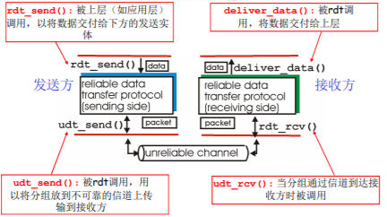

 渐增式地开发可靠数据传输协议（ rdt ）的发送方和接收方  
 只考虑单向数据传输  
 但控制信息是双向流动的！  
 **双向的数据传输问题实际上是2个单向数据传输问题的综合**  
 使用**有限状态机 (FSM)** 来描述发送方和接收方

### Rdt1.0： 在可靠信道上的可靠数据传输

**下层的信道是完全可靠的**

- 没有比特出错
- 没有分组丢失

发送方和接收方的FSM

- 发送方将数据发送到下层信道
- 接收方从下层信道接收数据

发送方：接收–封装–打走 接收方：解封装–交付 什么都不用干

### Rdt2.0：具有比特差错的信道

下层信道可能会出错：将分组中的比特翻转  
 用校验和来检测比特差错

 问题：怎样从差错中恢复：  
 确认(ACK)：接收方显式地告诉发送方分组已被正确接收  
 否定确认( NAK): 接收方显式地告诉发送方分组发生了差错  
• 发送方收到NAK后，发送方重传分组

 rdt2.0中的新机制：采用差错控制编码进行差错检测  
 发送方差错控制编码、缓存  
 接收方使用编码检错  
 接收方的反馈：控制报文（ACK，NAK）：接收方->发送方  
 发送方收到反馈相应的动作

#### Rdt2.0：FSM描述

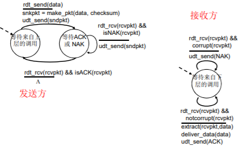

发送方接收nak (接收方检测出错) ，将之前封装的package重传，直到收到ack才开始下一轮的发送

### rdt2.0的致命缺陷！-> rdt2.1

如果ACK/NAK出错？  
 发送方不知道接收方发生了什么事情！  
 **发送方如何做？**  
 **重传？可能重复**  
 **不重传？可能死锁(或出 错)**  
 **需要引入新的机制**  
 **序号**

处理重复：  
 发送方在每个分组中加 入序号  
 如果ACK/NAK出错，发送方重传当前分组  
 **接收方丢弃（不发给上层）重复分组**  
**接收方通过序号判断，是否重复接收同样的包，在进行下一次流程/发送ack**

**停等协议: 发送方发送一个分组， 然后等待接收方的应答**

发送方：

1. 在分组中加入序列号  
     两个序列号（0，1）就 足够了  
     一次只发送一个未经确认 的分组
2. 必须检测ACK/NAK是否 出错（需要EDC ）  
    状态数变成了两倍  
    必须记住当前分组的序列号为0还是1

接收方：

1. 必须检测接收到的分组是否是重复的  
     状态会指示希望接收到的 分组的序号为0还是1

注意：接收方并不知道 发送方是否正确收到了 其ACK/NAK

**rdt2.1的运行**

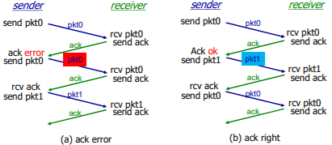

接收方不知道它最后发送的ACK/NAK是否被正确地收到  
 发送方不对收到的ack/nak给确认，**没有所谓的确认的确认**；  
 接收方发送ack，如果后面接收方收到的是：  
 **老分组p0？则ack 错误**  
 **下一个分组？P1，ack正确**

### rdt2.2：无NAK的协议

- 功能同rdt2.1，但只使用ACK(ack 要编号）
- 接收方对最后正确接收的分组发ACK，以替代NAK
    - 接收方必须显式地包含被正确接收分组的序号
- **当收到重复的ACK（如：再次收到ack0）时，发送方与收到NAK采取相同的动作：重传当前分组**
- 为后面的一次发送多个数据单位做一个准备
    - 一次能够发送多个
    - 每一个的应答都有：ACK，NACK；麻烦
    - 使用对前一个数据单位的ACK，代替本数据单位的nak
    - 确认信息减少一半，协议处理简单

NAK free

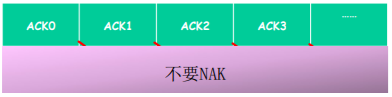

**rdt2.2的运行**

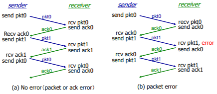

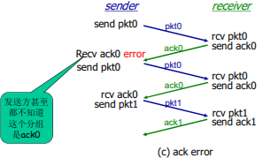

1、No error 2、packet error 3、ack error

### rdt3.0：具有比特差错和分组丢失的信道

**新的假设：下层信道可 能会丢失分组（数据或ACK）**  
 会死锁  
 机制还不够处理这种 状况：  
• 检验和  
• 序列号  
• ACK  
• 重传

- 方法：发送方等待ACK一段合理的时间  
    发送端**超时重传**：如果到时没有 收到ACK->重传
- 问题：如果分组（或ACK ）只 是被延迟了：  
    重传将会导致数据重复，但利用序列号已经可以处理这 个问题  
    接收方必须指明被正确接收的序列号
- 需要一个倒计数定时器

链路层的timeout时间确定的 （比较集中）  
传输层timeout时间是适应式的 （不太集中）

#### rdt3.0的运行

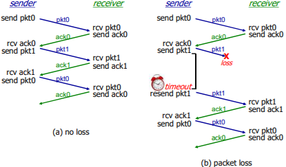

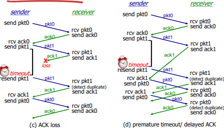

1、no loss 2、packet loss 3、ACK loss **4、premature timeout/ delayed ACK**

 **过早超时（延迟的ACK）也能够正常工作；但是效率较低，一半的分组和确认是重复的；**  
 设置一个合理的超时时间也是比较重要的；

#### rdt3.0的性能

**rdt3.0可以工作，但链路容量比较大的情况下，性能很差**

- 链路容量比较大，一次发一个PDU 的不能够充分利用链路的传输能力

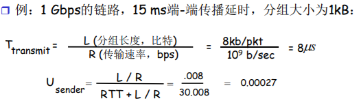

- U sender：利用率 – 忙于发送的时间比例
- 每30ms发送1KB的分组 -> 270kbps=33.75kB/s 的吞吐量（在1 Gbps 链路上）
- 瓶颈在于：网络协议限制了物理资源的利用！

### rdt3.0：停-等操作 stop-wait

**一次收发一个**

### 流水线：提高链路利用率

pipeline

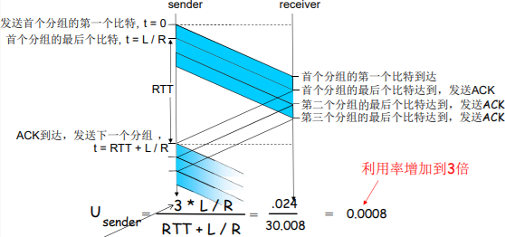

 增加n,能提高链路利用率  
 但当达到某个n,其u=100%时,无法再通过增加n，提高利用率  
 瓶颈转移了->链路带宽

#### 流水线协议/管道化协议

流水线：允许发送方在未得到对方确认的情况下一次发送多个 分组  
 必须增加序号的范围:用多个bit表示分组的序号  
 在发送方/接收方要有缓冲区  
• 发送方缓冲：未得到确认，可能需要重传；  
• 接收方缓存：上层用户取用数据的速率≠接收到的数据速率；接收到的数据可 能乱序，排序交付（可靠）

| slide window | sw(sending window) | rw(receiving window) |           |
| ------------ | ------------------ | -------------------- | --------- |
|              | \=1                | \=1                  | stop-wait |
| 流水线协议   | \>1                | \=1                  | GBN       |
| 流水线协议   | \>1                | \>1                  | SR        |

两种通用的流水线协议：回退N步(GBN)和选择重传(SR)

#### 发送缓冲区

- **形式：内存中的一个区域，落入缓冲区的分组可以发送**
- **功能：用于存放已发送，但是没有得到确认的分组**
- **必要性：需要重发时可用**

发送缓冲区的大小：一次最多可以发送多少个未经确认的分组

- 停止等待协议=1
- 流水线协议>1，合理的值，不能很大，链路利用率不能够超100%

发送缓冲区中的分组

- 未发送的：落入发送缓冲区的分组，可以连续发送出去；
- **已经发送出去的、等待对方确认的分组：发送缓冲区的分组只有得到确认才能删除**

#### 发送窗口

采用相对移动方式表示，分组不动  
可缓冲范围移动，代表一段可以发送的权力

**发送窗口：发送缓冲区内容的一个范围**

- 那些已发送但是未经确认分组的序号构成的空间

发送窗口的最大值<=发送缓冲区的值  
一开始：没有发送任何一个分组

- 后沿=前沿
- 之间为发送窗口的尺寸=0

每发送一个分组，前沿前移一个单位

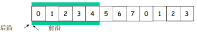

发送窗口前沿移动的极限：不能够超过**发送缓冲区的大小**

发送窗口后沿移动  
条件：收到老分组的确认  
结果：发送缓冲区罩住新的分组，来了分组可以发送  
移动的极限：不能够超过前沿

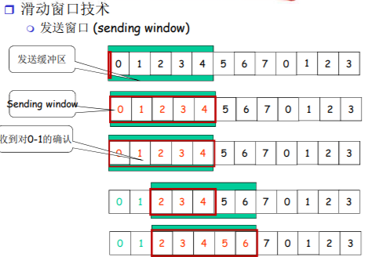

#### 接收窗口

| slide window | sw (sending window) | rw (receiving window) |           |
| ------------ | ------------------- | --------------------- | --------- |
|              | \=1                 | \=1                   | stop-wait |
| 流水线协议   | \>1                 | \=1                   | GBN       |
| 流水线协议   | \>1                 | \>1                   | SR        |

**两种通用的流水线协议：回退N步(GBN)和选择重传(SR)**

接收窗口 (receiving window)=接收缓冲区

- 接收窗口用于控制哪些分组可以接收；
    - 只有收到的分组序号落入接收窗口内才允许接收
    - 若序号在接收窗口之外，则丢弃；
- **接收窗口尺寸Wr=1，则只能顺序接收；**
- **接收窗口尺寸Wr>1 ，则可以乱序接收**
    - 但提交给上层的分组，要按序

例子：Wr＝1，在0的位置；只有0号分组可以接收；向前滑动一个，罩在1的位置，如果来了第2号分组，则丢 弃。

接收窗口的滑动和发送确认

- 滑动：
    - 低序号的分组到来，接收窗口移动；
    - 高序号分组乱序到，缓存但不交付（因为要实现rdt，不允许失序），不滑动
- 发送确认：
    - **接收窗口尺寸=1 ； 发送连续收到的最大的分组确认（累计确认）**
    - **接收窗口尺寸>1 ； 收到分组，发送那个分组的确认（非累计确认）**

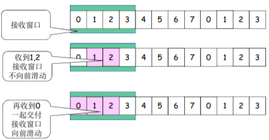

#### 正常情况下的2个窗口互动

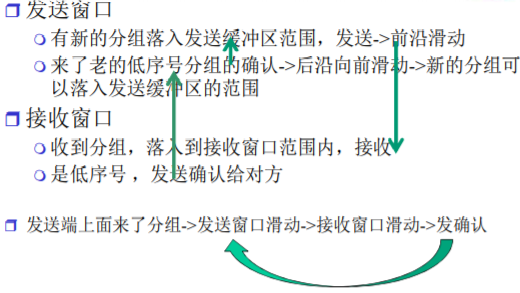

#### 异常情况下GBN的2窗口互动

发送窗口

- 新分组落入发送缓冲区范围，发送->前沿滑动
  
- **超时重发机制让发送端将发送窗口中的所有分组发送出去**
  
- 来了老分组的重复确认->后沿不向前滑动->新的分组无法落入发送缓冲区的范围团(此时如果发送缓冲区有新的分组可以发送)
  

接收窗口

- 收到乱序分组，没有落入到接收窗口范界内，抛弃
- (重复）发送老分组的确认，**累计确认**

#### 异常情况下SR的2窗口互动

发送窗口

- 新分组落入发送缓冲区范围，发送->前沿滑动
- **超时重发机制让发送端将超对的分组重新发送出去**
- 来了乱序分组的确认->后沿不向前滑动->新的分组无法落入发送缓冲区的范围（此时如果发送缓冲率有新的分组可以发送)

接收窗口

- 收到乱序分组，落入到接收窗口范围内，接收
- 发送该分组的确认，**单独确认**

#### GBN协议和SR协议的异同

相同之处  发送窗口>1  一次能够可发送多个 未经确认的分组

不同之处

GBN :接收窗口尺寸=1

- **接收端：只能顺序接收**
- **发送端：从表现来看，一旦一个 分组没有发成功，如：0,1,2,3,4 ; 假如1未成功，234都发送出去 了，要返回1再发送；GB1(go back 1)**

SR: 接收窗口尺寸>1

- **接收端：可以乱序接收**
- **发送端：发送0,1,2,3,4，一旦1 未成功，2,3,4,已发送，无需重发，选择性发送1**

**Go-back-N:**  
 发送端最多在流水线中有N个未确认的分组  
 **接收端只是发送累计型确认(cumulative ack)**  
 接收端如果发现gap，不确认新到来的分组

发送端拥有对最老的 未确认分组的定时器  
只需设置一个定时器  
**当定时器到时时，重传所有未确认分组**

**Selective Repeat:**  
 发送端最多在流水线中有N个未确认的分组  
 接收方对每个到来的分组单独确认individual ack （非累计确认）

发送方为每个未确认的分组保持一个定时器  
当超时定时器到时，只是重发到时的未确认分组

#### 运行中的GBN

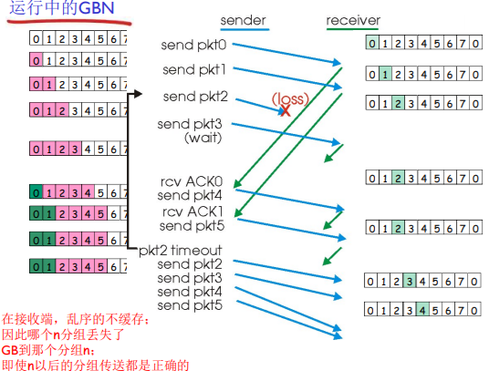

#### 选择重传SR的运行

 发送窗口的最大值（发送缓冲区）限制发送未确认分组的个数

发送方

> 从上层接收数据：  
>  如果下一个可用于该分组的序 号可在发送窗口中，则发送  
> timeout(n):  
>  重新发送分组n，重新设定定时器  
> ACK(n) in \[sendbase,sendbase+N\]:  
>  将分组n标记为已接收  
>  如n为最小未确认的分组序号， 将base移到下一个未确认序号

接收方

> 分组n \[rcvbase, rcvbase+N-1\]  
>  发送ACK(n)  
>  乱序：缓存  
>  有序：该分组及以前缓存的 序号连续的分组交付给上层 ，然后将窗口移到下一个仍 未被接收的分组  
> 分组n \[rcvbase-N, rcvbase-1\]  
>  ACK(n) 其它：  
>  忽略该分组

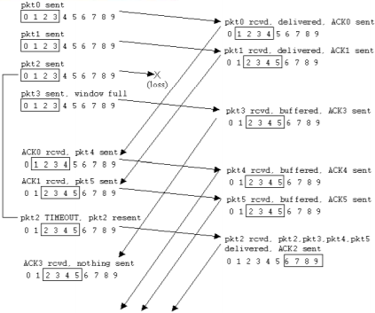

#### 对比GBN和SR

|      | GBN                                     | SR                                        |
| ---- | --------------------------------------- | ----------------------------------------- |
| 优点 | 简单，所需资源少（接收方一个 缓存单元） | 出错时，重传一个代价小                    |
| 缺点 | 一旦出错，回退N步代价大                 | 复杂，所需要资源多（接收方多个 缓存单元） |

**适用范围**

- 出错率低：比较适合GBN，出错非常罕见，没有必 要用复杂的SR，为罕见的事件做日常的准备和复杂处理
- 链路容量大\*\*（延迟大、带宽大）\*\*：比较适合SR而不 是GBN，一点出错代价太大

**窗口的最大尺寸**

 GBN: 2^n -1  
 SR:2^(n-1) 例  
如：n=2; 序列号：0, 1, 2, 3  
 GBN =3  
 SR=2  
SR的例子：  接收方看不到二者的区别！  将重复数据误认为新数据 (a)

Q: 序号大小与窗口大小 之间的关系？

## 3.5 面向连接的传输： TCP

点对点：一个发送方，一个接收方

可靠的、按顺序的字节流：没有报文边界

管道化（流水线）：TCP拥塞控制和流量控制设置窗口大小

发送和接收缓存

全双工数据：

- 在同一连接中数据流双向 流动
- MSS：最大报文段大小 MSS的大小 + TCP头部 + IP头部 = 一个报文段

面向连接：在数据交换之前，通过握 手（交换控制报文） 初始 化发送方、接收方的状态 变量

有流量控制：发送方不会淹没接收方

### TCP报文段结构

**序号：报文段首字节的在字节流的编号**

**确认号：1、期望从另一方收到的下一个字节的序号 2、累积确认**

#### TCP序号和确认号

\[外链图片转存失败,源站可能有防盗链机制,建议将图片保存下来直接上传(img-fPifywE9-1627286415551)(C:\\Users\\20662\\AppData\\Roaming\\Typora\\typora-user-images\\image-20210726075010148.png)\]

#### TCP 往返延时（RTT）和超时

怎样设置TCP 超时？  
比RTT要长 ，但RTT是变化的  
太短：太早超时 ，不必要的重传  
太长：对报文段丢失反应太慢，消极

怎样估计RTT？  
SampleRTT：测量从报文段发出到 收到确认的时间  如果有重传，忽略此次测量  
SampleRTT会变化，因此估计的 RTT应该比较平滑  对几个最近的测量值求平均，而 不是仅用当前的SampleRTT

EstimatedRTT = (1- a)\*EstimatedRTT + a\*SampleRTT  
 **指数加权移动平均**  
 **过去样本的影响呈指数衰减**  
 推荐值：a = 0.125

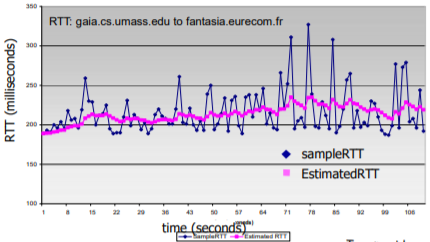

#### 设置超时

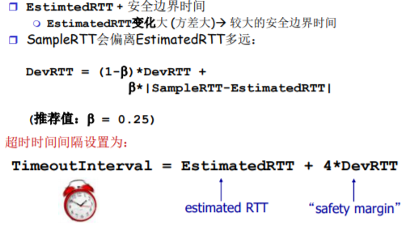

### TCP：可靠数据传输

TCP在IP不可靠服务的基础上 建立了rdt  
 管道化的报文段 • GBN or SR

 **累积确认（像GBN）**  
 **单个重传定时器（像GBN）**  
 **是否可以接受乱序的，没有规范**

通过以下事件**触发重传**  
 **超时（只重发那个最早的未确认段：SR）**  
 **重复的确认**  
• 例子：收到了ACK50,之后又收到3 个ACK50

首先考虑简化的TCP发送方：  忽略重复的确认  忽略流量控制和拥塞控 制

#### TCP发送方事件：

从应用层接收数据：  
 用nextseq创建报文段  
 序号nextseq为报文段首字节的字节流编号  
 如果还没有运行，启动定时器

超时：  
 **重传后沿最老的报文段**  
 **重新启动定时器**

收到确认：  
 如果是对尚未确认的报文段确认  
 更新已被确认的报文序号  
 如果当前还有未被确认的报文段，重新启动定时器 (发完，就关掉定时器)

TCP重传

ACK丢失 过早超时 对顺序收到的最高字节确认

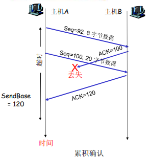

**产生TCP ACK的建议**

| 接收方的事件                                                 | TCP接收方动作                                                |
| ------------------------------------------------------------ | ------------------------------------------------------------ |
| 所期望序号的报文段按序到达。 所有在期望序号之前的数据都已经被确认 | 延迟的ACK（提高效率，少发一个ACK）。对另一个按序报文段的到达最多等待500ms。如果下一个报文段**在这个时间间隔内没有到达**，则发送一个ACK。 |
| 有期望序号的报文段到达。 另一个按序报文段等待发送ACK         | **立即发送单个累积ACK，以确认两个按序报文段。**              |
| 比期望序号大的报文段乱序到达。 检测出数据流中的间隔          | 立即发送重复的ACK，**指明下一个期待字节的序号**              |
| 能部分或完全填充接收数据间隔 的报文段到达                    | 若该报文段起始于间隔（gap）的低端， 则立即发送ACK（给确认。反映下一段的需求）。 |

### 快速重传

超时周期往往太长：  
在重传丢失报文段之前的延时太长

通过重复的ACK来检测 报文段丢失  
 发送方通常连续发送大量 报文段  
 如果报文段丢失，通常会引起多个重复的ACK

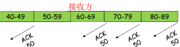

如果发送方收到同一数据 的3个冗余ACK，重传最 小序号的段：  
 **快速重传：在定时器过时之前重发报文段**

 它假设跟在被确认的数据 后面的数据丢失了

• 第一个ACK是正常的；

• 收到第二个该段的ACK，表 示接收方收到一个该段后的乱序段；

• 收到第3，4个该段的ack，表 示接收方收到该段之后的2个 ，3个乱序段，可能性非常大段丢失了

**三重ACK接收后的快速重传**

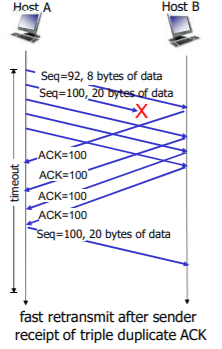

### TCP 流量控制

流量控制  
接收方控制发送方，不让发送方发送的太多、太快以至于让 接收方的缓冲区溢出

接收方在其向发送方的TCP段 头部的rwnd字段“通告”其空闲buffer大小

- RcvBuffer大小通过socket选项 设置 (典型默认大小为4096 字 节)
- 很多操作系统自动调整 RcvBuffer

发送方限制未确认(“inflight”)字节的个数≤接收 方发送过来的 rwnd 值

保证接收方不会被淹没

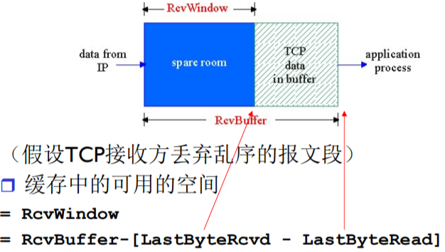

RcvWindow = 缓冲区空间 - 已经接收到未读取的空间

### TCP连接管理

在正式交换数据之前，发送方和接收方握手建立通 信关系:  
 **同意建立连接（每一方都知道对方愿意建立连接）**  
 **同意连接参数**

#### 同意建立连接

在网络中，2次握手建 立连接总是可行吗？  
 变化的延迟（连接请求的段没有丢，但可能超时）  
 由于丢失造成的重传 (e.g. req\_conn(x))  
 报文乱序  
 相互看不到对方

2次握手的失败场景：

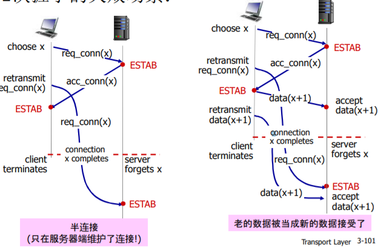

1、可能发送半连接（只在服务器维护了连接）  
2、老的数据被当成新的数据接收了 **seq x 和 x + 1**

TCP 3次握手

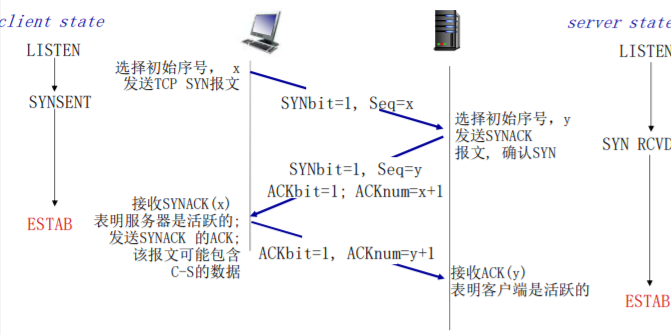

**解决方案：变化的初始序号+双方确认对方的序号 (3次握手)**

第一次：seq 第二次：ACK + seq 第三次：ACK

#### 3次握手解决：半连接和接收老数据问题

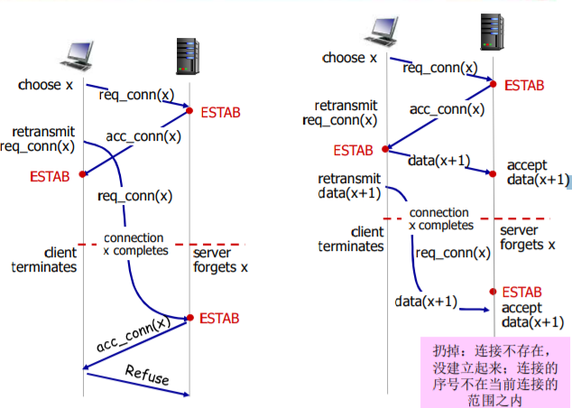

**二次握手：可能发送半连接（只在服务器维护了连接）**  
**三次握手：客户端在第三次握手拒绝连接请求 服务器二次握手后的连接请求**

**二次握手：老的数据被当成新的数据接收了**  
**三次握手：未建立连接（无半连接），故将发来的数据丢掉**

扔掉：连接不存在， 没建立起来；连接的 序号不在当前连接的 范围之内

**若一个数据滞留时间足够长导致**  
**在TCP第二次连接（两个三次握手后）到来，这个数据包大概率也会被丢弃，因为seq不一样，而seq又与时间有关**

#### TCP: 关闭连接

- **客户端，服务器分别关闭它自己这一侧的连接**
    - **发送FIN bit = 1的TCP段**
- **一旦接收到FIN，用ACK回应**
    - **接到FIN段，ACK可以和它自己发出的FIN段一起发 送**
- **可以处理同时的FIN交换**

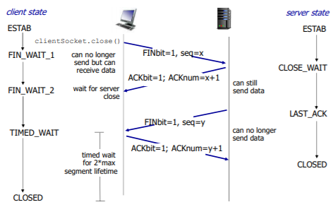

## 3.6 拥塞控制原理

拥塞:  
 非正式的定义: “太多的数据需要网络传输，超过了网络的处理能力”  
 与流量控制不同  
 拥塞的表现:  
 **分组丢失 (路由器缓冲区溢出)**  
 **分组经历比较长的延迟(在路由器的队列中排队)**  
 网络中前10位的问题!

### 拥塞的原因/代价: 场景1

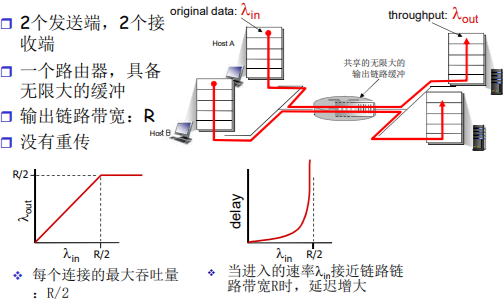

### 拥塞的原因/代价: 场景2

 一个路由器，有限的缓冲  
 分组丢失时，发送端重传  
应用层的输入=应用层输出: λ(in) = λ(out)  
传输层的输入包括重传: λ(in‘) >= λ(in)

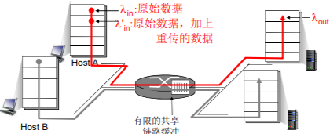

理想化: 发送端有完美的信息  
发送端知道什么时候路由器的缓冲是可用的  
 只在缓冲可用时发送  
 不会丢失: λ(in‘’) = λ(in)

理想化: 掌握丢失信息 分组可以丢失，在路由器由 于缓冲器满而被丢弃  如果知道分组丢失了，发 送方重传分组

现实情况: 重复  分组可能丢失，由于缓冲器 满而被丢弃  发送端最终超时，发送第2 个拷贝，2个分组都被传出

现实情况: 重复  分组可能丢失，由于缓冲器 满而被丢弃  发送端最终超时，发送第2 个拷贝，2个分组都传到

拥塞的“代价”:  
 为了达到一个有效输出，网络需要做更多的工作（重传）  
 没有必要的重传，链路中包括了多个分组的拷贝  
 是那些没有丢失，经历的时间比较长（拥塞状态）但是 超时的分组  
 降低了的“goodput”

**输出比输入少原因：1）重传的丢失分组；2） 没有必要重传的重复分组**

### 拥塞的原因/代价: 场景3

1、4个发送端 2、多重路径 3、超时／重传

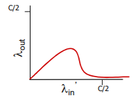

又一个拥塞的代价:  
 当分组丢失时，**任何“关于这个分组的上游传输能力” 都被浪费了**

### 拥塞控制方法

2种常用的拥塞控制方法:

端到端拥塞控制:  
 没有来自网络的显式反馈  
 **端系统根据延迟和丢失事件推断是否有拥塞**  
 TCP采用的方法

网络辅助的拥塞控制:  
 **路由器提供给端系统以反馈信息**  
 单个bit置位，显示有拥塞 (SNA, DECbit, TCP/IP ECN, ATM)  
 显式提供发送端可以采用的速率

### 案例学习: ATM ABR 拥塞控制

ABR: available bit rate:  
 “弹性服务”  
 **如果发送端的路径“轻载 ” 发送方使用可用带宽**  
 **如果发送方的路径拥塞了 发送方限制其发送的速度到一个 最小保障速率 上**

**RM (资源管理) 信元:**  
 由发送端发送,在数据信元中间隔插入  
 RM信元中的比特被交换机设置 (“网络辅助”) 有无拥塞  
 **NI bit: no increase in rate (轻微拥塞)速率不要增加了**  
 **CI bit: congestion indication 拥塞指示**  
 发送端发送的RM 信元被接收端返回, 接收端不做任何 改变

在RM信元中的2个字节 ER (explicit rate)字段 多大带宽  
 **拥塞的交换机可能会降低信元中ER的值**  
 **发送端发送速度因此是 最低的可支持速率(交换机)**

数据信元中的EFCI bit: 被拥塞的交换机设置成1  
 如果在管理信元RM前面的数据信元EFCI被设置成了1, 接收端在 返回的RM信元中设置CI bit

总结：网络提供一些信息，包括一些标志位的置位以及字段 (为两主机间的通信提供多大的带宽)

## 3.7 TCP 拥塞控制

### TCP 拥塞控制：机制

端到端的拥塞控制机制  
 路由器不向主机有关拥塞的反馈信息  
• 路由器的负担较轻  
• **符合网络核心简单的 TCP/IP架构原则**

 **端系统根据自身得到的信息** ，判断是否发生拥塞，从而 采取动作

拥塞控制的几个问题  
 如何检测拥塞  
 轻微拥塞  
 拥塞  
 控制策略  
 在拥塞发送时如何动 作，降低速率  
• 轻微拥塞，如何降低  
• 拥塞时，如何降低  
 在拥塞缓解时如何动 作，增加速率

### TCP 拥塞控制：拥塞感知

发送端如何探测到拥塞?

1. 某个段超时了（丢失事件 ）：拥塞  
     超时时间到，某个段的确认没有来  
     **原因1：网络拥塞（某个路由器缓冲区没空间了，被丢弃）概率大**  
     **原因2：出错被丢弃了（各级错误，没有通过校验，被丢弃）概率小**  
     一旦超时，就认为拥塞了，有一定误判，但是总体控制方向是对的
    
2. **有关某个段的3次重复ACK：轻微拥塞**  
     段的第1个ack，正常，确认绿段，期待红段  
     段的第2个重复ack，意味着红段的后一段收到了，蓝段乱序到达  
     段的第2、3、4个ack重复，意味着红段的后第2、3、4个段收到了 ，橙段乱序到达，同时红段丢失的可能性很大（后面3个段都到了， 红段都没到）  
     **网络这时还能够进行一定程度的传输，拥塞但情况要比第一种好**
    

### TCP 拥塞控制：速率控制方法

如何控制发送端发送的速率  
 **维持一个拥塞窗口的值：CongWin (主要手段)**  
 发送端限制 **已发送但是未确认** 的数据量\*\*（的上限）**: LastByteSent-LastByteAcked <= CongWin  
 从而**粗略地控制\*\*发送方的往网络中注入的速率

**RTT 往返延时**

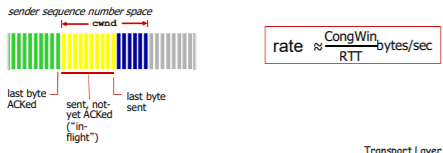

如何控制发送端发送的速率  
 CongWin是动态的，是感知到的网络拥塞程度的函数  
 **超时或者3个重复ack，CongWin↓（下降）**  
• 超时时：**CongWin降为1MSS**，**进入SS阶段**然后再倍增到 CongWin(原) / 2（每个RTT），从而**进入CA阶段**  
• 3个重复ack ：CongWin降为CongWin/2,CA阶段  
 否则（正常收到Ack，没有发送以上情况）：CongWin跃跃欲试↑ （上升）  
• **SS阶段：加倍增加(每个RTT)**  
• **CA阶段：线性增加(每个RTT)**

### TCP拥塞控制和流量控制的联合动作

联合控制的方法:  
 发送端控制发送但是未确认的量同时也不能够超过接收 窗口，满足流量控制要求  
 **SendWin=min{CongWin, RecvWin}**  
 同时满足 拥塞控制和流量控制要求

### 拥塞控制策略

 慢启动  
 AIMD：线性增、乘性减少  
 超时事件后的保守策略

#### TCP 慢启动

连接刚建立, CongWin = 1 MSS

- 如: MSS = 1460bytes & RTT = 200 msec  初始速率 = 58.4kbps

可用带宽可能>> MSS/RTT

- 应该尽快加速，到达希望的速率

当连接开始时，指数性增加发送速率，直到发生丢失的事件

- 1、启动初值很低 2、但是速度很快

当连接开始时，指数性增 加（每个RTT）发送速率 直到发生丢失事件  
 每一个RTT， CongWin加倍  
 每收到一个ACK时， CongWin加1（why）  
 慢启动阶段：只要不超时或 3个重复ack，一个RTT， CongWin加倍

总结: 初始速率很慢，但是加速却是指数性的  指数增加，SS时间很短，长期来看可以忽略

#### TCP 拥塞控制：AIMD

乘性减: 丢失事件后将CongWin降为1(ss阶段通常可忽略，故相当于直接减少到 CongWin/2 )，将CongWin/2作为阈值，进入慢启动阶段（倍增直到 CongWin/2）

加性增： **当 CongWin >阈值时**，一个 RTT 如没有发生丢失事件，将 CongWin 加1MSS : 探 测

当收到3个重复的ACKs:

- CongWin 减半
- 窗口（缓冲区大小）之后 线性增长

当超时事件发生时:

- CongWin被设置成 1 MSS，进入SS阶段
- 之后窗口指数增长
- 增长到一个阈值（上次发 生拥塞的窗口的一半）时 ，再线性增加

### 总结: TCP拥塞控制

出现丢失，Threshold设置成 CongWin的1/2

- 当CongWin＜Threshold, 发送端处于慢启动阶段（ slow-start）, 窗口指数性增长.
  
- 当CongWin > Threshold, 发送端处于拥塞避免阶段 （congestion-avoidance）, 窗口线性增长.
  
- 当收到三个重复的ACKs (triple duplicate ACK), Threshold设置成 CongWin/2， CongWin=Threshold+3.
  
- 当超时事件发生时timeout, Threshold=CongWin/2 CongWin=1 MSS，进入SS阶段
  

#### TCP 发送端拥塞控制

状态转换

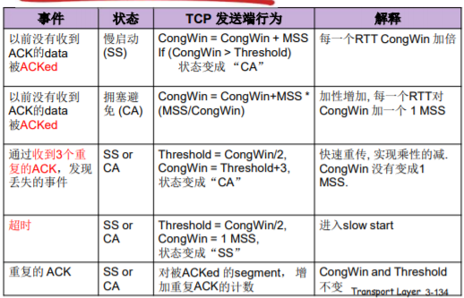

### TCP 吞吐量

TCP的平均吞吐量是多少，使用窗口window尺寸W和RTT来 描述?  
 忽略慢启动阶段，假设发送端总有数据传输

W：发生丢失事件时的窗口尺寸（单位：字节）  
 **平均窗口尺寸（#in-flight字节）：3/4W**  
 **平均吞吐量：一个RTT时间吞吐3/4W， avg TCP thruput = 3/4 \* (W/RTT) bytes/sec**

### TCP 公平性

**公平性目标**: 如果 **K个TCP会话**分享一个链路带宽为R的 瓶颈，每一个会话的有效带宽为 **R/K**

2个竞争的TCP会话:  
 加性增加，斜率为1, 吞吐量增加  
 乘性减，吞吐量比例减少

**往返延迟相同时，TCP会话竞争的最终，双方的 有效的带宽 将收敛到 链路带宽 的一半。**  
**所以相互竞争时 应用建立的TCP会话越多，占有带宽一般越大。**

公平性和 UDP  
 多媒体应用通常不是用 TCP  
 应用发送的数据速率希望 不受拥塞控制的节制  
使用UDP:  音视频应用泵出数据的速率是恒定的, 忽略数据的丢失  研究领域: TCP 友好性

公平性和并行TCP连接  
 2个主机间可以打开多个并行的TCP连接  
 Web浏览器

- 例如: 带宽为R的链路支持了 9个连接;
    - 如果新的应用要求建1个TCP连接,获得带宽R/10
    - 如果新的应用要求建11个TCP连接,获得带宽R/2

## 第三章 总结

- 传输层提供的服务
  
    - 应用进程间的逻辑通信
        - Vs 网络层提供的是主机到主机的通信服务
    - 互联网上传输层协议：UDP TCP
        - 特性
- 多路复用和解复用
  
    - 端口：传输层的SAP
    - 无连接的多路复用和解复用
    - 面向连接的多路复用和解复用
- 实例1：无连接传输层协议 UDP
  
    - 多路复用解复用
    - UDP报文格式
    - 检错机制：校验和
- 可靠数据传输原理
  
    - 问题描述
    - 停止等待协议
        - Rdt1.0 rdt2.0,2.1 ,2.2 Rdt 3.0
    - 流水线协议
        - GBN
        - SR（Selective Repeat）
- 实例2：面向连接的 传输层协议-TCP
  
    - 概述：TCP特性
    - 报文段格式
        - 序号，超时机制及时间
    - TCP可靠传输机制
    - 重传，快速重传
    - 流量控制
    - 连接管理
        - 三次握手
        - 对称连接释放
    - 拥塞控制原理
        - 网络辅助的拥塞控制
        - 端到端的拥塞控制
    - TCP的拥塞控制
        - AIMD
        - 慢启动
        - 超时之后的保守策略