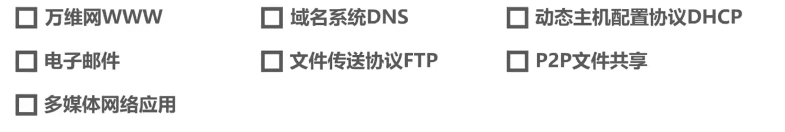

# 6.1 应用层概述

# 6.2 客户-服务器方式和对等方式

## 6.2.1 客户-服务器方式（c/s方式）

## 6.2.2 对等方式（P2P方式）

# 6.3 动态主机配置协议DHCP

## 6.3.1 工作流程

- 如图所示，有两个DHCP服务器和一个DHCP客户，DHCP是TCP/IP协议体系应用层中的协议，使用运输层中UDP提供的服务，会被封装成UDP用户数据报，DHCP服务器的UDP端口为67，DHCP客户的UDP端口号为68。
- 主机DHCP启用后，DHCP客户广播发送**DHCP发现报文**，该报文中主要的信息有**事务ID**和DHCP客户端的**MAC地址**，封装该报文的IP数据报的源IP地址为0.0.0.0，因为主机目前还未分配IP地址，目的地址为广播地址255.255.255.255，因为目前主机不知道有多少个DHCP服务器，所以要广播。
- DHCP服务器接受DHCP发现报文并做出相应，根据DHCP客户端的MAC地址获取配置信息，最终发送**DHCP提供报文**，该报文的源IP地址为DHCP服务器的IP地址，目的地址为广播地址，因为主机目前还未配置IP地址，为了主机可以收到，只能发送广播地址。
- DHCP客户解析DHCP提供报文，如果DHCP提供报文中的事务ID与自己之前发送的DHCP发现报文中的事务ID相同，则接受该报文。DHCP提供报文中还包含配置信息（IP地址、子网掩码、地址租期、默认网关、DNS服务器，其中IP地址会使用ARP确保所选的IP地址未被占用）。
- 在图中DHCP客户会收到两个DHCP服务器发来的报文，一般选择先到达的报文所对应的服务器，然后向所选择的DHCP服务器发送**DHCP请求报文**，源地址为0.0.0.0，目的地址为广播地址，报文中封装了事务ID、DHCP客户端的MAC地址、接受的租约中的IP地址、提供此租约的DHCP服务器端的IP地址等信息。
- 假设DHCP客户选择DHCP服务器1发送请求，并且该服务器接受了该请求，于是DHCP服务器1发送**DHCP确认报文**，报文的源IP地址为DHCP服务器1的IP，目的地址为广播地址。
- 此时主机会使用ARP检测所分配的IP是否已经被占用，如果被占用则会给DHCP服务器发送**DHCP谢绝报文**，并重新广播DHCP发现报文，否则就可以使用该IP进行通信了。
- 当租用期过了一半时，DHCP客户会向DHCP服务器发送DHCP请求报文来请求更新租期，该报文的源IP地址为租用到的地址，目的地址为DHCP服务器1的地址。
- 此时有三种情况：
    - 如果DHCP服务器同意则发回DHCP确认报文，DHCP客户得到了新的租用期。
    - 如果DHCP服务器拒绝，则发送**DHCP否认报文**，DHCP客户必须立即停止使用之前租用到的IP，并重新发送DHCP发现报文来重新申请IP地址。
    - 若DHCP服务器没有做出响应，则在过了0.875倍的租用期后DHCP客户重新发送DHCP请求报文，继续等待DHCP服务器做出反应，如果在租用期到之前还未反应，则DHCP客户停止使用租用的IP地址，并重新发送DHCP请求报文。
- DHCP服务器也可以提前终止提供给DHCP客户的租用期，只要发送**DHCP释放报文**即可。

## 6.3.2 DHCP中继代理

如下图所示，右边橙色的主机是无法自动获取到IP地址的，因为当主机发送DHCP请求报文时，中间的路由器是不会转发该报文的，而是直接丢弃。解决办法是在路由器中配置DHCP服务器的IP地址使得该路由器成为DHCP的中继代理。

# 6.4 域名系统DNS（Domain Name System）

## 6.4.1 域名系统DNS的作用

当用户在web浏览器中输入域名时，首先主机会在自己的DNS缓存中查找该域名对应的IP地址，如果找不到则去DNS服务器查找，DNS服务器中存储了域名和IP地址的数据库，之后将查询结果返回给主机。

## 6.4.2 层次树状结构的域名系统

## 6.4.3 域名服务器

## 6.4.4 域名解析的过程

## 6.4.5 高速缓存

# 6.5 文件传送协议FTP

## 6.5.1 概述

## 6.5.2 工作原理

# 6.6 电子邮件

## 6.6.1 概述

## 6.6.2 SMTP工作原理

## 6.6.3 电子邮件格式

## 6.6.4 邮件读取协议

# 6.7 万维网WWW

## 6.7.1 概述

## 6.7.2 超文本传输协议HTTP

## 6.7.3 Cookie

## 6.7.4 万维网缓存与代理服务器

## 6.7.5 习题

