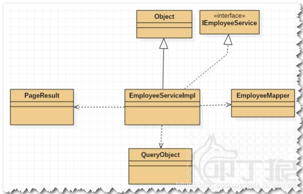

1. 纵向关系

    1. 泛化

        1. 继承

            1. 

                - 泛化关系其实就是`继承关系`：指的是一个类（称为子类、子接口）继承(`extends`)另外的一个类（称为父类、父接口）的功能，并可以增加自己额外的一些功能，**继承是类与类或者接口与接口之间最常见的关系；**
                - 在Java中此类关系通过关键字 `extends`明确标识。
                - 在UML类图中，继承通常使用 **空心三角+实线** 表示

                接口之间的泛化关系: 接口用圆心表示  
                

                类之间的泛化关系:  
                

    2. 实现

        1. 

            - 实现关系：指的是一个class类实现 interface接口（可以实现多个接口）的功能；实现是类与接口之间最常见的关系；
            - 在Java中此关系通过关键字`implements`明确标识。
            - 在UML类图中，实现通常使用`空心三角+虚线`表示  
                

2. 横向关系

    1. 关系
        1. 从强到弱
        2. 组合>聚合>关联>依赖
    2. 组成
        1. 依赖
            1. 一个类依赖另一个类的定义
            2. **”依赖“**是最好区分的，如果A类只是使用B类，而没有持有B类的对象和指针，那么A就依赖B。如B作为局部变量，函数参数等。
            3. 可能更多的是类型，成员变量、局域变量、方法的形参、方法返回值，或者对被依赖类静态方法的调用
            4. 
        2. 关联
            1. 联表示为类A在类B当中被引用，类A和类B是平级的
        3. 聚合 **事实上如果已经确定持有对象和指针的基础上，不是组合就是聚合。**
            1. 生命周期可以不一致。
            2. 大部分时候，B类会以指针或引用的形式存在于A类中，很可能是在初始化或者某些接口中传入的。
            3. 语义上讲，聚合并不强调整体与部分的关系，并不是没有而是不强调，这种整体与部分的关系常常也不明显。所以如果分不清是不是整体与部分也无所谓，根据1和2判断或者排除法即可。
            4. 有时候两个类会相互持有对方的指针，这时候整体往往有更长的生命周期。
        4. 组合
            1. 生命周期必须一致。
            2. 大部分时候，B类会以对象的方式存在，或者在A类中创建和销毁。
            3. 语义上有整体和部分的关系，如果实在看不出来就根据1和2判断