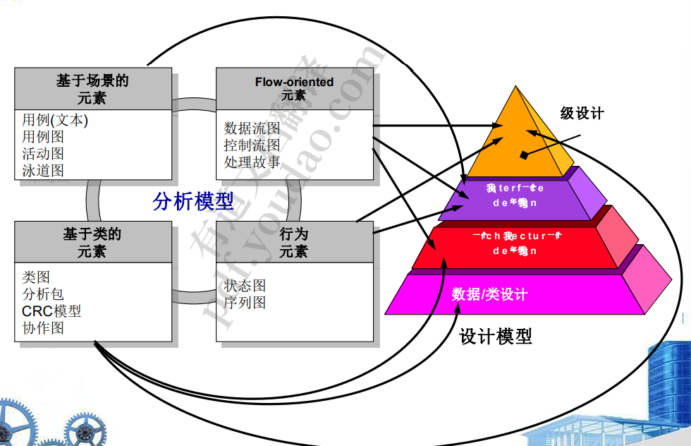
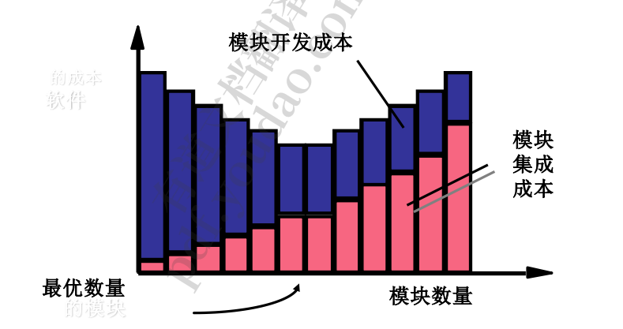
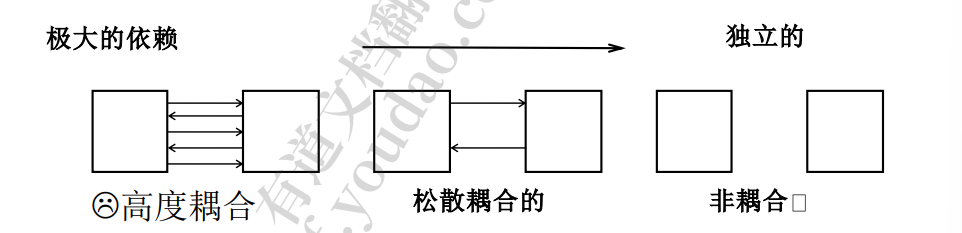
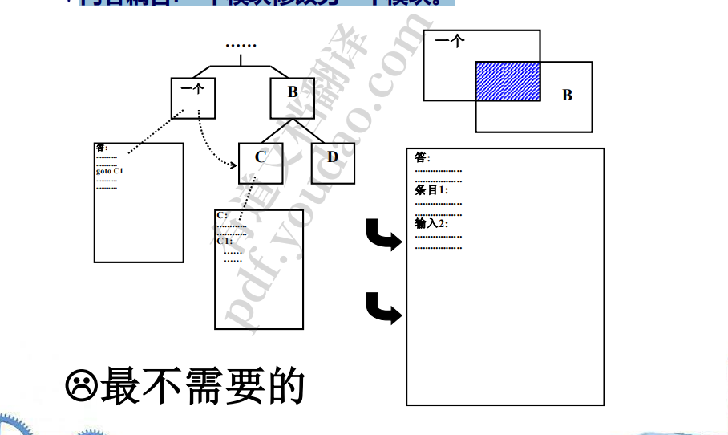
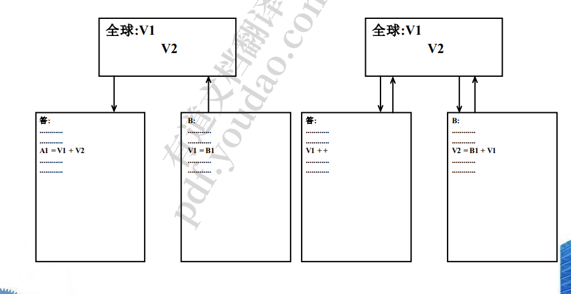
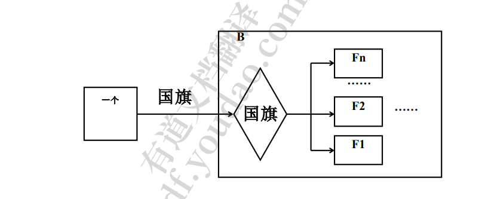
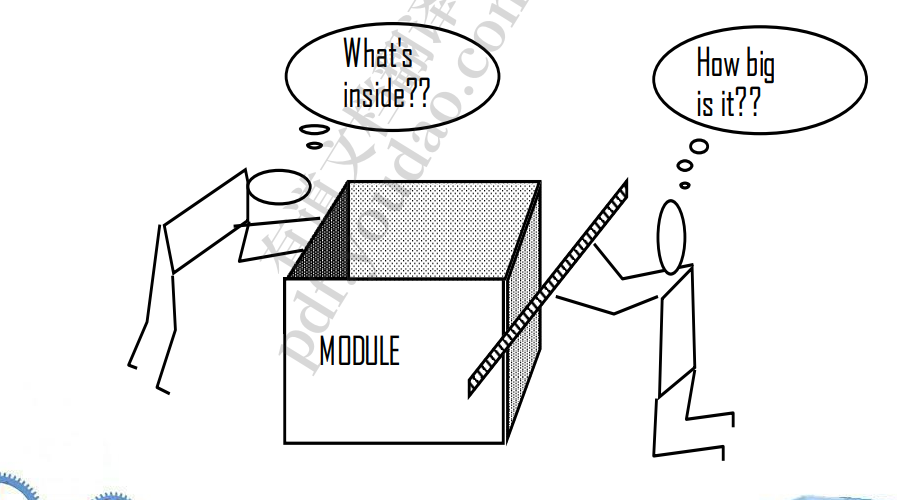
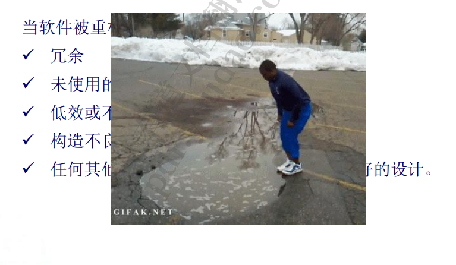

## 1.社会工程背景下设计

## 2.设计过程和设计质量

1. 优秀设计特点

   1. 设计必须实现分析模型中包含的所有显式需求，并且必须适应 客户所需的所有隐式需求。 
   2. 对于那些生成代码的人以及那些测试和随后支持软件的人来说， 设计必须是一个可读的、可理解的指南。 
   3.  设计应该提供软件的完整图景，从实现的角度处理数据、功能 和行为领域

2. 设计原则

   1. 设计过程不应该管中窥豹的影响，有全局观。 
   2. ➢ 设计应该可以溯源到分析模型。
   3. ➢ 设计不应该重新发明轮子。
   4. ➢ 设计应该“最小化软件和现实世界中存在的问题之间的充分易懂”[DAV95]。
   5. ➢ 设计应该表现出统一性和集成度，整体感。
   6. ➢ 设计的结构应该适应变化。
   7. ➢ 设计的结构应该是温和地降级，即使遇到异常的数据、事件或操作 条件。
   8. ➢ 设计不是编码，编码不是设计。
   9. ➢ 设计的质量评估应该在设计过程中进行，而不是在设计完成之后。设计是迭代的，不是一步就位的
   10. ➢ 应该对设计进行审查，以最大限度地减少概念(语义)错误。大方向不能错，不跑题

   ## 3.设计概念

   1. 基本概念
      1. 抽象——数据、过程、控制
         1. 
      2. 精细化——自上而下的设计策略
   2. • 体系结构(Architecture):软件的整体结构，以及该结 构为系统提供概念完整性的方式。(SHA95a) 
      1. ➢ 结构模型:将架构表示为程序组件的有组织的集合 
      2. ➢ 框架模型:通过尝试识别在类似类型的应用程序中遇到的可重复 的架构设计框架来增加抽象级别 
      3. ➢ 动态模型:处理程序体系结构的行为方面，表明结构或系统配置 如何随着外部事件的作用而改变
      4.  ➢ 流程模型:专注于系统必须适应的业务或技术流程的设计。 用户使用过程
      5. ➢ 功能模型:表示系统的功能层次结构
   3. 模式
      1. – 图案名称描述了图案的本质 
      2. – Intent描述了模式及其作用
      3.  – 也称为模式的同义词 
      4. – 动机提供了一个问题的例子
      5.  – 适用性模式适用的具体设计情况 
      6. – 实现模式所需的结构类 
      7. – 类的参与者职责 
      8. – 协作参与者如何协作来完成他们的职责 
      9. – 后果描述了影响模式和潜在权衡的“设计力量”
      10.  – 相关的模式交叉引用相关的设计模式
   4. 概念
      1. 模块化
         1. 
         1. 易修改，可更换。模块数量与合并不可兼得
      2. 信息隐藏
         1. 
         1. 
      3. 功能独立
         1. 耦合
            1. 
         2. 目标：尽可能松散=尽可能独立
         3. 耦合程度
            1. 内容耦合 :一个模块修改另一个模块。最差
               1. 
            2. 公共耦合:数据可以从一个公共的数据存储中访问。相当于全局变量
               1. 
            3. 控制耦合:一个模块传递参数来控制另一个模块的活动
               1. 
            4. 数据耦合:只传递数据。很容易追踪数据，也很容易做出改变。
         4. 内聚性：尽可能的内聚
            1. 巧合内聚:在同一个模块中找到不相关的函数、过程或数据 (为了方便)。
            2.  逻辑内聚:逻辑相关的函数或数 据放在同一个模块中。比如将一个模块专门来读输入
            3. 时序内聚:函数仅与所涉及的时间相关。比如启动相关功能全部一个模块实现
         5.  凝聚力(继续):
            1. 过程内聚:函数被分组在一个模块中，以确保一定的性能顺序。 
               1. 输入数据—> 检查数据—> 操作数据 
            2. 通信内聚:一个模块中的所有函数都操作或产生相同的数据集。
            3.  功能内聚:每个处理元素对单个功能的性能至关重要。
         6.  大小调整模块 :两个视图
            1. 
         7. 重构:以一种不改变代码[设计]的外部行为但改进其内 部结构的方式改变软件系统。重构需谨慎
            1. 
         8. 设计类
            1. 用户界面类 
            2. 业务域类 
            3.  流程类——完全管理BD类所需的较低级别的业务抽 象 
            4. 持久类——数据库 
            5. 系统类——管理和控制功能

## 3.基于模式的软件设计

1. 设计模式——一种复用设计元素的技术，这些元素 在过去已经被证明是成功的 
   1. ➢ 设计模式的描述也可以考虑一组设计力量。
      1.  – 设计力量描述了与应用模式的软件相关的非功能需求(例如， 易维护性、可移植性)。 
   2. ➢ 设计模式的类型:
      1.   架构模式
      2.   设计模式(专注于设计的特定元素) 抽
      3.  成语(编码模式）
2. 框架——一个带有“插点”集合的架构骨架，使其能够 适应特定的问题领域。针对某个领域的知识抽象出一个
   1. 设计模式比框架更抽象。 
   2. – 设计模式是比框架更小的架构元素 
   3. – 设计模式没有框架那么专门化

