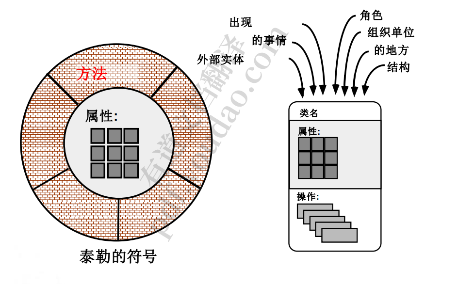

## 5.1数据模型

1. 数据模型概念（首先建立，为输入信息，使客户能够看懂，不需要使客户关注太多细节）

   1.  在客户的抽象层次上创建一个模型
   2. 指示数据对象如何相互关联

2. 数据对象	

   1. 由一组属性(数据项)描述的，将在软件系统内进行操 作的东西
      1. 一个对象(例如，一本书)的每个实例都可以被唯一标识(例如 ，ISBN#) 
      2. 每一个都在系统中扮演着必要的角色，即，系统不能在不访 问对象实例的情况下工作 
      3. 每一个都是由属性描述的，这些属性本身就是数据项
   2. 数据属性
      1. -数据对象包含一组属性，作为对象的方面、质量 、特征或描述符
      2. 
   3. 关系
      1. 表示连通性;一个必须被系统“记住”的、不能或不是 机械计算或推导出来的“事实”
      2. 基数:一对一、一对多、多对多 
      3. 形态:强制性、可选的
   4. 学会将需求描述性文本进行关键词抽取
      1. 需要关注的词性
         1. 名词–有明确定义
            1. 可能是需求object
            2. 也可能无关
         2. 动词–跟功能相关
         3. 形容词–跟限定性相关

   ## 5.2面向对象分析

   1. ​	基本概念
      1. 类和对象 –
      2. 属性和操作 
      3.  封装和实例化 
      4.  继承
   2. 任务
      1. 基本要求必须沟通 –
      2.  必须识别类(属性和方法 ) – 
      3. 定义类层次结构 
      4. – 对象关系应该被表示
      5.  – 对象行为必须建模 
      6. – 上述任务被迭代地重新应用
   3. 相关例子
   4. 
   5. 封装
      1. 封装:对象封装数据和操作数据所需的逻辑过程。 
         1.  信息隐藏——减少变化发生时副作用的传播。
         2.  接口简化，系统耦合度趋于降低。
         3.  数据结构和操作它们的操作被合并在单个命名实体 中——类。这有助于组件重用。
   6. 继承
      1. 子类继承父类
      2. 单继承
      3. 多重继承
         1. 
            1. 可能有重复的方法
         2. 不再具有传递性

   ## 5.3基于场景建模

   1. 用例只是一种帮助定义什么存在于系统之外(参与者)和什么应该由 系统执行

   2. 步骤: 

      1. 列出特定角色所执行的功能 
      2.  为每个功能开发主要场景
      3. 评估可选行为并制定一套次要方案

   3. 在开始建模时和测试时均需要

   4. 用例：

   5. 活动图

      1. 

   6. 泳道图较活动图简化

      1. 

   7. 数据流图

      1. 

      2. ==相关注意事项==：

         1. 断流—一个模块有输入就有输出
         2. 启动要有原因，不可自启动
         3. 数据库是被动输入模块信息，人是主动输入信息
         4. 图是给别人看的，要求易读
         5. 

      3. 示例：

         1. 公共图书馆的信息系统 

         2. 如果 {用户请求一本书 (书名，作者，用户名)} {得到一本书 } 

         3. 书，以及用户的借阅书单 ;

         4.  如果 {用户按主题搜索一本书 } {按主题搜索 } 

         5. 与主题相关的书目列表。 

         6. 

         7. 缺点：产生了两个输出，不好

            

      4. 细化：

         1. 

      5. 

      6. 控制流图—-强调状态转移

         1.  表示事件和管理事件的过程
         2.  ➢ 一个“事件”是一个布尔条件，可以通过以下方式确定: 
         3. – 列出所有被软件“读取”的传感器 
         4. – 列出所有中断条件
         5.  – 列出由操作员驱动的所有开关。
         6.  – 列出所有数据条件
         7.  – 尽可能检查控制流输入/输出的所有控制项 
         8. – 识别系统的状态，每个状态是如何达到的，以及状态之间的 转换 
         9. – 还有其他方法可以让我达到这个状态或者从这个状态退出吗?

      7. 建模

         1. 

   8. 基于类建模

      1. 基本方法
         1. 通过检查问题陈述来识别分析类 
         2. • 使用语法分析来隔离潜在的类
         3.  • 识别每个类的属性-定义对象 
         4. • 识别操作——操作属性‘
         5. 关注某些功能改变了什么数据
      2. 类图
         1. 
         2. 
            1. 比如要更改一张卡片，则需要将合作者包含的卡片都取出来，然后看更改后影响了那些卡片。耦合性较差
         3. 
         4. 
         5. 
         6. 

   9. 创建行为模型

      1. 行为模型表明软件将如何对外部事件或刺激作出反应。要创 建模型，分析师必须执行以下步骤: 
         1. 评估所有用例，以充分理解系统内的交互顺序。 
         2. 识别驱动交互序列的事件，并了解这些事件如何与特定 对象相关联。
         3.   为每个用例创建一个序列。 
         4. 为系统建立一个状态图。 
         5.  审查行为模型，以验证准确性和一致性
      2. 在行为建模的背景下，必须考虑两种不同的状态表征: 
         1. – 当系统执行其功能时，每个类的状态 – 
         2. 系统执行其功能时从外部观察到的系统状态 •
      3.  一个类的状态呈现出被动和主动两种特征。
         1.  – 被动状态简单来说就是对象所有属性的当前状态。 
         2. – 一个对象的活动状态表示该对象在经历持续的转换或处理 时的当前状态
      4. 
      5. 
         1. 按时间轴从上向下
         2. 从左到右是发生的事件

      ## 写作规格说明

      1. 每个人都知道 确切地说是什么 做,直到有人 写下来!
      2. 规范指南
         1. 使用分层的格式来提供更多的细节 随着 “ 层 ”的加深 
         2. 使用一致的图形符号并应用文本 使用一致的术语 (远离别名 ) 
         3. 确保定义所有的缩写词 
         4. 确保包括一个目录 ;理想情况下 , 包括索引和 /或术语表
         5.  写一个简单，明确的风格 
         6. 总是把自己放在读者的位置上。 如果不是亲密接触的话，我也能理解 熟悉这个系统吗?”

      

