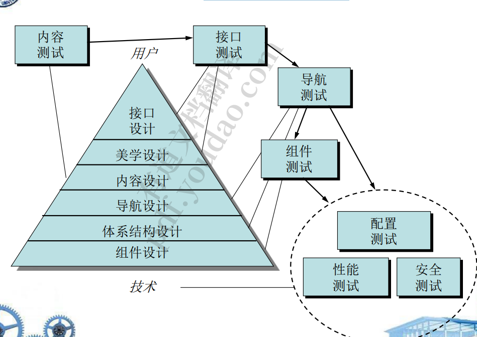
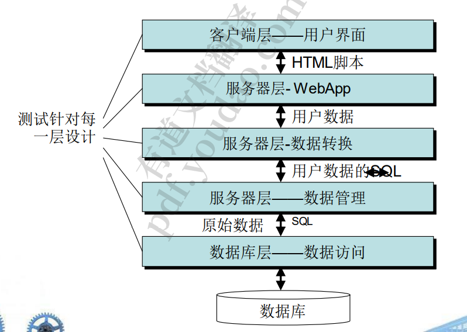
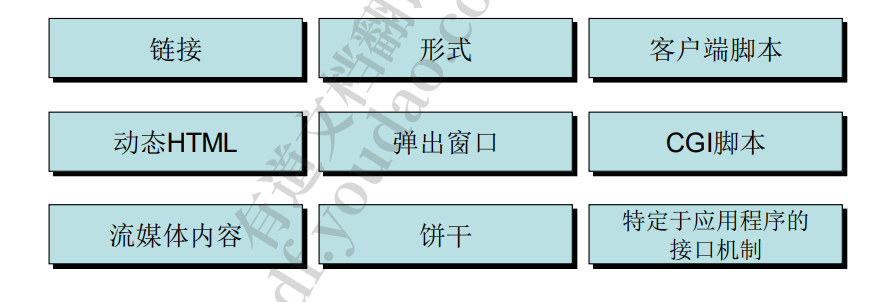

1. 测试web应用的概念 
   1. • 质量维度 
      1. . 内容:句法和语义层面 
      2. 功能:正确、不稳定、标准 
      3. 结构:适当交付、可扩展、支持扩展
      4. 可用性:每个角色都可以学习并应用所有必需的导航语法和 界面语义 
      5. 可导航性:导航语法和语义
      6. 性能:运行条件、配置和加载
      7. 兼容性:客户端和服务器端的主机配置不同 
      8. 互操作性:与其他应用程序和/或数据库的接口 
      9.  安全:潜在的漏洞
   2. 困难 
      1. 客户端的症状不是错误本身 
         1. 客户机，服务器，网络，其中一方出错便出错了，难以排查是哪方面的原因
      2. 在环境之外几乎不可能重现错误
      3. 许多错误是由于配置造成的 
      4. 难以跨客户端、服务器和网络层进行跟踪 
      5. 静态(配置)和动态(瞬时资源加载或与时间相关的错误)操作 环境都会产生错误 
      6. 环境在错误诊断中起着重要的作用。
   3. 测试策略
      1. 对WebApp的内容模型进行审查以发现错误。 
      2. 界面模型被审查，以确保所有用例都可以被容纳。
      3. 对WebApp的设计模型进行审查，以发现导航错误。 
      4. 测试用户界面以发现展示和/或导航机制中的错误。
      5. 对选定的功能组件进行单元测试。
      6. 测试整个架构的导航。 
      7.  WebApp在各种不同的环境配置中实现，并对每种配置的 兼容性进行测试
      8.  进行安全测试的目的是试图利用WebApp或其环境中的漏 洞
      9. 进行性能测试。 
      10. 该网络应用程序由受控制和监控的终端用户群体进行测试
2. 测试过程——概述
   1. 
3. 内容测试
   1. 目标 
      1. – 发现基于文本的文档、图形表示和其他媒体中的语 法错误(例如，拼写错误、语法错误) 
      2. – 发现作为导航出现的任何内容对象中的语义错误 (即信息的准确性或完整性错误) 
      3. – 发现呈现给最终用户的内容的组织或结构中的错误
      4. 大多数中心是数据库
   2. 数据库测试——为什么这么复杂? 
      1. – 原始的客户端请求很少以DBMS =>翻译的形式(例如SQL)呈 现 
      2. – 数据库可能是远程到WebApp服务器=>服务器通信
      3. – 来自DB的原始数据必须传输到WebApp服务器，然后到客户 端=>原始数据和转换 
      4. – 动态内容对象必须采用适当的格式，以便display =>格式和 兼容性
   3. 层的交互
      1. 
4. 用户界面测试
   1. 测试策略:发现错误 
      1. – 与特定的接口机制相关 
      2. – 界面实现导航、功能或内容显示语义的方式 
   2. • 目标 
      1. – 测试界面功能=>设计规则、美学和相关视觉内容 
      2. – 测试单个界面机制(单元测试)
      3.  – 整合测试每个接口机制=特定用户类别的>用例或NSU 
      4. – 针对选定的用例和接口的NSUs =>语义测试完整接口 
      5. – 该接口在各种环境(例如浏览器)中进行测试=>兼容
   3. 测试界面机制
      1. 
      2. 可用性测试:由WebE团队设计，由最终用户执行
         1.  – 定义一组可用性测试类别，并确定每个类别的目标 • 交互性，布局，可读性，美学，显示特性，时间敏感性，个性 化，可访问性 
         2. – 能够对每个目标进行评估的设计测试 
         3. – 选择进行测试的参与者
         4.  – 在进行测试时，仪器参与者与WebApp的交互
         5.  – 开发一种评估网络应用程序可用性的机制
   4. 级测试
      1. 专注于一组测试，试图发现WebApp函数中的错误 
      2. • 可以使用传统的黑盒和白盒测试用例设计方法 
      3. • 数据库测试通常是组件测试制度中不可分割的一部 分
   5. 导航测试
      1. • 目的
         1. : – 语法 
         2. ✓导航链接 
         3. ✓重定向 
         4. ✓书签 
         5. ✓框架和框架集
         6.  ✓站点地图 
         7. ✓内部搜索引擎
   6. 配置测试
      1. 服务器端
         1. – WebApp与服务器操作系统完全兼容吗? 
         2. – 当WebApp运行时，系统文件、目录和相关系统数据是否正确创建? 
         3. – 系统安全措施(例如，防火墙或加密)是否允许WebApp在不受干扰或 性能下降的情况下执行和服务用户?
         4.  – WebApp是否已经使用所选择的分布式服务器配置(如果存在的话)进 行了测试?
         5.  – WebApp是否正确地与数据库软件集成?WebApp对不同版本的数据 库软件敏感吗? 
         6. – 服务器端WebApp脚本执行是否正常? 
         7. – 是否检查了系统管理员错误对WebApp运行的影响? 
         8. – 如果使用代理服务器，是否通过现场测试解决了它们配置上的差异?
      2. 客户端：
         1.  硬件——CPU、内存、存储和打印设备
         2.  – 操作系统——Linux、Macintosh操作系统、Microsoft Windows、 基于移动设备的操作系统 
         3. – 浏览器软件——Internet Explorer, Mozilla/Netscape, Opera,  Safari等 
         4. – 用户界面组件- Active X, Java applet等 
         5. – 插件- QuickTime, RealPlayer等
         6.  – 连接性-电缆，DSL，常规调制解调器，T1
   7. 安全性测试
      1. 设计用于探测的漏洞 
         1. – 客户端环境 
         2. – 当数据在客户端和服务器之间来回传递时发生的网络通信 
         3. – 服务器端环境 
      2. • 在客户端，漏洞通常可以追溯到浏览器、电子邮件程 序或通信软件中预先存在的bug。
      3.  • 在服务器端，漏洞包括拒绝服务攻击和可以传递到客 户端或用于禁用服务器操作的恶意脚本
   8. 性能测试
      1. 目标:模拟真实的加载情况 
         1. – 服务器响应时间是否降低到一个值得注意和不可接受的程度? 
         2. – 在什么时候(就用户、事务或数据加载而言)性能变得不可接受? 
         3. – 哪些系统组件会导致性能下降? 
         4. – 用户在各种加载条件下的平均响应时间是多少? 
         5. – 性能下降对系统安全性有影响吗? 
         6. – 随着系统负载的增加，WebApp的可靠性或准确性是否会受到 影响? –
         7.  当负载大于服务器的最大容量时，会发生什么?—-
      2. • 负载测试:WebApp及其服务器端环境将如何响应各种 加载条件 
         1. – N，并发用户数量 
         2. – T，单位时间内每个用户的在线交易次数 
         3. – D，服务器每笔交易处理的数据负荷 
         4. – 总吞吐量P = N x T x D 
      3. • 压力测试:负载测试的延续，但迫使变量满足然后超过 操作限制

