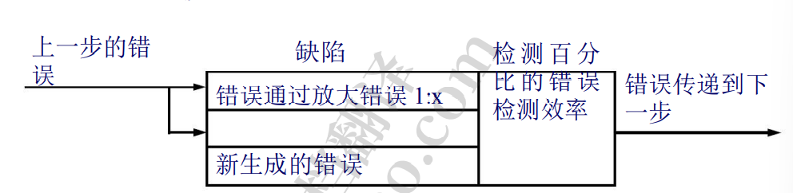
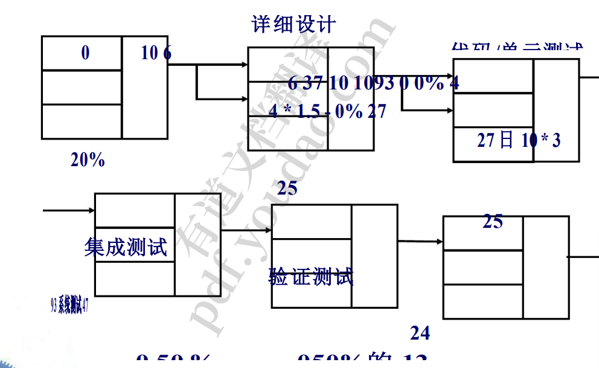
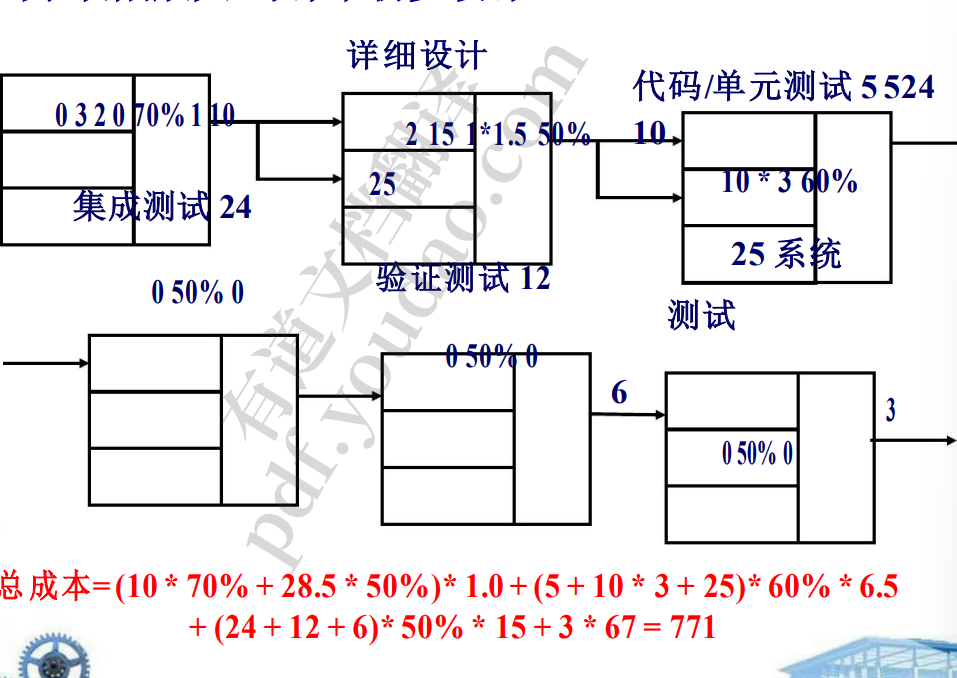
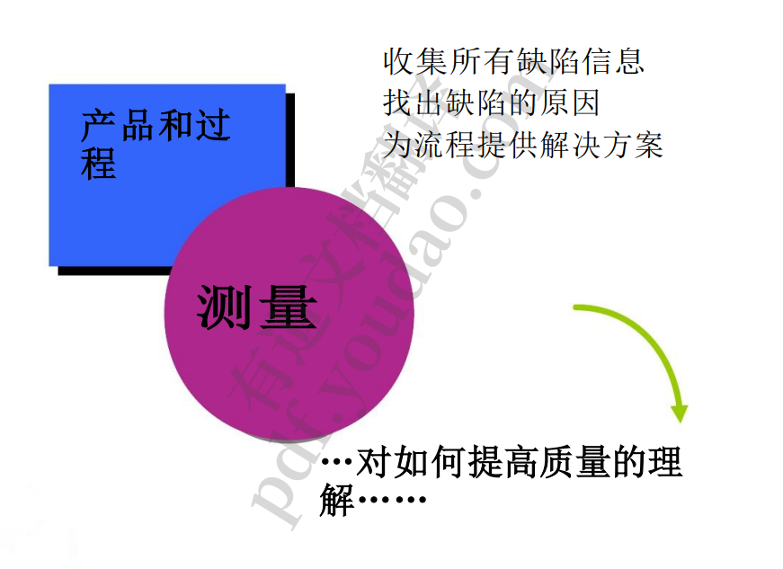
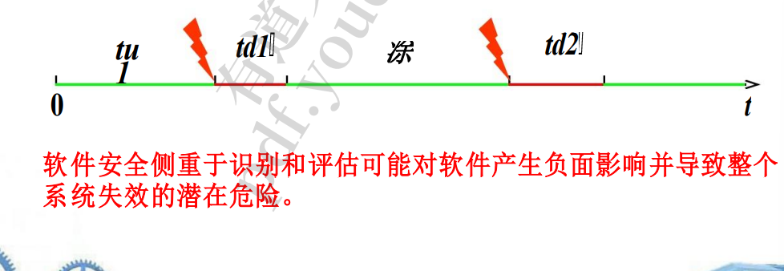
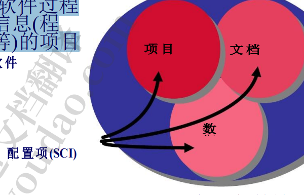
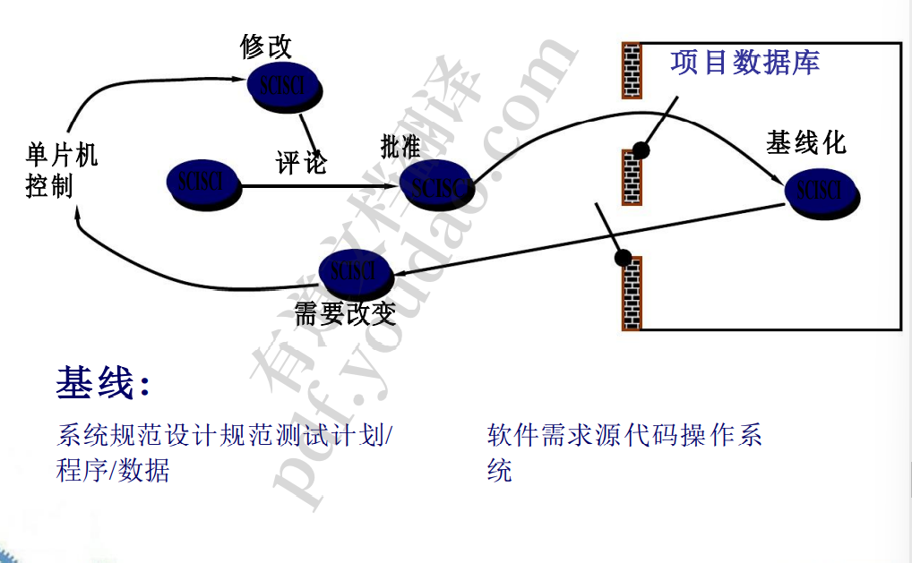

1. 质量概念
   1. •设计质量:要求、规范和系统的设计一致性质量实现 
   2. •用户满意度=合格的产品+良好的质量 +在预算和进度内交付 
   3. 定义:软件质量 ：符合明确声明的功能和性能要求，明确记录的开发标准， 以及所有专业开发的软件应有的隐含特征。
   4. •质量成本 
      1. ——预防成本
         1. 质量规划、正式技术审查、测试设备、培 训…… 
      2. ——评估成本 
         1. 过程检验、设备校准和维护、测试……
      3. ——失败成本 
         1. 内部故障成本:返工、维修、发货前的故障模式 分析 
         2. 外部故障成本:投诉解决、产品退换货、帮助线支 持、保修工作…… 
2. 软件质量保证
   1. •SQA 活动
      1.  为一个项目准备一个 SQA 计划，该计划确定 
         1. 进行评估 
         2. -进行审计和审查
         3.  -适用于项目的标准
         4.  -错误报告和跟踪程序 由质量保证小组制作的文件
         5.  -提供给软件项目团队的反馈数量 
      2. 参与项目软件过程描述的开发
      3. 评审软件工程活动以核实遵守制定的规则 
      4. 审核指定的软件工作产品以进行验证 符合规定的部分 软件过程
      5. 确保软件工作和工作中的偏差 产品被文件化并根据 一个文档化的过程
      6. 记录任何不合规行为并向上级报告 管理
3. 软件的评论
   1. 缺陷放大模型
      1. 
      2. 假设在设计过程中发现的错误将花费 1.0 个货币单位来纠正。 相对于此成本，在测试开始前发现的相同错误将花费 6.5 个 单位;测试期间，15 个单位;发布后，60 - 100 个单位。
      3. 许多研究表明，设计活动引入了软件过程中 50% - 65%的错 误。然而，正式审查技术已被证明在发现设计缺陷方面高达 75%的有效性。
      4. ==越早发现错误越好==，每个阶段进行一次错误检查
      5. 示例:缺陷放大-未审查初步设计
         1. 
         2. 
4. 正式技术评审
   1. •目标 
      1. 发现错误
      2. 验证软件符合其要求 
      3. 确保软件已经按照预定义的标准表示 
      4. 以统一的方式实现软件
      5. 让项目更容易管理
      6. 用作训练场地
5. 统计SQA
   1. 
   2. 六西格玛方法定义了三个核心步骤:
      1. 通过明确的客户沟通方法定义客户需求、可交付成果和项目目 标
      2. 测量现有的过程及其输出以确定当前的质量性能(收集缺陷指 标) 
      3. 分析缺陷指标并确定关键的少数原因(80%的缺陷可以追溯到 20%的所有可能原因)。 
   3. 通过消除缺陷的根本原因来改进过程。 
   4. 控制过程，确保将来的工作不会重新引入缺陷的原因。 
   5. 设计过程以避免缺陷的根本原因并满足客户要求。
   6.  验证过程模型能够避免缺陷并满足客户要求。
6. 软件可靠性
   1. 可靠性= MTBF = MTTF + MTTR 可用性=MTTF (Shooman, 1983) MTTF MTTR 其 中，MTTF =平均失效时间= n1 i ntui 1 MTTR =平 均修复时间= n1 i n1tdi
   2. 
7. 变革管理
   1. 第一定律：无论你处于系统生命周期的哪个阶段，系统 都会发生变化，而改变它的欲望会贯穿于整 个生命周期。
   2. 软件配置管理
      1. 软件配置:包含作为软件过程 一部分产生的所有信息(程 序、数据、文档等等)的项目 统称为软件配置。
         1. 是基本上不变的
      2. 
      3. 基线(IEEE Std. No.610.12-1990):已经正式评审并达 成一致的规范或产品，此后作为进一步开发的基础， 并且只能通过正式的变更控制程序进行更改
      4. 
         1. 单向，只要出去了就不能再修改，没出去可以修改。
         2. 走严格的流程
   3. 供应链管理流程
      1. 识别:一个组织如何识别和管理一个程序(及其文档) 的许多现有版本，以使变化能够有效地适应? 
      2. 版本控制:组织如何控制软件发布给客户之前和之后的 变更? 
      3. 变更控制:谁负责批准和排序变更? 
      4. 配置审计:我们如何确保正确地进行了更改? 
      5. 报告:使用什么机制来评估他人所做的变化?

