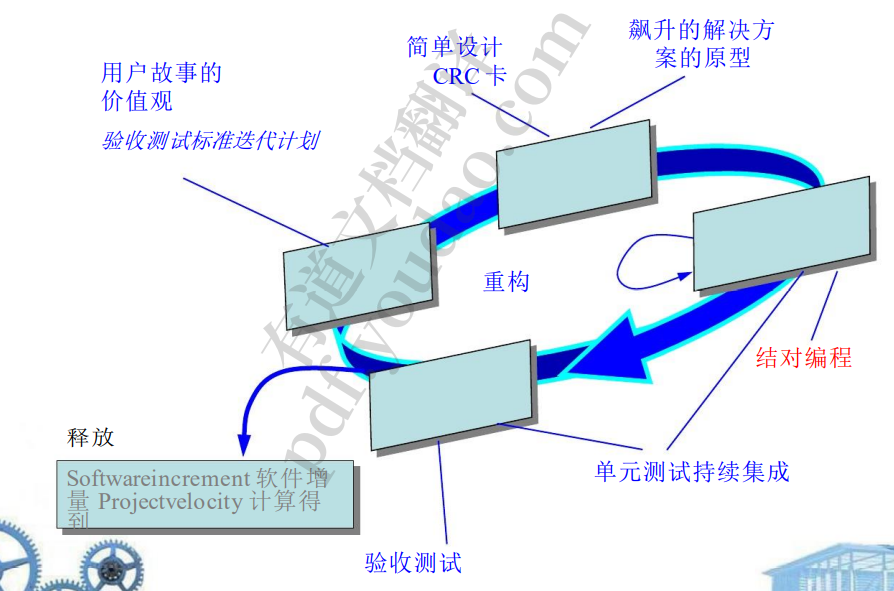
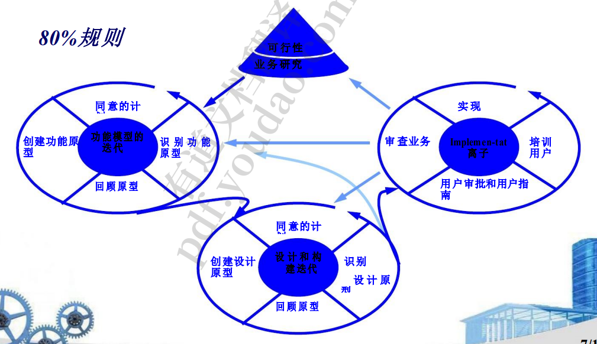
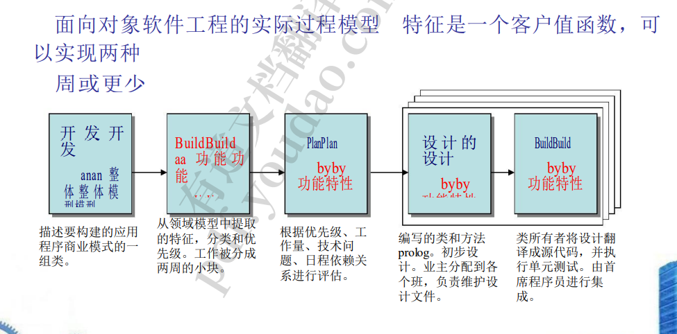

1. 敏捷软件开发宣言
   1. 响应变化 
   2. •客户协作
   3.  •工作软件 
   4. •个体和互动
   5. 跟进全面的合同谈判 计划 文 档 流 程 和 工 具
   6. 意:虽然大多数从业者在理论上同意这种哲学，但现实世界中出现 了许多实用主义问题，这些问题可能会导致右边的项目与左边的项目 一样重要。
2. 什么是敏捷?
   1. •对变化的有效(快速和适应性)反应 
   2. 与所有利益相关者进行有效沟通
   3.  •吸引客户加入团队 
   4. 组织一个团队，使其能够控制所执行的工作 
   5. 屈服…… 
   6. 软件的快速增量交付
3. •敏捷过程
   1.  由客户对所需内容的描述(场景)驱动 
   2. 认识到计划是短暂的 
   3. 以一个沉重的迭代 开发软件 
   4. 强调建设活动 交付多个“软件增 量” 随着变化的发生而适应
4. 什么是敏捷过程
   1. 人为因素——敏捷开发团队成员中需要存在 的特征: 
      1. ——能力 
      2. ——共同的焦点
      3.  -合作 
      4. ——决策能力
      5.  -模糊问题解决能力
      6.  -相互信任和尊重 
      7. ——自组织
   2. 敏捷过程模型
      1. 极限编程(XP)
         1. 
      2. 适应性软件开发(ASD)
         1. 
      3. 动态系统开发方法(DSDM)
         1. 
      4. •Scrum——Schwaber 和 Beedle 著
         1. 
      5. 水晶
         1. 特点：实际上创建了一个晶体流程模型家族，允许基 于问题特征的可操作性 强调面对面交流 建议使用反思工作坊来审 查团队的工作习惯
      6. 功能驱动开发（FDD）
         1. 
      7. 敏捷建模（AM）
         1. 建模原则 
            1. 有目的的建模 
            2. 使用多种模型 
            3. 轻装出行(只保留具有长期价值的模型) 内容比表示 形式更重要 了解用于创建它们的模型和工具 本地适 应