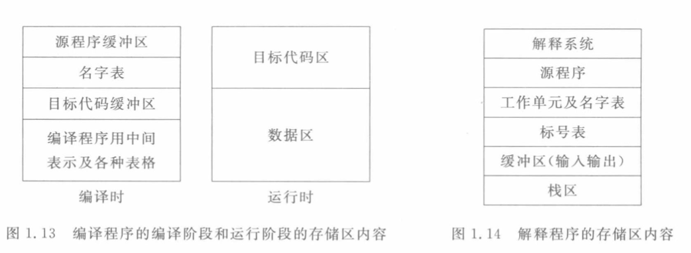
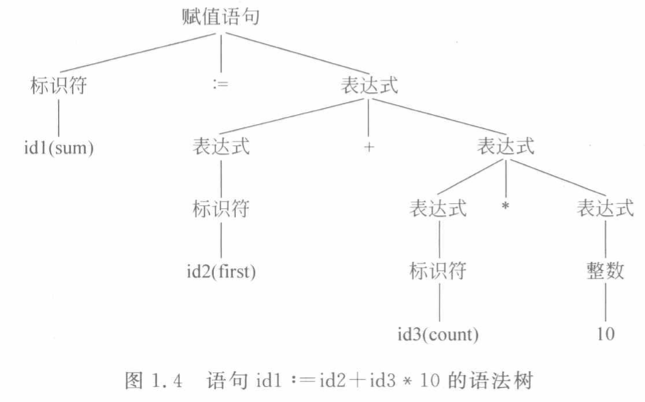
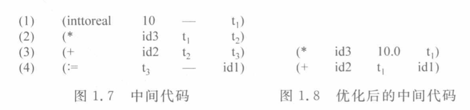

# 一、编译程序和解释程序

## 1.1 定义

编译程序最初的定义是把一种**高级语言**设计的源程序(面向人的)翻译成另一种**等价的低级程序设计语言**(面向硬件的)即机器语言或汇编语

## 1.2 程序执行方式

程序设计语言源程序的执行基本有两种方式：

- 翻译：使用翻译程序，将源程序翻译成为低级语言目标程序，然后执行目标程序。
- 解释：使用解释程序，对源程序逐个语句边解释边执行。

## 1.3 编译程序和解释程序的区别

主要区别在于是否生成目标程序，运行时的存储分配。



## 1.4 高级语言程序的处理过程


# 二、编译过程和编译程序的结构（重点）

## 2.1 编译过程概述

词法分析-> 语法分析 -> 语义分析+中间代码生成 -> 中间代码优化 -> 目标代码生成 -> 目标代码

### 2.1.1 词法分析

- 输入源程序(看成字符串)
  
- 根据语言的词法规则对构成源程序的字符串进行扫描和分解
  
- 识别出一个个的单词（token），如保留字、界符、算符、标识符、常量。
  
- 单词内部表示形式：二元式 (class,value)
  

如下图的一行代码，按顺序进行词法分析可以得到以下的单词序列。


### 2.1.2 语法分析

- 输入单词符号串
  
- 根据语言的语法规则对单词符号串进行扫描和分解
  
- 识别出各类语法单位
- 语法单位内部表示：语法树



### 2.1.3 语义分析+中间代码生成

- 输入各类语法范畴
  
- 根据语言的语义规则，分析其含义，并进行初步翻译
  
- 产生中间代码
  

以下列代码为例，生成中间代码：

```c
int main(  ){  float sum,first,count;  sum=first+count*10;}
```

翻译成如下的四元式序列（中间代码）：

`(操作符,左操作数,右操作数,存储位置)`

(1) (inttofloat, 10, \_， T1 )

(2) ( \*, count，T1，T2 )

(3) ( +, first，T2，T3 )

(4) ( =, T3, \_, sum)

其中，Ti为语义分析程序为存放中间结果而生成的临时变量。

### 2.1.4 代码优化

- 输入中间代码
  
- 进行等价变换
  
- 输出更高效的中间代码
  

**目的：**

- 用以提高目标代码的时、空效率
  
- 也就是希望完成同样功能的程序，代码优化后比优化前运行的时间短，占用的存储空间少
  
- 有时二者不能同时达到，需根据实际情况取舍
  

**例子：**



### 2.1.5 目标代码生成

- 输入优化后的中间代码。
  
- 变换成特定机器上的低级语言代码（汇编之类的代码），实现最后的翻译。
  
- 产生目标代码。
  
    
    

### 2.1.6 表格管理和出错处理

**表格管理（符号表）：**

在完成以上5个过程的同时必须随时对符号表进行管理

- 记录源程序中使用的名字
  
- 收集每个名字的各种属性信息，如类型、作用域、存储分配信息等。
  
- 例：
  
    count 变量 类型 float
    
    first 变量 类型 float 地址
    

**出错处理：**

- 发现源程序中的错误
  
- 检查词法、语法和语义中的错误(静态)
  
- 编译程序的处理能力，如存储空间越界 (动态)
  
- 报告出错信息和位置
  
- 处理和恢复
  

## 2.2 编译程序结构


## 2.3 编译阶段的组合

### 2.3.1 前段和后端的概念

有时，将编译过程分成前段和后端两部分，方便移植


**前端：**完成分析工作(与机器无关)，词法分析 语法分析 语义分析。

**后端：** 完成综合工作(与机器相关)，优化（改善目标代码质量），目标代码生成。

### 2.3.2 遍的概念

**定义：**从头到尾对源程序及其内部表示扫描一次，并作有关的加工处理。

从源程序扫描是第一遍输入，每前一遍的输出是后一遍的输入。

分遍的原则按实际情况而定：

- 多遍（结构清晰、少占内存、读写次数多，耗时）
  
- 一遍（多占内存，速度快）