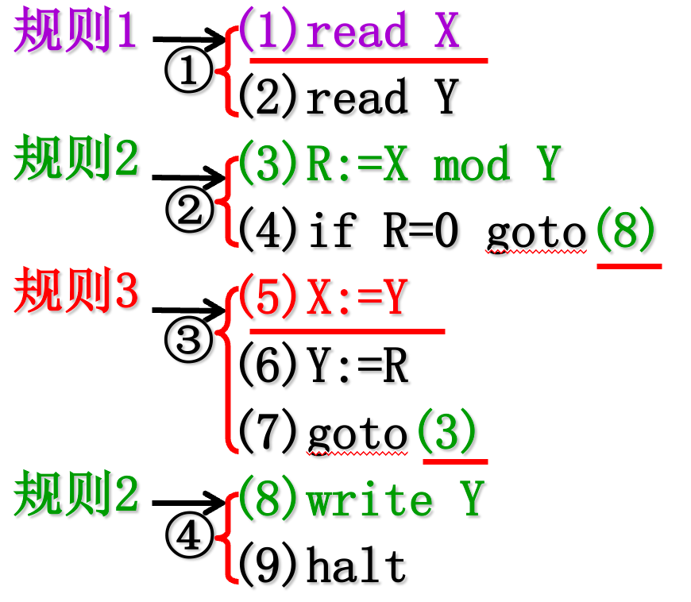
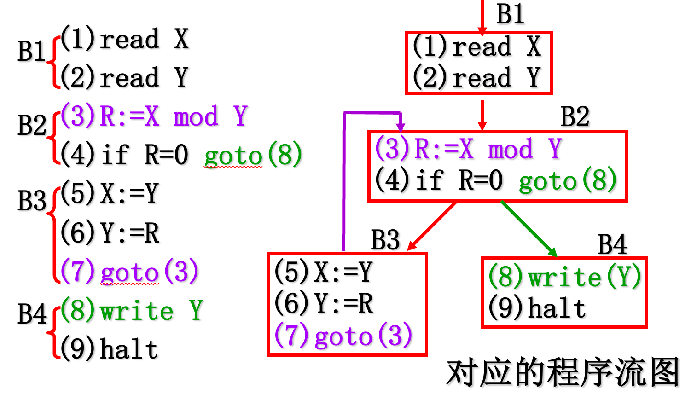
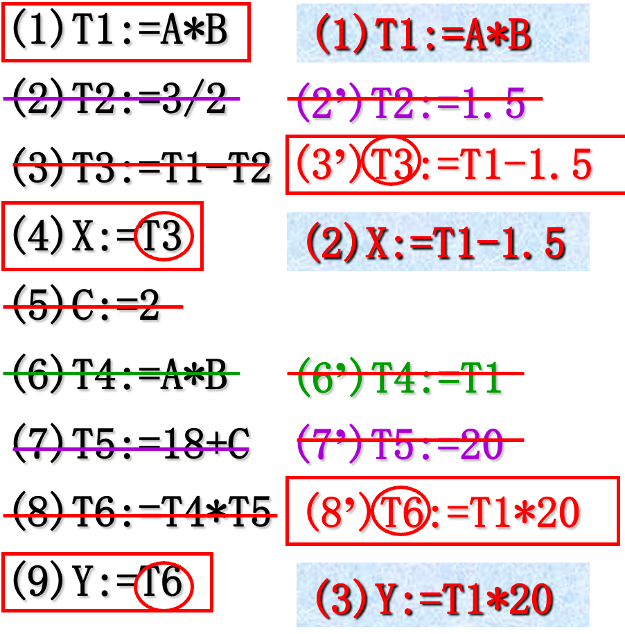
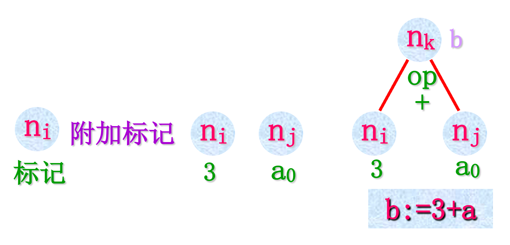
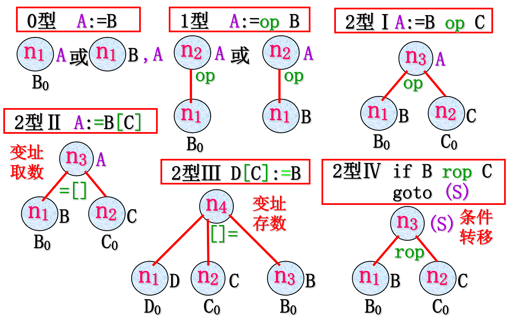
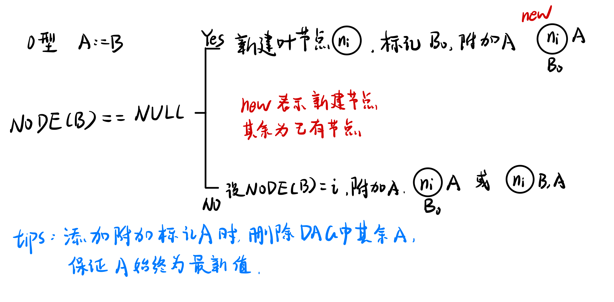
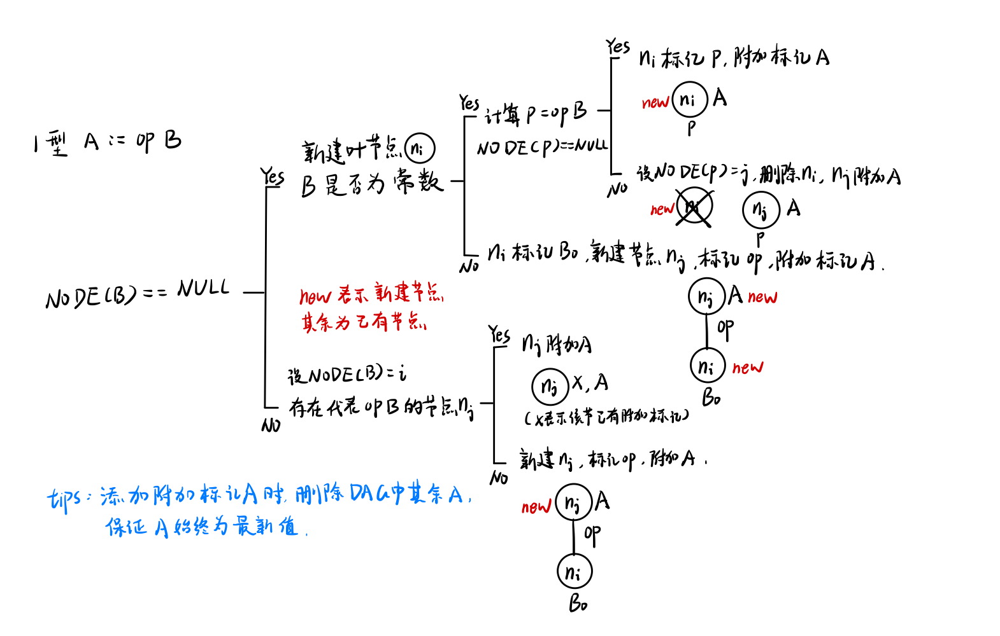
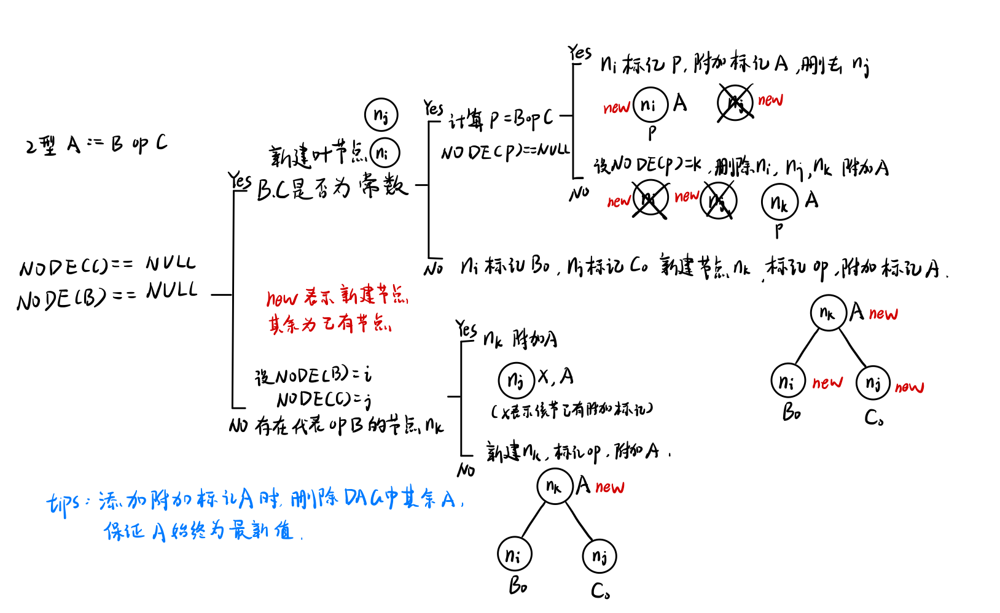
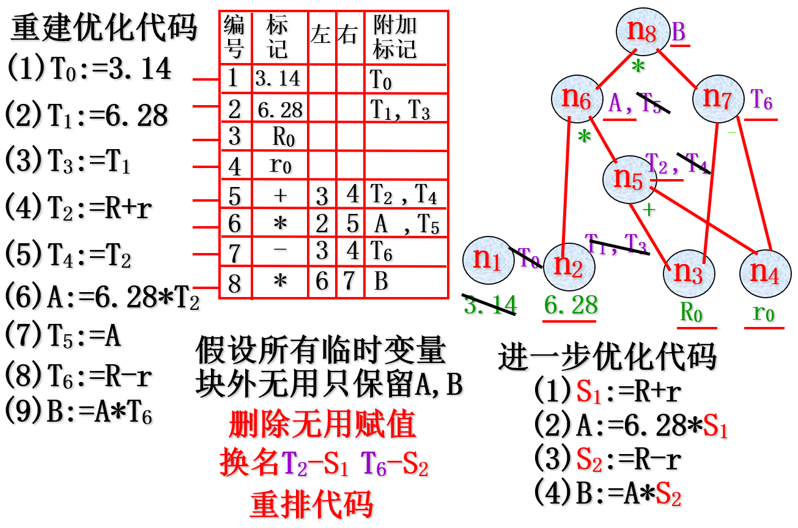

# 一、优化技术简介

## 1.1 优化的分类

**按阶段分成：**

- 与机器无关的优化，对中间代码进行
  
- 依赖于机器的优化，生成目标代码时进行
  

**根据优化时所涉及的程序范围分成：**

- 局部优化 在基本块内部进行优化
  
- 循环优化 对循环中的代码进行优化
  
- 全局优化 大范围的优化，涉及整个程序
  

## 1.2 优化工作的基础

控制流分析(data-flow analysis)

数据流分析(control-flow analysis)

变换(transformations)

# 二、局部优化

## 2.1 基本块

### 2.1.1 基本块的定义和性质

基本块的定义：是指程序中一顺序执行的语句序列，其中只有一个入口语句和一个出口语句。

基本块的性质：有唯一入口和唯一出口，块内各个操作按序执行，不出现任何分叉。

**基本块内的语句要么全执行，要么全不执行，而不能只执行一部分。**

### 2.1.2 基本块入口语句的确定

**确定规则：**

1. 程序的第一条语句；
  
2. 能由条件转移语句或无条件转移语句转移到的语句；
  
3. 紧跟在转移语句后面的语句。
  

只要满足上述规则中的一个，就是基本块的入口语句。

**举例：**

### 2.1.2 划分基本块的算法

1. 求出四元式程序中各个基本块的入口语句
  
2. 对以上求出的每一个入口语句，构造其所属的基本块，即寻找**结束语句**。满足下列规则之一的就是该基本块的结束语句：
  
    - 到另一入口语句(不包括该入口语句)；
    - 到一转移语句(包括该转移语句)；
    - 到一停语句(包括该停语句)。
    
    在入口语句和结束语句之间的语句序列组成一个基本块。
    
3. 凡未被纳入某一基本块的语句，都是程序中控制流程无法到达的语句，从而也是不会被执行到的语句，可把它们从程序中删去。
  

## 2.2 程序流图及常用优化技术

### 2.2.1 流图

定义：以基本块为结点，以程序控制流为有向边的一张有向图，用来描述程序。

### 2.2.2 优化技术

- 合并常数和已知量：(2) 编译时计算(2’) (7) 编译时计算(7’)
- 删除多余运算： (1)(6) A\*B公共子表达式只需计算一次 (6’)
  
- 复写传播：
  
    (3)引用T2 (3’) (8)引用T4，T5 (8’)
    
- 删除无用赋值：设所有临时变量和C在以后无用，则除了计算X，Y时要用到的变量保留外，删除其它赋值(2)’(5)’(6)’(7)’
  

## 2.3 基本块的DAG表示及其应用

### 2.3.1 基本块的DAG表示方法

**基本块的DAG：**结点带有标记或附加标记的DAG，其中标记放在节点的下方，附加标记放在节点右边，表示赋值操作（下图左1）。

**叶节点：** 标记是一个标识符或者常数（下图左2）。变量标记的下标为0 (下图左3) ，表示该变量的初值，该值由块外定值。

**内部结点：**标记是一个运算符，代表其直接后继结点值进行该运算的结果（下图右1）。

**附加标记：**一个或多个变量，可以附加到各个结点，表示这些变量持有该结点所代表的值。

### 2.3.2 几种常见三地址代码及对应DAG表示

**注：** 如0型中的两种情况，其中第一种情况表示当前DAG中不存在变量 B ，说明 B 由块外定值，所以新建一个 B0 节点表示。第二种情况是，当前DAG中已经存在代表 B 的节点，则直接将 A 写在右边，表示 A 的值和该节点的值相同即可。

### 2.3.3 基本块的DAG构造算法

函数`NODE(A)`：以名字A在对应表中查找结点

构造DAG的大致过程，对每一个三地址代码，按其类型不同分别构造：

**0型 A:=B**

**1型 A:=op B**

**2型 A:= C op B**

### 2.3.4 基本块的DAG构造及优化举例

