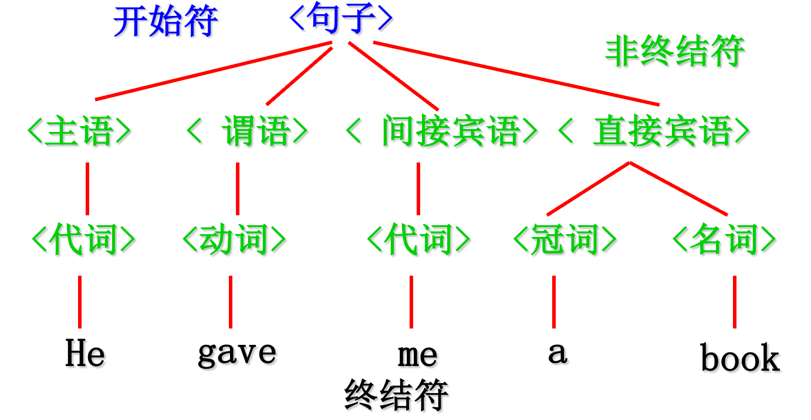
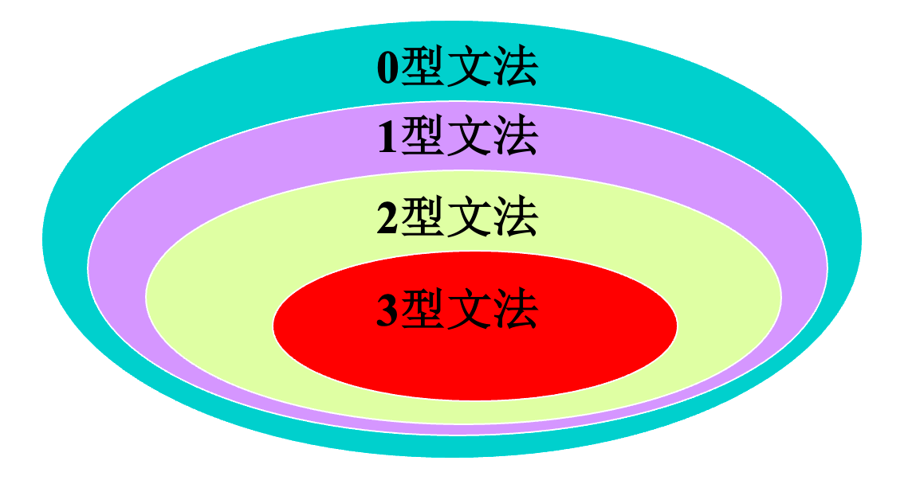
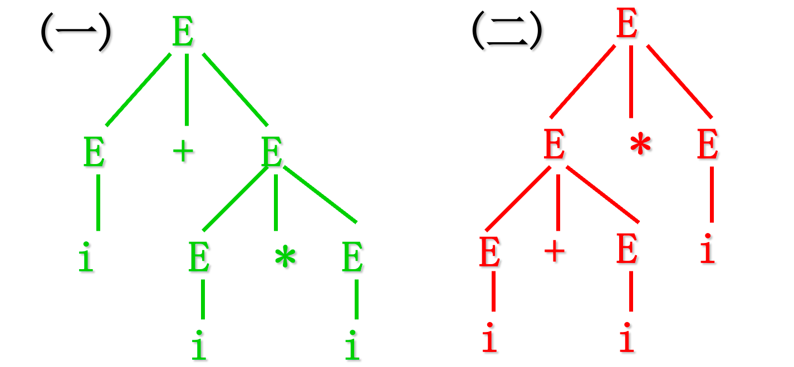
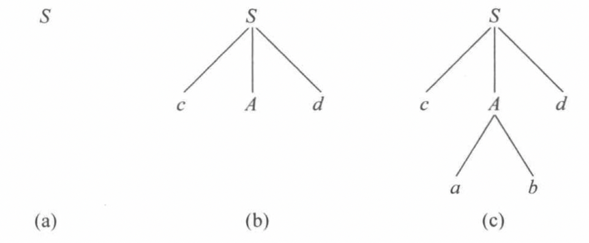
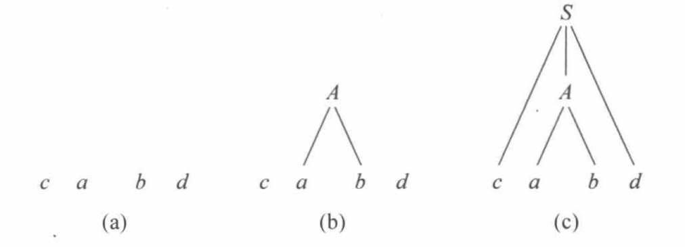
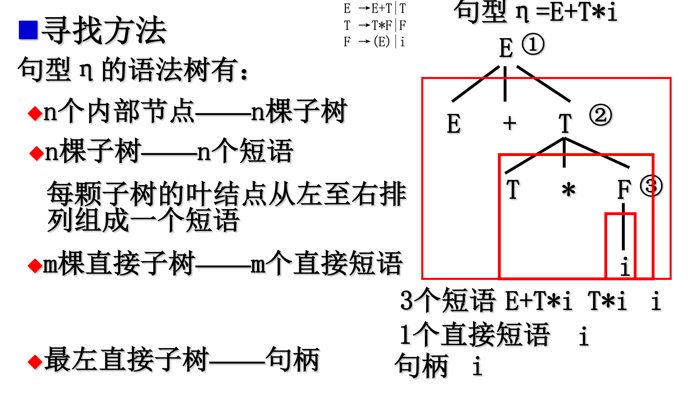

# 零、 程序语言的定义

一个程序语言是一个记号系统，其定义包含两部分：语法和语义

## 0.1 语法

**语法：**形成和产生**合适程序**的规则集，描述了该语言的程序的正确形式。

- 词法规则：形成单词符号的规则

    

- 语法规则： 形成语法单位的规则（语法树表示）

常用的语法描述方法（文法）：

- 用正规文法描述词法规则。

    

- 用上下文无关文法描述语法规则。

## 0.2 语义

**语义：**用以定义**程序意义**的规则集，即解释程序在运行时做什么

静态语义：标识符未声明、重复声明、类型不符、种类不符

动态语义：除零错误、下标越界、无效指针、死循环

**在不同语言中完全相同的语法单位，含义却可能完全不同**，例如：x=y 在C语言中表示赋值表达式，在Pascal语言中为关系表达式。

# 一、文法的直观概念

以定义描述英语句子的文法为例：He gave me a book

**文法的规则如下：**

```
(1)<句子>→<主语><谓语><间接宾语><直接宾语>
(2)<主语>→<代词>
(3)<谓语>→<动词>
(4)<间接宾语>→<代词>
(5)<直接宾语>→<冠词> <名词>
(6)<代词>→He|me
(7)<冠词>→a
(8)<动词>→gave
(9)<名词>→book|peach
```

`< >` 表示该对象还需要进一步定义， `->` 表示将左边的定义为右边。

**应用上述语法规则进行推导：**

```
句子
=>主语 谓语 间接宾语 直接宾语
=>代词 谓语 间接宾语 直接宾语
=>He 谓语 间接宾语 直接宾语
=>He 动词 间接宾语 直接宾语
=>He gave 间接宾语 直接宾语
=>He gave 代词 直接宾语
=>He gave me 直接宾语
=> He gave me 冠词 名词
=> He gave me a 名词
=> He gave me a book
```

`=>` 表示应用某个规则进行推导（即将相应规则的右部进行替换），上述例子中，终结符号为`He,me,book,gave`等，非终结符号为`句子,主语,谓语,动词`等，开始符号为 `句子`，产生式依靠语法规则。

**画出语法树：**





# 二、符号和符号串

## 2.1 符号和字母表

**符号(元素)：** 可以相互区别的记号，例如 a b 0 1。

**字母表：** 符号的非空有穷集合，如 `{0,1}` 表示二进制数语言的字母表，程序设计语言的字母表是该语言的基本字符集。

C语言是C程序的集合，C程序是在C基本字符集上定义的，按一定规则构成的符号串。

## 2.2 符号串

**定义：**由字母表中的符号所组成的任何有穷序列称为该字母表上的符号串。

**空串：** (ε—空字) 长度为0的符号串，|ε|=0。

### 2.2.1 符号串的操作

**运算：**

- 连接（并置）：x = 123, y = 45, xy = 12345
- 方幂：x0=ε,x1=x,x2=xx…

**子字符串：** 非空，原串从头和尾去掉 ≥0 个字符得到。

**头，尾：** x是xy的头，y是xy的尾。

### 2.2.2 字符串集合

**定义：**若集合A中的一切元素都是某字母表上的符号串，则称A为该字母表上的符号串的集合。

例： ，∑=0，1 是字母表,其中 0,1 为符号，则D=0,1 其中 0,1 为符号串，E=ε,0,1,00,01,10,11,000,…是 ∑ 上的符号串集合。 特别：空集记为фф= 注意与 ε 区别。

**操作：**

- 乘积：

     

    且UV=αβ|α∈U且β∈V

    

- 方幂 ：V的n次方幂就是将n个V相乘

- 符号串集V的闭包 V∗=V0∪V1∪V2∪V3∪…，，即 V 上的所有符号串(包括空字ε)的集合。

- 符号串集V的闭包 V+=V1∪V2∪V3∪…，，即 V 上的所有**非空**符号串(包括空字ε)的集合。

### 2.2.3 **语言的概念**

某个字母表 ∑ 上的符号串集合，是 ∑∗ 的一个子集。

# 三、 文法和语言的形式定义（重点）

## 3.1 规则或产生式

**形式:** α→β或α::=β，α 称为产生式的左部，β称为产生式的右部，读作“α定义为β”。

**举例：**

- A→a 这是关于A的一条规则

    

- <标识符> →<字母>

- <字母> →a|b|……|z

## 3.2 文法的定义

**定义：**ＧＶ，Ｖ，，Ｇ=(ＶT，ＶN，S，P)，以四元式的形式表示。

ＶＶT 非空有穷终结符集

ＶＶN 非空有穷非终结符集 ＶＶфＶT∩ＶN=ф

ＶS∈ＶN 开始符号 ，S至少在产生式左部出现一次

P 非空有穷产生式集合 α→β

- ＶＶα∈(ＶT∪ＶN)∗

    ，且至少含有一个非终结符

    

- ＶＶβ∈(ＶT∪ＶN)∗，

令ＶＶＶＶ=ＶT∪ＶN ，称Ｖ为文法符号，是文法G的字母表

## 3.3 文法描述的约定

用大写字母A、B、C…或汉语词组<标识符>代表**非终结符号**

用小写字母a、b、c…代表终结符号

用希腊字母α、β、γ…代表**终结符号和非终结符号组成的符号串**

若干个左部相同的产生式可以合并为一个 P→α1|α2|…|αn，每个αi 称为P的一个候选式

## 3.4 推导

**直接推导：**

产生式右部代替左部，当ＡＡ→γ 是文法Ｇ的一个产生式，且、ＶＶα、β∈(ＶT∪ＶN)∗，则有Ａα Ａ β=>α γ β，称 α γ β 是 Ａα Ａ β的直接推导或称 α γ β 直接归约到 αＡβ ，，G[E]:E→E+E|E∗E|(E)|i，i+E=>i+E∗E

特点：只能用一次产生式替换。

**归约：**

如果α0=>α1=>α2=>…=>αn，则称这个序列是从α0至αn的一个推导

用α0=+>αn表示从 α0 出发，经一步或多步推导，可推出 αn

用 α0=∗>αn 表示从 α0 出发，经零步或多步推导，可推出 αn ，即 或α0=αn或α0=+>αn

## 3.5 句型

**定义：**设 G 是一个文法，S 是开始符号，若有 S=∗>α，则称 α 是文法 G 的一个句型。G(E):E→E+E|E∗E|(E)|i。

例如 $E=+>i*E则,则*E是文法是文法G(E)$ 的一个句型。

$E=^+>i*i则,则i*i是文法是文法G(E)$ 的一个句型。

**句子**： 完全由终结符组成的句型。例如 $E=^+>i*i则,则i*i是文法是文法G(E)$ 的一个句子。

**合法句子的生成：**u从Ｓ出发反复推导，每次得到一个句型，最终得到句子。

## 3.6 文法G描述的语言

由文法Ｇ产生的所有句子的集合为：ＬＧ＝｜Ｓ＝＞且ＶＬ(Ｇ)＝α｜Ｓ＝+＞α 且 α∈ＶT∗

**文法G的作用：**以有限的规则描述无限的语言现象。

- 有限：产生式集合、终结符集合、非终结符集合。

    

- 无限：由开始符号导出的句子。

例：G[E]:E→E+E|E∗E|(E)|i，文法G所描述的语言：含有+、*和括号的算术表达式

## 3.7 文法等价性

若L(G1)=L(G2)，则称文法G1和G2是等价的（它们产生的句子集合相同）

例子：

文法 G1[E]:E→E+E|E∗E|(E)|i$

文法 G2[E]:E→E+T|T，T→T∗F|F，F→(E)|i

因为L(G1)=L(G2),所以文法G1和G2是等价的。

# 四、文法的类型

## 4.1 0型文法（**短语文法** ）

对任一产生式α→β，都有ＶＶα∈(ＶN∪ＶT)∗且α至少含有一个非终结符，ＶＶβ∈(ＶN∪ＶT)∗，此类文法的限制最少，描述能力最强。

直接替换

## 4.2 1型文法（上下文有关文法）

对任一产生式α→β，都有|α|≤|β| 仅仅ＳＳ→ε 除外，并且Ｓ不出现在其他产生式的右部。

例如： S→aSBA，AA’→AB 。

这里的上下文有关指的是，对于某个推导还限制了一定的条件，比如 AA′→AB ，直观来看就是 A′→B，但是替换有个“上下文限制”，即必须前面有一个 A 才能替换。

## 4.3 2型文法（上下文无关文法）

对任一产生式α→β，都有Ｖ，ＶＶα∈ＶN，β∈(ＶN∪ＶT)∗

例如 E→E+T|T，足以描述大多数程序设计语言语法特征

## 4.4 3型文法（正规文法）

- 右线性文法：对任一产生式的形式都为Ａ→ａＢ或Ａ→ａ，其中

    Ａ，ＢＶ，ａＶ（ａ可为）Ａ，Ｂ∈ＶN，ａ∈ＶT∗（ａ可为ε）

    

- 左线性文法：对任一产生式的形式都为Ａ→Ｂａ或Ａ→ａ，其中Ａ，ＢＶ，ａＶ（ａ可为）Ａ，Ｂ∈ＶN，ａ∈ＶT∗（ａ可为ε）

## 4.5 四类文法的关系

由于四种文法是按照将产生式做进一步限制而定义的，所以它们之间是逐级“包含”的关系，由四种文法产生的语言也是逐级“包含”关系。





# 五、上下文无关文法及其语法树（重点）

## 5.1 上下文无关文法组成

**终结符号：**组成语言的基本符号，在程序语言中是单词符号。

**非终结符号：**用来代表语法范畴(语法概念)，每个非终结符号表示一定符号串的集合。

**开始符号：**一个特殊的非终结符号。

**产生式：**是定义语法范畴的一种书写规则。形式 A→α，A是一个非终结符，称为产生式的左部符号，α是一个符号串，称为产生式的右部

## 5.2 语法树（推导树）

**构造特点：**

- 每个结点都有一个V中的符号作标记

    

- 根结点——开始符S

- 中间结点——非终结符 ＶA∈ＶN

- 叶结点——非终结符或终结符(关于句型)，终结符Ｖa∈ＶT(关于句子)

- 如果结点n标记为A， 其直接子孙从左到右的标记为则A1,A2,…,Ak,则A→A1A2…Ak∈P

**构造步骤：**

- 步骤1 根结点为开始符号

    

- 步骤2 对于每一次推导使用的产生式A→α，找出A对应的结点(此时应该是末端结点)，从该结点向下画分支，子结点从左到右分别是α中从左到右的符号

- 重复步骤2直到推导的最后一步

**语法树特点：**

从语法树的构造过程可以看出，句型的推导过程不同，语法树的生长过程也不同，但最终生成的语法树结构是完全相同的。可以说，一棵语法树包括了一个句型所有可能的推导过程。整体上看不出推导的次序(即产生式使用的次序)，只能看出使用了哪些产生式。

## 5.3 最左（最右）推导

定义：在一个推导的过程中，如果每一步直接推导所被替换的总是最左(右)的非终结符号。最右推导常被称为**规范推导**。由规范推导所得到的句型称为**规范句型**，也称为**右句型**。

## 5.4 二义性文法

### 5.4.1 二义性定义

若一个文法**存在某个**句型对应两棵不同的语法树，则称这个文法是**二义性文法**。或者，若一个文法存在某个句型有两个不同的最左(最右)推导，则称这个文法是二义性文法。二义性一般是有害的，如果一个句子具有二义性，那么对这个句子的结构可能有多种“正确”的解释。通常情况下，我们希望对每个语句的分析是唯一的。但是,只要我们能够控制和驾驭文法的二义性,文法二义性的存在并不一定是坏事 。

例如：文法$G：E→E+E | E*E | (E) | i，文法的句子，文法的句子:i+i*i$，其语法树如下：





### 5.4.2 二义性的判定

这个问题是不可判定的。对某文法，若能找出一个句子对应两棵不同的语法树，则该文法必是二义性文法。

二义性文法可以改造为无二义性文法。

G1[E]:E→E+E|E∗E|(E)|i，G1是二义性文法

，，G2[E]:E→E+T|T，T→T∗F|F，F→(E)|i，G2(E)是无二义性文法，两者等价。

# 六、 句型的分析（重点）

## 6.1 基本概念

句型分析问题：如何知道所给定的字符串是文法的句型。

句型的分析：就是识别一个符号串是否为某文法的句型，是某个推导的构造过程。或者说，是否能为一个符号串构造一颗语法树。

语法分析树（或分析树）：就是语法树。

分析程序（或识别程序）：完成句型分析的程序。分析算法又称为识别算法。

## 6.2 自上而下的分析方法

从开始符号出发，构造最左推导的过程。即从树根出发，利用推导生成语法树的过程。

例如：

文法G[S]:(1)S→cAd (2)A→ab (3)A→a，输入串w=cabd





## 6.3 自下而上的分析方法

从输入串出发，进行最左归约，直到开始符号。从叶子结点出发，修剪语法树直至只剩开始符。

还是以上面的文法为例：

首先选择ab，然后用A替换，即把 ab **归约**到 A。





## 6.4 句型分析的有关问题

### 6.4.1 自上而下的句型分析

文法G[S]:(1)S→cAd (2)A→ab (3)A→a，输入串w=cabd，根据自上而下的推导，我们构造出第一个直接推导S⇒cAd，接着拓展非终结符A ，这时有多种选择，如果我们用产生式（3）推导，我们可以发现构造不出w=cabd ，所以是个错误推导。面对这种情况，需要退回去，试试另外一种选择，这种方式称为**回溯**，但是这种方法效率极低。

### 6.4.2 自下而上的句型分析

在归约的时候，同样也会遇到多种选择的情况，如果用（3）将 a 归约成 A，则会出错，必须用（2）进行归约。在一种叫做**规范归约**的分析方法中，我们将这些能够正确归约的子串称为**可归约串**，也称为**句柄**。

下面介绍三个重要的概念：

⇒∗ 指左部可以经过0步或多步推导得到右部，⇒+ 指左部可以经过1步或多步推导得到右部

- **短语：** 若ＳＡ，且Ｓ⇒∗αＡδ，且A⇒+β，则称 β 是句型 αβδ 相对于非终结符号 A 的短语。
- **直接短语：**若ＳＡ且Ｓ⇒∗αＡδ且A⇒β，则称β是句型 αβδ 相对于非终结符号A的直接短语。
- **句柄：** 一个句型的最左直接短语称为该句型的句柄。（此概念只适用于右句型）

### 6.4.3 利用语法树寻找短语、句柄等方法

句型η的语法树有若干个内部节点（包括根节点）每个内部节点对应一棵以该内部节点为根的子树。

如果一棵子树只有父子两代（两层节点），则称该子树为**直接子树。**

如果一棵子树的根标记为A，且将此子树的叶节点 标记自左至右排列所形成的符号串为β，**则β是句型 η 相对于A的一个短语。**

如果子树是一棵直接子树，**则β是句型 η 相对于A的一个直接短语**，最左直接子树对应该句型的句柄。



