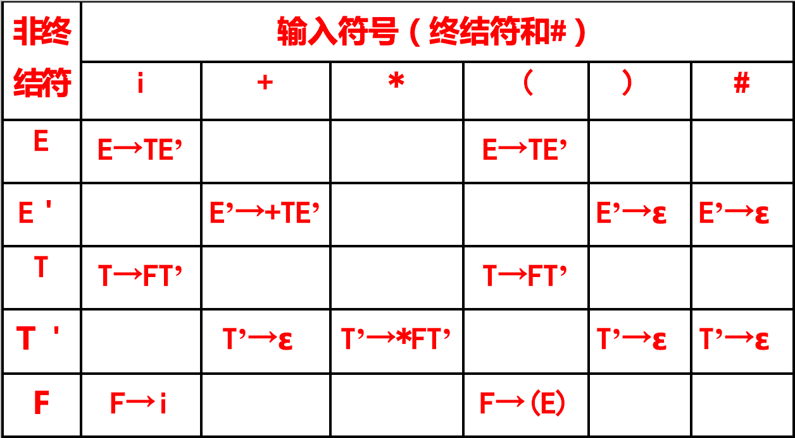

# 一、确定的自顶向下语法分析思想

基本方法：对任何输入串,试图从文法的开始符号出发， 自上而下地为输入串建立一棵语法树，或者说为输入串寻找一个最左推导。

过程本质：是一种试探过程，是反复使用不同产生式谋求匹配输入串的过程如何选择哪个产生式进行推导，某文法符号对应当前输入符号时，有唯一的产生式进行替换并向下推导。

## 1.1 First集合

### 1.1.1 定义

设Ｖ，Ｖ，，）ＶG=(ＶT，ＶN，S，P）α∈Ｖ∗

$FIRST(α)=\{a|α\overset*\Rightarrow aβ，a∈ＶT\}，若，若α\overset*\Rightarrow ε，则，则ε∈FIRST(α)$

FIRST(α) 是 *α* 的**所有可能推导的首遇终结符号或 \*ε\***，是选择产生式的依据。

### 1.1.2 举例

S→Ap|Bq A→cA|a B→dB|b

，FIRST(Ap)=a，c,Ap⇒apAp⇒cAp

，FIRST(Bq)=b，d,Bq⇒bqBq⇒dBq

因为 S 的两个候选式 FIRST(Ap)∩FIRST(Bq)=φ,所以当 S 与面临的输入符号 i 匹配时，可能出现几种选择？

- i∈FIRST(Ap)

    ，选择 S → Ap 匹配。

    

- i∈FIRST(Bq)，选择 S → Bq 匹配 。

- 出错，即 i 只能从上面两个候选式中产生，否则就是出错。

## 1.2 FOLLOW集合

### 1.2.1 定义

ＶＶA∈ＶN,FOLLOW(A)=a|S⇒∗…Aa…,a∈ＶT，若，则（）若S⇒∗…A，则#∈FOLLOW（A）

`#`(有些书上用`$`)：输入串的结束符，也可看作是句子的括号 #S#。

FOLLOW(A)表示了句型中**可能紧跟在A后面的终结符号**。

### 1.2.2 举例

S→aA|d A→bAS|ε

S⇒aA,#∈FOLLOW(A)

S⇒aA⇒abAS⇒abAaA,a∈FOLLOW(A)

S⇒aA⇒abAS⇒abAd,d∈FOLLOW(A)

因为 A 的两个候选式FIRST(bAS)∩FOLLOW(A)=φ,所以当A与面临的输入符号 i 匹配时，可能出现几种选择？

- i∈FIRST(bAS)

    ，选择

    A→bAS

     匹配。

    

- i∈FOLLOW(A)，选择A→ε 匹配 。

- 出错

## 1.3 SELECT 集合

### 1.3.1 定义

设Ｖ，Ｖ，，）ＶG=(ＶT，ＶN，S，P）α∈Ｖ∗，，ＶFIRST(α)={a|α⇒∗aβ，a∈ＶT}

若α⇏∗ϵ，则SELECT(A→α)=FIRST(α)

若α⇒∗ϵ，则SELECT(A→α)=(FIRST(α)−{ϵ})∪FOLLOW(A)，这里的意思是，如果 α 能推出 ϵ ，则 A 后面紧跟着的终结符也可以由 A→α 产生，或者 α 前的终结符也可以由 A→α 产生。

**SELECT集合不允许有空串。**即非终结符 A 面临某个输入符号时，选择产生式的依据。

### 1.3.2 举例

S→aA|d A→bAS|ε

FOLLOW(A)={a,d,#}

SELECT(A→bAS)=FIRST(bAS)={b}

SELECT(A→ε)=(FIRST(ε)−ε)∪FOLLOW(A)={a,d,#}

S→aA|d A→bAS|K K→c|ε

FOLLOW(A)={a,d,#}FIRST(K)={c,ε}

SELECT(A→bAS)=FIRST(bAS)={b}

SELECT(A→K)=(FIRST(K)−ε)∪FOLLOW(A)={c,a,d,#}

## 1.4 LL(1)文法

### 1.4.1 定义

一个上下文无关文法是 LL(1) 文法的充分必要条件是，对每个非终结符的两个不同的产生式，，A→α，A→β，满足：SELECT(A→α)∩SELECT(A→β)=φ

### 1.4.2 举例

S→aA|d A→bAS|ε

求所有SELECT集合：

SELECT(S→aA)=FIRST(aA)={a}

SELECT(S→d)=FIRST(d)={d}

SELECT(A→bAS)=FIRST(bAS)={b}

SELECT(A→ε)

n=(FIRST(ε)−ε)∪FOLLOW(A)={a,d,#}

求每个非终结符不同产生式SELECT的交集：

SELECT(S→aA)∩SELECT(S→d)=φ

SELECT(A→bAS)∩SELECT(A→ε)=φ

所以，该文法是LL(1)文法。

## 1.4.3 LL(1)分析

**含义：**第一个 L 表示从左向右扫描输入符号串；第二个 L 表示生成最左推导；1 表示读入一个符号可确定下一步推导。

LL(1)文法能够对输入串进行有效的、无回溯的自上而下分析。

**规则：**

对于文法G，当面临的输入符号为a，要用非终结符A进行匹配时，假设 A 的所有产生式为 A→α1|α2|…|αn

- 若

    a∈FIRST(αi)

    ，则指派

    αi

    去执行任务。

    

- 若 a 不属于任何候选首符集，则：

    - 若ε属于某个FIRST(αi)且a∈FOLLOW(A)，则让 A 与ε自动匹配。
    - 否则，a的出现是一种语法错误。

其实上述的规则就是 SELECT 集合的定义，所以其实就是看输入符号属于哪个 SELECT 集，就选择相对应的产生式。

# 二、LL(1)文法的判别

一个上下文无关文法是 LL(1) 文法的充分必要条件是，对每个非终结符的两个不同的产生式，，A→α，A→β，满足：SELECT(A→α)∩SELECT(A→β)=φ

## 2.1 FIRST(α)的计算法

### 2.1.1 步骤

**重复以下计算，直到FIRST（X）不再增大为止:**

1. 若

     

    ＶX∈ＶT

    ，则

     

    FIRST(X)={X}

    ，即将自身加入集合。

    例：FIRST(+)={+}FIRST(i)={i}

2. 若 ＶX∈ＶN，若有X→a…，则将 a 加入FIRST(X)，将所有一步推导出的前缀终结符加入集合。

    例：，则E′→+TE′，则+∈FIRST(E′)，则，F→(E)|i,则(，i∈FIRST(F)

    若有X→ε，则将ε加入FIRST(X)

3. 若有 ，且ＶX→Y…，且Y∈ＶN ，则 FIRST(Y)−ε 加入FIRST(X)。

    例：，F→(E)|i FIRST(F)={(，i} T→FT′ ，FIRST(T)=FIRST(F)−{ε}={(，i}

    若有X→Y1…Yi−1Yi…Yk，并对于某个 i ,有 1≤j≤i−1，ε∈FIRST(Yj)，

    即，，，Y1，…，Yi−1⇒∗ε， 则将所有FIRST(Yj)−ε∪FIRST(Yi)−ε加入FIRST(X)中;

    若所有Y1,…,Yk⇒∗ε，则将ε加入到FIRST(X)。

    问题：如果 Y→ε,X→Y ,那么FIRST(X)=ε ？？？？

### 2.1.2 举例

文法G为：

S→Ap|Bq A→a|cA B→dB|ε

- 先找以终结符开头的产生式：

FIRST(A)={a,c}

FIRST(B)={d,ε}

- 再找右部以非空终结符开头的产生式

FIRST(S)=FIRST(A)–{ε}∪FIRST(B)–{ε}∪FIRST(q)={a,c,d,q}

加入 FIRST(q) 是因为 B→ε

### 2.1.3 FIRST(α)举例


## 2.2 FOLLOW(A)的计算法

### 2.2.1 步骤

反复重复步骤，直到集合不再增大。

1. 将 # 加入到 FOLLOW(S) 中。
2. 若A→αBβ,则将FIRST(β)−{ε}加入FOLLOW(B)
3. 若 A→αB，或 A→αBβ，且β⇒∗ε，即，ε∈FIRST(β)，A≠B，则将FOLLOW(A)所有元素加入FOLLOW(B)

问：如果S不能推导得到A呢？

### 2.2.2 举例

：G：

E→TE′

E′→+TE′|ε

T→FT′

T′→∗FT′|ε

F→(E)|i

\#∈FOLLOW(E)

对每个非终结符查看其在产生式右边的出现：(注意！！！)

FOLLOW(E)={),#}

FOLLOW(E′)=FOLLOW(E)={),#}（步骤三）

FOLLOW(T)=FIRST(E′)–{ε}∪FOLLOW(E)（步骤二+步骤三）

FOLLOW(T′)=FOLLOW(T)={+,),#}

FOLLOW(F)=FIRST(T′)−{ε}∪FOLLOW(T)={∗,+,),#}

## 2.3 SELECT(A)的计算法


# 三、不确定的自顶向下分析思想

**不确定性导致回溯的原因：**

- 由于相同左部的产生式的右部FIRST集交集不为空而引起回溯。

    

- 由于相同左部非终结符的右部存在能⇒∗ε的产生式，且该非终结符的FOLLOW集中含有其他产生式右部FIRST集的元素。

- 由于文法含有左递归引起回溯。例：文法G: S → Sa|aba

# 四、某些非LL(1)文法到LL(1)文法的等价变换

## 4.1 提取公共左因子方法

对于所有形如 A→αβ1|αβ2|…|αβn|γ的规则，其中，α为左因子，γ不以α开头，改写为：

A→αA′|γ其中A′为新增加的非终结符A′→β1|β2|…|βn

例如：

S→xAy A→ab|a

提左因子后变换为：

S→xAy

A→aA′

A′→b|ε

**注意事项：**

- 变换后存在的无用产生式需要删除。

    

- 不一定每个文法都能在有限步骤内替换成无左公共左因子的文法。

- 一个文法提取了公共左因子后，只解决了相同左部产生式的FIRST集不相交问题，当改写后的文法不含空产生式，且无左递归时，则改写后的文法是LL(1)文法，若还有空产生式时，则还需要用LL(1)文法的判别方式进行判断才能确定是否为LL(1)文法。

## 4.2 左递归消除

### 4.2.1 关于非终结符P的规则

直接左递归定义：若，且、ＶP→Pα|β，且α、β∈Ｖ∗

### 4.2.2 方法

改写为等价的右递归，形如：P→Pα|β ，α非ε，β不以P开始。

改写为：（为新增加的非终结符）P→βP′（P′为新增加的非终结符）P′→αP′|ε

改写前产生式可产生短语 ：P⇒Pα⇒βα

改写后产生式可产生短语：P⇒βP′⇒βαP′⇒βα

### 4.2.3 消除多个直接左递归

若有多个左递归的产生式如：P→Pα1|Pα2|…|Pαm|β1|β2|…|βn

消除左递归后变为：

P→β1P′|β2P′|…|βnP′

P′→α1P′|α2P′|…|αmP′|ε

消除左递归要求文法：

1.无回路(A⇒∗A)

2.无空产生式(A→ε)

### 4.2.4 消除间接左递归

**间接左递归定义：** 若ＶP⇒+Pα   α∈Ｖ∗

例如：

S→Aa A→Sb|b

S⇒Aa⇒Sba，即S⇒+Sb

用 S 的产生式右部替换 A 右部的 S 得：A→Aab|b，变成A的产生式含有直接左递归。

# 五、确定的自顶向下分析方法

## 5.1 递归子程序法

### 5.1.1 原理

用LL(1)文法构造不带回溯的自上而下的分析程序，一个分析程序对应一组递归过程，每个非终结符对应一个子递归。子过程的功能：

对相应非终结符产生式右部进行语法分析。分析程序从开始符号所对应的过程开始运行。

**举例：**

消除左递归后的表达式文法G为：

E→TE′

E′→+TE′|ε

T→FT′

T′→∗FT′|ε

F→(E)|i

可以证明，G是一个LL（1）文法。

从开始符号 E 开始对其右部进行分析：

```c
E(){
    //由于E右部为非终结符，所有非终结符对应一个子递归。
    T; //递归进入另外一个函数
    E';//递归进入另外一个函数
}
```

对E′ 进行分析：

```c
E’(){   
    if (c==‘+’)//c：当前所面临的输入符号
    { 
        p++;//把输入指针p下移一位
        T;
        E’; 
    }
    //其它 非+字符 自动匹配ε
}
```

对 T 进行构造：

```c
T(){
    F;
    T';
}
```

对T′ 进行构造：

```c
T'{
    if(c == '*'){
        p++;
        F;
        T';
    }
}
```

对 F: F→(E)|i进行构造：

```c
F{
    if(c == '(') {
        p++;
        E;
        if(c == ')')p++;
        else Error;//注意这里如果不是')' 则无法匹配，发生错误。
    }else if(c == 'i') p++;
    else Error//F面临非'('和'i'时，无法匹配。
}
```

### 5.1.2 递归下降分析程序优缺点分析

优点：

1. 直观、简单、可读性好

    

2. 便于扩充

缺点：

\1) 递归算法的实现效率低

\2) 处理能力相对有限(LL(1))

## 5.2 预测分析方法

### 5.2.1 预测分析表简介

实现LL(1)分析的另一种有效方法，称为预测分析法，使用一张二维分析表（预测分析表）和一个分析栈（文法符号栈）联合进行控制来实现自上而下分析技术。

预测分析表实际上是一个矩阵M[A,a]，其有两种取值，如果当A面临a时存在可选用的候选式，则为该产生式，否则为空值（表示A面临a时无法匹配，出现语法错误），例如下图所示：





### 5.2.2 分析栈的说明

分析栈用于存放分析过程中的文法符号，分析栈初始化时：栈底压入一个‘#’，再压入开始符 S。预测分析器模型如下图所示,总控制程序从输入缓冲区得到输入符号，与栈顶符号一起在预测分析表中查找选用的产生式序列，并根据不同情况修改栈，最终得到一个产生式序列：


**总控程序执行时可能动作：**

对于任何（X，a） ，X是栈顶符号 a 是面临输入符号，则：

- ＶX∈ＶT

     

    且

     

    ＝＝X＝a＝′#′

     

    : 分析成功结束，输入串是一个合法句子。

    

- ＶX∈ＶT 且 ＝X＝a≠′#′，X 出栈，输入指针指向下一输入符号。

- ＶX∈ＶN ，查分析表 ，M[X，a]：

    - 若 ，M[X，a]=X→αi，X 出栈，αi 逆序入栈，输入指针不动。
    - 若 ，空M[X，a]=空，则调用 error 程序，进行错误处理。

下面给出输入串w=i∗i+i的预测分析过程：

```
栈           输入缓冲区        所用产生式
0  #E          i+i*i#         E → TE'
1  #E'T        i+i*i#         T → FT'
2  #E'T'F      i+i*i#         F → i
3  #E'T'i      i+i*i#         i出栈，a下移
4  #E'T'        +i*i#         T' → ε
5  #E'          +i*i#         E' → +TE'
6  #E'T+        +i*i#         +出栈，a下移
7  #E'T          i*i#         T → FT'  
8  #E'T'F        i*i#         F → i  
9  #E'T'i        i*i#         i出栈，a下移
10 #E'T'          *i#         T' → *FT'
11 #E‘T'F*        *i#        *出栈，a下移 
12 #E'T'F          i#         F → i
13 #E'T'i          i#         i出栈，a下移
14 #E'T'            #         T' → ε
15 #E'              #         E' → ε
16 #                #         分析成功结束
```

### 5.2.2 预测分析表的构造

设有文法G，预测分析表**构造过程**：

计算所有候选式α的首符集：FIRST（α）

计算所有非终结符A的后继符集：FOLLOW（A）

计算所有产生式的 SELECT(A→α) 集合，构造预测分析表 M

**预测分析表的构造算法：**

(1)对文法G的每个产生式 A→α，执行(2)

(2)对每个终结符或“#”记为a，若a∈SELECT(A→α)，把 A→α 填入 M[A,a]

(3)把所有无定义的 M[A,a]标上“出错标志”

### 5.2.3 预测分析法流程

\1) 编写文法，消除二义性；

\2) 消除左递归、提取左因子；

\3) 求 FIRST 集合、 FOLLOW 集合和SELECT集合

1. 检查是不是 LL(1) 文法，若不是 LL(1),说明文法的复杂性超过自上 而下方法的分析能力
2. 按照 LL(1) 文法构造预测分析表
3. 实现预测分析器