# 一、属性文法

## 1.1 属性文法的举例

### 1.1.1 综合属性

有句子：3∗5+4n

表达式的文法：

```
1.L→En 2.E→E1+T 3.E→T 4.T→T1*F 5.T→F 6.F→(E) 7.F→i  
```

下图为用语法树进行表达式求值的过程，可以发现所有的值都是自下而上传递的，这种称为综合属性。

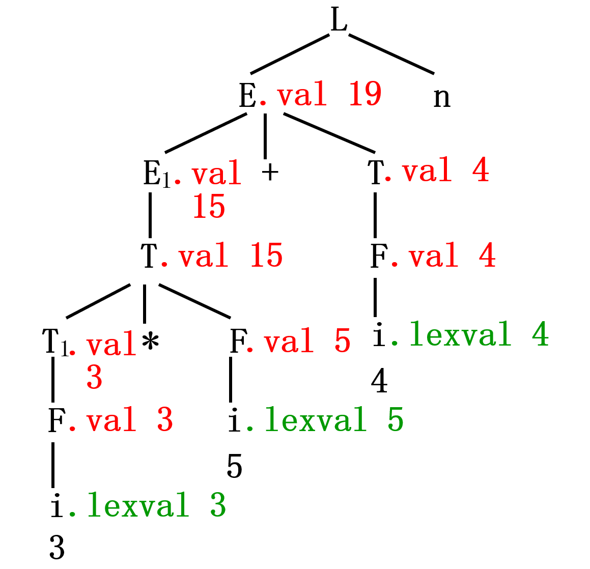

### 1.1.2 继承属性

有句子：real id1,id2,id3

文法：

```
D → T LT → intT → real  L → L1,idL → id
```

记录标识符的类型并将类型信息传递的过程，这些属性都是自上而下的，称为继承属性。

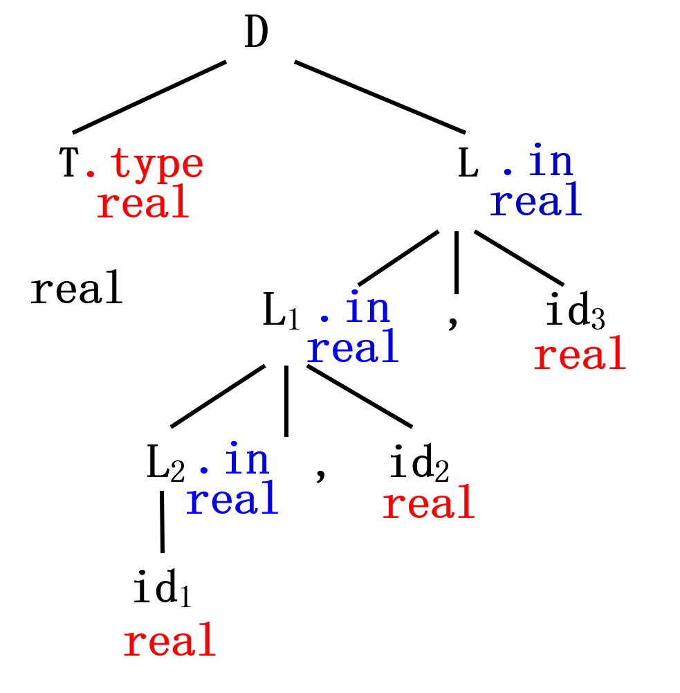

## 1.1 属性文法的定义

属性文法是Knuth在1968年提出的，属性文法的特点：

- 是一种接近形式化的语义描述方法。
- 每个文法符号有相应的属性 V——属性集合，代表与文法符号相关的信息；例如类型、值、代码序列等。
  
- 每个产生式配有相应的语义规则 F——规则集合，计算属性的规则,可以产生代码、在符号表中存放信息、给出错误信息或执行任何其它动作，实现翻译；以函数形式 b:=f(c1,c2,…,ck) 表示。
  
- 属性文法：三元组A\=(G,V,F)，在上下文无关文法的基础上，把每个文法符号和一组属性相关联，并给产生式附加以语义规则。

## 1.2 属性分类

产生式 A→α 有语义规则 b:=f(c1,c2,…,ck)

**综合属性：** 用于“自下而上”传递信息。如上式中，b 是 A 的综合属性, c1,c2,…,ck是右边文法符号的属性。从分析树的角度来看，是从其子结点的属性值计算出来的，**终结符只有综合属性，由词法分析器提供。**

**继承属性：**用于“自上而下”传递信息。b 是右边某个文法符号的继承属性, c1,c2,…,ck是A或右边任何文法符号的属性，从其兄弟结点和父结点的属性值计算出来，开始符号的继承属性作为属性计算前初值。

非终结符既可有综合属性也可有继承属性,一般对于出现在产生式右边的继承属性和出现在产生式左边的综合属性都必须提供一个计算规则。

# 二、语法制导翻译概论

**语法制导翻译法：**

由源程序的语法结构所驱动的处理办法，为文法中每个产生式配上一组语义规则，并且在语法分析的同时执行这些语义规则，完成相应的语义处理。每当用一个产生式推导或归约时，就执行对应的语义规则。

## 2.1两种属性文法

**S-属性文法：**

仅包含综合属性的语法制导定义，对于所有ＡＸＸＸＡ→Ｘ1Ｘ2…Ｘn，Ａ的属性计算仅用ＸＸＸＸ1,Ｘ2,…,Ｘn的属性，自下而上计算属性，如：算术表达式求值的属性文法。

**L-属性文法：**

包含综合属性和继承属性的语法制导定义，对于所有$Ａ→Ｘ_1Ｘ\_2…Ｘ_{i-1}Ｘ_i …Ｘ\_n,Ｘ\_i属性计算仅使用属性计算仅使用Ｘ\_1,Ｘ\_2…Ｘ_{i-1}的属性和的属性和A$ 的继承属性。自上而下计算属性。如 说明语句的属性文法。

## 2.2 翻译模式

语法制导翻译的两种描述形式：

**属性文法(语法制导定义) (Grammar Directed Definition)：**语义的抽象说明，隐去实现细节

**翻译模式 (Translation Scheme)**：规定实现方法，表明计算次序

翻译模式的特征：规定在语法分析中使用语义规则进行计算的次序，保证当动作使用某属性时，该属性必须是可用的

翻译模式的构造方法：将{语义动作}插入到产生式中的某个位置

## 2.3 S-属性文法自下而上翻译

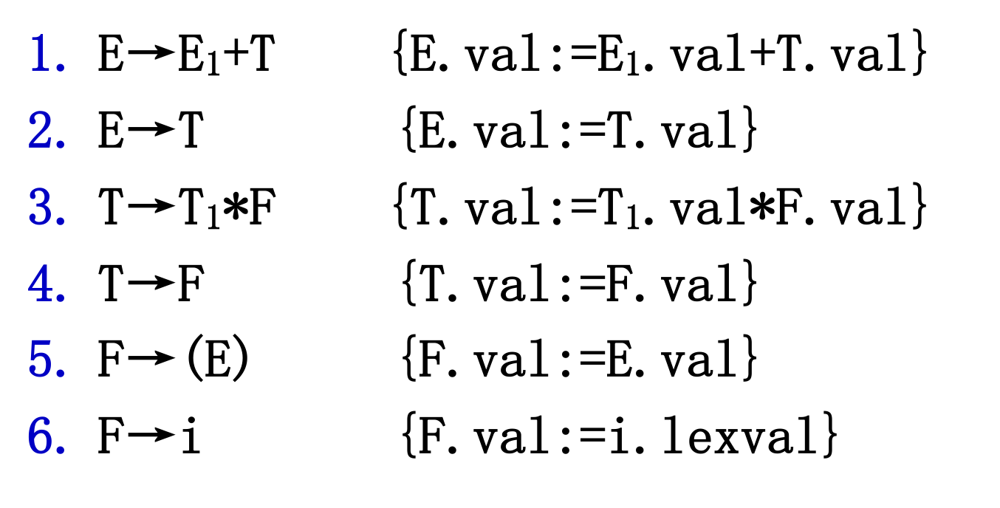

## 2.4 L-属性文法自下而上翻译

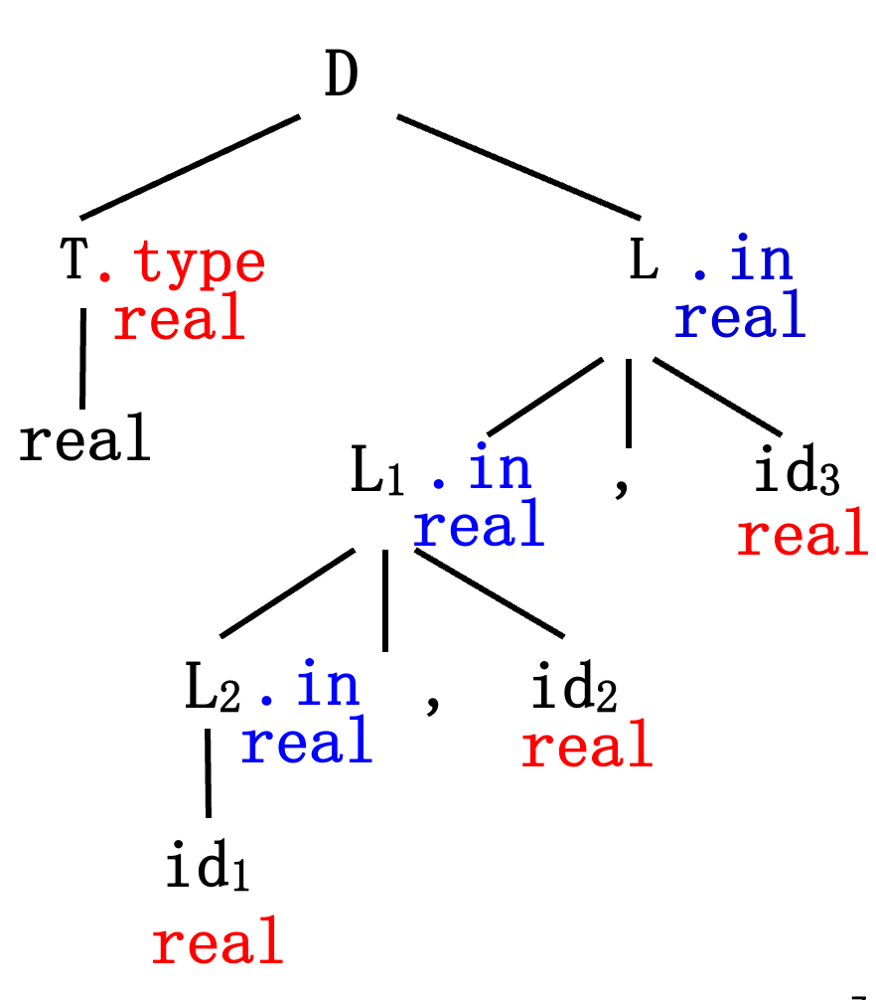

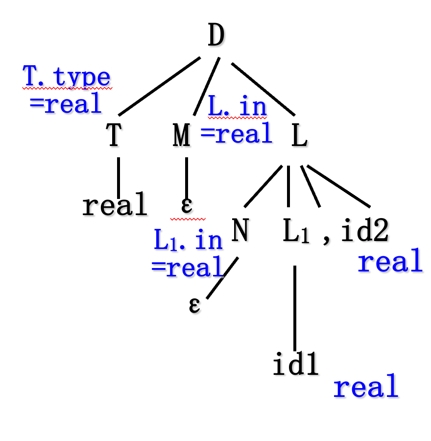

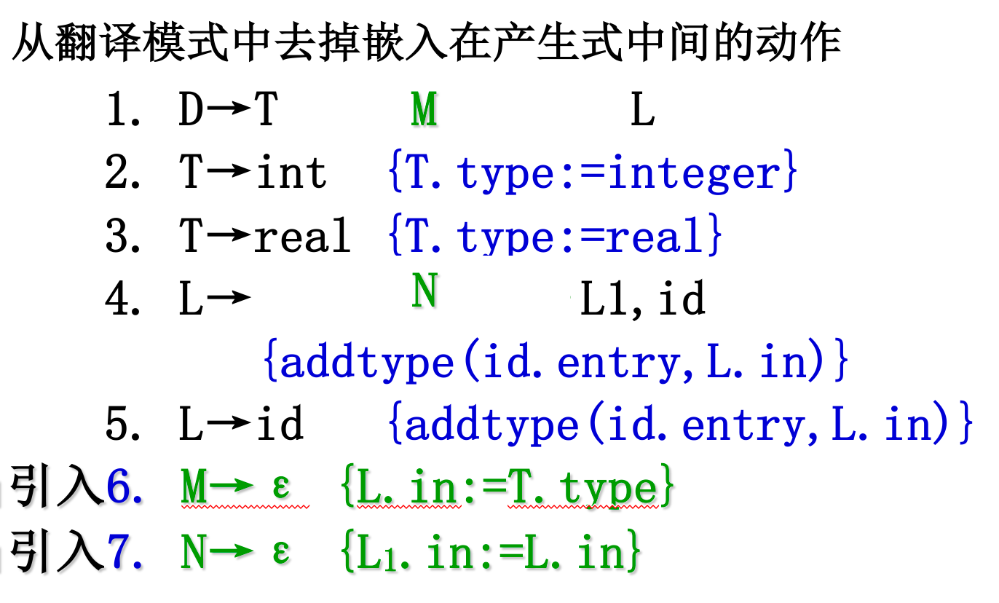

# 三、中间代码形式

许多编译程序采用的独立于机器的、复杂性界于源语言和机器语言之间语言源程序的一种内部表示：**中间代码**

**用中间语言过渡的好处：**

- 便于进行与机器无关的优化工作
  
- 使编译程序改变目标机容易，便于移植
  
- 使编译程序的结构在逻辑上更为简单明确
  

# 3.1 后缀式

是表达式的一种表示形式，把运算符写在运算量(操作数)后面

定义 设E是表达式，那么：

若E是变量或常量，E的后缀式为E自身；

E1  OP  E2⇒E1′  E2′  OP，其中E1’和E2’分别为E1和E2的后缀式。

## 3.2 **三元式和树形表示**

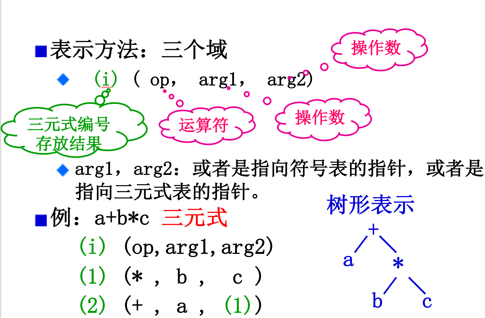

## 3.3 四元式

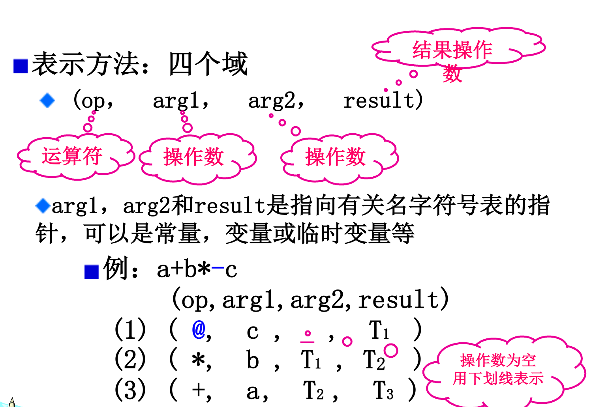

# 四、**简单赋值语句的翻译**

## 4.1 **语义过程及属性设置**

语法：id:=E

语义：计算表达式E的值之后把值赋给变量id

文法G\[S\]：

```
 S→id:=E  E→E1+E2  E→E1*E2  E→-E1  E→(E1)  E→id
```

**语义过程：**

- `lookup(id.name)` 检查在符号表中是否存在id.name的表项。


- `emit(x ':=' y '+' z)`将生成的三地址代码x:=y+z发送到输出文件。
- `newtemp` 每调用一次，生成一个临时变量。

**属性设置：**

存储位置 `place`。例如`E.place`，`T.place`等。

## 4.2 翻译模式


## 4.3 自下而上语法制导翻译过程举例


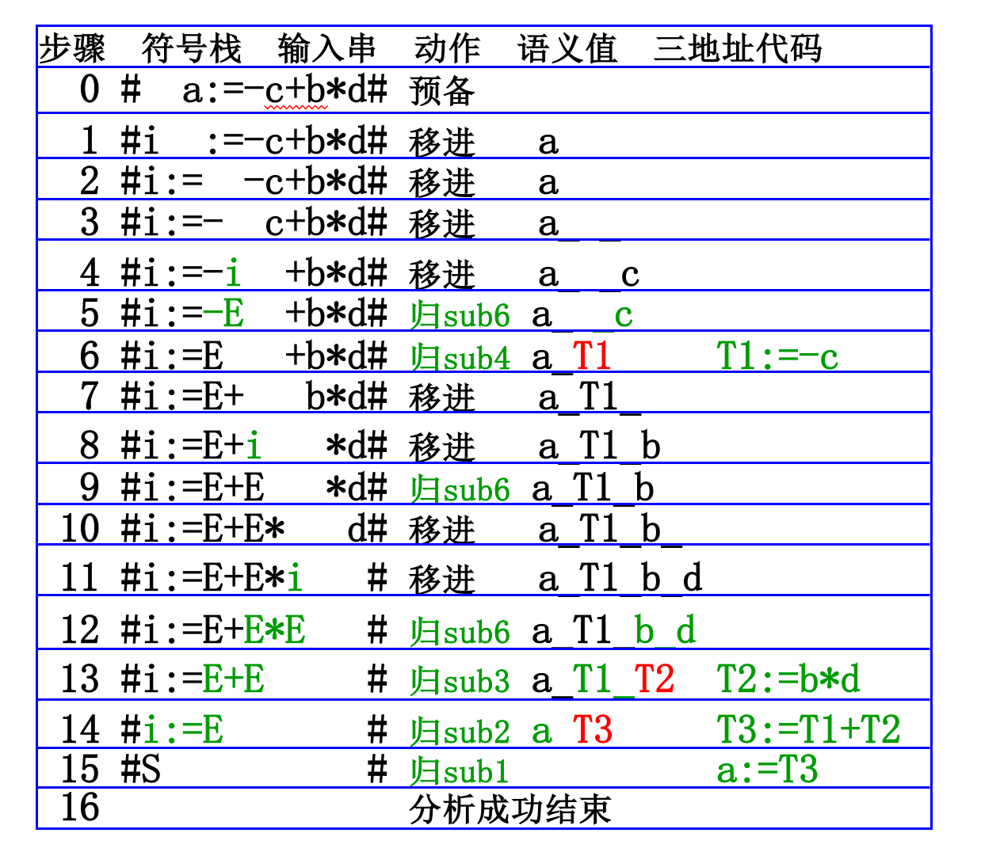

# 五、布尔表达式的翻译

## 5.1 布尔表达式的作用

- 计算逻辑值
- 控制流语句如if-then，if-then-else和while-do等之中的条件表达式

**举例：**

```
1 or ( not 0 and 0 ) or 0a<b or c<d and e<fif a<b or c<d and e<f then x:=1 else x:=-1while a<b do a:=a-b
```

## 5.2 布尔表达式的文法

布尔表达式——用布尔运算符号(and,or,not) 作用到布尔变量或关系表达式上而组成。

考虑如下生成布尔表达式的文法：

E→E  or  E|E  and  E|not  E|(E)|id  relop  id|id

其中 relop 表示六个关系运算符之一，如 ： `<` `>` 等。

## 5.3数值表示法

### 5.3.1 翻译方式

若用1表示真，0表示假，则布尔表达式可以象算术表达式一样来计算。

例如 关系表达式 a<b 可等价地写成:

`if a<b then 1 else 0`翻译成三地址代码：

```
100 if a<b goto 103101 T1:=0102 goto 104 103 T1:=1104 后续代码
```

\### 5.3.2 有关属性和函数

**属性：**

`E.place` 综合属性，表示存放布尔表达式值的名字

`relop.op` 综合属性，表示六个关系运算符之一

**三地址代码的编号：**

`nextstat` 给出输出三地址代码序列中下一条代码的编号(地址索引)

**函数：**

`emit` 将产生的三地址代码送到输出文件中,每产生一条三地址代码后，`emit`便把`nextstat+1`

### 5.3.3 翻译模式


### 5.3.4 举例

把 `a<b or c<d and e<f`翻译成三地址代码：

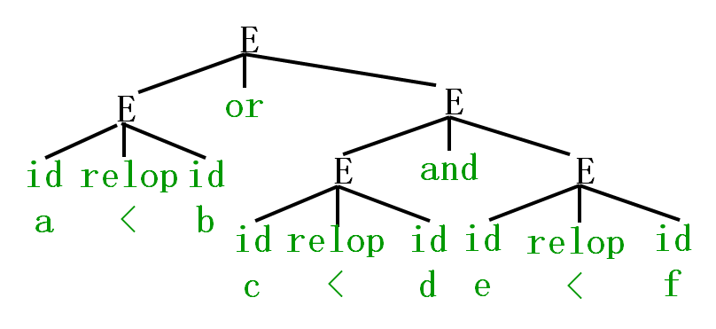

按照自下而上归约的顺序进行翻译：

（1）sub5 T1

```
100 if a<b goto 103101 T1:=0102 goto 104103 T1:=1
```

（2） sub5 T2

```
104 if c<d goto 107105 T2:=0106 goto 108107 T2:=1
```

（3）sub5 T3

```
108 if e<f goto 111109 T3:=0110 goto 112111 T3:=1
```

（4）sub2

```
112 T4:=T2 and T3
```

（5）sub1

```
113 T5:=T1 or T4
```

## 5.4 作为条件控制的布尔式的翻译

**语法：** S→if E then S1 else S2

**语义：** 如果 E 的值为true，那么执行S1；否则,执行S2。

**if-then-else的代码结构：**


### 5.4.1 选择语句中布尔式的翻译思想

设 E 形如a<b,则：

**属性：**

`E.code`为生成的三地址代码：

```
if a<b goto E.truegoto E.false
```

`E.true` 为 E 为“真”时控制流转向的标号

`E.false`为 E 为“假”时控制流转向标号

函数 `newlabel`：每次调用返回一个新的符号标号，该符号标号用来标识一条三地址代码。

### 5.4.2 使用拉链-回填技术实现布尔式翻译

采用四元式实现三地址代码，约定转移四元式的形式为：

`(jnz,a,_,p)`表示`if a goto p`

`(jrop,x,y,p)`表示`if x rop y goto p`

`(j,_,_,p)` 表示 `goto p`

面临主要问题是通过一遍扫描来产生代码时，当生成某些转移语句时我们可能还不知道该语句要转移到的标号究竟是什么，于是引入**拉链-回填技术**：

- **拉链：**在生成暂时不知道转移目标的转移四元式时，先建立链表，把转移目标相同的转移四元式链接在一起：
    - `E.truelist` 真链，回填E的真出口 `E.true`
      
    - `E.falselist`假链，回填E的假出口 `E.false`
    
- **回填：**一旦某条链的转移目标确定之后，再把转移目标填入到有关的四元式中。
  

**布尔表达式文法：**

```
（1）E→E1 or M E2 （2） |E1 and M E2 （3） |not E1 （4） |(E1) （5） |id1 relop id2 （6） |id  (与教材不同)（7）M→ε
```

插入非终结符号 M 是为了引入一个语义动作，以便在适当的时候获得即将产生的下一个四元式的编号，或说四元式的索引（E2.codebegin）。

**举例：**

```
if a＜b or c＜d and e＜f       then x:=y+z     else x:=y-z   
```

翻译过程：

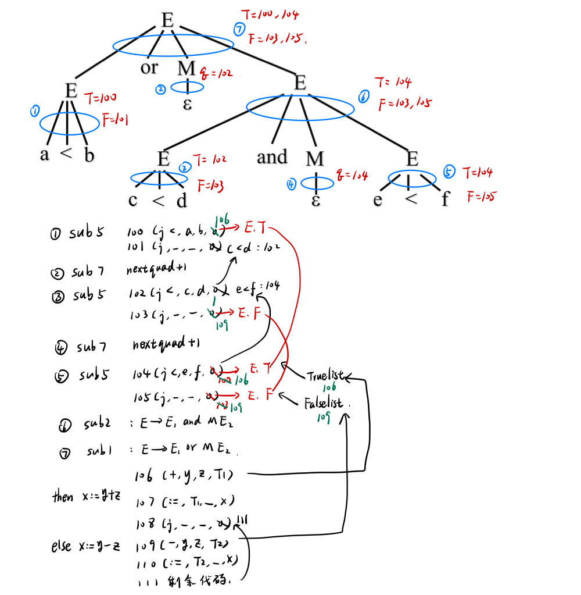

- 首先按照自下而上的方式归约，每次归约句柄得到1-7步的中间代码（四元式），其中 M 用于产生下一个代码地址，没有实际的意义。其中 `sub` 表示某种翻译模式，下面会进行说明。
- 在产生中间代码的过程中，每个四元式的转移目标可能未知，将其链接起来。链接有两种类型，
    - 一种是内部链接，如101的转移目标为 `c<d` 的开始地址（由or的定义得知），102的转移目标为 `e<f` 的开始地址。
    - 还有一种是真链和假链的链接，比如100转移地址为 `E.true` ，即最终整个布尔表达式的真地址，同时 104 转移地址也为 `E.true` ，于是将104的转移地址改为100，真链的链头指向104，即`E.truelist = 104` 。当找到 `E.true` 的地址 106后，从 `E.truelist = 104` 开始回溯填充所有链上的转移地址，即`104` 和 `100` 的转移地址都改为 106。 falselist 同理，不在描述。

当然，上述的过程都是人脑手动模拟的过程，站在上帝视角上可以轻松模拟，但是计算机没有那么智能，所以需要规定出翻译模式，按照翻译模式机械翻译。

### 3.4.3 有关属性和函数

- 变量 `nextquad` 或 `nextstat`：指向下一条要产生四元式的编号，每执行一次 `emit`，`nextquad` 增1。
  
- 函数`makelist(i)`：创建一个仅包含编号为i的四元式的新链表，函数返回指向这个链的指针。
  
- 函数`merge(p1，p2)`：把以 p1 和 p2 为链首的两个链合并为一，合并后的链首 p2 作为函数值回送。
  
- 过程`backpatch(p，i)`：完成“回填”，把p所指向链的每个四元式第四个域都填为i。
  

### 3.4.3 翻译模式

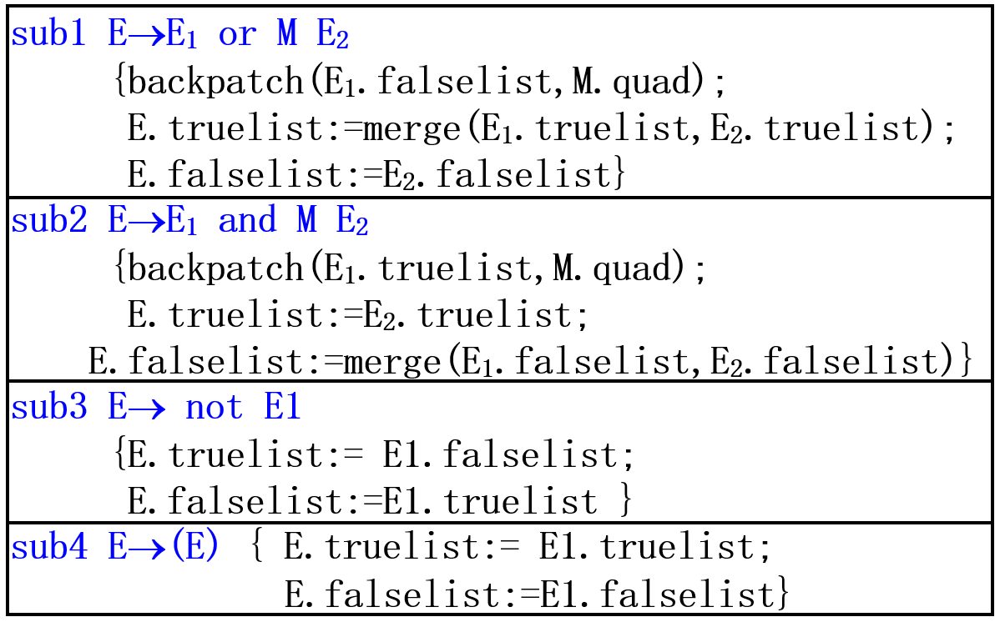

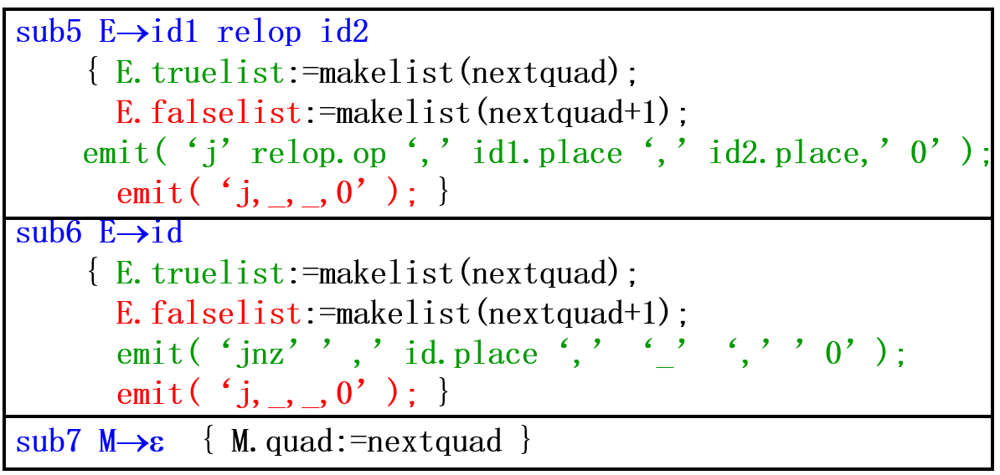

使用上面这些翻译模式就可以让计算机自动进行中间代码（四元式）的生成，并且使用了拉链回填技术。注意，中间代码的生成是在语法分析时进行的，所以所有翻译模式都是在归约时进行。

# 六、控制结构的翻译

## 6.1 if then 语句

**语法：** S→if E then S1

**语义：** 如果E的值为true，那么执行S1

**举例：**

`if c<d then a:=b+2`翻译成四元式序列为：

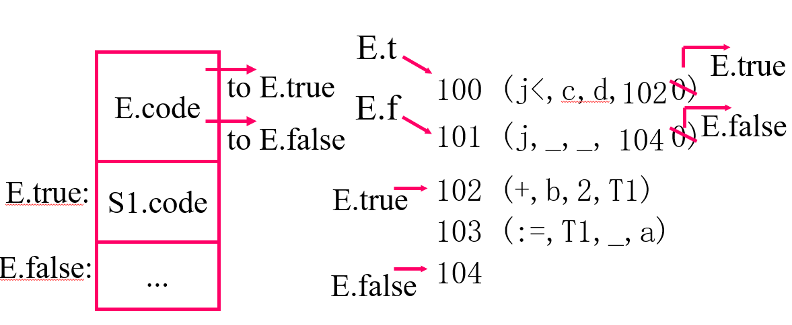

## 6.2 if then else 语句

**语法：** S→if E then S1 else S2

**语义：** 如果E的值为true，那么执行S1；否则执行S2

**举例：**

```
if c<d then x:=y+z       else x:=y-z
```

翻译成四元式序列为：

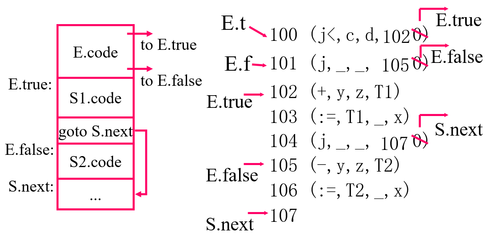

## 6.3 while\_do的代码结构

**语法：** S→while E do S1

**语义：** 如果E的值为true，那么执行S1；否则退出循环

**举例：**`while a<b do x:=y+z`翻译成四元式序列为：

![image-20211105092423531](