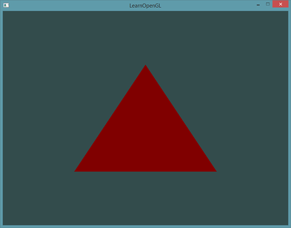
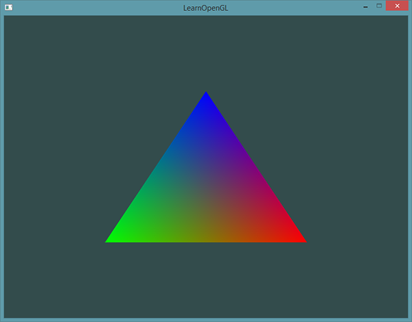

# 着色器

原文     | [Shaders](http://learnopengl.com/#!Getting-started/Shaders)
      ---|---
作者     | JoeyDeVries
翻译     | [Django](http://bullteacher.com/), Krasjet, Geequlim
校对     | 暂未校对

在[Hello Triangle](04 Hello Triangle.md)教程中提到，着色器(Shader)是运行在GPU上的小程序。这些小程序为图形渲染管线的某个特定部分而运行。从基本意义上来说，着色器只是一种把输入转化为输出的程序。着色器也是一种非常独立的程序，因为它们之间不能相互通信；它们之间唯一的沟通只有通过输入和输出。

前面的教程里我们简要地触及了一点着色器的皮毛，并了解了如何恰当地使用它们。现在我们会用一种更加广泛的形式详细解释着色器，特别是OpenGL着色器语言(GLSL)。

# GLSL

着色器是使用一种叫GLSL的类C语言写成的。GLSL是为图形计算量身定制的，它包含一些针对向量和矩阵操作的有用特性。

着色器的开头总是要声明版本，接着是输入和输出变量、uniform和<fun>main</fun>函数。每个着色器的入口点都是<fun>main</fun>函数，在这个函数中我们处理所有的输入变量，并将结果输出到输出变量中。如果你不知道什么是uniform也不用担心，我们后面会进行讲解。

一个典型的着色器有下面的结构：

```c++
#version version_number
in type in_variable_name;
in type in_variable_name;

out type out_variable_name;

uniform type uniform_name;

int main()
{
  // 处理输入并进行一些图形操作
  ...
  // 输出处理过的结果到输出变量
  out_variable_name = weird_stuff_we_processed;
}
```

当我们特别谈论到顶点着色器的时候，每个输入变量也叫<def>顶点属性</def>(Vertex Attribute)。我们能声明的顶点属性是有上限的，它一般由硬件来决定。OpenGL确保至少有16个包含4分量的顶点属性可用，但是有些硬件或许允许更多的顶点属性，你可以查询<var>GL_MAX_VERTEX_ATTRIBS</var>来获取具体的上限：

```c++
int nrAttributes;
glGetIntegerv(GL_MAX_VERTEX_ATTRIBS, &nrAttributes);
std::cout << "Maximum nr of vertex attributes supported: " << nrAttributes << std::endl;
```

通常情况下它至少会返回16个，大部分情况下是够用了。

## 数据类型

和其他编程语言一样，GLSL有数据类型可以来指定变量的种类。GLSL中包含C等其它语言大部分的默认基础数据类型：`int`、`float`、`double`、`uint`和`bool`。GLSL也有两种容器类型，它们会在这个教程中使用很多，分别是向量(Vector)和矩阵(Matrix)，其中矩阵我们会在之后的教程里再讨论。

### 向量

GLSL中的向量是一个可以包含有2、3或者4个分量的容器，分量的类型可以是前面默认基础类型的任意一个。它们可以是下面的形式（`n`代表分量的数量）：

  类型|含义
   ---|---
 `vecn` | 包含`n`个float分量的默认向量
 `bvecn`| 包含`n`个bool分量的向量
 `ivecn`| 包含`n`个int分量的向量
 `uvecn`| 包含`n`个unsigned int分量的向量
 `dvecn`| 包含`n`个double分量的向量

大多数时候我们使用`vecn`，因为float足够满足大多数要求了。

一个向量的分量可以通过`vec.x`这种方式获取，这里`x`是指这个向量的第一个分量。你可以分别使用`.x`、`.y`、`.z`和`.w`来获取它们的第1、2、3、4个分量。GLSL也允许你对颜色使用`rgba`，或是对纹理坐标使用`stpq`访问相同的分量。

向量这一数据类型也允许一些有趣而灵活的分量选择方式，叫做<def>重组</def>(Swizzling)。重组允许这样的语法：

```c++
vec2 someVec;
vec4 differentVec = someVec.xyxx;
vec3 anotherVec = differentVec.zyw;
vec4 otherVec = someVec.xxxx + anotherVec.yxzy;
```

你可以使用上面4个字母任意组合来创建一个和原来向量一样长的（同类型）新向量，只要原来向量有那些分量即可；然而，你不允许在一个`vec2`向量中去获取`.z`元素。我们也可以把一个向量作为一个参数传给不同的向量构造函数，以减少需求参数的数量：

```c++
vec2 vect = vec2(0.5, 0.7);
vec4 result = vec4(vect, 0.0, 0.0);
vec4 otherResult = vec4(result.xyz, 1.0);
```

向量是一种灵活的数据类型，我们可以把它用在各种输入和输出上。学完教程你会看到很多新颖的管理向量的例子。

## 输入与输出

虽然着色器是各自独立的小程序，但是它们都是一个整体的一部分，出于这样的原因，我们希望每个着色器都有输入和输出，这样才能进行数据交流和传递。GLSL定义了`in`和`out`关键字专门来实现这个目的。每个着色器使用这两个关键字设定输入和输出，只要一个输出变量与下一个着色器阶段的输入匹配，它就会传递下去。但在顶点和片段着色器中会有点不同。

顶点着色器应该接收的是一种特殊形式的输入，否则就会效率低下。顶点着色器的输入特殊在，它从顶点数据中直接接收输入。为了定义顶点数据该如何管理，我们使用`location`这一元数据指定输入变量，这样我们才可以在CPU上配置顶点属性。我们已经在前面的教程看过这个了，`layout (location = 0)`。顶点着色器需要为它的输入提供一个额外的`layout`标识，这样我们才能把它链接到顶点数据。

!!! Important

	你也可以忽略`layout (location = 0)`标识符，通过在OpenGL代码中使用<fun>glGetAttribLocation</fun>查询属性位置值(Location)，但是我更喜欢在着色器中设置它们，这样会更容易理解而且节省你（和OpenGL）的工作量。

另一个例外是片段着色器，它需要一个`vec4`颜色输出变量，因为片段着色器需要生成一个最终输出的颜色。如果你在片段着色器没有定义输出颜色，OpenGL会把你的物体渲染为黑色（或白色）。

所以，如果我们打算从一个着色器向另一个着色器发送数据，我们必须在发送方着色器中声明一个输出，在接收方着色器中声明一个类似的输入。当类型和名字都一样的时候，OpenGL就会把两个变量链接到一起，它们之间就能发送数据了（这是在链接程序对象时完成的）。为了展示这是如何工作的，我们会稍微改动一下之前教程里的那个着色器，让顶点着色器为片段着色器决定颜色。

**顶点着色器**

```c++
#version 330 core
layout (location = 0) in vec3 aPos; // 位置变量的属性位置值为0

out vec4 vertexColor; // 为片段着色器指定一个颜色输出

void main()
{
    gl_Position = vec4(aPos, 1.0); // 注意我们如何把一个vec3作为vec4的构造器的参数
    vertexColor = vec4(0.5, 0.0, 0.0, 1.0); // 把输出变量设置为暗红色
}
```
**片段着色器**

```c++
#version 330 core
out vec4 FragColor;
  
in vec4 vertexColor; // 从顶点着色器传来的输入变量（名称相同、类型相同）

void main()
{
    FragColor = vertexColor;
}
```

你可以看到我们在顶点着色器中声明了一个<var>vertexColor</var>变量作为`vec4`输出，并在片段着色器中声明了一个类似的<var>vertexColor</var>。由于它们名字相同且类型相同，片段着色器中的<var>vertexColor</var>就和顶点着色器中的<var>vertexColor</var>链接了。由于我们在顶点着色器中将颜色设置为深红色，最终的片段也是深红色的。下面的图片展示了输出结果：



完成了！我们成功地从顶点着色器向片段着色器发送数据。让我们更上一层楼，看看能否从应用程序中直接给片段着色器发送一个颜色！

## Uniform

<def>Uniform</def>是一种从CPU中的应用向GPU中的着色器发送数据的方式，但uniform和顶点属性有些不同。首先，uniform是<def>全局的</def>(Global)。全局意味着uniform变量必须在每个着色器程序对象中都是独一无二的，而且它可以被着色器程序的任意着色器在任意阶段访问。第二，无论你把uniform值设置成什么，uniform会一直保存它们的数据，直到它们被重置或更新。

我们可以在一个着色器中添加`uniform`关键字至类型和变量名前来声明一个GLSL的uniform。从此处开始我们就可以在着色器中使用新声明的uniform了。我们来看看这次是否能通过uniform设置三角形的颜色：

```c++
#version 330 core
out vec4 FragColor;
  
uniform vec4 ourColor; // 在OpenGL程序代码中设定这个变量

void main()
{
    FragColor = ourColor;
}
```

我们在片段着色器中声明了一个uniform `vec4`的<var>ourColor</var>，并把片段着色器的输出颜色设置为uniform值的内容。因为uniform是全局变量，我们可以在任何着色器中定义它们，而无需通过顶点着色器作为中介。顶点着色器中不需要这个uniform，所以我们不用在那里定义它。

!!! Attention

	如果你声明了一个uniform却在GLSL代码中没用过，编译器会静默移除这个变量，导致最后编译出的版本中并不会包含它，这可能导致几个非常麻烦的错误，记住这点！

这个uniform现在还是空的；我们还没有给它添加任何数据，所以下面我们就做这件事。我们首先需要找到着色器中uniform属性的索引/位置值。当我们得到uniform的索引/位置值后，我们就可以更新它的值了。这次我们不去给像素传递单独一个颜色，而是让它随着时间改变颜色：

```c++
float timeValue = glfwGetTime();
float greenValue = (sin(timeValue) / 2.0f) + 0.5f;
int vertexColorLocation = glGetUniformLocation(shaderProgram, "ourColor");
glUseProgram(shaderProgram);
glUniform4f(vertexColorLocation, 0.0f, greenValue, 0.0f, 1.0f);
```

首先我们通过<fun>glfwGetTime()</fun>获取运行的秒数。然后我们使用<fun>sin</fun>函数让颜色在0.0到1.0之间改变，最后将结果储存到<var>greenValue</var>里。

接着，我们用<fun>glGetUniformLocation</fun>查询uniform <var>ourColor</var>的位置值。我们为查询函数提供着色器程序和uniform的名字（这是我们希望获得的位置值的来源）。如果<fun>glGetUniformLocation</fun>返回`-1`就代表没有找到这个位置值。最后，我们可以通过<fun>glUniform4f</fun>函数设置uniform值。注意，查询uniform地址不要求你之前使用过着色器程序，但是更新一个uniform之前你**必须**先使用程序（调用<fun>glUseProgram</fun>)，因为它是在当前激活的着色器程序中设置uniform的。

!!! Important

	因为OpenGL在其核心是一个C库，所以它不支持类型重载，在函数参数不同的时候就要为其定义新的函数；<fun>glUniform</fun>是一个典型例子。这个函数有一个特定的后缀，标识设定的uniform的类型。可能的后缀有：

    后缀|含义
     ---|--
	  `f` | 函数需要一个float作为它的值
	  `i` | 函数需要一个int作为它的值
	  `ui`| 函数需要一个unsigned int作为它的值
	  `3f`| 函数需要3个float作为它的值
	  `fv`| 函数需要一个float向量/数组作为它的值

    每当你打算配置一个OpenGL的选项时就可以简单地根据这些规则选择适合你的数据类型的重载函数。在我们的例子里，我们希望分别设定uniform的4个float值，所以我们通过<fun>glUniform4f</fun>传递我们的数据(注意，我们也可以使用`fv`版本)。

现在你知道如何设置uniform变量的值了，我们可以使用它们来渲染了。如果我们打算让颜色慢慢变化，我们就要在游戏循环的每一次迭代中（所以他会逐帧改变）更新这个uniform，否则三角形就不会改变颜色。下面我们就计算<var>greenValue</var>然后每个渲染迭代都更新这个uniform：

```c++
while(!glfwWindowShouldClose(window))
{
    // 输入
    processInput(window);

    // 渲染
    // 清除颜色缓冲
    glClearColor(0.2f, 0.3f, 0.3f, 1.0f);
    glClear(GL_COLOR_BUFFER_BIT);

    // 记得激活着色器
    glUseProgram(shaderProgram);
  
    // 更新uniform颜色
    float timeValue = glfwGetTime();
    float greenValue = sin(timeValue) / 2.0f + 0.5f;
    int vertexColorLocation = glGetUniformLocation(shaderProgram, "ourColor");
    glUniform4f(vertexColorLocation, 0.0f, greenValue, 0.0f, 1.0f);

    // 绘制三角形
    glBindVertexArray(VAO);
    glDrawArrays(GL_TRIANGLES, 0, 3);
  
    // 交换缓冲并查询IO事件
    glfwSwapBuffers(window);
    glfwPollEvents();
}
```

这里的代码对之前代码是一次非常直接的修改。这次，我们在每次迭代绘制三角形前先更新uniform值。如果你正确更新了uniform，你会看到你的三角形逐渐由绿变黑再变回绿色。

<video src="../../img/01/05/shaders.mp4" controls="controls"/></video>

如果你在哪儿卡住了，可以到[这里](https://learnopengl.com/code_viewer_gh.php?code=src/1.getting_started/3.1.shaders_uniform/shaders_uniform.cpp)查看源码。

可以看到，uniform对于设置一个在渲染迭代中会改变的属性是一个非常有用的工具，它也是一个在程序和着色器间数据交互的很好工具，但假如我们打算为每个顶点设置一个颜色的时候该怎么办？这种情况下，我们就不得不声明和顶点数目一样多的uniform了。在这一问题上更好的解决方案是在顶点属性中包含更多的数据，这是我们接下来要做的事情。

## 更多属性！

在前面的教程中，我们了解了如何填充VBO、配置顶点属性指针以及如何把它们都储存到一个VAO里。这次，我们同样打算把颜色数据加进顶点数据中。我们将把颜色数据添加为3个float值至<var>vertices</var>数组。我们将把三角形的三个角分别指定为红色、绿色和蓝色：

```c++
float vertices[] = {
    // 位置              // 颜色
     0.5f, -0.5f, 0.0f,  1.0f, 0.0f, 0.0f,   // 右下
    -0.5f, -0.5f, 0.0f,  0.0f, 1.0f, 0.0f,   // 左下
     0.0f,  0.5f, 0.0f,  0.0f, 0.0f, 1.0f    // 顶部
};
```

由于现在有更多的数据要发送到顶点着色器，我们有必要去调整一下顶点着色器，使它能够接收颜色值作为一个顶点属性输入。需要注意的是我们用`layout`标识符来把<var>aColor</var>属性的位置值设置为1：

```c++
#version 330 core
layout (location = 0) in vec3 aPos;   // 位置变量的属性位置值为 0 
layout (location = 1) in vec3 aColor; // 颜色变量的属性位置值为 1
  
out vec3 ourColor; // 向片段着色器输出一个颜色

void main()
{
    gl_Position = vec4(aPos, 1.0);
    ourColor = aColor; // 将ourColor设置为我们从顶点数据那里得到的输入颜色
}
```

由于我们不再使用uniform来传递片段的颜色了，现在使用`ourColor`输出变量，我们必须再修改一下片段着色器：

```c++
#version 330 core
out vec4 FragColor;  
in vec3 ourColor;
  
void main()
{
    FragColor = vec4(ourColor, 1.0);
}
```

因为我们添加了另一个顶点属性，并且更新了VBO的内存，我们就必须重新配置顶点属性指针。更新后的VBO内存中的数据现在看起来像这样：


知道了现在使用的布局，我们就可以使用<fun>glVertexAttribPointer</fun>函数更新顶点格式，

```c++
// 位置属性
glVertexAttribPointer(0, 3, GL_FLOAT, GL_FALSE, 6 * sizeof(float), (void*)0);
glEnableVertexAttribArray(0);
// 颜色属性
glVertexAttribPointer(1, 3, GL_FLOAT, GL_FALSE, 6 * sizeof(float), (void*)(3* sizeof(float)));
glEnableVertexAttribArray(1);
```

<fun>glVertexAttribPointer</fun>函数的前几个参数比较明了。这次我们配置属性位置值为1的顶点属性。颜色值有3个float那么大，我们不去标准化这些值。

由于我们现在有了两个顶点属性，我们不得不重新计算**步长**值。为获得数据队列中下一个属性值（比如位置向量的下个`x`分量）我们必须向右移动6个float，其中3个是位置值，另外3个是颜色值。这使我们的步长值为6乘以float的字节数（=24字节）。  
同样，这次我们必须指定一个偏移量。对于每个顶点来说，位置顶点属性在前，所以它的偏移量是0。颜色属性紧随位置数据之后，所以偏移量就是`3 * sizeof(float)`，用字节来计算就是12字节。

运行程序你应该会看到如下结果：



如果你在哪卡住了，可以在[这里](https://learnopengl.com/code_viewer_gh.php?code=src/1.getting_started/3.2.shaders_interpolation/shaders_interpolation.cpp)查看源码。

这个图片可能不是你所期望的那种，因为我们只提供了3个颜色，而不是我们现在看到的大调色板。这是在片段着色器中进行的所谓<def>片段插值</def>(Fragment Interpolation)的结果。当渲染一个三角形时，光栅化(Rasterization)阶段通常会造成比原指定顶点更多的片段。光栅会根据每个片段在三角形形状上所处相对位置决定这些片段的位置。  
基于这些位置，它会<def>插值</def>(Interpolate)所有片段着色器的输入变量。比如说，我们有一个线段，上面的端点是绿色的，下面的端点是蓝色的。如果一个片段着色器在线段的70%的位置运行，它的颜色输入属性就会是一个绿色和蓝色的线性结合；更精确地说就是30%蓝 + 70%绿。

这正是在这个三角形中发生了什么。我们有3个顶点，和相应的3个颜色，从这个三角形的像素来看它可能包含50000左右的片段，片段着色器为这些像素进行插值颜色。如果你仔细看这些颜色就应该能明白了：红首先变成到紫再变为蓝色。片段插值会被应用到片段着色器的所有输入属性上。

# 我们自己的着色器类

编写、编译、管理着色器是件麻烦事。在着色器主题的最后，我们会写一个类来让我们的生活轻松一点，它可以从硬盘读取着色器，然后编译并链接它们，并对它们进行错误检测，这就变得很好用了。这也会让你了解该如何封装目前所学的知识到一个抽象对象中。

我们会把着色器类全部放在在头文件里，主要是为了学习用途，当然也方便移植。我们先来添加必要的include，并定义类结构：

```c++
#ifndef SHADER_H
#define SHADER_H

#include <glad/glad.h>; // 包含glad来获取所有的必须OpenGL头文件
  
#include <string>
#include <fstream>
#include <sstream>
#include <iostream>
  

class Shader
{
public:
    // 程序ID
    unsigned int ID;
  
    // 构造器读取并构建着色器
    Shader(const char* vertexPath, const char* fragmentPath);
    // 使用/激活程序
    void use();
    // uniform工具函数
    void setBool(const std::string &name, bool value) const;  
    void setInt(const std::string &name, int value) const;   
    void setFloat(const std::string &name, float value) const;
};
  
#endif
```

!!! Important

	在上面，我们在头文件顶部使用了几个<def>预处理指令</def>(Preprocessor Directives)。这些预处理指令会告知你的编译器只在它没被包含过的情况下才包含和编译这个头文件，即使多个文件都包含了这个着色器头文件。它是用来防止链接冲突的。

着色器类储存了着色器程序的ID。它的构造器需要顶点和片段着色器源代码的文件路径，这样我们就可以把源码的文本文件储存在硬盘上了。除此之外，为了让我们的生活更轻松一点，还加入了一些工具函数：<fun>use</fun>用来激活着色器程序，所有的<fun>set...</fun>函数能够查询一个unform的位置值并设置它的值。

## 从文件读取

我们使用C++文件流读取着色器内容，储存到几个`string`对象里：

```c++
Shader(const char* vertexPath, const char* fragmentPath)
{
    // 1. 从文件路径中获取顶点/片段着色器
    std::string vertexCode;
    std::string fragmentCode;
    std::ifstream vShaderFile;
    std::ifstream fShaderFile;
    // 保证ifstream对象可以抛出异常：
    vShaderFile.exceptions (std::ifstream::failbit | std::ifstream::badbit);
    fShaderFile.exceptions (std::ifstream::failbit | std::ifstream::badbit);
    try 
    {
        // 打开文件
        vShaderFile.open(vertexPath);
        fShaderFile.open(fragmentPath);
        std::stringstream vShaderStream, fShaderStream;
        // 读取文件的缓冲内容到数据流中
        vShaderStream << vShaderFile.rdbuf();
        fShaderStream << fShaderFile.rdbuf();		
        // 关闭文件处理器
        vShaderFile.close();
        fShaderFile.close();
        // 转换数据流到string
        vertexCode   = vShaderStream.str();
        fragmentCode = fShaderStream.str();		
    }
    catch(std::ifstream::failure e)
    {
        std::cout << "ERROR::SHADER::FILE_NOT_SUCCESFULLY_READ" << std::endl;
    }
    const char* vShaderCode = vertexCode.c_str();
    const char* fShaderCode = fragmentCode.c_str();
    [...]
```

下一步，我们需要编译和链接着色器。注意，我们也将检查编译/链接是否失败，如果失败则打印编译时错误，调试的时候这些错误输出会及其重要（你总会需要这些错误日志的）：

```c++
// 2. 编译着色器
unsigned int vertex, fragment;
int success;
char infoLog[512];
   
// 顶点着色器
vertex = glCreateShader(GL_VERTEX_SHADER);
glShaderSource(vertex, 1, &vShaderCode, NULL);
glCompileShader(vertex);
// 打印编译错误（如果有的话）
glGetShaderiv(vertex, GL_COMPILE_STATUS, &success);
if(!success)
{
    glGetShaderInfoLog(vertex, 512, NULL, infoLog);
    std::cout << "ERROR::SHADER::VERTEX::COMPILATION_FAILED\n" << infoLog << std::endl;
};
  
// 片段着色器也类似
[...]
  
// 着色器程序
ID = glCreateProgram();
glAttachShader(ID, vertex);
glAttachShader(ID, fragment);
glLinkProgram(ID);
// 打印连接错误（如果有的话）
glGetProgramiv(ID, GL_LINK_STATUS, &success);
if(!success)
{
    glGetProgramInfoLog(ID, 512, NULL, infoLog);
    std::cout << "ERROR::SHADER::PROGRAM::LINKING_FAILED\n" << infoLog << std::endl;
}
  
// 删除着色器，它们已经链接到我们的程序中了，已经不再需要了
glDeleteShader(vertex);
glDeleteShader(fragment);
```

<fun>use</fun>函数非常简单：

```c++
void use() 
{ 
    glUseProgram(ID);
}
```

uniform的setter函数也很类似：

```c++
void setBool(const std::string &name, bool value) const
{
    glUniform1i(glGetUniformLocation(ID, name.c_str()), (int)value); 
}
void setInt(const std::string &name, int value) const
{ 
    glUniform1i(glGetUniformLocation(ID, name.c_str()), value); 
}
void setFloat(const std::string &name, float value) const
{ 
    glUniform1f(glGetUniformLocation(ID, name.c_str()), value); 
} 
```

现在我们就写完了一个完整的[着色器类](https://learnopengl.com/code_viewer_gh.php?code=includes/learnopengl/shader_s.h)。使用这个着色器类很简单；只要创建一个着色器对象，从那一点开始我们就可以开始使用了：

```c++
Shader ourShader("path/to/shaders/shader.vs", "path/to/shaders/shader.fs");
...
while(...)
{
    ourShader.use();
    ourShader.setFloat("someUniform", 1.0f);
    DrawStuff();
}
```

我们把顶点和片段着色器储存为两个叫做`shader.vs`和`shader.fs`的文件。你可以使用自己喜欢的名字命名着色器文件；我自己觉得用`.vs`和`.fs`作为扩展名很直观。

你可以在[这里](https://learnopengl.com/code_viewer_gh.php?code=src/1.getting_started/3.3.shaders_class/shaders_class.cpp)找到使用[新着色器类](https://learnopengl.com/code_viewer_gh.php?code=includes/learnopengl/shader_s.h)的源代码。注意你可以点击源码中的着色器文件路径来查看每一个着色器的源代码。

# 练习

1. 修改顶点着色器让三角形上下颠倒：[参考解答](https://learnopengl.com/code_viewer.php?code=getting-started/shaders-exercise1)
2. 使用uniform定义一个水平偏移量，在顶点着色器中使用这个偏移量把三角形移动到屏幕右侧：[参考解答](https://learnopengl.com/code_viewer.php?code=getting-started/shaders-exercise2)
3. 使用`out`关键字把顶点位置输出到片段着色器，并将片段的颜色设置为与顶点位置相等（来看看连顶点位置值都在三角形中被插值的结果）。做完这些后，尝试回答下面的问题：为什么在三角形的左下角是黑的?：[参考解答](https://learnopengl.com/code_viewer.php?code=getting-started/shaders-exercise3)
