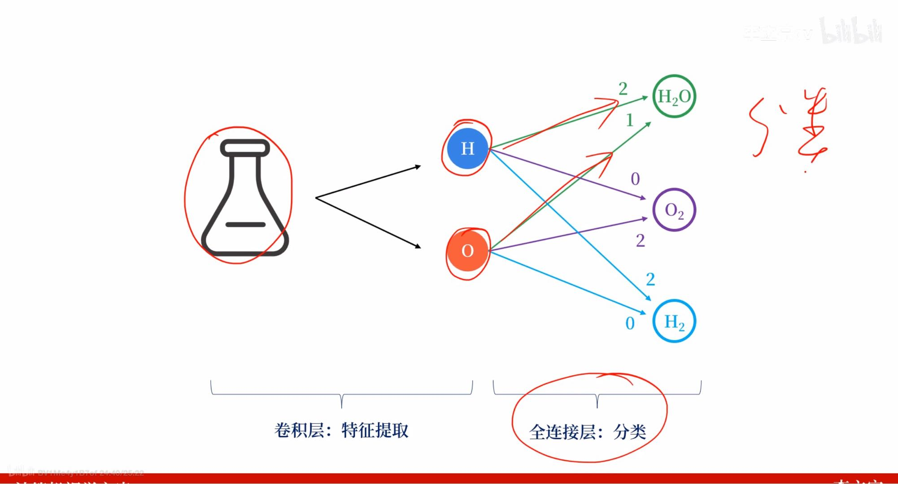
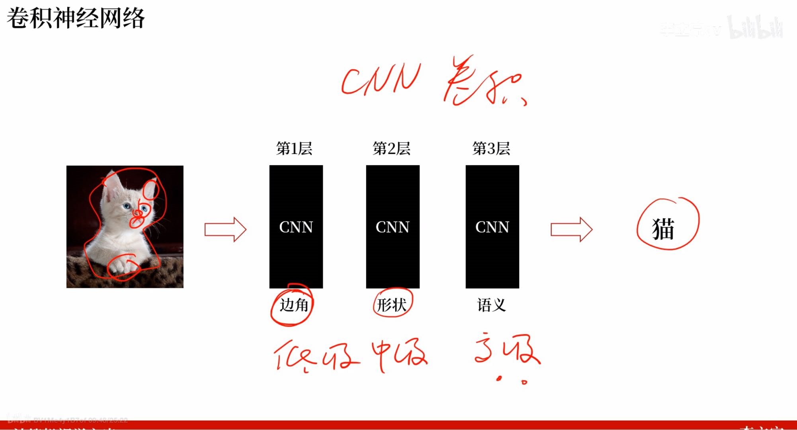

1. 基本流程：信息输入——>特征提取——>特征分类——>特征合并——>输出
   1. 特征提取，一般通过特殊的滤波器对其进行操作，然后将其边角特征值提取，这一层输出的为边角信息（==边角==）
   2. 特征分类，通过将局部的边角信息进行合并并进行提取，将其整理分类，形成局部的部件特征，比如眼睛（==形状==）
   3. 特征合并，将整理分类好的特征信息进行综合，来进行整体输出（==语义==）
2. 举例：
   1. 
   2. 