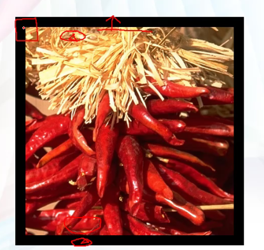
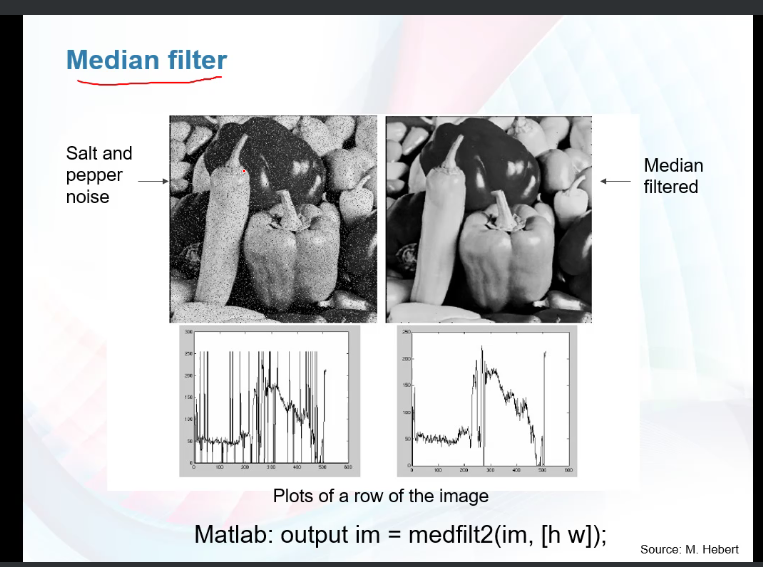
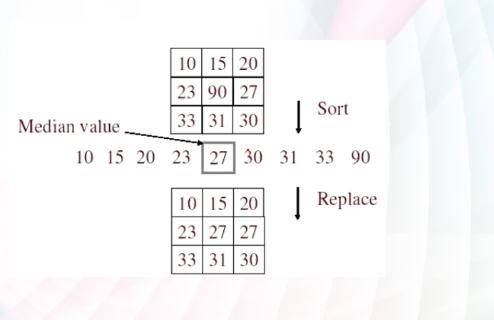
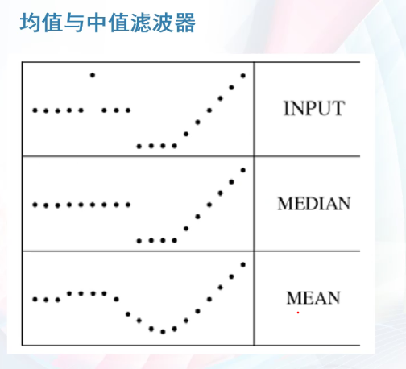
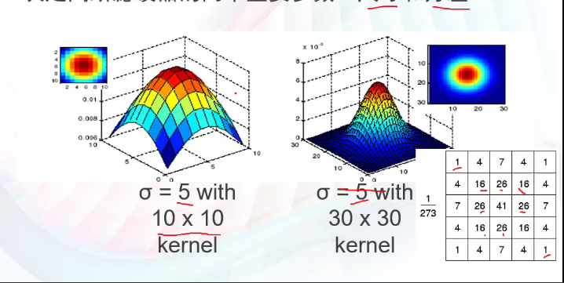

1. 滤波器

   1. 将图像进行矩阵处理，使用一个矩阵与其相乘可以得到在原图像变化的图像

   2. 两种策略
      1. 有结果图像（通过自行在原图像上修改）即知道自己想要的变化，可以通过结果矩阵对目标矩阵进行相除，得到滤波矩阵，从而得到一个适用于全部图像该变化的矩阵

      2. 有明确的滤波矩阵，知道其效果，直接与目标矩阵进行运算，得到结果矩阵

2. 滤波范围：

   1. 使用滤波矩阵对图象进行的起始位置和终止位置的结果不一样
   2. 位置与大小的关系：目标图像size=滤波器位移距离
      1. 滤波器右下角开始与目标图像左上角进行处处理 ，直到滤波器左下角与目标图像右上角 ：其结果图像比原图像多个滤波器尺寸大小
      1. 滤波器中间元素与目标图像左上角进行处理，知道滤波器中间元素与目标图像右上角：其结果图像与原图像大小相同
      1. 滤波器左下角元素与目标图像左上角进行处理，知道滤波器右下角元素与目标图像右上角：其结果图像等于原图像大小+滤波器大小

3. 边界问题：

   1. methods
      1. clip filter（black）
         1. 使用黑边进行填充
            1. 
      2. wrap around
         1. 使用相对方向来进行填充，比如顶部使用底部图象进行填充
      3. copy edge
         1. 边框复制图像边缘的图像
      4. reflect across edge
         1. 与copy edge相似，使用镜像

4. median filter  中值滤波器

   1. 特征：黑点和白点混合，由于信号干扰产生。取值要不然是最大值，要不然是最小值
   2. 用一个矩阵，对一个小范围分别求其平均值，
      1. 
      2. 滤波后对该结果矩阵进行先排序，再取其中间值来代替其原本结果
   3. 特点：
      1. 不会产生新的像素值
      2. 适合去除椒盐噪声和斑点噪声
      3. 非线性滤波器
   4. 其与均值滤波器对比
      1. 
      2. 可看到均值滤波器更加平滑，可能会对其造成一定修改和改变其数据值（形状）
      3. 中值滤波器不改变其基本变化形状（数值）

5. 高斯滤波器

   1. 高斯函数方式分布权重越靠近中心，权重越大
   2. 
      1. 对角线其权重相同，相当于按圆来分布
   3. 决定高斯滤波器的两个重要参数
      1. 尺寸
         1. 矩阵的行数和列数
         2. 尺寸越大，越模糊
      2. 方差
         1. 决定函数的形态
         2. 
            1. 方差越小，其中间权值最大
            2. 调大方差即提高了远处像素对中心像素的影响程度，滤波结果也就越平滑。
   4. MATLAB相关指令
      1. 
      2. 

   