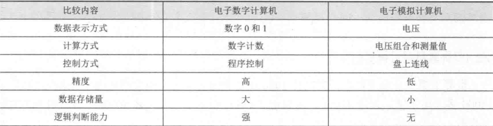
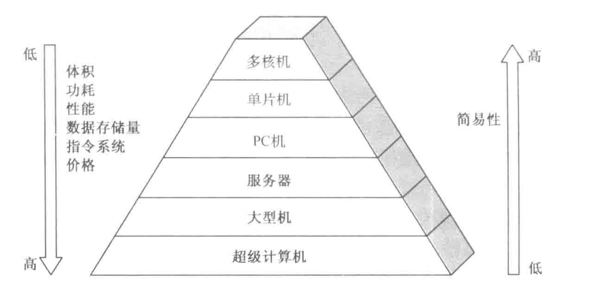
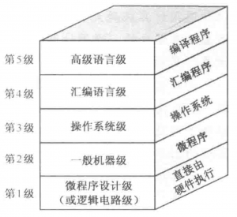

# 1.1 计算机的分类

## 一、两大类

- 电子模拟计算机：数值由连续量表示，运算过程连续，受干扰大。

- 电子数字计算机：按位运算，不连续地跳动计算，抗干扰能力强。

    

## 二、电子计算机分类

- 专用计算机：最高效、经济、快速的方式，适应性差。
- 通用计算机：适应性强，牺牲效率、速度、经济性，细分为超级计算机、大型机、服务器、PC机、单片机、多核机。

# 1.2 计算机的发展简史

## 1.2.1计算机五代变化

1. 1946-1957 电子管计算机——数据处理机
2. 1958-1964 晶体管计算机——工业控制机
3. 1965-1971 中小规模集成电路计算机——小型计算机
4. 1972-1990 大规模和超大规模集成电路计算机——微型计算机，分为：多板机（多个印刷板）、单板机、单片机（一个芯片）
5. 1991- 现在 巨大规模集成电路计算机——单片机

## 1.2.4 计算机的性能指标

- 吞吐量：表征一台计算机在某 一时间间隔内能够处理的信息量。
- 响应时间：表征从输入有效到系统产生响应之间的时间度量，用时间单位来度量，包括等待时间和处理时间。
- 利用率：在给定的时间间隔内系统被实际使用的时间所占的比率，用百分比表示，实际处理时间/响应时间。
- 处理机字长：指处理机运算器中一次能够完成二进制数运算的位数，如32位、64位。
- 总线宽度：一般指CPU中运算器与存储器之间进行互连的内部总线二进制位数。
- 存储器容量：存储器中所有存储单元的总数目， 通常用KB、MB、GB、TB来表示。
- 存储器带宽：单位时间内从存储器读出的二进制数信息量，一般用字节数/秒表示。
- 主频/时钟周期：CPU的工作节拍受主时钟控制，主时钟不断产生固定频率的时钟，主时钟的频率(f)叫CPU的主频。度量单位是MHz(兆赫兹)、GHz(吉赫兹)。主频的倒数称为CPU时钟周期(T)，T=1/f， 度量单位是μs、ns。
- CPU执行时间：表示CPU执行一般程序所占用的CPU时间，可用下式计算:
    CPU执行时间 = CPU时钟周期数 * CPU时钟周期
- CPI:表示每条指令周期数，即执行一条指令所需的平均时钟周期数。用下式计算:
    CPI = 执行某段程序所需的CPU时钟周期数/程序所包含的指令条数
- MIPS (Million Instructions Per Second)的缩写，表示平均每秒执行多少百万条定点指令数，用下式计算:
    MIPS = 指令数 +/(程序执行时间 * 10^6)
- FLOPS (Floating-point Operations Per Second) 的缩写，表示每秒执行浮点操作的次数，用来衡量机器浮点操作的性能。用下式计算:
    FLOPS = 程序中的浮点操作次数 / 程序执行时间(s)

# 1.3 计算机的硬件

## 1.3.2 运算器

主要功能是进行加减乘除等算术运算，还可以进行逻辑运算，又称为ALU（算术逻辑运算部件），计算机中通常采用二进制数，运算器长度一般是8、16、32、64位。

## 1.3.3 存储器（存放数据和程序）

保存一个数的16个触发器称为一个**存储单元**，也称其为寄存器。存储器由许多存储单元组成，每个存储单元有编号，称为**地址**，存取数据都要按给定的地址来寻找存储单元。存储器所有存储单元的总数称为**存储容量**，存储容量大的磁盘存储和光盘存储称为**外存储器**，半导体存储器称为**内存储器（内存）**。

## 1.3.4 控制器

控制器是计算机中发号施令的部件，控制计算机各部件的工作。

### 1.计算程序

每一个基本操作称为一条**指令**，一串特定的指令序列称为某问题的**计算程序**，简称程序。

### 2.指令的形式

指令的内容由两部分组成：操作的性质和操作数的地址，前者为操作码，后者为地址码。
将接替的程序存放到存储器中称为存储程序，控制器依据存储的程序进行计算任务称为程序控制。存储程序并按照地址顺序执行，这就是冯诺依曼型计算机的设计思想。

- 冯诺依曼结构：指令和数据放在一个存储器中。
- 哈佛结构：指令和数据分别放在两个存储器中。

### 3.控制器的基本任务

把取指令的一段时间叫做取指周期，把执行指令的时间叫做执行周期，计算机系统中运算器和控制器组合在一个芯片中，称为CPU。

### 4.指令流和数据流

把组成一个字的二进制位数称为字长，可以是8位也可达到64位（影响精度）。如果某字代表要处理的数据，称为数据字，如果代表指令，称为指令字。取指周期中从内存中读出的信息流是指令流，流向控制器；执行周期中，从内存读出信息流是数据流，由内存流向运算器。由对其进行操作的周期区间进行判断

## 1.3.5 适配器与输入/输出设备

- 输入设备：把人们熟悉的某种信息形式变换为机器内部所能接受和识别的二进制信息形式。
- 输出设备：把计算机处理的结果变化为人或其他机器设备所能接收和识别的信息形式。
- 计算机的输入输出设备也称外围设备，通常需要一个适配器与主机相连。
- **系统总线**是构成计算机系统的骨架，多个系统部件之间进行数据传送的公共通路。

# 1.4 计算机的软件

## 1.4.1 软件组成和分类

- 系统程序：各种服务性程序、语言程序、操作系统、数据库管理系统
- 应用程序：用户利用计算机来解决某些问题二编制的程序

## 1.4.2 软件的发展演变

机器语言编写程序（手编程序），这种计算机完全可以识别的程序又称为**目的程序**；再是约定一些格式表示不同指令（汇编语言），用指令编写程序，用**汇编器**将汇编程序语言翻译为目的程序；然后是接近数学语言的**算法语言**，如C，Java，算法语言编写的程序称为**源程序**，**编译程序**用于翻译成目的程序，**运行系统**协助目的程序运行，编译程序和运行系统合称为**编译器**。
一个c语言程序到可执行文件的过程：c语言程序由编译器形成汇编语言程序，汇编语言程序再由汇编器形成目标板块，再由连接器将多个模块与库程序组合在一起解析所有应用，最后加载器将机器代码放入合适的内存位置以便处理器执行

# 1.5 计算机系统的层次结构

## 1.5.1 多级组成的计算机系统

第一级到第三级编写程序采用的语言，基本是二进制数字化语言，机器执行和解释容易。第4、5级编写程序采用的是符号语言，用英文字母和符号来表示程序。

## 1.5.2 软件与硬件的逻辑等价性

把复杂的、常用的程序制作成所谓的固件，就其功能而言，是软件，但从形态上来说又是硬件。

计算机的性能指标主要由CPU的性能指标，存储器性能指标和I/O吞吐率。