# 2.1 数据与文字的表示方式

## 2.1.1 数据格式

### 1.定点数表示法

将数据分为纯整数和纯小数两类，用n+1位表示一个定点数，xn为符号位，放在最左边，0表示正号，1表示负号。故一个数 x 可以表示为 x\=xnxn−1…x1x0

x为纯小数：0≤|x|≤1−2−n

x为纯整数：0≤|x|≤2n−1

计算机中多采用定点纯整数表示，将定点数表示的运算简称整数运算。  

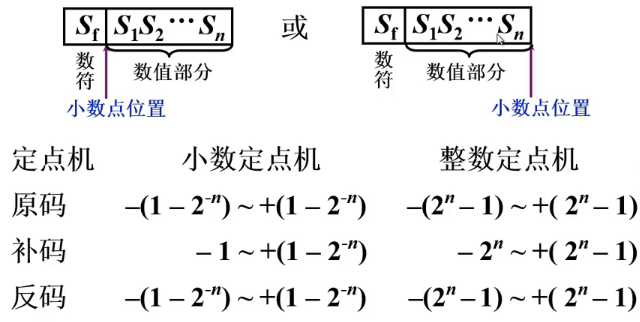

求补码：

​	对于正数：直接就是该数

​	==对于负数：相当于一个2^n+1^-|a|=11111111+1-|a|= a~取反~+1==

### 2.浮点数表示法

小数点随着阶码的不同而浮动，数的范围和精度分别表示。

格式：N\=Re.M

M称为浮点数的**尾数**，e 称为**指数**，是一个整数，R是**基数**，一般隐式表示（通常2或10）。在机器中，尾数用定点小数形式表示，指数用定点整数形式表示，称为**阶码**。

相当于S与M结合，S表M的符号位

**阶码E**：其第一位表阶码的正负，E=e+123=e+0111 1111,根据与规律，

1. 若e为正：e从右到左，e的第一个为1的位其对应的E的位为0，其他位除了第一位表正负的位，E均与e的位相等；（该位之前除符号位均为e，该位之后均为1，该位为0）；

    1. 原理相当于：将e第一次出现1的位单独拆分成其他位为0该位为1的数加上e该位变为0后的数（此时其该位包括该位之后的数均为0）再加上0111 1111，将再将拆分出的数与0111 1111先运算，运算结果即，该位之后的数为1，该位之前（包括该位）的位均为0（除第一位符号位收到了进位），而被拆分的e为该位（包括该位）之后均为0，该位之前的不确定，进行相加，正好是0与不确定的位和1与0相加，即除了该位改变，其他位均不变

    2. eg：0101 0010，第一位出现的为第二位，即将其拆分：0101 0000+0000 0010，让0000 0010与0111 1111相加，即1000 0001 ，再使1000 0001与0101 0000进行相加，即原先为不变，1101 0011

        因此可直接求，1（符号）101 000（该位之后均为1)1

2. 若e为负：则不加符号位对其求反


### 3\. 浮点数表示范围

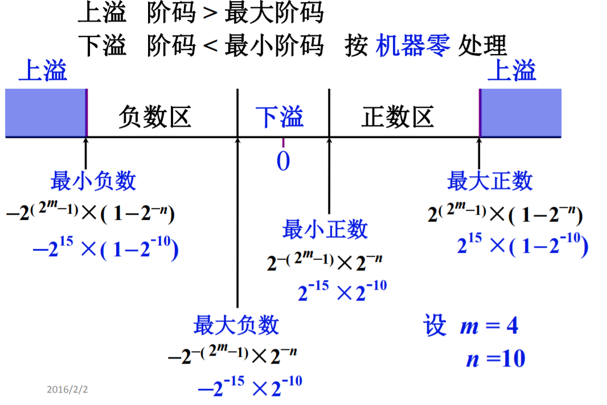

### 4\. 浮点数的规格化

**规格化形式：**

- 基数 r = 2 ，尾数最高位为 1
- 基数 r = 4 ，尾数最高 2 位不全为 0
- 基数 r = 8 ，尾数最高 3 位不全为 0

基数不同，浮点数的规格化形式不同。

**规格化方式：**

- r = 2 左规 尾数左移 1 位，阶码减 1  
       右规 尾数右移 1 位，阶码加 1
- r = 4 左规 尾数左移 2 位，阶码减 1  
       右规 尾数右移 2 位，阶码加 1
- r = 8 左规 尾数左移 3 位，阶码减 1  
       右规 尾数右移 3 位，阶码加 1

基数 r 越大，可表示的浮点数的范围越大，基数 r 越大，浮点数的精度降低。  
**举例：**

> 1.设 m = 4，n = 10，r = 2，求尾数规格化后的浮点数表示范围。

**最大正数** = 2+1111∗0.1111111111\=215∗(1−2−10)

**最小正数** = 2−1111∗0.1000000000\=2−15∗(2−1)\=2−16 （尾数第一位规格化后必须为1）

**最大负数** = 2−1111∗−0.1000000000\=−2−15∗2−1\=−2−16

**最小负数** – 2+1111∗−0.1111111111\=−215∗(1−2−10)

> 例 6.13 将 x = + 19/128 写成二进制定点数、浮点数及在定点机和浮点机中的机器数形式。其中数值部分均取 10 位，数符取 1 位，浮点数阶码取 5 位（含1位阶符），尾数规格化。

**x的二进制表示:** 设 x = + 19/128

**二进制形式：** x\=0.0010011

**定点表示：** x\=0.0010011000

**浮点规格化：** x\=0.1001100000∗2−10

**定点机中：** 原补反\[x\]原\=\[x\]补\=\[x\]反\=0.0010011000

**浮点机中：**  
原；\[x\]原\=1,0010；0.1001100000  
补；\[x\]补\=1,1110；0.1001100000  
反；\[x\]反\=1,1101；0.1001100000

### 5\. 十进制数表示

1. 字符串形式  
    即一个字节存放一个十进制的数位或符号位，还需要存放该数在主存中的起始地址和该数的位数。
2. 压缩的十进制数串形式  
    即一个字节存放两个十进制的数位或符号位即BCD码(压缩)，即一个字节存放两个十进制的数位或符号位即BCD码(压缩)。

## 2.1.2数的机器码表示

### 1\. 原码表示法

#### (1) 数学定义

- 整数：  
  
    
    

整数的第一位为符号位，用 “,”隔开，0表示正数，1表示负数,x为真值，n为整数的位数。

- 小数：  
  
    
    

#### (2) 举例

原\[x\]原\=1.001   x\=−0.001

原\[x\]原\=0.101   x\=+0.101

原\[x\]原\=1,110   x\=−110

原\[x\]原\=0,011   x\=+011

结论：有逗号表示整数，有小数点表示小数，符号前的数表示符号，0表示正数，1表示负数。

#### (3) 特点

简单、直观，但是在加法运算时由于符号位的存在，不能简单地按位相加，**“+0”和“-0”的原码不同**。

### 2.补码表示法

#### (1) 补的概念

- 以时钟为例，在时钟上进行运算相当于是模12下的运算。如果要-3，有两种途径：把指针向后拨3位（-3）或者向前拨9位（+9），故可以用这种方式将减法转换成加法，我们称+9是-3在模12下的补数。
- 结论：
    1. 一个负数加上“模”就是它的补数（如-3+12=9，表示-3在模为12下的补数是9）。
    2. 一个正数和一个负数互为补数时，他们绝对值之和即为模数（相当于结论1的逆运算）。
    3. 正数的补数就是其本身。
    4. **“+0”和“-0”的补码相同**

#### (2) 补码的定义

（勘误：下方公式的下标应该为“补”）

- 整数：


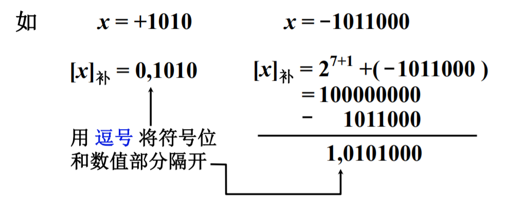

- 小数：


#### (4) 快速求补码

当真值为**负数**时，补码可以用原码忽略符号位每位取反后末位+1得到，再将符号位填1。

如：x = -1010,取反得0101,+1得0110,加上符号位得补码：1,0110。

原因如下：

根据补码的最初定义，补\[x\]补\=2n+1+x，假设x是个4位负数，用 −x1x2x3x4 表示，那么公式可以写成 补\[x\]补\=25–x1x2x3x4\=100000–x1x2x3x4\=11111+00001–x1x2x3x4 ，而对于 11111−x1x2x3x4 就可以看成 1x1¯x2¯x3¯x4¯ ，然后再加上一个 00001 。即除符号位外，每位取反，末位+1。

所以，已知x的补码，也可以很容易地求得-x的补码，即整体取反+1。树状数组的关键函数lowbit用于求一个数从末尾开始的第一个1所在位置的十进制数，其实现方式就是x & -x，用的就是这里的原理。

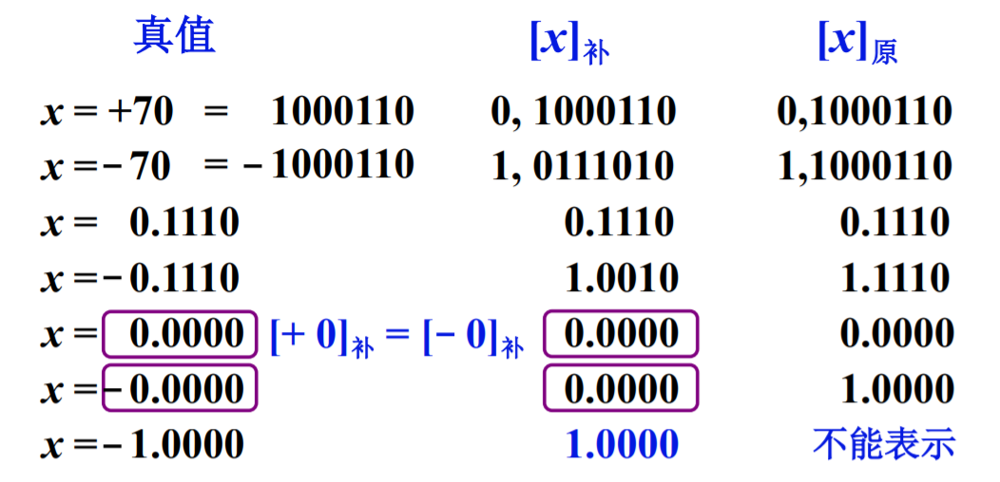

### 3.反码表示法

#### (1) 定义

（勘误：下方公式的下标应该为“反”）

- 整数：  
  
    
    
- 小数：
  


即 当真值为负数时，反码可以用原码除符号位外每位取反得到，正数反码不变，**“+0”和“-0”的反码不同**。

### 4\. 三种表示法小结

- 最高位为符号位，书写上用“,”（整数） 或“.”（小数）将数值部分和符号位隔开。
- 对于正数，原码 = 补码 = 反码。
- 对于负数 ，**原码**符号位为 1，数值位不变，原码除符号位外取反后得**反码**，反码末位+1得**补码**，补码符号位取反得**移码**，补码连同符号位取反后+1得相反数的补码。

一字节空间可以表示的范围：


疑问：加蓝处为何为-128？

答：二进制代码10000000表示负数，忽略符号位取反后+1得到其补码也为1000000，如果按照原码的定义，10000000表示-0，但是补码没有“+0”和“-0”之分，补码的0全用00000000表示，多出的“-0”用于表示-128，所以补码比其他都多一个最小数。

### 5.移码表示法

#### (1) 定义

由于符号位存在，补码很难直接判断真值大小。

移\[x\]移\=2n+x(2n\>x≥−2n)x为真值，n为整数的位数。

移x\=10100,\[x\]移\=25+10100\=1,10100

移x\=−10100,\[x\]移\=25−10100\=0,01100

**移码与补码只差一个符号位，符号位取反两者就能相互转换。**

证明：

正数：补\[x\]补\=0,x 移\[x\]移\=2n+x，相当于在第n为 +1，即在符号位取反。

负数：补移\[x\]补\=2n+1+x\=(2n+x)+2n\=\[x\]移+2n，也相当于符号位取反。

#### (2) 特点

移移\[+0\]移\=\[−0\]移

最小真值的移码为全 0,用移码表示浮点数的阶码,能方便地判断浮点数的阶码大小。

### 6\. IEEE754标准

IEEE二进位浮点数算术标准（IEEE Standard for Floating-Point Arithmetic）的标准编号,它规定了浮点数在计算机当中的存储方式以及算术标准等。

浮点格式可分为符号位s，指数位e以及尾数位f三部分。

规定了单精度（32）和双精度（64）两种基本格式（还有其他特殊格式不做介绍），规定尾数用原码，阶码用移码表示，但是不完全等同与移码，真值和阶码的转换为：单精度 E\=e+127 ，双精度 E\=e+1023 , E 为阶码， e 为指数真值。**尾数域最高位总是1**，隐藏在小数点左边不显示。

**在IEEE-754 标准下，浮点数一共分为：**

- NaN：即Not a Number。非数的指数位全部为1 同时尾数位不全为0。在此前提下，根据尾数位首位是否为1，NaN 还可以分为SNaN 和QNaN 两类。前者参与运算时将会发生异常。
- 无穷数：指数位全部为1 同时尾数位全为0，根据符号决定正负。
- 规格化数：指数位不全为1 同时尾不全为0。此时浮点数的隐含位有效，其值为1。
- 非规格化数：指数位全为0 且尾数位不全为0。此时隐含位有效，值为0。另外需要注意，以单精度时为例，真实指数E 并非0-127=-127，而是-126，这样一来就与规格化下最小真实指数E=1-127=-126 达成统一，形成过度。
- 0 ：指数位与尾数位都全为0，根据符号位决定正负。

## 2.1.3字符与字符串的表示方法

符号数据:字符信息用数据表示，如ASCII等;  
ASCII:用一个字节来表示,低7位用来编码(128),最高位为校验位，  
字符串的存放方法：可以从低位到高位存放也可以从高位到低位存放。

## 2.1.4 汉字的表示方法

### 1\. 汉字的输入编码

**数字编码 拼音码 字形编码**

### 2.汉字内码

汉字信息的存储，交换和检索的机内代码，两个字节组成，每个字节高位都为1(区别于英文字符)。

### 汉字字模码

用点阵表示汉字字形，形成汉字库。

> 输入编码用于输入，汉字内码用于计算机内部处理，字模码用于汉字输出。

## 2.1.5 校验码（奇偶校验）

设x\=x0x1…xn−1是一个n位字，奇校验位C定义为：c¯\=x0⨁x1⨁…⨁xn−1,即只有x中有奇数个1时才会使得c = 0。  
**奇偶校验码只能检测奇数个错误，无法检测偶数个错误，更不能提供错误的位置。**

# 2.2定点加减法运算

## 2.2.1 补码加法

公式：[x\]补+\[y\]补\=\[x+y\]补  
[](http://fangkaipeng.com/wp-content/uploads/2021/03/wp_editor_md_fa75ea72e0f42fe264b6f509585795bf.jpg)

[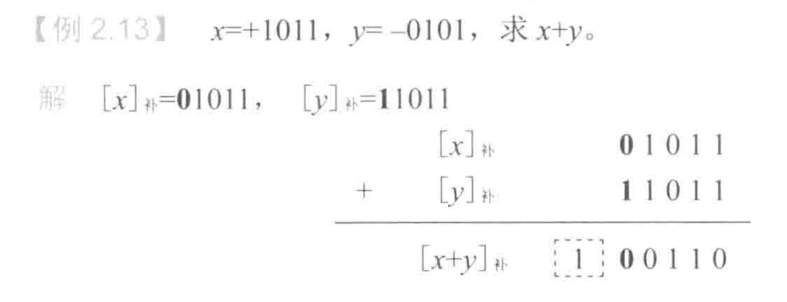](http://fangkaipeng.com/wp-content/uploads/2021/03/wp_editor_md_fa75ea72e0f42fe264b6f509585795bf.jpg)

**补码加法特点：** 符号位一起参与运算，在模 2n+1 下运算，即溢出舍去。

## 2.2.2 补码减法

公式： 补补补补补\[x−y\]补\=\[x\]补–\[y\]补\=\[x\]补+\[−y\]补

**已知y的补求-y的补方法：** 连同符号位取反后末尾+1。

## 2.2.3 溢出概念与检测方法

### 1.定义

定点整数机器中，数的表示范围|x|<2n−1 ，在运算过程中出现大于字长绝对值的现象称为溢出。两个正数相加，结果大于机器字长所能表示的最大正数（变成负数），称为**正溢**。两个负数相加，结果小于所能表示的最小负数，称为**负溢**。

### 2.双符号位法判断溢出

补\[x\]补\=2n+2+x(mod2n+2)

补补补\[x\]补+\[y\]补\=\[x+y\]补(mod2n+2)

**规则：** 两个符号位一起参与模2n+2下的运算，符号位为11表示负数，00表示正数，01和10表示溢出，最高符号位表示正确的符号，01为正溢，10为负溢。

### 3.单符号判断溢出

当符号位产生进位而最高有效位没进位时发生负溢，当符号位无进位而最高有效位进位时发生正溢。

## 2.2.4 基本的二进制加法/减法器

[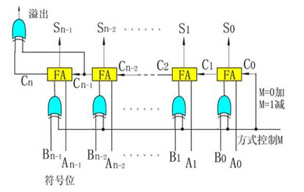](http://fangkaipeng.com/wp-content/uploads/2021/03/wp_editor_md_22d5fa44ba5fb58849daf4fe6edfc67e.jpg)

由n个1位的全加器（FA）串联组成，全加器包含三个输入（两个加数，一个前驱进位数）和两个输出（结果和进位）。M为方式控制输入线，M=0时做加法，M=1时做减法。

**减法实现：** 通过 补补补\[A−B\]补\=\[A\]补+\[−B\]补 实现，-B的补码就是B连同符号位取反后+1，电路中通过一个异或门将B与1异或实现每位取反，C0输入1实现末尾+1。

# 2.3 定点乘法运算

### 2.3.1 不带符号的列阵乘法器

[](http://fangkaipeng.com/wp-content/uploads/2021/03/wp_editor_md_605527ab08ec8dfe3b77b4caebf01850.jpg)

如图，设A\=am−1…a1a0 以及 B\=bn−1…b1b0 ,在二进制的乘法中被乘数 A 和乘数 B 产生 m+n 位乘积 P\=pm+n−1…p1p0\=∑i\=0m−1∑j\=0n−1(aibj)2i+j，其中每个aibj称为一个**被加数**。

对于m∗n 个被加数可以用m∗n 个与门并行产生：  
[](http://fangkaipeng.com/wp-content/uploads/2021/03/wp_editor_md_49812277988fbc2f332b90cfe39271d4.jpg)

[](http://fangkaipeng.com/wp-content/uploads/2021/03/wp_editor_md_49812277988fbc2f332b90cfe39271d4.jpg)

产生被加数后需要将其按照上述P的计算公式加起来，可以用一组并行的加法器实现，即列阵乘法器：  


[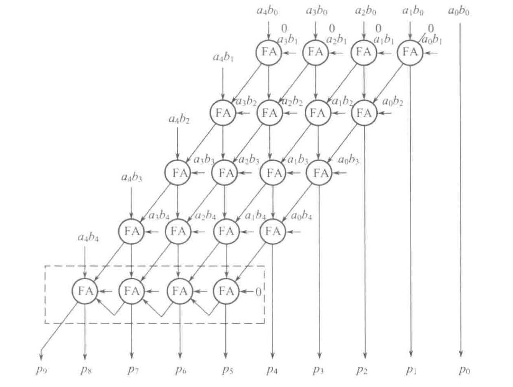](http://fangkaipeng.com/wp-content/uploads/2021/03/wp_editor_md_e5a7f6f9474c59d07e48f00ff20c5b65.jpg)

### 2.3.2 带符号的列阵乘法器

求补方法：从右往左扫描，遇到第一个“1”，将1左边的所有取反，右边连同自己不变，结果就是补码。

**求补电路：**  
[](http://fangkaipeng.com/wp-content/uploads/2021/03/wp_editor_md_c3d3901513eabbf1a8a7b1fb11ebc276.jpg)

[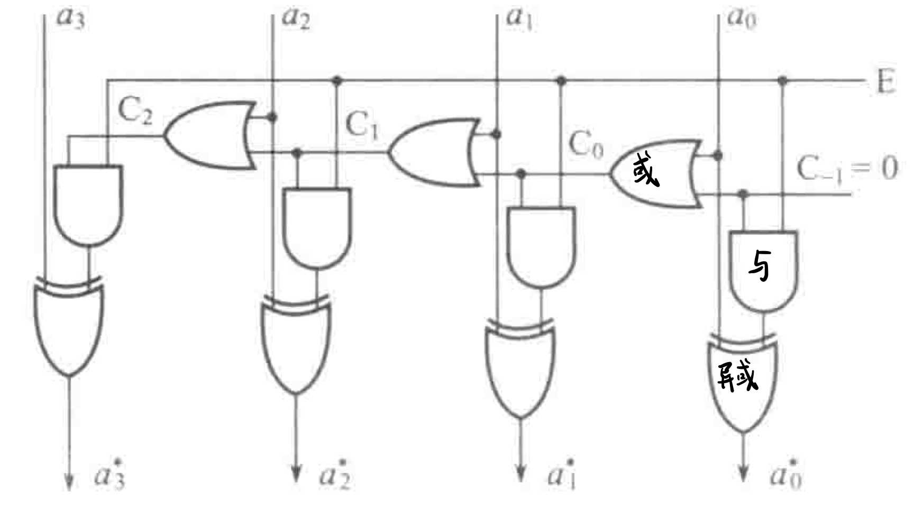](http://fangkaipeng.com/wp-content/uploads/2021/03/wp_editor_md_c3d3901513eabbf1a8a7b1fb11ebc276.jpg)

如图所示，C−1 始终保持0，E 为控制信号，为1表示进行求补操作。最下方输出的即求补后的结果。

带符号的列阵乘法器含有三个求补器，其中两个为算前求补器，一个位算后求补器，结构如图所示：

[](http://fangkaipeng.com/wp-content/uploads/2021/03/wp_editor_md_089903db76fa2d899ede8c6d5028c525.jpg)

**使用规则（考）：**

- 用于原码列阵乘法器：忽略三个求补器，单独考虑符号位，使用原码输入到乘法列阵运算。
  
- 用于补码列阵乘法器：单独考虑两个乘数的符号位，将负数的数值部分求补后输入给乘法列阵运算，若符号位异或后为1，则将乘法列阵输出的结果求补后加上符号位，如果符号位为0则直接加上符号位。
  

**例题：**

1.设x=+15，y=-13，用带求补器的**原码**阵列乘法器求出乘积x·y

由于是原码列阵乘法器，首先求出x和y的原码：原，原\[x\]原\=01111，\[y\]原\=11101, 去掉符号位：，|x|\=1111，|y|\=1101, 符号位运算：0⨁1\=1。

```
            1 1 1 1×           1 1 0 1———————————————————            1 1 1 1          0 0 0 0        1 1 1 1+     1 1 1 1———————————————————    1 1 0 0 0 0 1 1 
```

乘积符号为1，算后求补器输出11000011，原\[x∗y\]原\=111000011，换算成二进制数真值是：  
x∗y\=(−11000011)2\=(−195)10。

2.设x=-15，y=-13，用带求补器的**补码**阵列乘法器求出乘积x·y。

补码列阵乘法器，求出补码补，补\[x\]补\=10001，\[y\]补\=10011，乘积符号位运算：1⨁1\=0。  
忽略符号位后用算前求补器输出 ，|x|\=1111，|y|\=1101 。

```
                1 1 1 1×               1 1 0 1———————————————————————                1 1 1 1              0 0 0 0            1 1 1 1＋         1 1 1 1———————————————————————        1 1 0 0 0 0 1 1 
```

乘积符号为0，算后求补器输出 11000011，补\[x∗y\]补\=011000011。  
补码二进制数真值：  
＋＋＋＋x∗y\=0∗28＋1∗27＋1∗26＋1∗21＋1∗20\=(+195)10  
十进制数乘法验证：x∗y\=(−15)∗(−13)\=+195。

# 2.4 定点除法运算

## 2.4.1 原码除法算法原理

[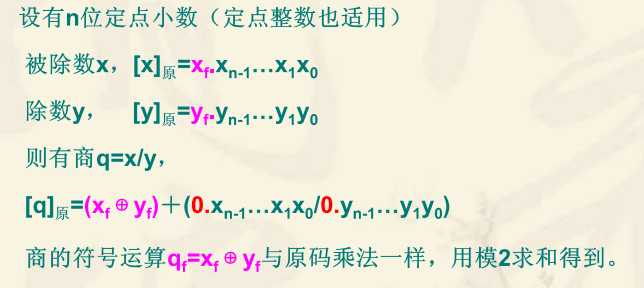](http://fangkaipeng.com/wp-content/uploads/2021/03/wp_editor_md_b1d816f596e599e569e6caacb23a26fb.jpg)

手算模拟除法：

[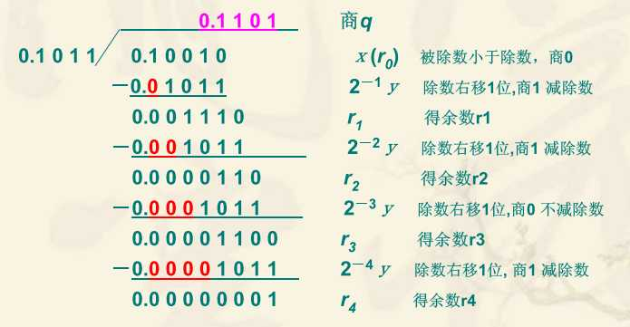](http://fangkaipeng.com/wp-content/uploads/2021/03/wp_editor_md_5bcec8dfe1e809304eafda9887fb274e.jpg)

上图可以发现：人工除法时，人可以比较被除数（余数）和除数的大小来确定商1(够减）或商0（不够减)。  
对于机器除法，余数为正表示够减，余数为负表示不够减。不够减时必须恢复原来余数，才能继续向下运算，这种叫做**恢复余数法**，由于有各种判断和恢复余数的操作，控制较为复杂，不常用。

**计算机常用方法：加减交替法**

余数为正，商1，下次除数右移做减法;余数为负，商0，下次除数右移做加法。

[](http://fangkaipeng.com/wp-content/uploads/2021/03/wp_editor_md_9a70844813bb4a4a78aa64baf094ff64.jpg)

## 2.4.2 并行除法器

### 1\. 可控加法减法单元（CAS）

[](http://fangkaipeng.com/wp-content/uploads/2021/03/wp_editor_md_10df9d1533e71a9f588b0142b34bbc92.jpg)

它有四个输出和四个输入端，输入线P\=0 时，CAS做加法，p\=1 时，CAS做减法。  
CAS的输入输出关系可以用下式表示：  
Si\=Ai⨁(Bi⨁P)⨁Ci  
Ci+1\=(Ai+Ci)⨁(Bi⨁P)+AiCi

P\=1时：  
Si\=Ai⨁Bi⨁Ci  
Ci+1\=AiBi+BiCi+AiCi  
P\=0时：  
Si\=Ai⨁Bi¯⨁Ci  
Ci+1\=AiBi¯+Bi¯Ci+AiCi

### 2\. 加减交替的列阵除法器

[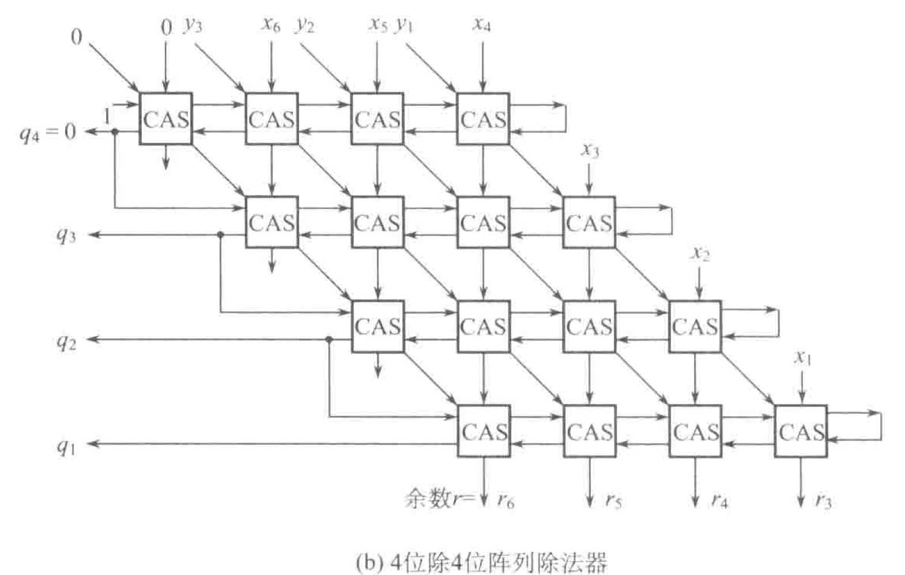](http://fangkaipeng.com/wp-content/uploads/2021/03/wp_editor_md_d4faa24066bac0f2c8d8da95cc096e33.jpg)

### 3\. 例题说明

x\=−0.1011   y\=−0.1101, 求原\[x/y\]原  
原原补补\[x\]原\=1.1011\[y\]原\=1.1101\[y∗\]补\=0.1101\[−y∗\]补\=1.0011  
[](http://fangkaipeng.com/wp-content/uploads/2021/03/wp_editor_md_092558fa3a372bb9efbb7098400caca7.jpg)

[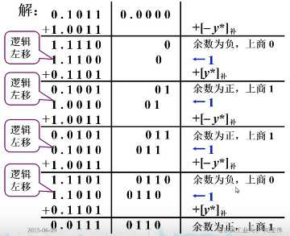](http://fangkaipeng.com/wp-content/uploads/2021/03/wp_editor_md_092558fa3a372bb9efbb7098400caca7.jpg)

# 2.5 定点运算器的组成

## 2.5.1 逻辑运算

### 1\. 逻辑非运算

逻辑非也称**求反**， 对某数进行逻辑非就是按位求反，常用变量上加一横来表示。  
x\=x0x1x2…xn则 x¯\=x0¯x1¯x2¯…xn¯  
例：x1\=01001011  x1¯\=10110100

### 2\. 逻辑加运算

对两个数进行逻辑加就是按位求或，又称为**逻辑或**，常用“+”表示。

例：x\=10100001   y\=10011011   x+y\=10111011

注意逻辑加是按位运算，所以**没有进位！**

### 3.逻辑乘运算

对两个数进行逻辑乘就是按位求与，又称为**逻辑与**，常用“·”表示。  
例：x\=10111001   y\=11110011   x·y\=10110001  
注意逻辑乘是按位运算，所以**没有进位！**

### 4.逻辑异或运算

对两个数进行逻辑异或就是按位求它们的模2和，又称为**按位加**，常用“⨁”表示。  
例：x\=10101011   y\=11001100   x⨁y\=01100111  
注意逻辑乘是按位运算，所以**没有进位！**

## 2.5.2 多功能算术/逻辑运算单元（ALU）

# 2.6 浮点运算方法和浮点运算器

## 2.6.1 浮点加减法

### 1.浮点加减法规则

[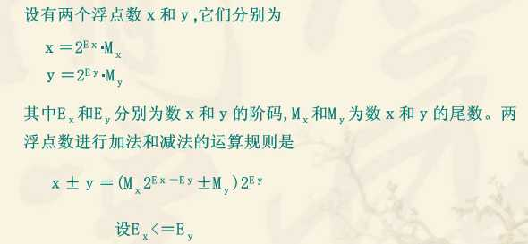](http://fangkaipeng.com/wp-content/uploads/2021/03/wp_editor_md_52a8b752c58d6e0d7d76d7ac2f65aec5.jpg)

### 2\. 运算步骤  小阶靠大阶

**0操作数的检查：**  
检查x和y中是否存在0，如果存在0则无需计算，直接得出答案。

**对阶：**  
将两个浮点数的阶码用补码表示，做相减运算得出需要移动的位数。遵守 `小阶向大阶看齐` 的原则，即小阶的尾数向右移，每移一位，阶码+1。（不易损失高位，易损失低位，误差小）

**尾数加减运算：**  
与定点加减法运算一样，采用补码运算。

**结果规格化：**

[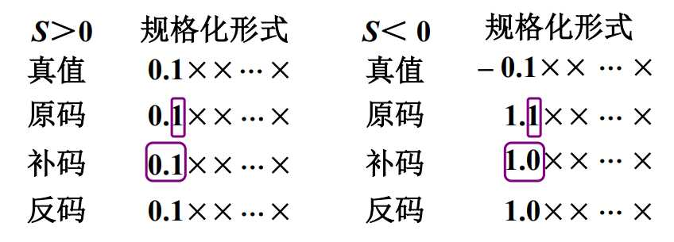](http://fangkaipeng.com/wp-content/uploads/2021/03/wp_editor_md_f5c4200cd2b42a654a7732257bd6e354.jpg)

上图可知：对于补码，规格化要求符号位和第一数位不同。

- 左规  
    结果是00.00…001…或者11.11…110…这种形式的，没有发生溢出，不断地将**尾数**相对小数点向左移动一位，阶码相应-1，直到符号位和第一数位不同为止。
- 右规  
    结果是01.xxxx或10.xxxx时，说明发生溢出，需要向右移动，01.xxxx向右移动一位变成00.xxxx，10.xxxx向右移动一位变成11.xxxx，阶码都相应+1。

**舍入操作：**

在对阶和右规过程中，可能出现尾数末尾丢失引起误差，需要考虑舍入。

- 0舍1入：类似四舍五入，丢弃的最高位为1，则进1，否则直接舍去。
- 朝0舍入：直接舍去，易导致误差积累，正数相加操作误差大。
- 朝+无穷舍入：正数多余位不全为“0”则进1，负数则截尾。
- 朝-无穷舍入：负数多余位不全为“0”则进1，正数则截尾。

**溢出处理：**

- 阶码上溢：超出阶码可能表示的最大值的正指数值，一般认为正无穷和负无穷。
- 阶码下溢：超出阶码可能表示的最小值的负指数值，一般认为0。
- 尾数上溢：尾数右移，阶码+1。
- 尾数下溢：尾数右移时最低有效位从尾数域右端流出，需要进行舍入操作。

**例子：**

x\=0.11.1∗210   y\=0.1011∗201，求 x+y （除阶符、数符外，阶码取3位，尾数取6位）

解：

补\[x\]补\=00,010;00.110100  
补\[y\]补\=00,001;00.101100

- 对阶

[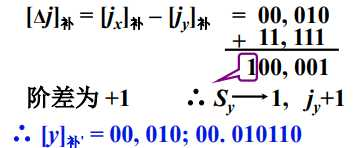](http://fangkaipeng.com/wp-content/uploads/2021/03/wp_editor_md_91fed6376baea03a8c8a84effb0fa2a5.jpg)

- 尾数求和

[](http://fangkaipeng.com/wp-content/uploads/2021/03/wp_editor_md_ed740ba55931024cc61e25e8e29dd39c.jpg)

- 右规

[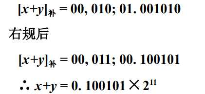](http://fangkaipeng.com/wp-content/uploads/2021/03/wp_editor_md_e03f4470aa2c6ec7eea7d5aaa2f589a4.jpg)

### 校验码

1. 奇偶校验
    1. 奇校验：其所有位的数据进行相加，最后加上奇校验位后为奇数，只能确定一位是否发生错误
    2. 偶校验：其所有位的数据进行相加，最后加上偶校验位后为奇偶，只能确定一位是否发生错误
    3. 汉明码：检错一位＋纠错一位（若想检错二位需要添加一位奇偶校验位）
        1. 具体思路
            1. 
            2. 由于一个校验位有两个状态，一个正确，一个出错，因此，一个校验位对应两个状态
            3. 因此，若共有n个信息位，再加上校验位的位数k，再加上一个无出错状态，共有2^k^个状态
            4. 即满足2^k^≥n+k+1 公式一
        2. 具体实施：
            1. 
            2. 第二步对应公式一，当数据位最低为1时，校验位数最低为2，分别位于0 1位，同时每个汉明码其校验位位置均相同，对应公式2^k-1^  
            3. 其中每个位置数对应的二进制数，其每相同位组成一组（共k组），每组组成的二进制数，位上为1的数字所对应的数据参与与或运算，即偶校验；
            4. eg：第一组为1 1 0 1，则第 1 2 4 个数据进行与或运算，为0对应的数据不需要
        3. 纠错原理：
            1. 
            2. 用每个校验位与上面所对应的数据位进行校验
                1. 单个校验结果出错：则代表出现一个错误，根据s1未出错,则s1与s2所共有的数据未出错，而s3未出错，则s3与s2共有的数据未出错，则d1 d3 d4均为出错，则出错的只有p2，即第二位
                2. 若有两个出错，则出错这两个共有的数据出错，比如若s1和s2出错，则一定是其共有的d1 d4这两个中间出错，而再分别利用s1和s3共有的d4，可知d4未出错，则出错就是d1

1. 

    