# 5.1 CPU功能和组成

## 5.1.1 CPU的功能

- 指令控制（程序的顺序控制）
- 操作控制（一条指令由若干操作信号实现）
- 时间控制（指令各个操作实施时间的定时）
- 数据加工（算术运算和逻辑运算）

## 5.1.2 CPU的基本组成

[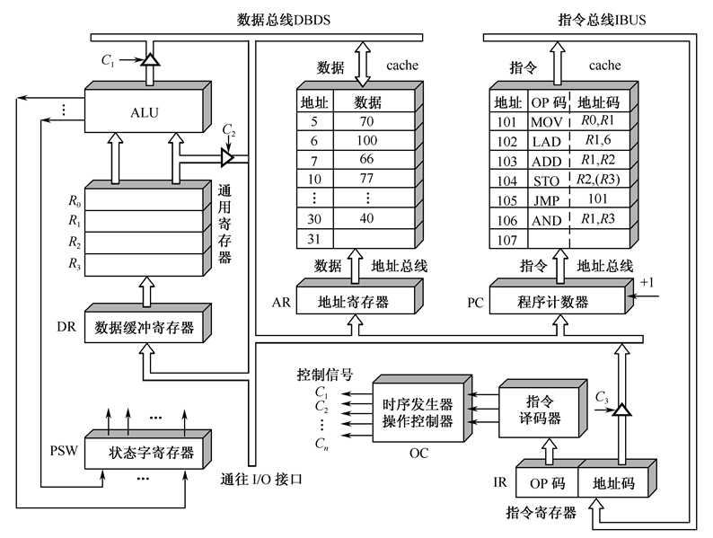](http://fangkaipeng.com/wp-content/uploads/2021/04/wp_editor_md_83d893c7a5015c03861a5d0f1e1c7470.jpg)

- 中央处理器CPU=运算器+控制器+Cache
- 运算器：ALU+通用寄存器+数据缓冲寄存器+状态条件寄存器，进行算术逻辑运算
- 控制器：
    - 组成：程序计数器、指令寄存器、指令译码器、时序产生器和操作控制器组成。
    - 功能：  
        （1）指令Cache中取出一条指令，并指出下条指令的在指存中的地址  
        （2）对指令进行译码和分析，产生相应的控制信号，完成规定的动作  
        （3）指挥并控制CPU、数存和输入输出设备间数据的流动方向

## 5.1.3 CPU中的主要寄存器

### 1\. 数据缓冲寄存器（DR）

数据寄存器（Data Register，DR）又称数据缓冲寄存器，其主要功能是作为CPU和主存、外设之间信息传输的中转站，用以弥补CPU和主存、外设之间操作速度上的差异。

数据寄存器用来暂时存放由主存储器读出的一条指令或一个数据字；反之，当向主存存入一条指令或一个数据字时，也将它们暂时存放在数据寄存器中。

数据寄存器的作用是 ：

（1）作为CPU和主存、外围设备之间信息传送的中转站；

（2）弥补CPU和主存、外围设备之间在操作速度上的差异；

（3）在单累加器结构的运算器中，数据寄存器还可兼作操作数寄存器。

### 2\. 指令寄存器（IR）

指令寄存器（Instruction Register，IR）用来保存当前正在执行的一条指令。

当执行一条指令时，首先把该指令从主存读取到数据寄存器中，然后再传送至指令寄存器。

指令包括操作码和地址码两个字段，为了执行指令，必须对操作码进行测试，识别出所要求的操作，指令译码器（Instruction Decoder，ID）就是完成这项工作的。指令译码器对指令寄存器的操作码部分进行译码，以产生指令所要求操作的控制电位，并将其送到微操作控制线路上，在时序部件定时信号的作用下，产生具体的操作控制信号。

指令寄存器中操作码字段的输出就是指令译码器的输入。操作码一经译码，即可向操作控制器发出具体操作的特定信号。

### 3\. 程序计数器（PC）

程序计数器（Program Counter，PC）用来指出下一条指令在主存储器中的地址。

在==程序执行之前==，首先必须将程序的首地址，即程序第一条指令所在主存单元的地址送入PC，因此PC的内容即是从主存提取的第一条指令的地址。

当执行指令时，CPU能自动递增PC的内容，使其始终保存将要执行的下一条指令的主存地址，为取下一条指令做好准备。若为单字长指令，则(PC)+1，若为双字长指令，则(PC)+2，以此类推。

但是，当遇到转移指令时，下一条指令的地址将由转移指令的地址码字段来指定，而不是像通常的那样通过顺序递增PC的内容来取得。

因此，程序计数器的结构应当是具有寄存信息和计数两种功能的结构。

### 4\. 数据地址寄存器（AR)

地址寄存器（Address Register，AR）用来保存CPU当前所访问的主存单元的地址。

由于在主存和CPU之间存在操作速度上的差异，所以必须使用地址寄存器来暂时保存主存的地址信息，直到主存的存取操作完成为止。

当CPU和主存进行信息交换，即CPU向主存存入数据/指令或者从主存读出数据/指令时，都要使用地址寄存器和数据寄存器。

如果我们把外围设备与主存单元进行统一编址，那么，当CPU和外围设备交换信息时，我们同样要使用地址寄存器和数据寄存器。

### 5.通用寄存器

通用寄存器既可以存放地址也可以存放数据，一般用作立即数与其他寄存器之间的中转站，由于立即数不可直接存放到其他寄存器，因此需要先将立即数存放到通用寄存器再将通用寄存器中的数据存放到其他寄存器，累加寄存器就是通用寄存器的一种。

当算术逻 辑单元(ALU)执行算术或逻辑运算时，为 ALU 提供一个工作区。例如，在执行一次加法运 算时，选择两个操作数(分别放在两个寄存器)相加，所得的结果送回其中一个寄存器(如 R2)中，而 R2 中原有的内容随即被替换。

### 6\. 累加寄存器

累加寄存器通常简称累加器（Accumulator，AC），是一个通用寄存器。

累加器的功能是：当运算器的算术逻辑单元ALU执行算术或逻辑运算时，为ALU提供一个工作区，可以为ALU暂时保存一个操作数或运算结果。

显然，运算器中至少要有一个累加寄存器。

### 7\. 程序状态字寄存器

程序状态字（Program Status Word，PSW）用来表征当前运算的状态及程序的工作方式。

程序状态字寄存器用来保存由算术/逻辑指令运行或测试的结果所建立起来的各种条件码内容，如运算结果进/借位标志（C）、运算结果溢出标志（O）、运算结果为零标志（Z）、运算结果为负标志（N）、运算结果符号标志（S）等，这些标志位通常用1位触发器来保存。

除此之外，程序状态字寄存器还用来保存中断和系统工作状态等信息，以便CPU和系统及时了解机器运行状态和程序运行状态。

因此，程序状态字寄存器是一个保存各种状态条件标志的寄存器

## 5.1.4 操作控制器和时序产生器

**数据通路：** 各寄存器传递信息的通路  
**操作控制器：** 为数据通路的建立提供各种操作信号。操作信号提供的依据是指令操作码和时序信号，主要有三种类型：

- 时序逻辑型：硬布线控制器
- 存储逻辑型：微程序控制器
- 混合型：前两者的组合

### 1\. 硬布线控制器

硬布线控制器，它是采用时序逻辑技术来实现的，其操作控制信号形成部件是由门电路组成的复杂树形网络。这种方法是分立元件时代的产物，以使用最少器件数和取得最高操作速度为设计目标。  
硬布线控制器的最大优点是速度快，但是时序、控制信号形成部件的结构不规整，使得设计、调试、维修较困难，难以实现设计自动化。

### 2\. 微程序控制器

微程序控制器是采用存储逻辑来实现的，也就是把微操作信号代码化，使每条机器指令转化成为一段微程序并存入一个专门的存储器(控制存储器)中，微操作控制信号由微指令产生。这是我们学习的重点。  
微程序控制器的设计思想和时序逻辑设计思想截然不同。它具有设计规整、调试、维修以及更改、扩充指令方便的优点，易于实现自动化设计，已成为当前控制器的主流。但是，由于它增加了一级控制存储器，所以指令执行速度比组合逻辑控制器慢。

### 3\. 混合型

这种控制器称为PLA控制器，它是吸收前两种的设计思想来实现的。

# 5.2 指令周期

## 5.2.1 指令周期的基本概念

### 1\. 指令周期

取指令、分析指令到执行完该指令所需的全部时间，即取指周期+执行周期。

### 2\. 机器周期

通常又称CPU周期或者总线周期，通常把一条指令周期划分为若干个机器周期，每个机器周期完成一个基本操作。不同的指令，可能包含不同数目的机器周期。

一般按照主存的工作周期(存取周期)为基础来规定CPU周期，比如，可以用CPU读取一个指令字的==最短==时间来规定CPU周期（读取一个字相当于寻找到一个寄存器并对其进行操作，即**相当于对一次寄存器进行一次写操作的时间**）。

**周期CPU**

1. 单周期CPU：在一个时钟周期完成从一条指令的全部（从取出到得到结果）一般较长

2. 多周期CPU：将指令执行分为多个阶段，每个阶段在一个时钟周期内完成，不同指令的时钟周期数不同，更加充分的利用了时间。

    

### 3\. 时钟周期

在一个机器周期内，要完成若干个微操作。这些微操作有的可以同时执行，有的需要按先后次序串行执行。因而需要把一个机器周期分为若干个相等的时间段，每一个时间段称为一个节拍，就称为时钟周期，它是再不能进一步分割的**最小时间单位**。节拍常用具有一定宽度的电位信号表示，称之为节拍电位。

### 4\. 三者关系

一条指令周期划分为若干个机器周期，一条指令周期划分为若干个机器周期。

[](http://fangkaipeng.com/wp-content/uploads/2021/04/wp_editor_md_004a1f1fd59e19707e19ab60d81f2e94.jpg)

## 5.2.2 MOV指令的指令周期

属于RR型指令，一共两个周期：取值周期和执行周期，占2个CPU周期。

### 1\. 取指周期

[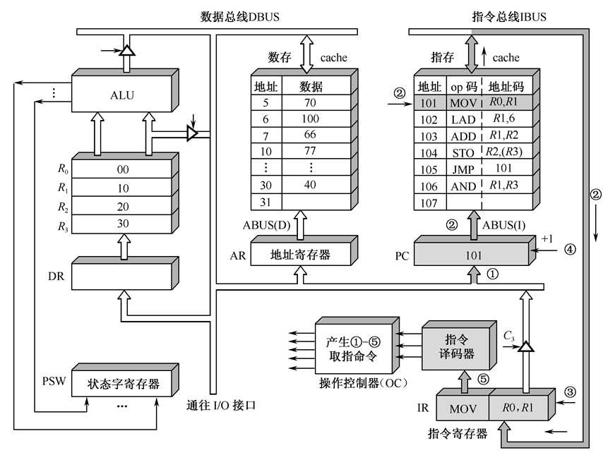](http://fangkaipeng.com/wp-content/uploads/2021/04/wp_editor_md_3cd4b141cbcc1f786a9d319d51b5729f.jpg)

1. 在PC中获取指令地址。

2. 指存中找到对应的指令，沿着指令总线IBUS传送到指令寄存器。

3. 将指令存入指令寄存器IR。

4. 程序计数器PC+1，指向下一条指令。

5. 指令寄存器将指令送到指令译码器进行译码。

    **相当于将该指令写入指令寄存器IR中的一次**

### 2\. 执行周期

[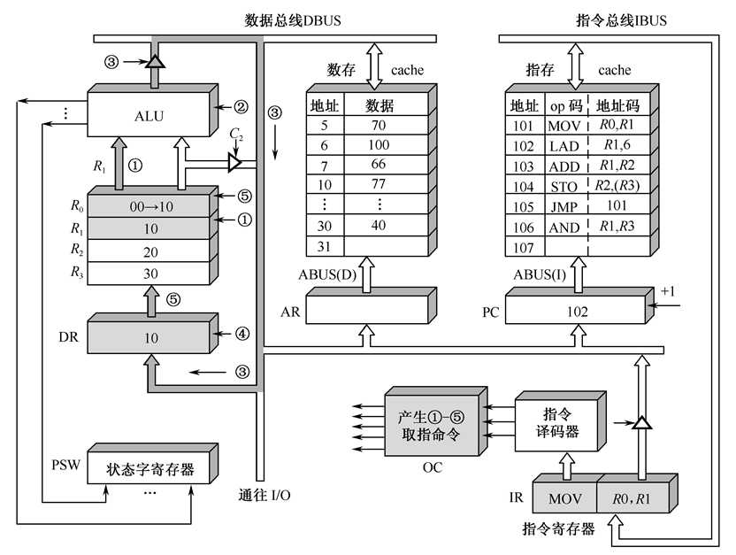](http://fangkaipeng.com/wp-content/uploads/2021/04/wp_editor_md_d74ba97ac6b45061a35e14d13466cd89.jpg)

1. 操作控制器产生1-5的指令，首先在对应寄存器中取出R1的值，放入ALU运算器。

2. 经过ALU运算，由于是MOV转移指令，无需处理。

3. ALU输出结果，进入数据总线。

4. 数据总线中的数据存入数据寄存器DR。

5. 将寄存器R0的数据修改。

    **相当于将数据总线中的数据写入数据寄存器DR中的一次**

## 5.2.3 LAD指令的指令周期

分为取值周期和执行周期，但是由于是RS型，执行周期需要两个CPU周期，第一个CPU周期先将操作数的地址送如地址寄存器，第二个CPU周期则进行执行。

取值周期和MOV指令相同，下面看执行周期：

[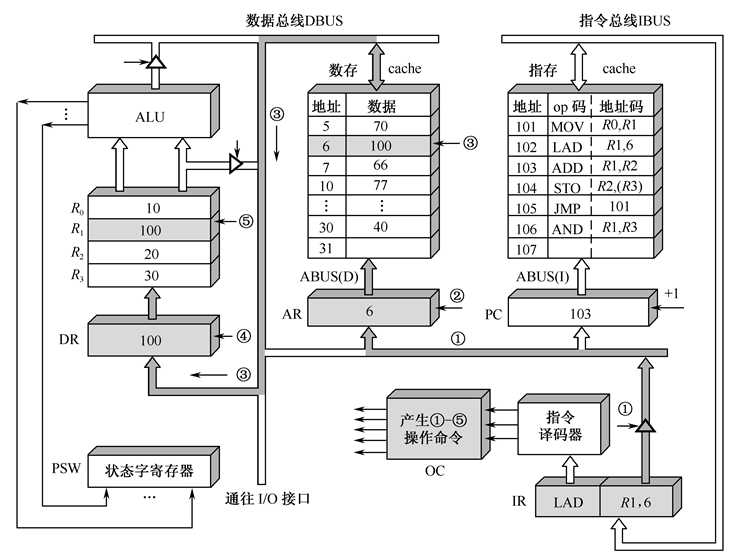](http://fangkaipeng.com/wp-content/uploads/2021/04/wp_editor_md_d61c76c70a0f0d4f3c0d7465cd5142ff.jpg)

1. 图中指令寻址为直接寻址，先将有效地址放入数据总线。

2. 通过数据总线，有效地址存入地址寄存器，到此需要一次CPU周期。

3. 找到内存中对应的数据，将数据放入数据总线。

4. 数据存入数据寄存器。

5. 修改R1的数据。

    **第一个周期：将有效地址写入地址寄存器中**

    **第二个周期：将数据写入数据寄存器中**

## 5.2.4 ADD指令的指令周期

取值周期和MOV的差不多，不在重复，看一下指令执行周期：

[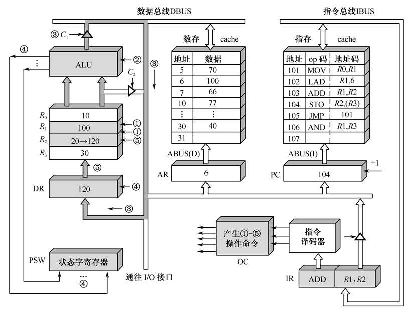](http://fangkaipeng.com/wp-content/uploads/2021/04/wp_editor_md_a7dddbda6de311964797634022fe17cb.jpg)

1. 分别取出R1和R2的数据，放入ALU。

2. 经过R1和R2的数据经过ALU运算。

3. ALU的数据进入数据总线。

4. 数据存入数据寄存器，同时修改状态字寄存器。

5. 将数据存入R2。

    **将数据写入数据寄存器一次**

## 5.2.5 STO指令的指令周期

STO属于RS型指令，同样需要3个CPU周期  
指令执行周期如下：  
[](http://fangkaipeng.com/wp-content/uploads/2021/04/wp_editor_md_1628069c27a1b31c7cef848eb469e7c6.jpg)

[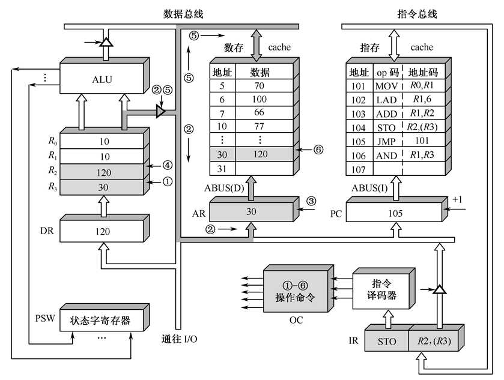](http://fangkaipeng.com/wp-content/uploads/2021/04/wp_editor_md_1628069c27a1b31c7cef848eb469e7c6.jpg)

1. 找到R3中的数据，该数据是第二操作数的有效地址。

2. 将R3的数据放入数据总线。

3. R3数据存入地址寄存器。

4. 取出R4中的数据。

5. R4数据存入数据总线。

6. 根据地址寄存器的地址，修改地址为30的数据。

    **第一次：将地址写入地址寄存器**

    **第二次：将R4数据写入其目标位置**

## 5.2.6 JMP指令的指令周期

[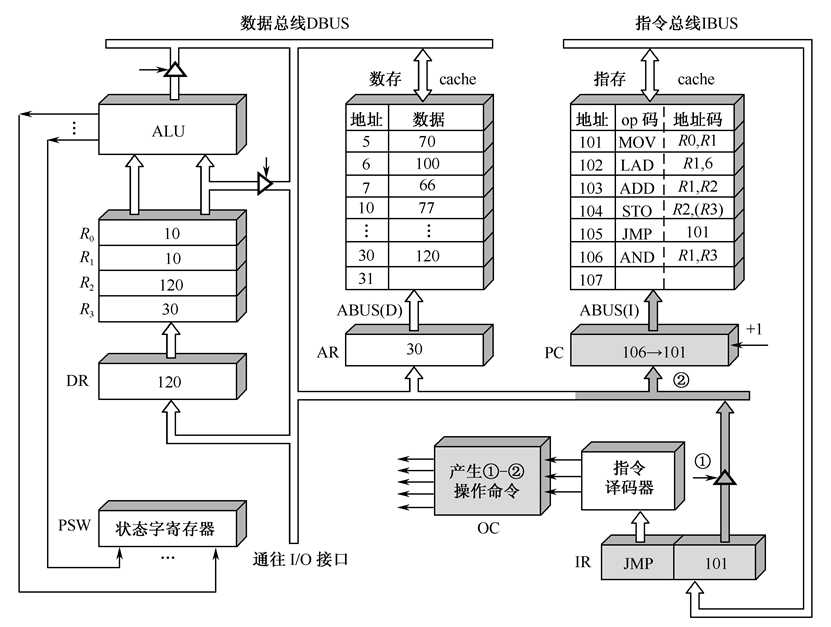](http://fangkaipeng.com/wp-content/uploads/2021/04/wp_editor_md_60f8f52a6da92fc061f0211283ee60f0.jpg)

1. 操作数进入数据总线。
2. 将PC的数据改为总线中的数据即101，表示下一次执行101指令。

## 5.2.7用方框图语言表示的指令周期

- 方框：按CPU周期（方框内内容——数据通路操作或控制操作）
- 菱形框：判别或测试
- 流线：表示指令的运行顺序
- ~：公操作

如下图为例：  
第一个方框为取值周期，需要一个CPU周期。菱形框译码，判别是下面五个指令中的哪个。其中LAD和STO指令为RS型指令，需要两个CPU周期进行执行。  
[](http://fangkaipeng.com/wp-content/uploads/2021/04/wp_editor_md_6251b4d2ab00c7fbafec3aa93c7e6705.jpg)

[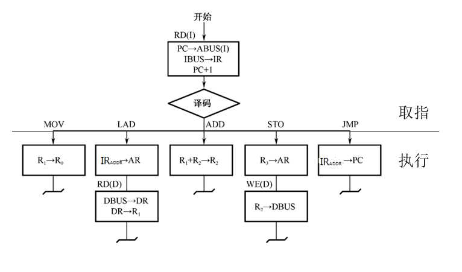](http://fangkaipeng.com/wp-content/uploads/2021/04/wp_editor_md_6251b4d2ab00c7fbafec3aa93c7e6705.jpg)

**双总线结构机器的数据通路图：**  
[](http://fangkaipeng.com/wp-content/uploads/2021/04/wp_editor_md_04deae00fcd3ad0c243625ef8192c8c8.jpg)

[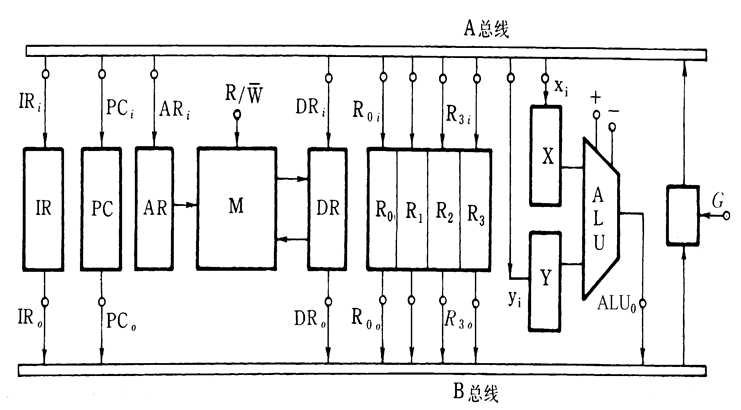](http://fangkaipeng.com/wp-content/uploads/2021/04/wp_editor_md_04deae00fcd3ad0c243625ef8192c8c8.jpg)


有A、B总线，通过微操作信号（如 PCi,IRi,IR0 等），中间的部件与总线相连形成数据通路，微操作信号为高电平表示该部件与对应总线相连（如IRi为1表示IR部件和A总线互通），最右边的G的电平为1表示AB总线相连。

指令执行过程的微操作信号（每个方框右边）如下：  
[](http://fangkaipeng.com/wp-content/uploads/2021/04/wp_editor_md_e242a85bfeae3f0da5963383d17a673d.jpg)

[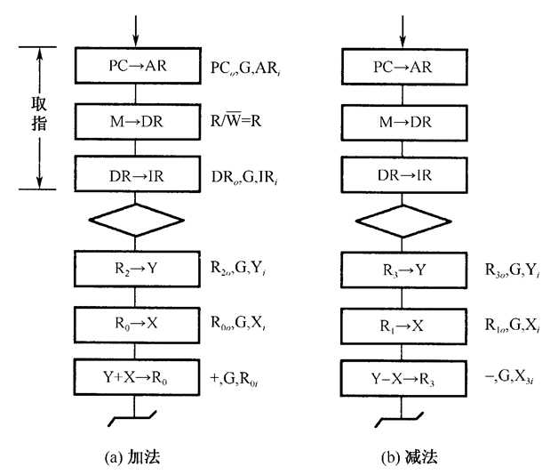](http://fangkaipeng.com/wp-content/uploads/2021/04/wp_editor_md_e242a85bfeae3f0da5963383d17a673d.jpg)

# 5.3 时序产生器和控制方式

## 5.3.1 时序产生器作用和体制

### 1\. 作用

- CPU中的控制器用它指挥机器的工作
- CPU可以用CPU周期信息来辨认从内存中取出的是指令（取指）还是数据（执行）
- 一个CPU周期中时钟脉冲对CPU的动作有严格的约束
- 操作控制器发出的各种控制信号是时间（时序信号）和空间（部件操作信号）的函数。

### 2\. 体制

组成计算机硬件的器件特性决定了时序信号的基本体制是 **电位—脉冲制**（以触发器为例）

**电位—脉冲制**：数据转化为电位信号加在触发器的电位输入端（触发器通过输入端向寄存器存入数据），打入的控制信号转为为脉冲信号加在触发器的时钟输入端，数据转化为电位信号必须在控制信号转化为脉冲信号之前转化完成，否则电位信号不稳定，输入出错。对于ALU来说，不需要控制信号，其本身是由硬件单独专门设计的，进相加一个操作。

- 硬布线控制器，采用主状态周期—节拍电位—节拍脉冲三级体制,时序信号产生电路复杂。
- 微程序控制器，采用节拍电位—节拍脉冲二级体制，利用微程序顺序执行来实现微操作，时序信号产生电路简单。

## 5.3.2 时序信号产生器（简单了解）

**功能：** 产生时序信号，各型计算机产生时序电路不相同，大、中型计算机的时序电路复杂，微型计算机的时序电路简单。  
**构成：** 时钟源、环形脉冲发生器、节拍脉冲和读写时序译码逻辑、启停控制逻辑。

### 1\. 时钟脉冲源

时钟脉冲源用来为环形脉冲发生器提供稳定且电平匹配的方波时钟信号。它通常用石英晶体振荡器和与非门组成的正反馈震荡电路组成。其输出送至环形脉 冲发生器。

[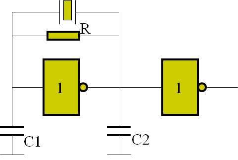](http://fangkaipeng.com/wp-content/uploads/2021/05/wp_editor_md_6f9a5be8cc7fe28c1fa29b52a2f795cb.jpg)

### 2\. 环形脉冲发生器

作用：产生一组有序间隔相等或不等的脉冲序列，以便通过译码电路来产生最后所需要的节拍脉冲。  
毛刺产生原因：电路内部原因以及寄存器参数的影响，避免方法：采用循环移位寄存器  
电路分析：S为置位端，R为复位端

[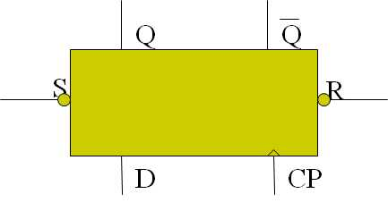](http://fangkaipeng.com/wp-content/uploads/2021/05/wp_editor_md_f8240b16a822a1ead31e54d529af68f9.jpg)

### 3\. 节拍脉冲和读/写时序的编码

节拍脉冲的译码逻辑（一个CPU周期包含4个等间隔的节拍脉冲）

### 4\. 启停控制逻辑

- 启动、停机是随机的，对读/写时序信号也需要由启停逻辑加以控制。
- 当运行触发器为“1”时，打开时序电路。当计算机启动时，一定要从第1个节拍脉冲前沿开始工作。
- 当运行触发器“0”时，关闭时序产生器。停机时一定要在第4个节拍脉冲结束后关闭时序产生器。

[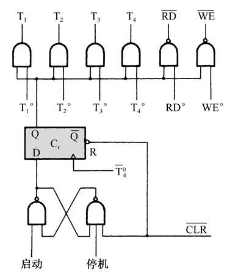](http://fangkaipeng.com/wp-content/uploads/2021/05/wp_editor_md_64f41f96076646e9706138f2c04289fa.jpg)

## 5.3.3 控制方式

机器指令所包含的CPU周期数反映了指令的复杂程度，不同CPU周期出现的操作控制信号的数目和出现的先后次序也不相同。

**控制方式：** 控制不同操作序列时序信号的方法。

**分类：**

- 同步控制方式：在任何情况下，已定的指令在执行时所需的机器周期数和时钟周期数都是固定不变的

    （1）采用完全统一的机器周期执行各种不同的指令。这意味着所有指令周期具有相同的 节拍电位数和相同的节拍脉冲数。显然，对简单指令和简单的操作来说，将造成时间浪费。

     (2)采用不定长机器周期。将大多数操作安排在一个较短的机器周期内完成，对某些时 间紧张的操作，则采取延长机器周期的办法来解决。

    (3)中央控制与局部控制结合。将大部分指令安排在固定的机器周期完成，称为中央控 制，对少数复杂指令(乘、除、浮点运算)采用另外的时序进行定时，称为局部控制。

- 异步控制方式：每条指令、每个操作信号需要多长时间就占多长时间

    - 可以是当控制器发出某 一操作控制信号后，等待执行部件完成操作后发回“回答”信号，再开始新的操作。显然， 用这种方式形成的操作控制序列没有固定的 CPU 周期数(节拍电位)或严格的时钟周期(节 拍脉冲)与之同步。 

- 联合控制方式：大部分指令采用同步控制方式完成，少数难以确定的操作采用异步方式，机器周期的节拍脉冲固定，但是各指令的机器周期数不固定（微程序控制器采用）。

# 5.4 微程序控制器

基本思想：仿照解题的方法，把操作控制信号编制成微指令，存放到CPU中的控制存储器里，运行时，从控存中取出微指令，产生指令运行过程中所需的各种操作控制信号。从上述可以看出，微程序设计技术是用软件方法来设计硬件的技术。

## 5.4.1微程序控制原理

组成计算机的部件可以分为两大类：控制部件和执行部件。

### 1\. 微命令

控制部件向执行部件发出的各种控制命令叫作微命令，它是构成控制序列的最小单位。

例如：打开或关闭某个控制门的电位信号、某个寄存器的打入脉冲等。  
微命令是控制计算机各部件完成某个基本微操作的命令。

### 2\. 微操作

执行部件收到微命令后执行的操作。

微命令和微操作是一一对应的。  
微命令是微操作的控制信号，微操作是微命令的操作过程。  
微操作是执行部件中最基本的操作。

**分类：**  
互斥性的微操作，是指不能同时或不能在同一个CPU周期内可以并行执行的微操作。可以编码实现（类似状态压缩二进制表示）  
相容性的微操作，是指能够同时或在同一个CPU周期内并行执行的微操作。必须各占一位。


### 3\. 微指令

把在同一个**CPU周期**内一组实现一定操作功能的微命令的组合叫做一条微指令（Microinstruction）。 它是并行执行的微操作控制信息，存储在控制存储器里。==由微命令组成==，微指令存储在控制器中的控制存储器中。  
一条微指令通常至少包含两大部分信息：

- 操作控制字段，又称微操作码字段，用以产生某一步操作（CPU周期）所需的各个微操作控制信号。  
    某位为1，表明发微命令，微指令发出的控制信号都是节拍电位信号，持续时间为一个CPU周期，微命令信号还要引入时间控制。
- 顺序控制字段，又称微地址码字段，用以控制产生下一条要执行的微指令地址。
- 其一般持续一个CPU周期

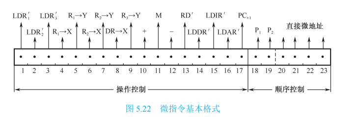

图中的微指令由17位操作控制字段和6位顺序控制字段组成，每一位表示一个微命令，当某位上为1表示发出该命令，如第十位为1，表示向ALU发出“+”的微命令，ALU执行“+”的微操作。微指令给出的控制信号都是节拍电位信号，它们的持续时间都是一个CPU周期。

操作控制前三位123，分别表示向寄存器R1 R2 R3中存入结果数据，其在一个CPU周期内，只能在运算结束后进行执行，因此可将其延迟，将其在CPU指令的第四个阶段执行，即将其分别与T~4~进行相与。

微指令顺序控制字段的后四位给出下一条微指令地址，19,19位为判别位，当两位都为0时直接将控制字段的后四位作为下一条微指令地址，


若P~1~=1 P~2~=0，其判别字段中P~1~为1，即表明是P~1~测试，P~1~的状态测试条件为指令寄存器中的操作码字段，即其进行跳转，其直接微地址为本次结果读出的地址，eg：本次操作读出了一个指令地址并将其存入IR，同时指令寄存器OP的值也为该地址，则此时其直接微地址也为该指令地址，在进行下一个指令时，按照该直接微地址读出下一条指令；


若P~1~=0 P~2~=1，其判别字段中P~2~为1，即表明是P~2~测试，P~2~的状态测试条件为进位标志C~y~（产生进位为1），其也进行跳转，其直接微地址根据进位标志得出，一般规定，在进行下一个指令时，按照该直接微地址读出下一条指令；eg：

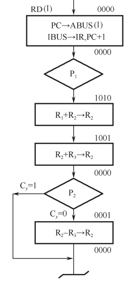

根据本次，可以看到产生进位跳转到0000，即C~y~=1，此时其微直接地址为0000未产生进位，即C~y~=0，则此时修改为0001。其是否进位与是否修改其微直接地址无关，其若P~2~=1，则其微地址进与C~y~有关，而与之前的微直接地址无关。

### 4\. 微程序

实现一条机器指令功能的一系列微指令的有序集合就是微程序，一段微程序对应一条机器指令。  
**微地址：** 存放微指令的控制存储器的单元地址

### 5.微程序控制器原理框图

[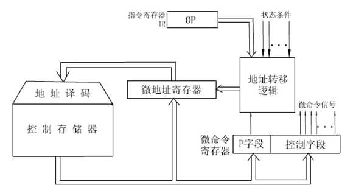](http://fangkaipeng.com/wp-content/uploads/2021/05/wp_editor_md_1681b849389ed5724ebadecd39c2157b.jpg)

- 控制存储器(CM)  
    这是微程序控制器的核心部件，用来存放微程序，最小单位是微指令。当机器开始执行后，其固化，不再改变只读不写。
    
    ​	其性能(包括容量、速度、可靠性等)与计算机的性能密切相关。
    
    ​	控制存储器字长就是微指令字的长度，其存储容量由机器指令系统而定，即取决于微程序的数量
    
- 微指令寄存器(μIR) 用来存放从CM取出的正在执行的微指令的信息
  
    - 微地址寄存器(μMAR)：决定将要访问的下一条微指令的地址
    - 微命令寄存器（它是 构成μIR的一部分）：保存一条微指令的操作控制字段和判别测试字段的信息
    
- 地址转移逻辑（微地址形成部件）  
    用来产生初始微地址和后继微地址，以保证微指令的连续执行。一般情况下，微指令由控存读出后就直接给出了下一条微指令的所在地址；当微程序发生转移时，需要通过判别测试字段P和执行部件的“状态条件”反馈信息，来修改微地址寄存器的内容来形成。

### 6\. CPU周期和微指令周期的关系

为了保证整个机器控制信号的同步和设计的简易性，通常将一个微指令周期设计的恰好和CPU周期时间相等。

[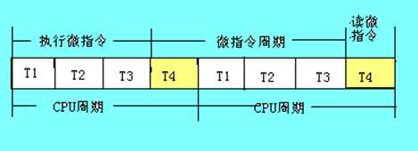](http://fangkaipeng.com/wp-content/uploads/2021/05/wp_editor_md_9d823830e927eeec50ca9c158b252188.jpg)

### 7.机器指令和微指令的关系

(1)一条机器指令对应着一段微程序  
(2)对应的硬件设备不同。前者与内存储器有关，后者与控制存储器有关。  
(3)每个CPU周期就是一条微指令

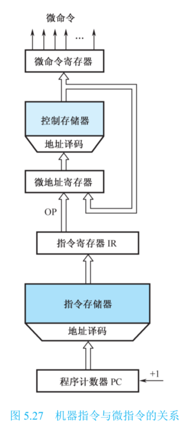

## 5.4.2微程序设计技术

设计微指令应当追求的目标：

- 有利于缩短微指令的长度
- 有利于缩小CM的容量
- 有利于提高微程序的执行速度
- 有利于对微指令的修改
- 有利于提高微程序设计的灵活性

### 1.微命令的编码方法

- 直接表示法：操作控制字段中的每一位分别可以直接控制计算机（0,1），不需要进行译码。
    - 优点：结构简单，并行性强，操作速度快，输出直接用于控制。
    - 缺点：微指令字太长，使得控制存储器容量较大。许多微命令是互斥的，不允许并行操作，将它们安排在一条微指令中是毫无意义的，只会使信息的利用率下降。  
        [
        
        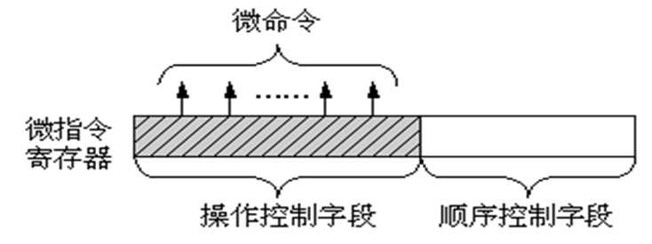
        
        ](http://fangkaipeng.com/wp-content/uploads/2021/05/wp_editor_md_73a0208d93347dcd3fae4ba0f088f4c9.jpg)
- 编码表示法：将操作控制字段分为若干个小段，每段内采用最短编码法，段与段之间采用直接控制法。
    - 优点：可用较小的二进制信息位表示较多的微命令信号，使微指令字大大缩短。
    - 缺点：增加译码电路，执行速度稍稍减慢。  
        [
        
        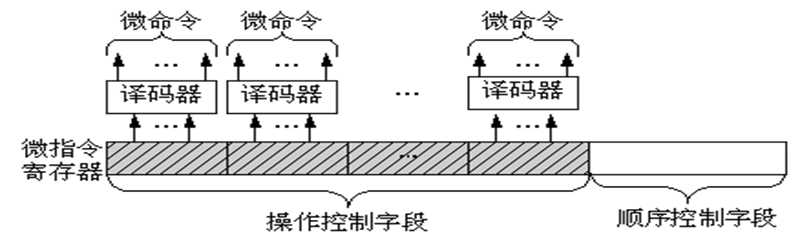
        
        ](http://fangkaipeng.com/wp-content/uploads/2021/05/wp_editor_md_a1690d698cf2e42576191d92f1fb4fbe.jpg)
- 混合编码法：将前两种结合在一起，兼顾两者特点。一个字段的某些编码采用直接控制法；而另一些采用最短编码法。

### 2\. 微指令地址的形成

入口地址：每条机器指令对应一段微程序，当公用的取指微程序从主存中取出机器指令之后，由机器指令的操作码字段指出各段微程序的入口地址，这是一种多分支(或多路转移)的情况。  
后继微地址的产生方式主要有两种：

- 计数器方式 （增量方式）
- 多路转移方式 （断定方式）

**入口地址形成：** 如果机器指令操作码字段的位数和位置固定，可以直接使用操作码与微程序入口地址的部分位相对应。  
**后继微地址形成方法：**

- 计数器方式
    - 方法： 微程序顺序执行时，其后继微地址就是现行微地址加上一个增量(通常为1)；当微程序遇到转移或转子程序时，由微指令的转移地址段来形成后继微地址。
    - 优点是简单、易于掌握，编制微程序容易
    - 缺点是这种方式不能实现两路以上的并行微程序转移，因而不利于提高微程序的执行速度。
- 多路转移的方式：根据条件转移，如状态条件/测试/操作码。在多路转移中，微程序不产生分支则后继微地址直接由微指令的顺序控制字段给出；当出现分支时，有若干个“候选”的微指令，根据条件选择其一。

**例题：**  
微地址寄存器有6位(μA5-μA0)，当需要修改其内容时，可通过某一位触发器的强置端S将其置“1”。现有三种情况：  
(1)执行“取指”微指令后，微程序按IR的OP字段(IR3-IR0)进行16路分支；  
(2)执行条件转移指令微程序时，按进位标志C的状态进行2路分支；  
(3)执行控制台指令微程序时，按IR4，IR5的状态进行4路分支。  
请按多路转移方法设计微地址转移逻辑。  
**解：**  
按所给设计条件，微程序有三种判别测试，分别为P1，P2，P3。 由于修改μA5-μA0内容具有很大灵活性，现分配如下：  
(1)用P1和IR3-IR0修改μA3-μA0；  
(2)用P2和C修改μA0；  
(3)用P3和IR5，IR4修改μA5，μA4。  
另外还要考虑时间因素T4(假设CPU周期最后一个节拍脉冲)，故转移逻辑表达式如下：

```cpp
μA5=P3·IR5·T4μA4=P3·IR4·T4μA3=P1·IR3·T4μA2=P1·IR2·T4μA1=P1·IR1·T4μA0=P1·IR0·T4+P2·C·T4
```

由于从触发器强置端修改，故前5个表达式可用“与非”门实现，最后一个用“与或非”门实现。  
下图仅画出了μA2、μA1、μA0触发器的微地址转移逻辑图。  
[](http://fangkaipeng.com/wp-content/uploads/2021/05/wp_editor_md_5989e9cb5a4124a2b82f1af92a0bb1ff.jpg)

[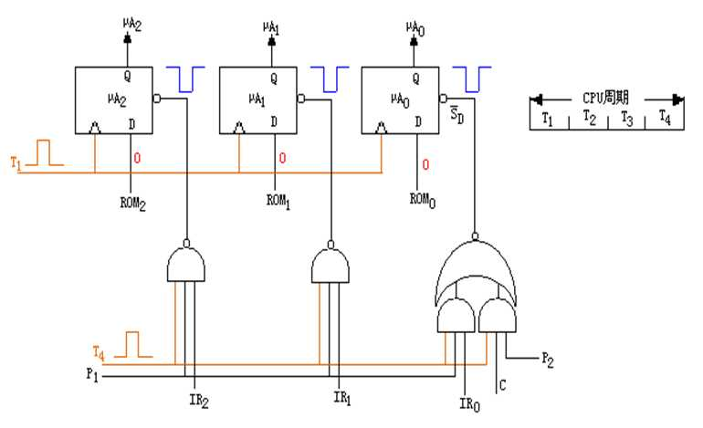](http://fangkaipeng.com/wp-content/uploads/2021/05/wp_editor_md_5989e9cb5a4124a2b82f1af92a0bb1ff.jpg)

### 3\. 微指令格式

**水平型微指令：**  
水平型微指令是指一次能定义并能并行执行多个微命令的微指令。  
[](http://fangkaipeng.com/wp-content/uploads/2021/05/wp_editor_md_ddf0588cac863d9f8eb24c1020eda902.jpg)

[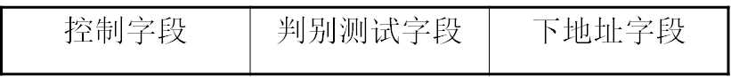](http://fangkaipeng.com/wp-content/uploads/2021/05/wp_editor_md_ddf0588cac863d9f8eb24c1020eda902.jpg)


它具体又分为三种：全水平型，字段译码法水平型，混合型

- 优点：  
    微指令字较长，速度较快。执行的微操作有高度的并行性。微指令译码简单。控制存储器的纵向容量小，灵活性强。
- 缺点：  
    微指令字比较长，明显地增加了控制存储器的横向容量。水平微指令与机器指令差别很大，一般要熟悉机器结构、数据通路、时序系统以及指令执行过程的人才能进行微程序设计，这对用户来说是很困难的。

**垂直型微指令：采用编码方式**

设置微操作控制字段时，一次只能执行一个微命令的微指令称为垂直型微指令。  
[](http://fangkaipeng.com/wp-content/uploads/2021/05/wp_editor_md_40ac160bf1565b4eecd78a734fd8f6ad.jpg)

[](http://fangkaipeng.com/wp-content/uploads/2021/05/wp_editor_md_40ac160bf1565b4eecd78a734fd8f6ad.jpg)

垂直型微指令的特点：  
微指令字短，一般为10～20位左右。  
微指令的并行微操作能力有限，一条微指令一般只包含一个微操作命令。  
微指令译码比较复杂。全部微命令用一个微操作控制字段进行编码，微指令执行时需进行完全译码。  
设计用户只需注意微指令的功能，而对微命令及其选择、数据通路的结构则不用过多地考虑，因此，便于用户编制微程序。而且，编制的微程序规整、直观，便于实现设计的自动化。  
垂直微指令字较短，使控制存储器的横向容量少。  
用垂直微指令编制微程序要使用较多的微指令，微程序较长；要求控制存储器的纵向容量大。垂直微指令产生微命令要经过译码，微程序执行速度慢。  
不能充分利用数据通路具有的多种并行操作能力

### 4\. 动态微程序设计

- 对应于一台计算机的机器指令只有一组微程序，这一组微程序设计好之后，一般无须改变而且也不好改变，这种微程序设计技术称为静态微程序设计。
- 采用EPROM或者Flash存贮器作为控制存储器，可以通过改变微指令和微程序来改变机器的指令系统，这种微程序设计技术称为动态微程序设计。

# 5.5 硬布线控制器

## 5.5.1 实现方法

通过逻辑电路直接连线而产生的，又称为组合逻辑控制方式

## 5.5.2设计目标

使用最少元件（复杂的树形网络），速度最快，其内部复杂，不易调试。

## 5.5.3 逻辑原理

### 1\. 逻辑原理图

[](http://fangkaipeng.com/wp-content/uploads/2021/05/wp_editor_md_f0b6716d9232379376cf319d39978c07.jpg)

**C\=f(Im,Mi,Tk,Bj) **

Im 为译码器输出

Mi为节拍电位，一般为机器周期（CPU）信号

Tk为节拍脉冲，一般为时钟周期信号

Bj为状态条件

C 为微操作控制信号，由组合电路实现，速度快，但难以修改。

### 2\. 指令的执行流程

微程序控制器时序信号简单。只需要若干节拍脉冲信号即可。  
组合逻辑控制器除了节拍脉冲信号外，还需要节拍电位信号。

### 3\. 微操作控制信号产生

在微程序控制器中，微操作控制信号由微指令产生，并且可以重复使用。  
在硬联线控制器中，某一微操作控制信号由布尔代数表达式描述的输出函数产生。C\=f(Im,Mi,Tk,Bj)  
设计微操作控制信号的方法和过程是，根据所有机器指令流程图，寻找出产生同一个微操作信号的所有条件，并与适当的节拍电位和节拍脉冲组合，从而写出其布尔代数表达式并进行简化，然后用门电路或可编程器件来实现。

### 4.硬布线与微程序控制

硬布线速度较快，取决于电路延迟

原因：微程序控制中每条微指令都要从控存中读取一次，影响了速度，而硬布线控制主要取决于电路延迟。

因此在某些超高速 新型计算机结构中，又选用了硬布线控制器，或与微程序控制器混合使用。


## 5.5.4设计步骤

### 1\. 画出指令流程图

### 2\. 列出微操作时间表

将指令流程图中的微操作合理地安排到各个机器周期的相应节拍和脉冲中去；  
微操作时间表形象地表明：什么时间、根据什么条件发出哪些微操作信号。

### 3\. 进行微操作信号的综合

当列出所有指令的微操作时间表之后，需要对它们进行综合分析，把凡是要执行某一微操作的所有条件(哪条指令、哪个机器周期、哪个节拍和脉冲等)都考虑在内，加以分类组合，列出各微操作产生的逻辑表达式，然后加以简化，使逻辑表达式更为合理。

### 4\. 电路实现

根据整理并化简的逻辑表达式组，可以用一系列组合逻辑电路加以实现，根据逻辑表达式画出逻辑电路图，用逻辑门电路的组合来实现之，也可以直接根据逻辑表达式，用PLA或其他逻辑电路实现。

[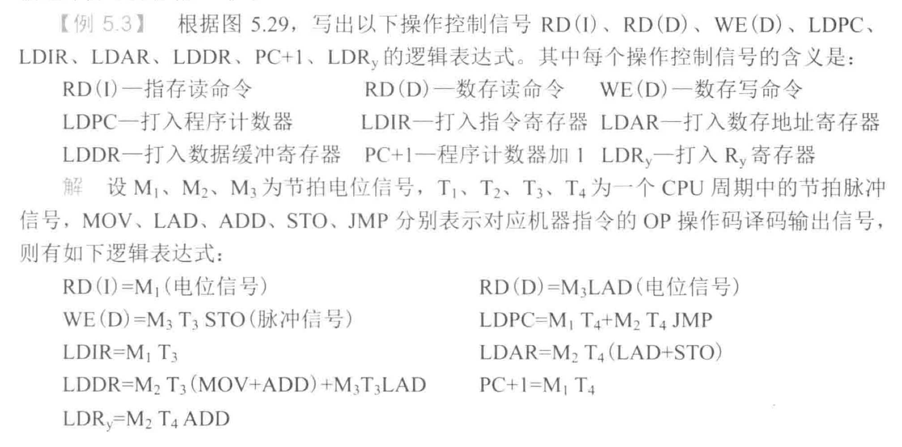](http://fangkaipeng.com/wp-content/uploads/2021/05/wp_editor_md_237d176303547c98978ede0bae460b7a.jpg)

# 5.6 流水CPU

### 5.61 并行处理技术

1. 并行性

    1. 同时性，指两个以上事件在同一时刻发生（开始）
    2. 并发性，指两个以上事件在同一时间间隔内发生（完成）

2. 三种形式

    1. 时间并行 ：指时间重叠，时间错开，轮流使用同一部件；时间并行性概念的实现方式就是采用流水处理部件。这是一种非常经济而实用的并行 技术，能保证计算机系统具有较高的性能价格比。
    2. 空间并行：资源重复，再增加多套部件，可在同一时间内使用同种部件的不同套。以“数量取胜”为原则来大 幅度提高计算机的处理速度。空间并行技术主要体现在多处 理器系统和多计算机系统。但是在单处理器系统中也得到了广泛应用
    3. 时间并行+空间并行：时间重叠和资源重复的综合应用，既采用时间并行性又采用空 间并行性。超标量流水技术，在一个机器周期中同时执行两条指令， 因而既具有时间并行性，又具有空间并行性。显然，第三种并行技术带来的高速效益是最好的。

    ### 5.6.2 流水 CPU 的结构

    1. 流水计算机的系统组成
        1. 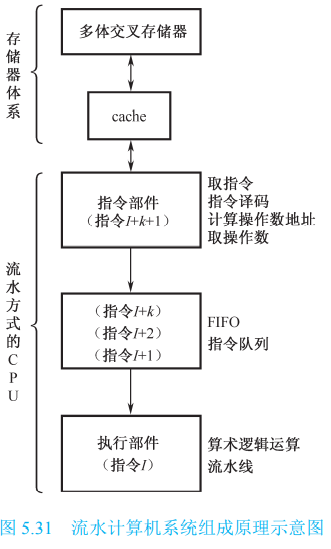
        2. CPU 按流水线方式组织，通常由三大部分 组成：指令部件、指令队列、执行部件。这三个功能 部件可以组成一个 3 级流水线（同一时间可以使用每一级部件）
        3. 程序和数据存储在主存中，主存通常采用多体交叉存储器（多级存储器一起使用，如寄存器，cache，内存），以提高访问速度。cache 是一个高速缓冲 存储器，用以弥补主存和 CPU 速度上的差异
        4. 指令部件：指令部件本身又构成一个流水线，即指令流水 线，它由取指令、指令译码、计算操作数地址、取操 作数等几个过程段组成。
        5. 指令队列：指令队列是一个先进先出(FIFO)的寄存器栈， 用于存放经过译码的指令和取来的操作数。它也是由 若干个过程段组成的流水线
        6. 执行部件：执行部件可以具有多个算术逻辑运算部件，这些 部件本身又用流水线方式构成；
            1. 执行部件流水：①将执行部件分为定点执行部件和浮点执行部件两个可并行执行的 部分，分别处理定点运算指令和浮点运算指令；②在浮点执行部件中，又有浮点加法部件 和浮点乘/除部件，它们也可以同时执行不同的指令；③浮点运算部件都以流水线方式工作。
        7. eg：当执行部件正在执行第 I 条指令时， 指令队列中存放着 I+1, I+2, …, I+k 条指令，而与此 同时，指令部件正在取第 I+k+1 条指令。
    2. 流水 CPU 的时空图
        1. 为了实现流水，首先把输入 的任务(或过程)分割为一系列子任务，并使各子任务能在流水线的各个阶段并发地执行。 当任务连续不断地输入流水线时，在流水线的输出端便连续不断地吐出执行结果，从而实 现了子任务级的并行性
        2. 假设指令周期包含四个子过程：取指令(IF)、指令 译码(ID)、执行运算(EX)、结果写回(WB)，每 个子过程称为过程段(Si)，这样，一个流水线由 一系列串联的过程段组成。各个过程段之间设有 高速缓冲寄存器，以暂时保存上一过程段子任务 处理的结果。在统一的时钟信号控制下，数据从 一个过程段流向相邻的过程段。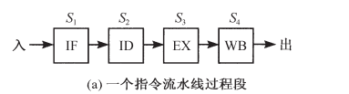
        3. 流水、超标量流水与非流水区别
            1. 非流水：对非 流水计算机来说，上一条指令的四个子过程全部 执行完毕后才能开始下一条指令。因此，每隔 4 个机器时钟周期才有一个输出结果。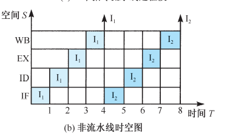
            2. 流水：上一条指令与下一条指令的四个子 过程在时间上可以重叠执行。因此，当流水线满 载时，每一个时钟周期就可以输出一个结果。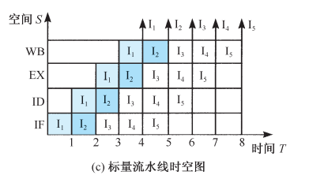
            3. 超标量流水： 一般的流水计算机因只有一条指令流水线，所以 称为标量流水计算机。所谓超标量流水，是指它 具有两条以上的指令流水线
    3. 流水线分类：一个计算机系统可以在不同的并行等级上采用流水线技术
        1. 指令流水线 ：指指令步骤的并行。将指令流的处理过程划分为取指令、译码、取操作 数、执行、写回等几个并行处理的过程段。
        2. 算术流水线 ：指运算操作步骤的并行。如流水加法器、流水乘法器、流水除法器等
        3. 处理机流水线 ：又称为宏流水线，是指程序步骤的并行；由一串级联的处理机构成流 水线的各个过程段，每台处理机负责某一特定的任务。

    ### 5.63流水线中的主要问题

    要使流水线具有良好的性能，必须使流水线畅通流动，不发生断流。但由于流水过程 中会出现以下三种相关冲突，实现流水线的不断流是困难的，这三种相关是资源相关、数 据相关和控制相关。

    1. 资源相关，是指多条指令进入流水线后在同一机器时钟周期内争用同一个功能部 件所发生的冲突。（同一时间使用同一部件引发的冲突）
    2. 数据相关：在一个程序中，如果必须等前一条指令执行完毕后，才能执行后一条指令，那么这两 条指令就是数据相关的。（后一条指令需要前一条指令的结果，这两条指令不能一起执行）
    3. 控制相关：由转移指令引起的。当执行转移指令时，依据转移条件的产生结果， 可能为顺序取下条指令；也可能转移到新的目标地址取指令，从而使流水线发生断流。（若发生转移，在该转移指令之后的指令进入流水线，其不需要执行，转移后，造成这些指令空间的浪费）。常用的解决方法：
        1. 延迟转移法 ：由编译程序重排指令序列来实现。基本思想是“先执行再转移”，即发生 转移取时并不排空指令流水线，而是让紧跟在转移指令 Ib 之后已进入流水线的少数几条指 令继续完成。如果这些指令是与 Ib 结果无关的有用指令，那么延迟损失时间片正好得到了 有效的利用。（让进入流水线的指令继续执行，防止其有用）
        2. 转移预测法 ：硬件方法来实现，依据指令过去的行为来预测将来的行为。通过使用转移取和顺序取两路指令预取队列器以及目标指令 cache，可将转移预测提前到取指阶段进 行，以获得良好的效果。（硬件依据过去行为提前预测）

# 5.7 RISC CPU

### 5.7.1 RISC 机器的特点

1. RISC三要素：

    1. 一个有限的简单的指令系统
    2. CPU 配备大量的通用寄存器；
    3. 强调对指令流水线的优化

2. RISC 的目标绝不是简单的缩减指令系统，而是使处理器的结构更简单，更合理，具有 更高的性能和执行效率，并降低处理器的开发成本

3. 特点：

    1. 使用等长指令，目前的典型长度是 4B。 

    2. 寻址方式少且简单，一般为二三种，最多不超过 4 种，绝不出现存储器间接寻址方式。 

    3. 只有取数指令、存数指令访问存储器。指令中最多出现 RS 型指令，绝不出现 SS 型指令。

    4.  指令系统中的指令数目一般少于 100 种，指令格式一般少于 4 种。

    5. 指令功能简单，控制器多采用硬布线方式，以期更快的执行速度。

    6.  平均而言，所有指令的执行时间为一个处理时钟周期。

    7.  指令格式中，用于指派整数寄存器的个数不少于 32 个，用于指派浮点数寄存器的 个数不少于 16 个。

    8. 强调通用寄存器资源的优化使用。

    9.  支持指令流水并强调指令流水的优化使用。

    10.  RISC 技术的复杂性在它的编译程序，因此软件系统开发时间比 CISC 机器长。

    11. 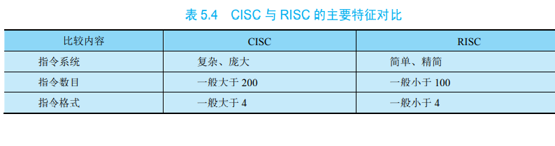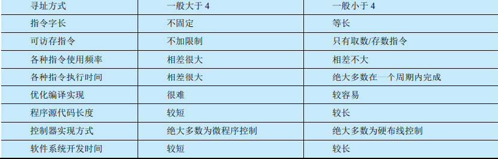

        ### 5.7.2 RISC CPU 实例

        1.  MC88110 CPU 结构框图
            1. 处理器有 12 个执行功能部件，三个 cache 和 一个控制部件。
            2. 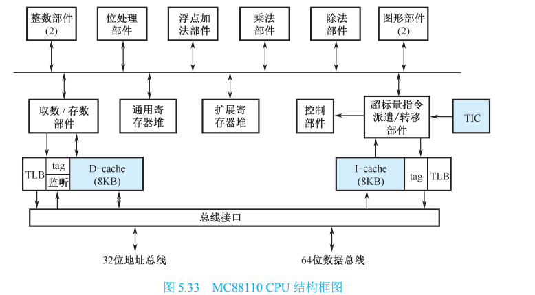
            3. 在三个 cache 中，一个是指令 cache，一个是数据 cache，它们能同时完成取指令和取数 据，还有一个是目标指令 cache(TIC)，它用于保存转移目标指令
            4. 两个寄存器堆：一个是通用寄存器堆，用于整数和地址指针，其中有 R0～R31共 32 个 寄存器(32 位长)；另一个是扩展寄存器堆，用于浮点数，其中有 X0～X31 共 32 个寄存器(长 度可以是 32 位、64 位或 80 位)
            5. 12 个执行功能部件是：取数/存数(读写)部件、整数运算部件(2 个)、浮点加法部件、乘法部件、除法部件、图形处理部件(2 个)、位处理部件、用于管理流水线的超标量指令派 遣/转移部件
            6. 这些 cache、寄存器堆、功能部件，在处理器中通过六条 80 位宽的内部总线相连 接。其中 2 条源 1 总线，2 条源 2 总线，2 条目标总线
        2.  MC88110 的指令流水线
            1. 由于 MC88110 是超标量流水 CPU，所以指令流水线在每个机器时钟周期完成两条 指令。流水线分为三段：取指和译码(F＆D)段、执行(EX)段、写回(WB)段
            2. 
            3. 。EX 段 执行的结果在 WB 段写回寄存器堆，WB 段只需时钟周期的一半。为了解决数据相关冲突， EX 段执行的结果一方面在 WB 段写回寄存器堆，另一方面经定向传送电路提前传送到 ALU，可直接被当前进入 EX 的指令所使用
        3. 指令动态调度策略
            1. 88110 采用按序发射、按序完成的指令动态调度策略。指令派遣单元总是发出一个地址， 然后从指令 cache 取出此地址及下一地址的两条指令（自动读取）；若第一条指令发生冲突，这一对都不执行；若第二个指令发生冲突，只发射第一条指令，第二条指令和下一轮指令一同执行，而下一轮仅取一个指令（而不是一对），前一对的后一条与下一轮的第一条一同执行；
            2. ==记分牌==方法：为了判定能否发射指令，寄存器堆中 每个寄存器都有一个位，用来表示记分牌的位向量。
                1. 工作流程：①每当一条指令发射时，它预约的目的寄存器在位向量中的相 应位上置“1”，表示该寄存器“忙”。当指令执行完毕并将结果写回此目的寄存器时，该位 被清除。②每当判定是否发射一条指令(STO 存数指令和转移指令除外)时，一个必须 满足的条件是：该指令的所有目的寄存器、源寄存器在位向量中的相应位都已被清除。否 则，指令必须停顿等待这些位被清除。
                2. 为了减少经常出现的数据相关，流水线采用了如前 面所述的定向传送技术，将前面指令执行的结果直接送给后面指令所需此源操作数的功能 部件，并同时将位向量中的相应位清除。因此，指令发射和定向传送是同时进行的。
                3. 实现按序完成：执行段有多个功能部件，很可能出现无序完成的情况。为此， 88110 提供了一个 FIFO 指令执行队列，称为历史缓冲器。每当一条指令发射出去，它的副 本就被送到 FIFO 队尾。队列最多能保存 12 条指令。只有前面的所有指令执行完，这条指 令才到达队首。当它到达队首并执行完毕后才离开队列。

        ### 5.7.3 动态流水线调度

        1. 动态流水线调度：是对指令进行重新排序以避免处理器阻塞的硬件支持。
        2. 通常流水线分为 3 个主要单元：一个取指令发射单元，多个 功能单元(10 个或更多)，一个指令完成单元。第一个单元用于取指令，将指令译码，并将 它们送到相应的功能单元执行
        3. 每个功能单元都有自己的缓冲器，称为保留站，它用于暂 存操作数和操作指令。当缓冲器中包含了所有的操作数，并且功能单元已经就绪，结果就 被计算出来。当完成结果时，它就被发送到等待特殊结果的储存站及指令完成单元。而指 令完成单元确定何时能够安全地将结果放入到寄存器堆或内存中
        4. 指令完成单元中的缓冲器通常称为重排序缓冲器，它也可以用来提供操作数，其工作 方式类似于旁路逻辑在静态调度流水线中的工作方式。一且结果写回寄存器堆，便可以从 寄存器堆中直接取得操作数，就像一般流水线取得操作数的方式一样
        5. 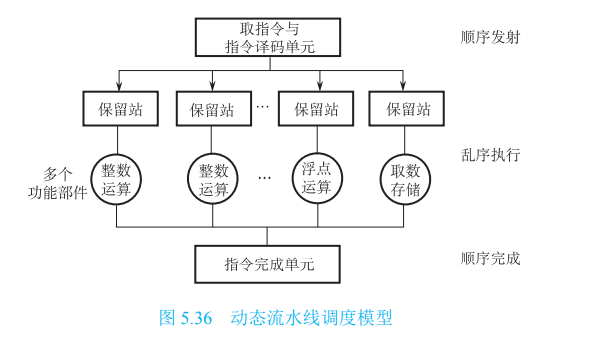