# 6.1 总线的概念和结构形态

## 6.1.1总线的基本概念

数字计算机是由若干个系统功能部件构成的，这些系统功能部件在一起工作才能形成一个完整的计算机系统。一种连接方式是将需要通信的部件两两相连。但是现代计算机的CPU可能有很多，I/O设备也各种各样，如果采用两两相连的方式，线路将会非常复杂，这是不现实的，故推出的总线的概念。

### 1. 定义

**总线定义：** 连接各个部件的信息传输线，是各个部件共享的传输介质，英文名为BUS，十分形象。

**总线是构成计算机系统的互联机构，是多个系统功能部件之间进行数据传送的公共通路。**借助于总线连接，计算机在各系统功能部件之间实现地址、数据和控制信息的交换，并在争用资源的基础上进行工作。在总线上传输方式有串行和并行两种，由于线路之间会相互干扰，所以传输距离短。

### 2. 分类

总线可分为以下几类（根据所在位置）：

- 内部总线：CPU内部连接各寄存器及运算器部件之间的总线，也叫**片内总线**。
- 系统总线：外部总线，CPU和计算机系统中其他高速功能部件如存储器、输入输出接口等相互连接的总线。又细分为：
    - 数据总线：双向（读和写），总线条数与机器字长、存储字长有关，但不一定相等。
    - 地址总线：单向（只读），条数与存储地址、I/O地址有关
    - 控制总线：传输控制信号，单向，但是有输出信号也有输入信号。
- IO总线（通信总线）：用于计算机系统之间或者计算机系统与其他系统之间的通信，按照传输方式分为：串行通信和并行通信总线。

### 3. 特性

总线的特性可分为：物理特性、功能特性、电气特性、时间特性。

- 物理特性：总线的物理连接方式（根数、插头、插座形状，引脚排列方式）
- 功能特性：每根线的功能（地址、数据、控制）
- 电气特性：每根线上信号的传递方向及有效电平范围。
- 时间特性：规定了每根总线在什么时间有效（时序关系）。

### 4. 总线的性能指标

1. 总线宽度 ：数据线的根数，最重要指标
2. 标准传输率 ：每秒传输的最大字节数（MBps）
3. 时钟同步/异步 ：同步、不同步
4. 总线复用： 地址线与数据线复用
5. 信号线数：地址线、数据线和控制线的总和
6. 总线控制方式：突发、自动、仲裁、逻辑、计数
7. 其他指标：负载能力

### 5. 标准总线

为了使不同厂家生产的相同功能部件可以互换使用，就需要进行系统总线的**标准化**工作。目前，已经出现了很多总线标准，如PCI、ISA等PC、STD、EISA。

采用标准总线的优点：

- 简化系统设计

    

- 简化系统结构，提高系统可靠性

- 便于系统的扩充和更新

### 6. 总线带宽

**总线带宽**：总线本身所能达到的**最高传输速率**。

一次操作可以传输的数据位数。如S100为8位，ISA为16位，EISA为32位，PCI-2可达64位。总线宽度不会超过微处理器外部数据总线的宽度。取决于一次操作所花费的时间，时间越短带宽越高。一次可传递的信息量越多，带宽越高。

**例题：**

（1）某总线在一个总线周期中并行传送4个字节的数据，假设一个总线周期等于一个总线时钟周期，总线时钟频率为33MHz，总线带宽是多少?

（2）如果一个总线周期中并行传送64位数据，总线时钟频率升为66MHz，总线带宽是多少?

解：

（1）设总线带宽用Dr表示，总线时钟周期用T=1/f表示，一个总线周期传送的数据量用D表示，根据定义可得

Dr=D/T=D∗(1/T)=D∗f=4B∗33∗106/s=132MB/s

（2）位64位=8B Dr=D∗f=8B∗66∗106/s=528MB/s

## **6.1.2**总线的连接方式

适配器（接口）：实现高速CPU与低速外设之间工作速度上的匹配和同步，并完成计算机和外设之间的所有数据传送和控制的电路。外设与CPU之间的接口

### 1. **单总线**：

使用一条单一的系统总线来连接CPU、内存和I/O设备。

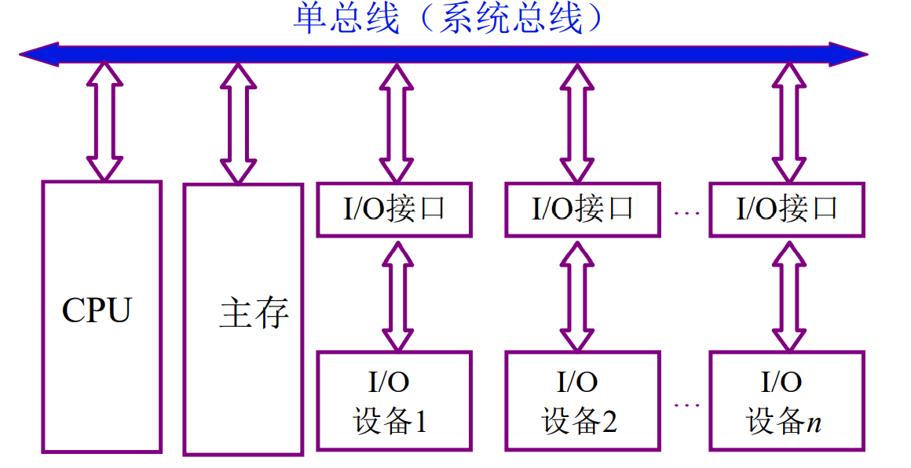

**单总线结构特点：**

在单总线结构中，要求连接到总线上的逻辑部件必须高速运行，以便在某些设备需要使用总线时，能迅速获得总线控制权；而当不再使用总线时，能迅速放弃总线控制权。否则，由于一条总线由多种功能部件共用，可能导致很大的时间延迟。

单总线系统中，由于所有的高速设备和低速设备都挂在同一总线上，且总线只能分时 工作，即某一时间只能允许在一对儿设备之间传送数据，这就使信息传送的效率和吞吐量 受到极大限制。

单总线结构容易扩展成多 CPU 系统。

### 2. **多总线**

在CPU、主存、I/O之间互联采用多条总线。如图所示。

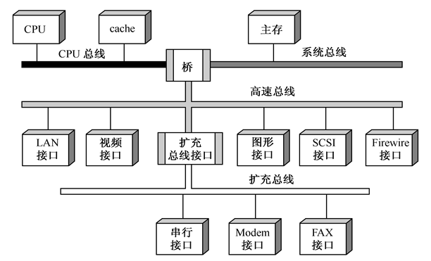

**桥**：总线桥是一种具有缓冲、转换、控制功能的逻辑电路。不同类型的桥扩展出不同层次的总 线，并分别连接高速、中速和低速设备。

**CPU总线：**CPU和cache之间采用

**系统总线：**主存连在其上。

**高速总线：**通过桥，CPU总线、系统总线和高速总线彼此相连。**桥**实质上是一种具有**缓冲、转换、控制**功能的逻辑电路。高速总线通过扩充总线接口与扩充总线相连，扩充总线上可以连接串行方式工作的I/O设备。

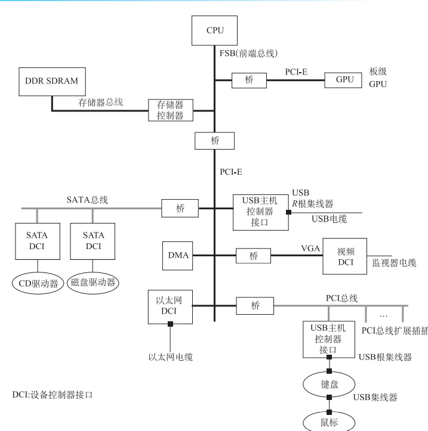

多总线结构体现了高速、中速、低速设备连接到不同的总线上同时进行工作，以提高总线的效率和吞吐量，而且处理器结构的变化不影响高速总线。

## 6.1.3总线的内部结构

### 1. **早期总线的内部结构**

如图所示，它实际上是处理器芯片引脚的延伸，是处理器与I/O设备适配器的通道。这种简单的总线一般由50～100条线组成，这些线按其功能可分为三类：地址线、数据线和控制线。

- 数据总线：双向（读和写），总线条数与机器字长、存储字长有关，但不一定相等。

    

- 地址总线：单向（只读），条数与存储地址、I/O地址有关

- 控制总线：传输控制信号，单向，但是有输出信号也有输入信号。

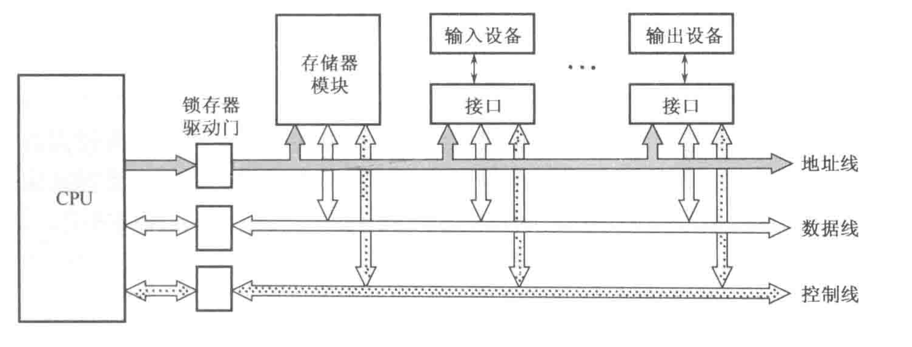

**缺点：**

- CPU是总线上惟一的主控者。即使后来增加了具有简单仲裁逻辑的DMA控制器以支持DMA传送，但仍不能满足多CPU环境的要求。

    

- 总线信号是CPU引脚信号的延伸，故总线结构紧密与CPU相关，通用性较差。

### 2. 当代总线的内部结构

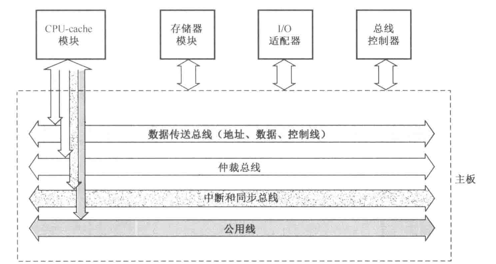

- 数据传送总线：由地址线、数据线、控制线组成。其结构与简单总线相似，但一般是32条地址线，32或64条数据线。为了减少布线，64位数据的低32位数据线常常和地址线采用多路复用方式。

    

- 仲裁总线：包括总线请求线和总线授权线。

- 中断和同步总线：用于处理带优先级的中断操作，包括中断请求线和中断认可线。

- 公用线：包括时钟信号线、电源线、地线、系统复位线以及加电或断电的时序信号线等。

## 6.1.4总线结构实例

大多数计算机采用了分层次的多总线结构。下图它是一个三层次的多总线结构：CPU总线、PCI总线和ISA总线。

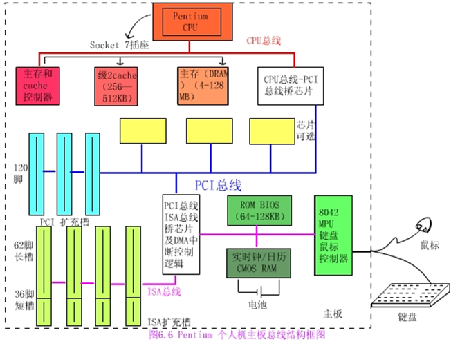

- CPU总线：也称CPU-存储器总线，包含64位数据线和32位地址线的同步总线。可以看成是CPU引脚信号的衍生。
- PCI总线：用于连接高速的I/O设备模块，如图形显示器适配器、网络接口控制器等，通过“桥”与上面更高速的CPU总线相连，与下面更低速的ISA总线相连。PCI总线是一个32（或64）位的同步总线，数据和地址是同一组线，分时复用，采用集中式仲裁方式，有专用的PCI总线仲裁器。
- ISA总线：与低速的I/O设备连接，支持7个DMA通道和15级可屏蔽硬件中断，并通过片级总线和ROM、键盘鼠标控制器等相连。
- CPU 总线-PCI 总线的 桥称为北桥，
- PCI 总线-ISA 总线的桥称为南桥

# 6.2 总线接口

## 6.2.1 **信息的传送方式**

数字计算机中的二进制位一般用电位高低或脉冲的有无来表示。

计算机系统中，传输信息基本有三种方式：

- 串行传送：使用一条传输线，采用脉冲传送。

    传输特点：由于其是在连续传输，若连续传入0或1，无法确定其个数，因此可以用位时间，即指定一个二进制位 在传输线上占用的时间长度。显然，位时间是由同步脉冲来体现的。

    eg：串行数据是由位时间组成的，那么传送 8 比特需要 8 个位时间。例如，如果接收设 备在第一个位时间和第三个位时间接收到一个脉冲，而其余的 6 个位时间没有收到脉冲，那 么就会知道所收到的二进制信息是 00000101。注意，串行传送时低位在前，高位在后。

    在串行传送时，被传送的数据需要在发送部件进行并-串变换，这称为拆卸；而在接收 部件又需要进行串-并变换，这称为装配。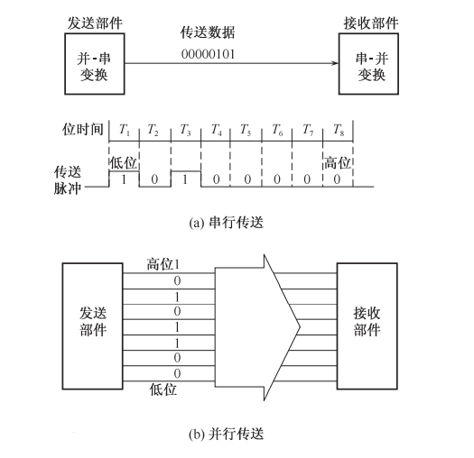

    优点：只需要一条传输线，这一点对长距离传输显得特别重要，不管传送的数据量有多少，只需要一条传输线，成本比较低廉。一般用于远距离传输

    缺点：就是速度慢。

- 并行传送：每一数据位需要一条传输线，一般采用**电位**传送。

- 分时传送：总线复用或是共享总线的部件分时使用总线。一般用于计算机内部

出于速度和效率上的考虑，系统总线上传送的信息必须采用并行传送方式。

## 6.2.2 总线接口的基本概念

I/O功能模块通常称为I/O接口，也叫适配器，是CPU、主存和外设之间通过系统总线进行连接的标准化逻辑部件。

外围设备本身带有自己的设备控 制器，它是控制外围设备进行操作的控制部件。 它通过 I/O 接口接收来自 CPU 传送的各种信息， 并根据设备的不同要求把这些信息传送到设备， 或者从设备中读出信息传送到 I/O 接口，然后送 给 CPU。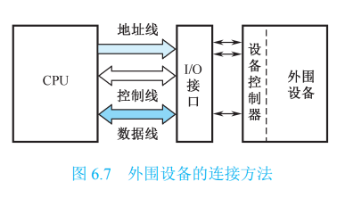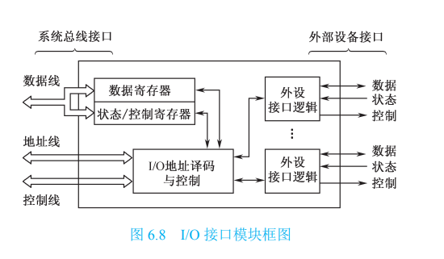

接口的典型功能：控制、缓冲、状态、转换、整理、程序中断。

一个适配器的两个接口：一个同系统总线相连，采用并行方式，另外一个同设备控制器相连，可能采用并行方式也可以采用串行方式，设备控制器是外围设备自带的设备控制器，是控制外围设备进行操作的控制部件。

**例题：**

利用串行方式传送字符，每秒钟传送的比特（bit）位数常称为波特率。假设数据传送速率是120个字符/秒，每一个字符格式规定包含10个比特位（起始位、停止位、8个数据位），问传送的波特率是多少?每个比特位占用的时间是多少?

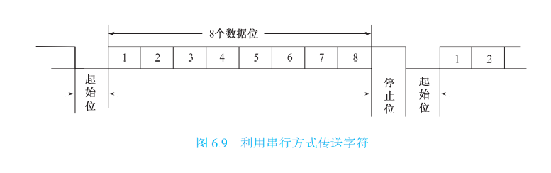

解：

波特率为：10位×120/秒=1200波特

每个比特位占用的时间Td是波特率的倒数：Td=1/1200=0.833×10-3s=0.833ms

# 6.3 总线的仲裁

## 6.3.0 基本概念

- 连接到总线上的功能模块有主动和被动两种形态，其中主方又称为主设备可以启动一个总线周期，而从方（从设备）只能响应主方请求。每次总线操作，只能有一个主方，但是可以有多个从方。
- 为了解决多个主动态的功能模块争用总线的问题，必须设置总线仲裁部件。
- 总线占用期：主方持续控制总线的时间。
- 按照总线仲裁电路的==位置==不同，仲裁方式分为集中式和分布式两种。

## 6.3.1 集中式仲裁

### 1. 链式查询方式

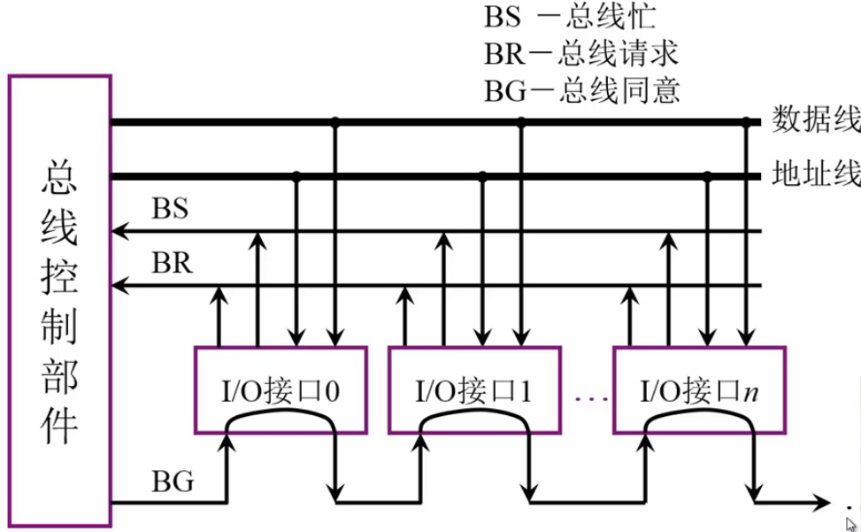

所有设备通过BR发出申请总线的信号，总线控制部件通过BG线授予某个设备总线控制权，该设备通过BS先发出总线被占用的信号。当有设备发出总线请求信号后，从仲裁器一端开始查询，从左向右的顺序依次查询每个I/O设备，遇到第一个设备请求总线则授予控制权。故离中央仲裁器最近的设备具有最高优先权，离总线控制器越远，优先权越低。

- 优点：只用很少几根线就能按照一定优先次序实现总线控制，并且这种链式结构很容易扩充设备。

    

- 缺点：对询问链的电路故障很敏感，某个接口电路出现故障，则后面的设备都无法获得总线控制权，优先级固定。

### 2. 计数器定时查询方式

总线上的任一设备要求使用总线时，通过BR线发出总线请求。中央仲裁器接到请求信号以后，在BS线为“0”的情况下让计数器开始计数，计数值通过一组地址线发向各设备。每个设备接口都有一个设备地址判别电路，当地址线上的计数值与请求总线的设备地址相一致时，该设备置“1”BS线，获得了总线使用权，此时中止计数查询。 每次计数可以从“0”开始，也可以从中止点开发始。

- 如果从“0”开始，各设备的优先次序与链式查询法相同，优先级的顺序是固定的。

    

- 如果从中止点开始，则每个设备使用总线的优先级相等。（如上次终止点在10，则下次从11开始查询，10的优先级从高变成最低）

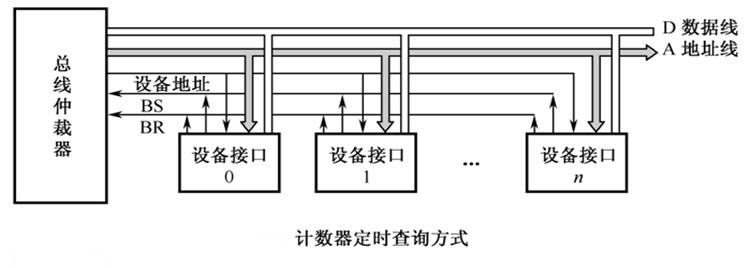

计数器的初值也可用程序来设置，这可以方便地改变优先次序，但这种灵活性是以增加线数为代价的。

### 3. 独立请求方式

在独立请求方式中，每一个共享总线的主设备均有一对总线请求线BRi和总线授权线BGi。当设备要求使用总线时，便发出该设备的请求信号。总线仲裁器中有一个排队电路，它根据一定的优先次序决定首先响应哪个设备的请求，给设备以授权信号BGi。当代总线标准普遍采用独立请求方式。

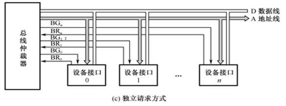

**优点：**

- 响应时间快，即确定优先响应的设备所花费的时间少，用不着一个设备接一个设备地查询。
- 对优先次序的控制相当灵活。优先级可以预先固定，也可以通过程序来改变优先次序，还可以用屏蔽（禁止）某个请求的办法，不响应来自无效设备的请求。较为复杂。

## 6.3.2 分布式仲裁

不需要中央仲裁器，而是多个仲裁器竞争使用总线。当它们有总线请求时，把它们唯一的仲裁号发送到共享的仲裁总线上，每个仲裁器将仲裁总线上得到的号与自己的号进行比较。如果仲裁总线上的号大，则它的总线请求不予响应，并撤消它的仲裁号。最后，获胜者的仲裁号保留在仲裁总线上。显然，分布式仲裁是以**优先级仲裁策略**为基础的。

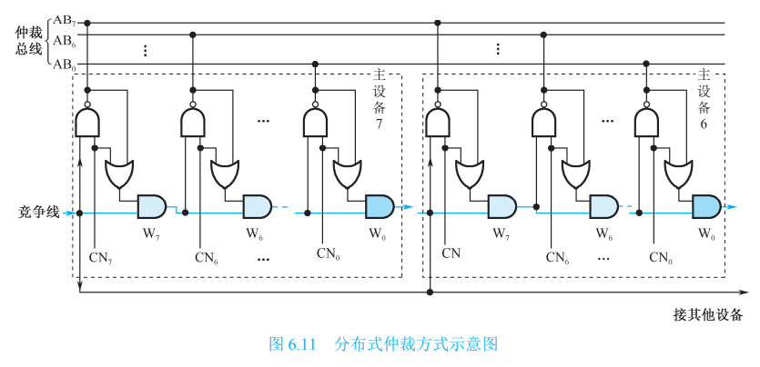

(1)所有参与本次竞争的各主设备(本例中共 8 个)将设备竞争号 CN 取反后打到仲裁总 线 AB 上，以实现“线或”逻辑。AB 线低电平时表示至少有一个主设备的 CNi 为 1，AB线高电平时表示所有主设备的 CNi 为 0。

(2)竞争时 CN 与 AB 逐位比较，从最高位(b7)至最低位(b0)以一维菊花链方式进行， 只有上一位竞争得胜者 Wi+1 位为 1。当 CNi=1，或 CNi =0 且 ABi 为高电平时，才使 Wi 位为 1。若 Wi=0 时，将一直向下传递，使其竞争号后面的低位不能送上 AB 线。

 (3)竞争不到的设备自动撤除其竞争号。在竞争期间，由于 W 位输入的作用，各设备 在其内部的 CN 线上保留其竞争号并不破坏 AB 线上的信息。

 (4)由于参加竞争的各设备速度不一致，这个比较过程反复(自动)进行，才有最后稳定 的结果。竞争期的时间要足够，保证最慢的设备也能参与竞争

# 6.4 总线的定时和数据传送模式

## 6.4.1 总线定时

总线的信息传送过程：

- 申请分配阶段：主模块申请，总线仲裁决定。
- 寻址阶段：主模块向从模块给出地址和命令。
- 传数阶段：主模块和从模块交换数据。
- 结束阶段：主模块撤消有关信息。

定时：事件出现在总线上的时序关系。

### 1. 同步定时

在同步定时协议中，事件出现在总线上的时刻由总线时钟信号来确定，所以总线中包 含时钟信号线。一次 I/O 传送被称为时钟周期或总线周期

由于采用了公共时钟，每个功能模块什么时候发送或接收信息都由统一时钟规定，因 此，同步定时具有较高的传输频率。

同步定时适用于总线长度较短、各功能模块存取时间比较接近的情况。这是因为同步方式对任何两个功能模块的通信都给予同样的时间安排。由于同步总线必须按最慢的模块 来设计公共时钟，当各功能模块存取时间相差很大时，会大大损失总线效率。

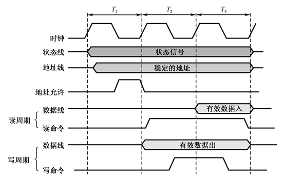

### 2. 异步定时

​	在异步定时协议中，后一事件出现在总线上的时刻取决于前一事件的出现时	刻，即建 立在应答式或互锁机制基础上。在这种系统中，不需要统一的公共	时钟信号。总线周期的 长度是可变的。

过程：CPU 发送地址信号和读状态信号到总线上。待 这些信号稳定后，它发出读命令，指示有效地址和控制信号的出现。存储器模块进行地址 译码并将数据放到数据线上。一旦数据线上的信号稳定，则存储器模块使确认线有效，通 知 CPU 数据可用。CPU 由数据线上读取数据后，立即撤销读状态信号，从而引起存储器模 块撤销数据和确认信号。最后，确认信号的撤销又使 CPU 撤销地址信息

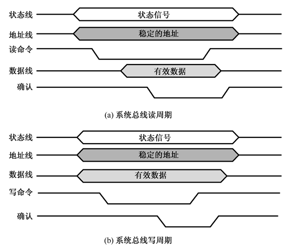

【例3】某CPU采用集中式仲裁方式，使用独立请求与菊花链查询相结合的二维总线控制结构。每一对请求线BRi和授权线BGi组成一对菊花链查询电路。每一根请求线可以被若干个传输速率接近的设备共享。当这些设备要求传送时通过BRi线向仲裁器发出请求，对应的BGi线则串行查询每个设备，从而确定哪个设备享有总线控制权。请分析说明图6.14所示的总线仲裁时序图。

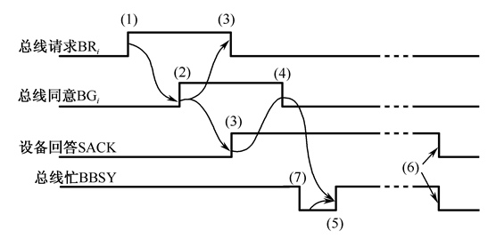

解：从时序图看出，该总线采用异步定时协议。

当某个设备请求使用总线时，在该设备所属的请求线上发出申请信号BRi（1）。

CPU按优先原则同意后给出授权信号BGi作为回答（2）。

BGi链式查询各设备，并上升从设备回答SACK信号证实已收到BGi信号（3）。

CPU接到SACK信号后下降BG作为回答（4）。

在总线“忙”标志BBSY为“0”情况该设备上升BBSY，表示该设备获得了总线控制权，成为控制总线的主设备（5）。

在设备用完总线后，下降BBSY和SACK（6）释放总线。

在上述选择主设备过程中，可能现行的主从设备正在进行传送。此时需等待现行传送结束，即现行主设备下降BBSY信号后（7），新的主设备才能上升BBSY，获得总线控制权。

### 3. 半同步总线定时协定

半同步总线整体上仍然采用同步操作方式，其总线周期是时钟周期的整数倍。不同之 处在于增加一根联络信号线，如高电平有效的准备好信号 READY(或者低电平有效的等待 信号 nWAIT))，由此信号决定是否需要增加时钟周期

基本的总线传输周期由 T1 到 T4 四个时钟周期构成，但如果某个设 备来不及在四个时钟周期内完成总线操作，可以使 READY 信号无效(或者 nWAIT 信号有 效)以增加时钟周期数。总线控制逻辑在 T3 的前沿检测 READY 引脚是否有效：如果 READY 有效，则在 T3 时钟周期后进入 T4 时钟周期；如果 READY 无效，则在 T3 和 T4 之间插入一 个等待周期 Tw，并在 Tw 前沿再次检测 READY 引脚是否有效，直到 READY 有效后才进入 T4 时钟周期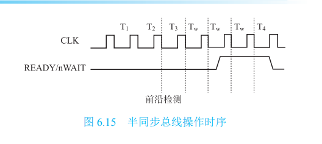

半同步总线协定在同步总线协定的基础上仅仅增加了一点点成本，但适应能力却大大 提升。因此，现代的许多同步总线都已扩展为半同步总线。

### 4. 周期分裂式总线定时协定

在第一个时钟周期 CPU 送出地址信息 和最后一个时钟周期存储器送出数据之间，通常有若干个时钟周期的延迟时间。这是存储 器内部准备数据的操作时间，占用的时钟周期数取决于存储器自身的速度。但是这部分时 间实际上并不需要占用总线传输数据，因而宝贵的总线资源被浪费

在对总线性能要求非常高的系统中，可以将每个读周期分为三步：

​	①主方通过总线 向从方发送地址和读命令；

​	②从方根据命令进行内部读操作，这是从方执行读命令的数据 准备时间；

​	③从方通过数据总线向主方提供数据。

相应地，将一个读周期分解成两个分离的传输子周期：第一个子周期，主方发送地址和命令及有关信息后，立即和总线断开，供其他设备使用；第二个子周期，被读出的设备重新申请总线使用权后将数据通过总线发向请求数据的设备。而写周期只需要第一个子周期即可完成。

在分离式总线定时协定中，由于每个设备都要申请总线使用权，故读数据的双方都是 总线主方。分离式总线定时协定以硬件复杂度的提高换取总线性能的提升。

## 6.4.2 总线数据传送模式

### 1.读、写操作

读操作是由从方到主方的数据传送；写操作是由主方到从方的数据传送。一般，主方先以一个总线周期发出命令和从方地址，经过一定的延时再开始数据传送总线周期。为了提高总线利用率，减少延时损失，主方完成寻址总线周期后可让出总线控制权，以使其他主方完成更紧迫的操作。然后再重新竞争总线，完成数据传送总线周期。

### 2. 块传送操作

只需给出块的起始地址，然后对固定块长度的数据一个接一个地读出或写入。对于CPU（主方）存储器（从方）而言的块传送，常称为==猝发式传送==，其块长一般固定为数据线宽度（存储器字长）的4倍。例如一个64位数据线的总线，一次猝发式传送可达256位。这在超标量流水中十分有用。

### 3. 写后读、读修改写操作

这是两种组合操作。只给出地址一次（表示同一地址），或进行先写后读操作，或进行先读后写操作。前者用于校验目的，后者用于多道程序系统中对共享存储资源的保护。这两种操作和猝发式操作一样，主方掌管总线直到整个操作完成。

### 4. 广播、广集操作

一般而言，数据传送只在一个主方和一个从方之间进行。但有的总线允许一个主方对多个从方进行写操作，这种操作称为广播。与广播相反的操作称为广集，它将选定的多个从方数据在总线上完成AND或OR操作，用以检测多个中断源。

**演示过程：**

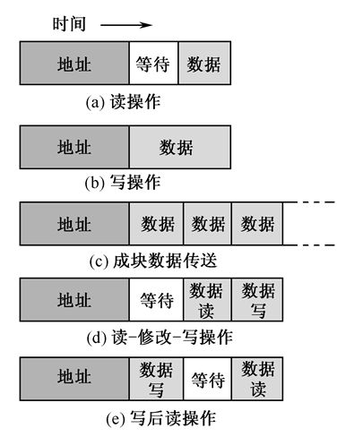

# 6.5 HOST总线和PCI总线

## 6.5.1 多总线结构

如图，典型的多总线结构框图。实际上，这也是高档PC机和服务器的主板总线框图。

**HOST总线：** 该总线有CPU总线、系统总线、主存总线、前端总线等多种名称，各自反映了总线功能的一个方面。这里称“宿主”总线，也许更全面，因为HOST总线不仅连接主存，还可以连接多个CPU。它是 连接“北桥”芯片与CPU之间的信息通路，它是一个64位数据线和32位地址线的同步总线。32位的地址线可支持处理器4GB的存储寻址空间。总线上还接有L2级cache，主存与cache控制器芯片。后者用来管理CPU对主存和cache的存取操作。CPU拥有HOST总线的控制权，但在必要情况下可放弃总线控制权。

**PCI总线：** 连接各种高速的PCI设备。PCI是一个与处理器无关的高速外围总线，又是至关重要的层间总线。它采用同步时序协议和集中式仲裁策略，并具有自动配置能力。PCI设备可以是主设备，也可以是从设备，或兼而有之。在PCI设备中不存在DMA（直接存储器传送）的概念，这是因为PCI总线支持无限的猝发式传送。这样，传统总线上用DMA方式工作的设备移植到PCI总线上时，采用主设备工作方式即可。系统中允许有多条PCI总线，它们可以使用HOST桥与HOST总线相连，也可使用PCI/PCI桥与已和HOST总线相连的PCI总线相连，从而得以扩充PCI总线负载能力。

**LAGACY总线：** 可以是ISA，EISA，MCA等这类性能较低的传统总线，以便充分利用市场上丰富的适配器板卡，支持中、低速I/O设备。

在PCI总线体系结构中有三种桥。其中HOST桥又是PCI总线控制器，含有中央仲裁器。桥起着重要的作用，它连接两条总线，使彼此间相互通信。桥又是一个总线转换部件，可以把一条总线的地址空间映射到另一条总线的地址空间上，从而使系统中任意一个总线主设备都能看到同样的一份地址表。

桥本身的结构可以十分简单，如只有信号缓冲能力和信号电平转换逻辑，也可以相当复杂，如有规程转换、数据快存、装拆数据等。与处理器无关

## 6.5.2 PCI总线信号线

PCI总线的基本传输机制是猝发式传送，利用桥可以实现总线间的猝发式传送。写操作时，桥把上层总线的写周期先缓存起来，以后的时间再在下层总线上生成写周期，即延迟写。读操作时，桥可早于上层总线，直接在下层总线上进行预读。无论延迟写和预读，桥的作用可使所有的存取都按CPU的需要出现在总线上。

- 必要引脚主控设备49条

    

- 目标设备47条

- 可选引脚51条（主要用于64位扩展、中 断请求、高速缓存支持等）

- 总引脚数120条（包含电源、地、保留引脚等）

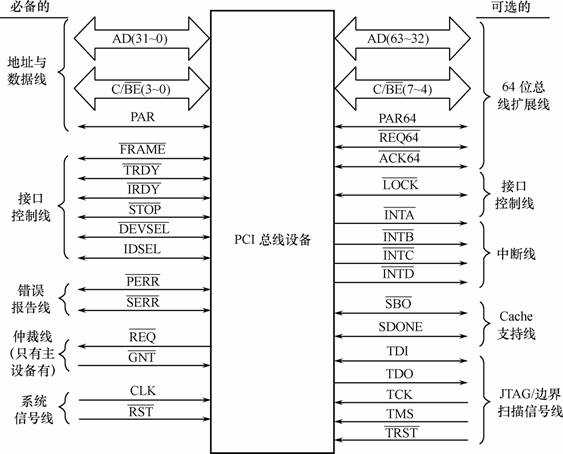

## 6.5.3 总线周期类型

PCI总线周期由当前被授权的主设备发起。PCI支持任何主设备和从设备之间点到点的对等访问，也支持某些主设备的广播读写。

存储器读/写总线周期：以猝发式传送为基本机制，一次猝发式传送总线周期通常由一 个地址期和一个或几个数据周期组成。存储器读/写周期的解释，取决于 PCI 总线上的存储 器控制器是否支持存储器/cache 之间的 PCI 传输协议。如果支持，则存储器读/写一般是通 过 cache 来进行；否则，是以数据块非缓存方式来传输

存储器写和使无效周期：与存储器写周期的区别在于，前者不仅保证一个完整的 cache 行被写入，而且在总线上广播“无效”信息，命令其他 cache 中的同一行地址变为无效。关 于存储器读的三个总线周期的说明示于表 6.3 中。

特殊周期：用于主设备将其信息(如状态信息)广播到多个目标方。它是一个特殊的写 操作，不需要目标方以 nDEVSEL 信号响应。但各目标方须立即使用此信息，无权中止此写 操作过程

配置读/写周期：是 PCI 具有自动配置能力的体现。PCI 有三个相互独立的物理地址空 间，即存储器、I/O、配置空间。所有 PCI 设备必须提供配置空间，而多功能设备要为每一 实现功能提供一个配置空间。配置空间是 256 个内部寄存器，用于保存系统初始化期间设 置的配置参数。CPU 通过 HOST 桥的两个 32 位专用寄存器(配置地址、配置数据)来访问 PCI 设备的配置空间。即 HOST 桥根据 CPU 提供给这两个寄存器的值，生成 PCI 总线的配 置读/写周期，完成配置数据的读出或写入操作

双地址周期 ：用于主方指示它正在使用 64 位地址

## 6.5.4 总线周期操作

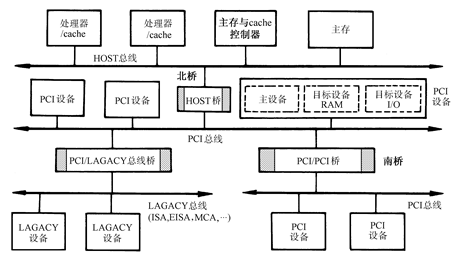

PCI总线周期的操作过程有如下特点：

（1）采用同步时序协议。总线时钟周期以上跳沿开始，半个周期高电平，半个周期低电平。总线上所有事件，即信号电平转换出现在时钟信号的下跳沿时刻，而对信号的采样出现在时钟信号的上跳沿时刻。

（2）总线周期由被授权的主方启动，以帧FRAME#信号变为有效来指示一个总线周期的开始。

（3）一个总线周期由一个地址期和一个或多个数据期组成。在地址期内除给出目标地址外，还在C/BE#线上给出总线命令以指明总线周期类型。

（4）地址期为一个总线时钟周期，一个数据期在没有等待状态下也是一个时钟周期。一次数据传送是在挂钩信号IRDY#和TRDY#都有效情况下完成，任一信号无效（在时钟上跳沿被对方采样到），都将加入等待状态。

（5）总线周期长度由主方确定。在总线周期期间FRAME#持续有效，但在最后一个数据期开始前撤除。即以FRAME#无效后，IRDY#也变为无效的时刻表明一个总线周期结束。由此可见，PCI的数据传送以猝发式传送为基本机制，单一数据传送反而成为猝发式传送的一个特例。并且PCI具有无限制的猝发能力，猝发长度由主方确定，没有对猝发长度加以固定限制。

（6）主方启动一个总线周期时要求目标方确认。即在FRAME#变为有效和目标地址送上AD线后，目标方在延迟一个时钟周期后必须以DEVSEL#信号有效予以响应。否则，主设备中止总线周期。

（7）主方结束一个总线周期时不要求目标方确认。目标方采样到FRAME#信号已变为无效时，即知道下一数据传送是最后一个数据期。目标方传输速度跟不上主方速度，可用TRDY#无效通知主方加入等待状态时钟周期。当目标方出现故障不能进行传输时，以STOP#信号有效通知主方中止总线周期。

## 6.5.5 总线仲裁

PCI总线采用集中式仲裁方式，每个PCI主设备都有独立的REQ#（总线请求）和GNT#（总线授权）两条信号线与中央仲裁器相连。由中央仲裁器根据一定的算法对各主设备的申请进行仲裁，决定把总线使用权授予谁。但PCI标准并没有规定仲裁算法。

PCI 总线支持隐藏式仲裁。即在主设备 A 正在占用总线期间，中央仲裁器根据指定的 算法裁决下一次总线的主方应为主设备 B 时，它可以使 nGNT-A 无效而使 nGNT-B 有效。 此时，设备 A 应在数据传送完成后立即释放 nFRAME 和 nIRDY 信号线，由设备 B 掌管后 开始一个新的总线周期。隐藏式仲裁使裁决过程或在总线空闲期进行或在当前总线周期内 进行，不需要单独的仲裁总线周期，提高了总线利用率。中央仲裁器使 nGNT-A 无效与 nGNT-B 有效之间至少有 1 个时钟周期的延迟，以保证信号线由 A 驱动变为 B 驱动时在临 界情况下也不产生冲突，即上述的交换期

PCIe总线：全称为 PCI-Express，是基于 PCI 总线技术发展起来的总线标准，对 PCI 总 线有良好的继承性，在软件和应用上兼容 PCI 总线。与 PCI 总线相比，PCIe 总线的主要改进有如下几点

1. 高速差分传输。与 PCI 总线使用的单端信号对地传输方式相比，PCIe 总线改用差分 信号进行数据传送，一个信号由 D+和 D–两根信号线传输，信号接收端通过比较这两个信 号的差值判断发送端发送的是逻辑“1”还是逻辑“0”。由于外部干扰噪声将同时附加到 D+和 D–两根信号上，因而在理论上并不影响二者的差值，对外界的电磁干扰也比较小。因 此差分信号抗干扰的能力更强，可以使用更高的总线频率。
2. )串行传输：由于并行传输方式使用更多的信号线进行传输，因而理论上并行传输的 速率比串行传输更高。但是并行总线通常需要在系统底板上进行复杂的走线，随着信号传 输速度的提高，不同长度或在 PCB 板不同层布放的导线引起的定时偏差的影响和并行导线 之间存在的相互干扰变得越来越严重，限制了信号传输的最高速率。而串行传输方式在每 个方向只有一个差分信号，且时钟信息嵌入在数据信号中，故不会出现定时偏移。
3. 全双工端到端连接：与 PCI 的共享总线模式不同，PCIe 链路使用端到端的数据传送 方式，每一通道(Lane)只能连接两个设备，设备之间通过双向的链路相连接，每个传输通 道独享带宽。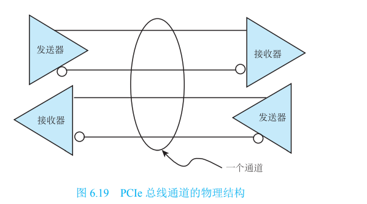
4. )基于多通道的数据传递方式。一个 PCIe 链路可以由多条通道组成，目前可支持×1、 ×2、×4、×8、×12、×16 和×32 宽度的 PCIe 链路。
5. 基于数据包的传输。作为串行通信总线，PCIe 所有的数据都是以数据包为单位进行 传输的。一个完整的 PCIe 体系结构由上到下包括应用层、事务层、数据链路层和物理层，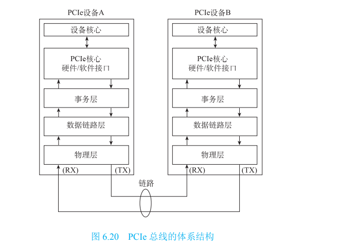
6. 可以看出，PCIe 总线上包括四类实体：根复合 体、交换器、PCIe 桥和端点。根复合体(Root Complex)是 PCIe 的根控制器，将处理器/内 存子系统连接到 PCIe 交换结构。一个根复合体可能包含多个 PCIe 端口，可将多个交换器 连接到根复合体或级联的端口。PCIe 总线采用基于交换的技术，交换器(Switch)可以扩展 PCIe 总线，PCIe 总线系统可以通过交换器连接多个 PCIe 设备。PCIe 桥(PCIe brige)负责 212 计算机组成原理 PCIe 和其他总线之间的转换，PCIe 总线系统可以通过 PCIe 桥扩展出传统的 PCI 总线或 PCI-X 总线。在 PCIe 总线中，基于 PCIe 总线的设备称为端点(Endpoint)，如 PCIe 接口网 卡、串口卡、存储卡等。端点处于 PCIe 总线系统拓扑结构中的最末端，一般作为总线操作 的发起者或者终结者，

# 6.6 InfiniBand标准

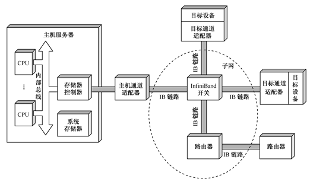

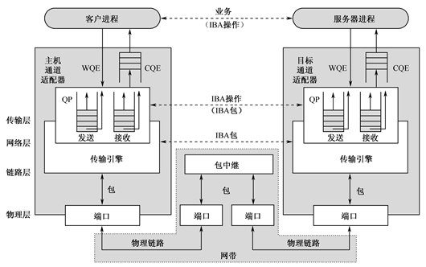