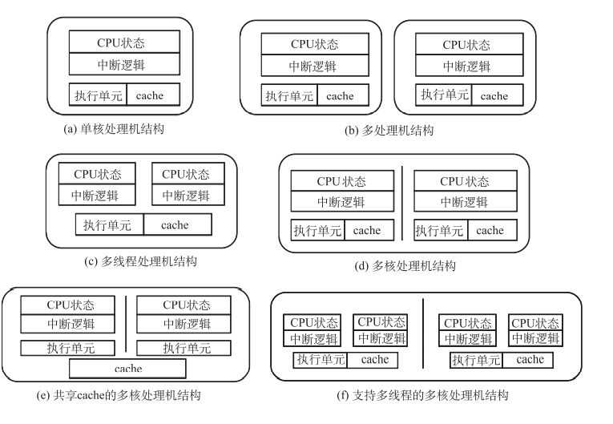

# 体系结构中的并行性

### 9.1.1 并行性的概念

1. 所谓并行性，是指计算机系统具有可以同时进行运算或操作的特性，它包括同时性与 并发性两种含义。

    1.  同时性 两个或两个以上的事件在同一时刻发生。
    2.  并发性 两个或两个以上的事件在同一时间间隔内发生。

2. 从处理数据的角度看，并行性等级从低到高可分为： · 

    1. 字串位串：同时只对一个字的一位进行处理。这是最基本的串行处理方式，不存在 并行性。
    2.  字串位并：同时对一个字的全部位进行处理，不同字之间是串行的。这里已开始出 现并行性。
    3.  字并位串：同时对许多字的同一位进行处理。这种方式有较高的并行性。 · 
    4. 全并行：同时对许多字的全部位进行处理。这是最高一级的并行。
    5. 

3. 从执行程序的角度看，并行性等级从低到高可分为：

    1.   指令内部并行：一条指令执行时各微操作之间的并行。
    2.   指令级并行：并行执行两条或多条指令。 
    3. 任务级或过程级并行：并行执行两个以上过程或任务(程序段)。
    4.   作业或程序级并行：并行执行两个以上作业或程序

    ### 9.1.2 提高并行性的技术途径

    1. 提高并行性的措施

        1. )时间重叠： 时间重叠即时间并行。在并行性概念中引入时间因素，让多个处理过程在时间上相互 错开，轮流重叠地使用同一套硬件设备的各个部分，以加快硬件周转而赢得速度。时间重 叠的实质就是把一件工作按功能分割为若干个相互联系的部分，每一部分指定专门的部件 完成，各部分执行过程在时间上重叠起来，使所有部件依次分工合作完成完整的工作。时 间重叠的典型应用就是流水线技术。
        2.  (2)资源重复：资源重复即空间并行。在并行性概念中引入空间因素，以数量取胜的原则，通过重复 设置硬件资源，大幅度提高计算机系统的性能。随着硬件价格的降低，资源重复在单处理 机中通过部件冗余、多存储体等方式被广泛应用，而多处理机本身就是实施“资源重复” 原理的结果。
        3.  (3)时间重叠+资源重复： 在计算机系统中同时运用时间并行和空间并行技术，这种方式在计算机系统中得到广 泛应用，成为并行性主流技术。
        4.  (4)资源共享： 资源共享是一种软件方法的并行，它使多个任务按一定时间顺序轮流使用同一套硬件 设备。多道程序、分时系统就是资源共享的具体应用。资源共享既降低了成本，又提高了 计算机硬件的利用率

        ### 单处理机系统中的并行性

        1. 主导作用的是时间并行(流水线)技术。实现时间并 行的物质基础是“部件功能专用化”，即把一件工作按功能分割为若干相互联系的部分，把 每一部分指定给专门的部件完成；然后按时间重叠原理把各部分执行过程在时间上重叠起 来，使所有部件依次分工完成一组同样的工作。

        2. 在单处理机中，空间并行技术的运用也已经十分普遍。在多操作部件处 理机中，通用部件被分解成若干个专用操作部件，如加法部件、乘法部件、除法部件、逻 辑运算部件等。一条指令所需的操作部件只要空闲，就可以开始执行这条指令，这就是指令级并行

        3. 在单处理机中，资源共享的概念实质上是用单处理机模拟多处理机的功能，形成所谓 虚拟机的概念。

            ### 9.1.4 多处理机系统中的并行性

            1. 耦合度：反映多处理机系统各机器之间物理连接的紧密程度与交互作用能力的强弱
            2. 紧耦合系统又称直接耦合系统，指处理机之间物理连接的频带较高，一般是通过总线 或高速开关实现互连，可以共享主存。由于具有较高的信息传输率，因而可以快速并行处 理作业或任务。
            3.  松耦合系统又称间接耦合系统，一般是通过通道或通信线路实现处理机之间的互连， 可以共享外存设备(磁盘、磁带等)。机器之间的相互作用是在文件或数据集一级上进行。 松耦合系统表现为两种形式：一种是多台计算机和共享的外存设备连接，不同机器之间实 现功能上的分工(功能专用化)，机器处理的结果以文件或数据集的形式送到共享外存设备， 供其他机器继续处理。另一种是计算机网，机器通过通信线路连接，以求得更大范围的资 源共享
            4. 许多主要功能，如数组运算、高级语言编译、数据库管理等，也逐渐分离 出来，交由专用处理机完成，机间的耦合程度逐渐加强，从而发展成为异构多处理机系统。
            5. 为了使并行处理的 任务能在处理机之间随机地进行调度，就必须使各处理机具有同等的功能，从而成为同构 多处理机系统。

            ### 9.1.5 并行处理机的体系结构类型

            1. 按照指令流和数据流的不同组织方式
                1.  单指令流单数据流(SISD)，其代表机型是单处理机。
                2. 单指令流多数据流(SIMD)，其代表机型是向量处理机。 
                3. 多指令流单数据流(MISD)，这种结构从来没有实现过。多条指令使用只能使用一组数据，无用
                4.   多指令流多数据流(MIMD)，其代表机型是多处理机和机群系统。前者为紧耦合系统， 后者为松耦合系统
                5. 
            2. 
                1.  9.2(a)表示一个 SISD 的结构，CU 代表控制单元，PU 代表处理单元，MU 代表存储单元，IS 代表单一指令流，DS 代表单一 数据流。这是单处理机系统进行取指令和执行指令的过程。 
                2. 图 9.2(b)表示 SIMD 的结构，仍是一个单一控制单元 CU，但现在是向多个处理单元 (PUl～PUn)提供单一指令流，每个处理单元可有自己的专用存储器(局部存储器 LMl～ LMn)。这些专用存储器组成分布式存储器。 
                3. 图 9.2(c)和图 9.2(d)表示 MIMD 的结构，两者均有多个控制单元(CUl～CUn)，每个控 制单元向自己的处理部件(PUl～PUn)提供一个独立的指令流。不同的是，图 9.2(c)是共享 存储器多处理机，而图 9.2(d)是分布式存储器多处理机

            ### 9.1.6 并行处理机的组织和结构

            计算机体系结构可以采用不同方式的并行机制

            1.  超标量处理机和超长指令字处理机 
                1. 在计算机系统的最底层，流水线技术将时间并行性引入处理机，而多发射处理机则把 空间并行性引入处理机。超标量(superscalar)设计采用多发射技术，在处理机内部设置多条 并行执行的指令流水线，通过在每个时钟周期内向执行单元发射多条指令实现指令级并行。 超长指令字技术(very long instruction word，VLIW)则由编译器在编译时找出指令间潜在的 并行性，进行适当的调度安排，把多个能够并行执行的操作组合在一起，控制处理机中的 多个相互独立的功能部件，相当于同时执行多条指令，从而提高处理机的并行性
            2. 多处理机和多计算机 
                1. 在单个处理机的性能一定的情况下，进一步提高计算机系统处理能力的简单方法就是 让多个处理机协同工作，共同完成任务。广义而言，使用多台计算机协同工作来完成所要 求的任务的计算机系统称为多处理机(multiprocessor)系统。具体而言，多处理机系统由多 台独立的处理机组成，每台处理机都能够独立执行自己的程序和指令流，相互之间通过专 门的网络连接，实现数据的交换和通信，共同完成某项大的计算或处理任务。多处理机系 统中的各台处理机由操作系统管理，实现作业级或任务级并行
                2. 狭义多处理机系统仅指在同一计算机内处理机之间通过共 享存储器方式通信的并行计算机系统。运行在狭义多处理机上的所有进程能够共享映射到 公共内存的单一虚拟地址空间。任何进程都能通过执行 LOAD 或 STORE 指令来读写一个 内存字
                3. 与狭义多处理机相对应，由不共享公共内存的多个处理机系统构成的并行系统又称为 多计算机(multicomputers)系统。每个系统都有自己的私有内存，通过消息传递的方式进行 互相通信
                4. 多计算机系统有各种不同的形状和规模。机群(cluster，也称集群)系统就是一种常见的 多计算机系统。机群系统是由一组完整计算机通过高性能的网络或局域网互连而成的系统， 这组计算机作为统一的计算机资源一起工作，并能产生一台机器的印象。术语“完整计算 机”意指一台计算机离开机群系统仍能运行自己的任务。机群系统中的每台计算机一般称 为节点
            3. 多线程处理机 
                1. 当通过简单提高处理机主频从而提升单处理机的性能的传统方法受到制约时，处理机 厂商被迫转向处理机片内并行技术。除了传统的指令级并行技术之外，多线程技术和多核 技术也是提高单芯片处理能力的片内并行技术。
                2.  由于现代处理机广泛采用指令流水线技术，因而处理机必须面对一个固有的问题：如 果处理机访存时 cache 缺失(不命中)，则必须访问主存，这会导致执行部件长时间的等待， 直到相关的 cache 块被加载到 cache 中。解决指令流水线因此必须暂停的一种方法就是片上 多线程(on-chip multithreading)技术。该技术允许 CPU 同时运行多个硬件线程，如果某个 线程被迫暂停，其他线程仍可以执行，这样能保证硬件资源被充分利用
            4.  多核处理机(片上多处理机)
                1.  多线程技术能够屏蔽线程的存储器访问延迟，增加系统吞吐率，但并未提高每个单线 程的执行速度。而多核(multicore)技术通过开发程序内的线程级或进程级并行性提高性能。 多核处理机是指在一颗处理机芯片内集成两个或两个以上完整且并行工作的计算引擎 (核)，也称为片上多处理机(chip multi-processor，CMP)。核(core，又称内核或核心)是指 包含指令部件、算术/逻辑部件、寄存器堆和一级或两级 cache 的处理单元，这些核通过某 种方式互联后，能够相互交换数据，对外呈现为一个统一的多核处理机
                2. 多核技术的兴起一方面是由于单核技术面临继续发展的瓶颈，另一方面也是由于大规 模集成电路技术的发展使单芯片容量增长到足够大，能够把原来大规模并行处理机结构中 的多处理机和多计算机节点集成到同一芯片内，让各个处理机核实现片内并行运行。因此， 多核处理机是一种特殊的多处理机架构。所有的处理机都在同一块芯片上，不同的核执行 不同的线程，在内存的不同部分操作。多核也是一个共享内存的多处理机：所有的核共享 同一个内存空间。多个核在一个芯片内直接连接，多线程和多进程可以并行运行
                3. 不同于多核结构，在传统的多处理机结构中，分布于不同芯片上的多个处理机通过片 外系统总线连接，因此需要占用更大的芯片尺寸，消耗更多的热量，并需要额外的软件支 持。多个处理机可以分布于不同的主板上，也可以构建在同一块电路板上，处理机之间通 过高速通信接口连接
                4. 
                    1. 图 9.3(a)是单核处理机结构，由执行 单元、CPU 状态、中断逻辑和片上 cache 组成。
                    2. 图 9.3(b)是多处理机结构，由两个完全独 立的单核处理机构成双处理机系统。
                    3. 图 9.3(c)是多线程处理机结构，在一个物理处理机芯 片内集成两个逻辑处理机，二者共享执行单元和片上 cache，但各自有自己的 CPU 状态和 中断逻辑。
                    4. 图 9.3(d)是多核处理机结构，两个完全独立的单处理机核集成在同一个芯片内， 构成双核处理机，每个核都有自己私有的片上 cache。
                    5. 图 9.3(e)同样是多核处理机结构，但 与图 9.3(d)显示的多核处理机结构的差别在于两个核共享片内 cache。
                    6. 图 9.3(f)显示的是多 核多线程处理机结构，这是多核与多线程相结合的片上并行技术。两个完全独立的处理机 核集成在同一个芯片内，每个核又是双线程的，故该处理机为双核四线程结构。

        ## 9.2 多线程与超线程处理机

        硬件多线程技术是提高处理机并行度的有效手段，以往常被应用于高性能计算机的处 理机。

        在经过特殊设计的处理机中，原有的单个物理内核经过简单扩展后被模拟 成两个逻辑内核，并能够同时执行两个相互独立的程序，从而减少了处理机的闲置时间， 充分利用了中央处理机的执行资源

        ### 9.2.1 从指令级并行到线程级并行

        #### 1. 超标量处理机的水平浪费和垂直浪费

        1. 超标量技术和超长指令字技术都是针对单一的指令流中的若干指令来提高并行处理能 力的，当单一的指令流出现 cache 缺失等现象时，指令流水线就会断流；而指令之间的相关 性也会严重影响执行单元的利用率。

        2. 垂直浪费：资源冲突会导致处理机流水线不能继续执行新 的指令

        3. 水平浪费：指令相关会导致多条流水线中部分流水线被闲置

        4. 

            #### 硬件线程的概念

1. 进程：

    1. 在操作 系统中，通常使用进程(process)这一概念描述程序的动态执行过程。

    1. 通俗地讲，程序是静态实体，而进程是动态实体，是执行中的程序。进程不仅仅包含程序代码，也包含了当前 的状态(这由程序计数器和处理机中的相关寄存器表示)和资源。因此，如果两个用户用同 样一段代码分别执行相同功能的程序，那么其中的每一个都是一个独立的进程。虽然其代 码是相同的，但是数据却未必相同。即每运行一个程序就可以得到一个进程（一个程序可以在一个时间点运行多次）

    1. 传统的计算机系统把进程当作系统中的一个基本单位，操作系统将内存空间、I/O 设备 和文件等资源分配给每个进程，调度和代码执行也以进程作为基本单位

    1. 进程调度是频 繁进行的，因而在处理机从一个进程切换到另一个进程的过程中，系统要不断地进行资源 的分配与回收、现场的保存与恢复等工作，为此付出了较大的时间与空间的开销。

2. 线程：

    1. 线程是在操作系统中 描述能被独立执行的程序代码的基本单位。在现代操作系统中，大都引入线程作为进程概念的延伸，
    2. 进程只作为资源分配的单位，不再是调度和执行的基本单位；而每个进程又拥有若干线程，线程则是调度和执行的基本单位
    3. 除了拥有 一点儿在运行中必不可少的独立资源(如程序计数器、一组寄存器和栈)之外，线程与属于 同一个进程的其他线程共享进程所拥有的全部资源。由于线程调度时不进行资源的分配与 回收等操作，因而线程切换的开销比进程切换少得多
    4. 硬件线程(hardware thread)，其原理与操作系统中的软件多 线程并行技术相似。硬件线程用来描述一个独立的指令流，而多个指令流能共享同一个支持多线程的处理机。当一个指令流因故暂时不能执行时，可以转向执行另一个线程的指令流。由于各个线程相互独立，因而大大降低了因单线程指令流中各条指令之间的相互依赖 导致的指令流水线冲突现象，从而有效提高处理机执行单元的利用率。因此，并行的概念 就从指令级并行扩展至线程级并行。

    #### 细粒度多线程和粗粒度多线程

    根据多线程处理机的具体实现方法差异，又可 以分为细粒度多线程(交错多线程)处理机和粗粒 度多线程(阻塞多线程)处理机

    1. 细粒度多线程如图 9.5(a)所示，处理机交替执行 A、B 两个线程的指令，在每个时钟周 期都进行线程切换。由于多个线程交替执行，并且处于阻塞状态的线程在切换时被跳过， 故在一定程度上降低了指令阻塞造成的处理机吞吐率损失。当然，每个线程的执行速度降 低了，因为就绪状态的线程会因为其他线程的执行而延迟（每个周期进行切换）
    2. 粗粒度多线程如图 9.5(b)所示，只有在遇到代价较高的长延迟操作(如因 cache 缺失需 要访问主存)时才由处理机硬件进行线程切换，否则一直执行同一个线程的指令。因此，粗 粒度多线程比细粒度多线程有更低的线程切换开销，且每个线程的执行速度几乎不会降低。 但是粗粒度多线程也有弱点，就是在线程切换的过程中需要排空或填充指令流水线。只有 当长延迟操作导致线程被阻塞的时间远长于指令流水线排空或填充的时间时，粗粒度多线 程才是有意义的（碰到困难进行切换）
    3. 
    4. 多线程处理机通常为每个线程维护独立的程序计数器和数据寄存器。处理机硬件能够 快速实现线程间的切换。由于多个相互独立的线程共享执行单元的处理机时间，并且能够 进行快速的线程切换，因而多线程处理机能够有效地减少垂直浪费情况，从而利用线程级 并行来提高处理机资源的利用率

    #### 同时多线程结构

    多线程处理机虽然可以减少长延迟操作和资源冲突造成的处理机执 行单元浪费，但并不能完全利用处理机中的所有资源。这是因为每个时钟周期执行的指令 都来自同一个线程，因而不能有效地消除水平浪费。

    1. 同时多线程技术：结合了超标量技术和细粒度多线程技术的优点，允许在一个时钟周期 内发射来自不同线程的多条指令，因而可以同时减少水平浪费和垂直浪费
    2. 在一个时钟周期内，处理机可以执行来自不同线程的多条 指令。当其中某个线程由于长延迟操作或资源冲突而没有指令可以 执行时，另一个线程甚至能够使用所有的指令发射时间。因此，同 时多线程技术既能够利用线程级并行减少垂直浪费，又能够在一个 时钟周期内同时利用线程级并行和指令级并行来减少水平浪费，从 而大大提高处理机的整体性能
    3. 
    4. 同时多线程技术是一种简单、低成本的并行技术。与单线程处 理机相比，同时多线程处理机只花费很小的代价，而性能得到很大 改善。在原有的单线程处理机内部为多个线程提供各自的程序计数器、相关寄存器以及其 他运行状态信息，一个“物理”处理机被模拟成多个“逻辑”处理机，以便多个线程同步 执行并共享处理机的执行资源。应用程序无须做任何修改就可以使用多个逻辑处理机
    5. 由于多个逻辑处理机共享处理机内核的执行单元、高速缓存和系统总线接口等资源， 因而在实现多线程时多个逻辑处理机需要交替工作
    6. 同时多线程技术就性能提升而言远不能等同于多个相同时钟频率处理机核组合而成的 多核处理机，但从性能-价格比的角度看，同时多线程技术是一种对单线程处理机执行资源 的有效而经济的优化手段。

    #### 超线程处理机结构

    超线程技术是同时多线程技术在英特尔系列处理机产品中的具体实现。

    

    为了支持两个硬件线程同时运行，需要对流水线进行改造。改造的方式是让每级流水 线中的资源通过三种方式之一复用于两个线程：复制、分区或共享

    1. ​	复制方式是在处理机设计时分别为两个线程设置独立的部件。被复制的资源包 括所有的处理机状态、指令指针 IP(程序计数器)寄存器、寄存器重命名部件和一些简单资 源(如指令 TLB 等)。复制这些资源仅仅会少许提高处理机的成本，而每个线程使用这些资 源的方式与单线程相同。
    2. 分区方式则是在处理机设计时把原有的用于单线程的独立资源分割成两部分，分别供 两个线程使用。采用分区方式的主要是各种缓冲区和队列，如重排序缓冲区、取数/存数缓 冲区和各级队列等。与单线程相比，每个线程使用的缓冲区或队列的容量减半，而处理机 成本并没有增加
    3. 共享方式则是由处理机在执行指令的过程中根据使用资源的需要在两个线程之间动态 分享资源。乱序执行部件和 cache 采用共享方式复用。这种方式同样不增加处理机成本，但 单线程运行时存在的资源闲置得到有效改善

    ## 多处理机

    ### 多处理机系统的分类

    ​	多处理机系统由多个独立的处理机组成，每个处理机能够独立执行自己的程序

    分类：

    1. 并行向量处理机见图 9.8(a)。它是由少数几台巨型向量处理机采用共享存储器方式互 连而成，在这种类型中，处理机数目不可能很多
    2. 对称多处理机见图 9.8(b)。它由一组处理机和一组存储器模块经过互联网络连接而成。 有多个处理机且是对称的，每台处理机的能力都完全相同。每次访问存储器时，数据在处 理机和存储器模块间的传送都要经过互联网络。由于是紧耦合系统，不管访问的数据在哪 一个存储器模块中，访问存储器所需的延迟时间都是一样的
    3. 分布共享存储器多处理机见图 9.8(c)。同 PVP 和 SMP 一样，它也属于紧耦合系统。它 的共享存储器分布在各台处理机中，每台处理机都带有自己的本地存储器，组成一个处理 机-存储器单元。但是这些分布在各台处理机中的实际存储器又合在一起统一编址，在逻辑 上组成一个共享存储器。这些处理机-存储器单元通过互联网络连接在一起，每台处理机除 了能访问本地存储器外，还能通过互联网络直接访问在其他处理机-存储器单元中的“远程 存储器”。处理机在访问远程存储器时所需的延迟时间与访问本地存储器时所需的延迟时间 是不一样的，访问本地存储器要快得多。
    4. 大规模并行处理机见图 9.8(d)。它属于松耦合多处理机系统。每个计算机模块称为一 个结点。每个结点有一台处理机和它的局部存储器(LM)、结点接口(NIC)，有的还有本身 的 I/O 设备，这几部分通过结点内的总线连在一起。计算机模块又通过结点接口连接到互联 网络上。由于 VLSI 技术的发展，整个结点上的计算机已可以做在一个芯片上
        1. 在这种松耦合的多计算机系统中，各台计算机间传送数据的速度低，延迟时间长，且 各结点间的距离是不相等的，因此把经常要在结点间传送数据的任务放在相邻的结点中执 行。由于松耦合的多计算机系统的互联网络的成本低得多，故同紧耦合多处理机系统相比， 其优点是可以组成计算机数目很多的大规模并行处理系统
    5. 

3. SMP对称多处理机：不仅指计算机硬件体系结构，还指该体系结构的操作系统行为

    1. 特征：
        1. 有两个以上功能相似的处理机。
        2.  这些处理机共享同一主存和 I/O 设施，以总线或其他内部连接机制互连在一起；这 样，存储器存取时间对每个处理机都是大致相同的。 
        3. 所有处理机共享对 I/O 设备的访问，或通过同一通道，或通过提供到同一设备路径 的不同通道。 
        4. 所有处理机能完成同样的功能。 
        5. 系统被一个集中式操作系统(OS)控制。OS 提供各处理机及其程序之间的作业级、 任务级、文件级和数据元素级的交互
    2. 两个CPU共有一套内存和外设
    3. 优点：
        1. 性能 如果可以对一台计算机完成的工作进行组织，使得某些工作部分能够并行完成； 则具有多个处理机的系统与具有同样类型的单处理机的系统相比，将产生更高的性能。 
        2. 可用性 在一个对称多处理机系统中，所有处理机都能完成同样的功能，故单个处理 机的故障不会造成系统的停机，系统在性能降低的情况下继续运行。 
        3. 增量式增长 用户可以通过在系统中添加处理机来提高系统性能。 
        4. 可扩展性 厂商能提供一个产品范围，它们基于系统中配置的处理机数目不同而有不 同的价格和性能特征
        5. 多个处理机的存在对用户是透明的；由操作系统实际关注各个处理机上进程或线程的调度，以及处理机间的同步。

4. SMP 的结构

    1. 对个人计算机、工作站和服务器而言，互连机构使用分时共享总线。分时共享总线是构 成一个多处理机系统的最简单机构。结构和界面基本上同于使用总线互连的单处理机系统。总线由控制、地址和数据线组成

    2. 特征：

        1. 寻址 必须能区别总线上各模块，以 确定数据的源和目标。 
        2. (2)仲裁 任何I/O模块都能临时具备主 控器(master)功能。要提供一种机制来对总 线控制的竞争请求进行仲裁，可使用某种类 型的优先级策略。
        3.  (3)分时共享 当一个模块正在控制总 线时，其他模块是被锁住的，而且如果需 要，应能挂起它的操作直到当前的总线访 问完成。

    3.  这些单处理机特征在对称多处理机配置 中是直接可用的，但可能会出现多个处理机 以及多个 I/O 适配器都试图掌管总线，并对一个或多个存储器模块进行存取操作的更为复 杂的情况。 

    4. 与其他方法比较，总线组织方式有如下几个优点。

        1.  简易性 这是多处理机系统组成的最简单方式。
        2. 物理接口以及每个处理机的寻址、仲 裁和分时逻辑保持与单处理机系统相同。 
        3. 灵活性 以附加更多处理机到总线的方法来扩充系统，一般来说也是容易的。 
        4. 可靠性 本质上来说，总线是一个被动介质，并且总线上任一设备的故障不会引起整 个系统的失败。

    5. 总线组织的主要缺点在于性能。所有的存储器访问都要通过公共总线，于是系统速度 受限于总线周期。为改善性能，就要求为每个处理机配置 cache，这将急剧地减少总线访问 次数。

        ## 多核处理机

        ​	从单处理机到多核处理机的变化并不是处理机设计厂商根据客户需求和市场趋势做出 的主动选择，而是在物理规律限制下的无奈之举。多核解决方案可以利用新工艺带来的集 成电路集成度的提高，将几个处理机核心集成在一块芯片内。

        1. 优势：在一个芯片内集成多个相对简单而主频稍低的处理机核既可以充分利 用摩尔定律带来的芯片面积提升，又可以更容易地解决功耗、芯片内部互联延迟和设计复 杂度等问题
            1. (1)高并行性：每个处理机核都不必提高晶体管的翻转速度，而多核处理机可同时执行 的线程数或任务数是单处理机的数倍，极大地提升了处理机的并行性，带来了更强的并行 处理能力和更高的计算密度。
            2.  (2)高通信效率：多个核集成在片内，各个处理机核只需要在核内部的相对较小的区域 内交换数据，不需要很长的互联线，通信延迟变低，提高了通信效率，数据传输带宽也得 到提高。 
            3. (3)高资源利用率：多核结构可以有效支持片内资源共享，片上资源的利用率得到了 提高。 
            4. (4)低功耗：处理机的功耗增长随着内核数目的增加呈线性增长，而不是随着频率的增 加呈指数级增长。由于不再依靠提高主频改善性能，内核的工作频率不需要达到上限，多 个简单低速核的功耗远低于一个高速复杂处理机的功耗。如果进一步采用动态管理各处理 机核功耗的方法，针对不同的任务，每个核可以被降频或关闭，多核在功耗控制上会更有 优势。 
            5. (5)低设计复杂度：多核处理机中的每个核的结构相对简单，易于优化设计，扩展性强。 设计高速而复杂的单处理机往往要采用超标量处理机结构和超长指令字结构，控制逻辑复 杂。而在芯片内复制多个低速简单内核的设计难度显然更低，设计和验证周期更短，出现 错误的机会也更小。 (6)较低的成本：多核处理机内的各个核共享器件芯片封装和芯片 I/O 资源，也使占单 核处理机成本 25%～50%的芯片封装和 I/O 成本的比重大大下降，生产成本得以降低。设计 复杂度的降低也会使处理机设计开发的成本降低。
        2. 多处理机系统是利用任务级并行的方式提高系统性能的，即把任务并行化并分配到多 个处理机中去执行。由于多处理机之间的耦合度较低，不适合实现细粒度并行，而功耗也 较高。而多核处理机由于在一个芯片内集成多个核心，核间耦合度高，核间互连延迟更小， 功耗更低，故可以在任务级、线程级和指令级等多个层次充分发挥程序的并行性，灵活 度高
        3. 同构多核处理机与异构多核处理机
            1. )同构多核(homogenous multi-core)处理机 
            2. 同构多核处理机内的所有计算内核结构相同，地位对等。
            3.  同构多核处理机大多由通用的处理机核心构成，每个处理机核心可以独立地执行任务， 其结构与通用单核处理机结构相近。同构多核处理机的各个核心之间可以通过共享存储器 互连，也可以通过 cache 或局部存储器互连。在英特尔公司的通用桌面计算机上的多核处理 机通常采用同构多核结构。 
            4. 2)异构多核(heterogeneous multi-core)处理机 
                1. 异构多核处理机内的各个计算内核结构不同，地位不对等。 异构多核处理机根据不同的应用需求配置不同的处理机核心，一般多采用“主处理核+ 协处理核”的主从架构。
                2. 异构多核处理机的优势在于可以同时发挥不同类型处理机各自的 长处来满足不同种类的应用的性能和功耗需求。异构多核处理机将结构、功能、功耗、运 算性能各不相同的多个核心集成在芯片上，并通过任务分工和划分将不同的任务分配给不 同的核心，让每个核心处理自己擅长的任务
        4. 异构组织方式比同构的多核处理机执行任务更有效率，实现了资源的最优 化配置，而且降低了系统的整体功耗。

    6. 多核处理机的对称性

        1. 从用户的角度看，可以把多核处理机的运行模式划分为对称(symmetric  multiprocessing，SMP)多核和非对称(asymmetric multiprocessing，AMP)多核两种类型
        2. 多核处理机中的对称(SMP)多核结构是指处理机片内包含相同结构的核，多个核紧密 耦合，并运行一个统一的操作系统。每个核的地位是对等的，共同处理操作系统的所有任 务。SMP 由多个同构的处理机核和共享存储器构成，由一个操作系统的实例同时管理所有 处理机核，并将应用程序分配至各个核上运行。只要有一个内核空闲可用，操作系统就在 线程等待队列中分配下一个线程给这个空闲内核来运行。应用程序本身可以不关心有多少 个核在运行，由操作系统自动协调运行，并管理共享资源。
        3. 同构多核处理机也可以构成非对称(AMP)多核结构。若处理机芯片内部是同构多核， 但每个核运行一个独立的操作系统或同一操作系统的独立实例，那就变成非对称多核。AMP 多核系统也可以由异构多核和共享存储器构成。

    7. 多核处理器的cache结构

        1. 片内私有 L1 cache 结构 图 9.10(a)显示的多核结构是简单的多核计算机片内 cache 结构。系统 cache 由 L1 和 L2 两级组成。处理机片内的多个核各自有自己私有的 L1 cache，一般被划分为指令 L1  cache(L1-I)和数据 L1 cache(L1-D)。而多核共享的 L2 cache 则存在于处理机芯片之外
        2. 片内私有 L2 cache 结构 在图 9.10(b)显示的多核结构中，处理机片内的多个核仍然保留自己私有的指令 L1  cache(L1-I)和数据 L1 cache(L1-D)，但 L2 cache 被移至处理机片内，且 L2 cache 为各个核 私有。多核共享处理机芯片之外的主存。
        3. 片内共享 L2 cache 结构 在图 9.10(c)显示的多核结构与图 9.10(b)显示的多核结构相似，都是片上两级 cache 结构。不同之处在于处理机片内的私有 L2 cache 变为多核共享 L2 cache。多核仍然共享处 理机芯片之外的主存
            1. 对处理机的每个核而言，片内私有 L2 cache 的访问速度更高。但在处理机片内使用共 享的 L2 cache 取代各个核私有的 L2 cache 能够获得系统整体性能的提升
            2. 原因：
                1. (1)共享 cache 有助于提高整体 cache 命中率。如果处理机内的多个核先后访问主存同 一个页面，首次访问该地址的操作会将该页面调入共享 cache，其他核在此后访问同样的主 存页面时可以直接在共享 cache 中快速存取，从而减少访问主存的次数。并且，在私有 cache 结构中，不同核访问主存相同页面会在各自私有 cache 中都保存该主存页面的副本，而共享 cache 则不会重复复制数据。
                2.  (2)共享 cache 的存储空间可以在不同核之间动态按需分配，实现“统计时分复用”。而 私有 cache 的大小是固定不变的。 
                3. (3)共享 cache 还可以作为处理机间交互信息的通道。 
                4. (4)多核处理机必须解决多级 cache 的一致性问题，而只设计 L1 一级私有 cache 可以降 低解决 cache 一致性问题的难度，从而提供额外的性能优势
        4. 片内共享 L3 cache 结构 随着处理机芯片上的可用存储器资源的增长，高性能的处理机甚至把 L3 cache 也从处 理机片外移至片内。图 9.10(d)显示的多核结构在图 9.10(b)显示的片内私有 L2 cache 结构 的基础上增加了片内多核共享 L3 cache，使存储系统的性能有了较大提高。 由于处理机片内核心数和片内存储空间容量都在增长，在共享 L2 cache 结构或私有 L2  cache 结构上增加共享的 L3 cache 显然有助于提高处理机的整体性能
        5. 

    8. 阿姆达尔定律(Amdahl’s law)：同构多核结构原理简单，硬件实现复杂度低，在通用桌面系统中被普遍采用。但在现 实世界的应用场景中，并不总是能够把计算任务均匀分配到同构的多个核心上，多核必须 面对如何平衡若干处理机的负载并进行任务协调等难题。即使能够不断增加同类型的处理 机核心的数量以加强并行处理能力，整个系统的处理性能仍然会受到软件中必须串行执行 的那部分的制约。达到极限值之后，性能就无法再随着内核数量的增加而提升了。

    9. 异构多核则通过配置不同特点的核心来优化处理机内部结构，实现处理机性能的最佳 化，并能有效地降低系统功耗

        1. 异构多核架构的一个典型实例就是在通用个人计算机上将图形处理单元(Graphic  Processing Unit，GPU)与通用 CPU 集成在一颗芯片上构成的异构多核处理机。在这样的架 构下，系统中必须串行执行的部分能在一个强大的 CPU 核上加速，而可以并行的部分则通 过很多很小的 GPU 核来提速

    10. 多核处理机的 cache 一致性

        1. cache 一致性问题产生的原因是：在一个处理机系统中，不同的 cache 和主存空间中可 能存放着同一个数据的多个副本，在写操作时，这些副本存在着潜在的不一致。在单处理 机系统中，cache 一致性问题主要表现为在内存写操作过程中如何保持 cache 中的数据副本 和主存内容的一致，即使有 I/O 通道共享 cache，也可以通过全写法较好地解决一致性问题
        2. 出现问题的原因：
            1. 可写数据的共享 一台处理机采用全写法或回写法修改某一个数据块时，会引起其他 处理机的 cache 中同一副本的不一致。
            2.  I/O 活动 如果 I/O 处理机直接接在系统总线上，也会导致 cache 不一致。 
            3. 核间线程迁移 核间线程迁移就是把一个尚未执行完的线程调度到另一个空闲的处理 机核中去执行。为提高整个系统的效率，有的系统允许线程核间迁移，使系统负载平衡。 但这有可能引起 cache 的不一致
        3. 解决方法：
            1. 软件方法采取的手段是“预防”。在使用软件方式维护 cache 一致性时，处理机需要提 供专门的显式 cache 操作指令，如 cache 块拷贝、回收和无效等指令，让程序员或编译器分 析源程序的逻辑结构和数据相关性，判断可能出现的 cache 一致性问题，利用这些指令维 护 cache 一致性。软件维护 cache 一致性的优点是硬件开销小，缺点是在多数情况下对性能 有较大影响， 而且需要程序员的介入。
            2. 多数情况下，cache 一致性由硬件维护。硬件方法采取的手段是“通过硬件发现和解决 所发生的 cache 一致性问题”。不同的处理机系统使用不同的 cache 一致性协议维护 cache 一致性。cache 一致性协议维护一个有限状态机，并根据存储器读写指令或者总线上的操作 进行状态转移并完成相应 cache 块的操作，以维护 cache 一致性。
            3. 目前，大多数多核处理机采用总线侦听(bus snooping)协议，也有的系统采用目录 (directory)协议解决多级 cache 的一致性问题。目录协议在全局的角度统一监管不同 cache 的状态；而在总线侦听方式中，每个 cache 分别管理自身 cache 块的状态，并通过广播进行 不同 cache 间的状态同步
                1. 目录协议
                    1.  目录协议收集并维护有关数据块副本驻存在何处的信息。典型地，系统有一中央控制 器，它是主存控制器的一部分，目录就存于主存中。目录会有关于各个局部 cache 内容的  全局性状态信息。当某个特定的 cache 控制器产生一个请求时，中央控制器检查此请求并 发出必要的命令，以在存储器和 cache 之间或不同 cache 之间传送数据。中央控制器亦负责 保持状态信息的更新。于是，任何一个能影响 cache 行的全局状态的局部动作必须报告给中 央控制器
                    2. 中央控制器维护着关于哪个处理机核具有哪个数据行副本的信息。在处理机核向局部 cache 行副本写入信息之前，必须向中央控制器请求排他性访问权限。在同意这次排他性访 问之前，控制器发送一个消息给所有 cache 中保持有这一行副本的处理机核，以强迫每个处 理机核使它的副本无效。接收到这些处理机核返回的确认信息后，控制器才将排他性访问 权授予提出请求的处理机核。当一 cache 行已授权给某处理机核专有，而另外的处理机核企 图读此行时，它将送出一个未命中指示给控制器。控制器则向持有此行的处理机核发布命 令，要求它将此行写回到主存。于是，现在此行可被原先的处理机核和提出请求的处理机 核读共享了。
                    3.  目录协议的缺点是存在中央瓶颈，且各 cache 控制器和中央控制器之间的通信开销也 较大。然而，在采用了多条总线或某种另外的复杂互连机构的大型系统中，它们是很有效的
                2. 监听协议 
                    1. 监听协议将维护 cache 一致性的责任分布到多核处理机中每个 cache 控制器上。一个 cache 必须知晓它保存的某个 cache 行何时会与其他 cache 共享。当对共享的 cache 行进行修 改时，必须通过一种广播机制通知到所有其他 cache。各 cache 控制器应能监听网络，以得 到这些广播通知，并做出相应的反应。
                    2.  监听协议非常适合于基于总线的多核处理机，因为共享的总线能为广播和监听提供简 洁的方式。然而，使用局部 cache 的目标之一就是希望避免或减少总线访问，因此必须小 心设计以避免由于广播和监听而增加的总线传输抵消了使用局部 cache 的好处。
                    3. 监听协议已开发出两种基本方法：写-作废(write-invalidate)和写-更新(write-update)。
                    4.  使用写-作废协议，系统任一时刻可有多个读者，但只能有一个写者。最初，一个数据 可能在几个 cache 中处于读共享状态。当某个 cache 要对此行进行写操作时，它要先发出 一个通知，以使其他 cache 中此行作废，使此行变为 cache 写独占状态。一旦行变为独占状 态，拥有该行的处理机核就可进行本地写操作，直到某些其他处理机核请求该数据行。 在写-作废协议中，cache 行的状态被分别标识为修改(Modified)、独占(Exclusive)、共 享(Shared)和无效(Invilid)。故写-作废协议也称为 MESI 协议
                    5. 写-更新协议又称为写-广播(write-broadcast)协议。采用该协议，系统中可有多个写者 以及多个读者。当一个处理机核打算修改一个共享 cache 行时，将被写入的字数据也被同时 广播到所有其他 cache，于是拥有该数据行副本的 cache 能同时进行写修改。
                    6.  监听协议实现比较简单，但只适用于总线结构的多处理机系统，而且不管是写作废还 是写更新，都要占用总线不少时间，所以只能用于处理机核数量不多的系统中。通常总线 上能连接的处理机核不能超过 10～16 个
            4. 多核处理机的核间通信与同步技术
                1. 总线共享 cache 结构 总线共享 cache 结构是指多核处理机核共享 L2 cache 或 L3 cache，处理机片上核心、输 入输出端口以及主存储器通过连接核心的总线进行通信。 这种方式的优点是结构简单、易于设计实现、通信速度高，但缺点是总线结构的可扩 展性较差，只适用于核心数较少的情况。 采用总线共享结构的处理机有斯坦福大学研制的 Hydra 处理机、英特尔公司开发的酷 睿(Core)处理机、IBM 公司开发的 Power4 处理机和 Power5 处理机等。 2)交叉开关互连结构 总线采用分时复用的工作模式，因而在同一总线上同时只能有一个相互通信的过程。 交叉开关(crossbar switch)结构则能够有效提高数据交换的带宽。 交叉开关是在传统电话交换机中沿用数十年的经典技术，它可以按照任意的次序把输 入线路和输出线路连接起来。图 9.11 所示为连接 8 个处理机核和 8 个内存模块的交叉开关 结构
                2. 交叉开关互连结构 总线采用分时复用的工作模式，因而在同一总线上同时只能有一个相互通信的过程。 交叉开关(crossbar switch)结构则能够有效提高数据交换的带宽。 交叉开关是在传统电话交换机中沿用数十年的经典技术，它可以按照任意的次序把输 入线路和输出线路连接起来
                3. 片上网络(network on a chip，NoC)技术借鉴了并行计算机的互联网络，在单芯片上集 成大量的计算资源以及连接这些资源的片上通信网络。每个处理机核心具有独立的处理单 元及其私有的 cache，并通过片上通信网络连接在一起，处理机核之间采用消息通信机制， 用路由和分组交换技术替代传统的片上总线来完成通信任务，从而克服由总线互连所带来 的各种瓶颈问题。 片上网络与传统分布式计算机网络有很多相似 之处，但限于片上资源有限，设计时要考虑更多的开 销限制，针对延时、功耗、面积等性能标准进行优化 设计，为实现高性能片上系统提供高效的通信支持
                4. 

        