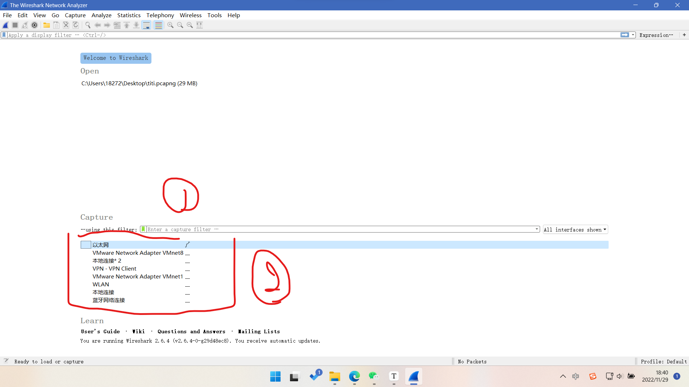
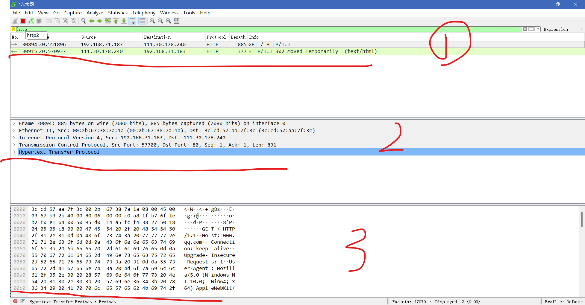
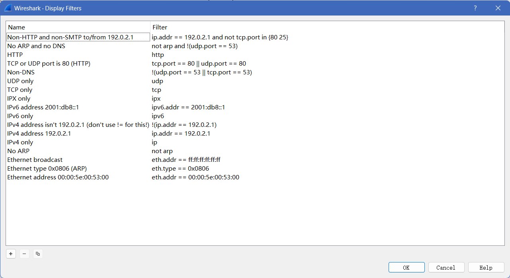
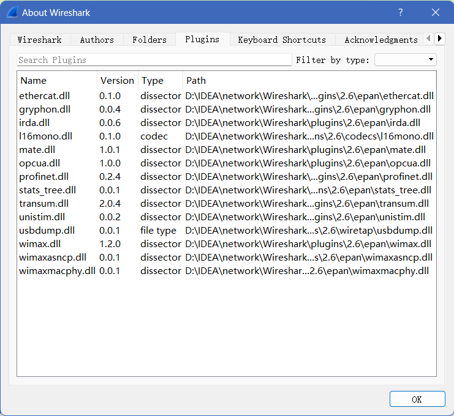

1. 开始界面
   1. 选择网络过滤器，对抓包数据进行过滤
   2. 选择本机网卡，选择本地对外连接的网络，vmware是虚拟机对外的虚拟网卡
2. 抓包界面
   1. 第一部分为抓到的数据包
   2. 第二部分为每一个数据包中不同层次的内容，分别为物理层，数据链路，网络层，传输层，应用层
   3. 第三部分为每一层次的具体二进制转化为16进制后的表示
3. 过滤器
   1. 通过对过滤器框输入过滤器表达式来进行过滤
      1. 表达式支持布尔运算，使用and or not等
   2. 在anlazy->dispaly filter中可查看不同表达式对应的过滤效果，同时也可以添加表达式
   3. 输入框为红色代表表达式书写错误，绿色表示可执行
4. 在help->about wireshark中可以查看到配置文件
   1. 有路径以及配置