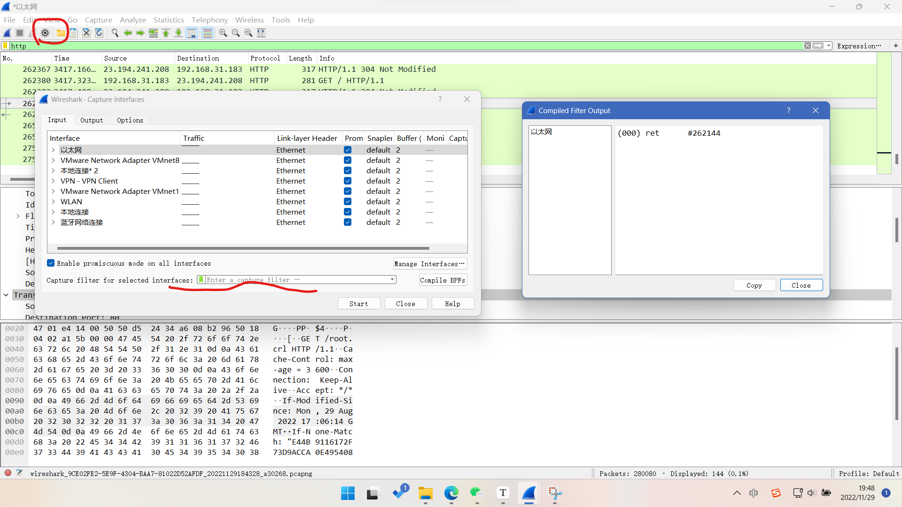

1. 语法：BPF采用与自然语言相近的语法，利用语法构造字符串确定保留具体符合规则的数据包而忽略其他数据包
   1. 主体 运算符 值 布尔表达式 主体
2. 规则：
   1. type表示对象 如ip地址，子网或端口 host   net  port
   2. dir 表示数据包的传输方向，src   dst
   3. proto 表示与数据包匹配的协议类型  enter ip  tcp  arp
   4. 空字符表示不进行过滤
3. 包过滤器分类：
   1. 捕获过滤器
      1. 基本使用
         1. 提前进行过滤器与网卡设置
         2. 可在开始界面和之后界面进行调整
   2. 筛选过滤器（显示过滤器）
      1. 在形成的抓包文件上再进行数据包的过滤
      2. 可以使用抓包数据中的信息进行过滤，选中目标，右键，anlazy，选中布尔方式