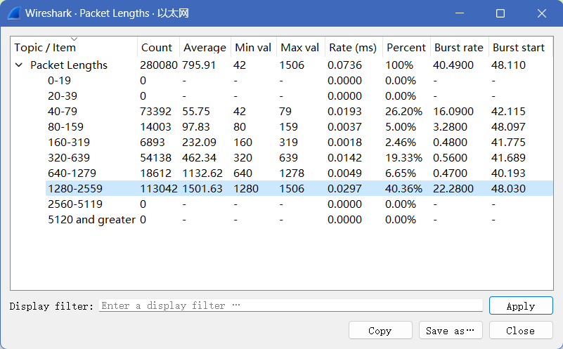
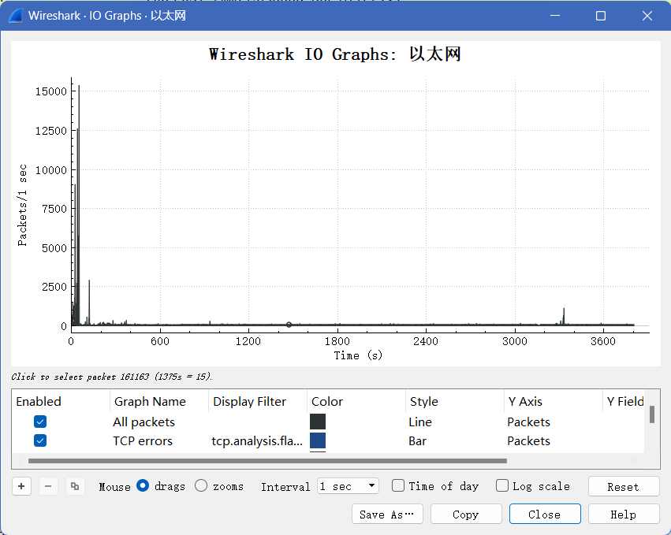
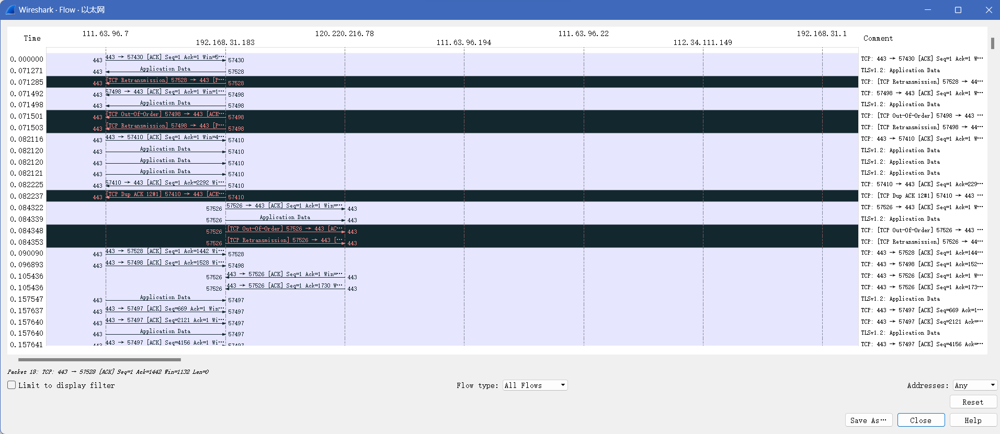
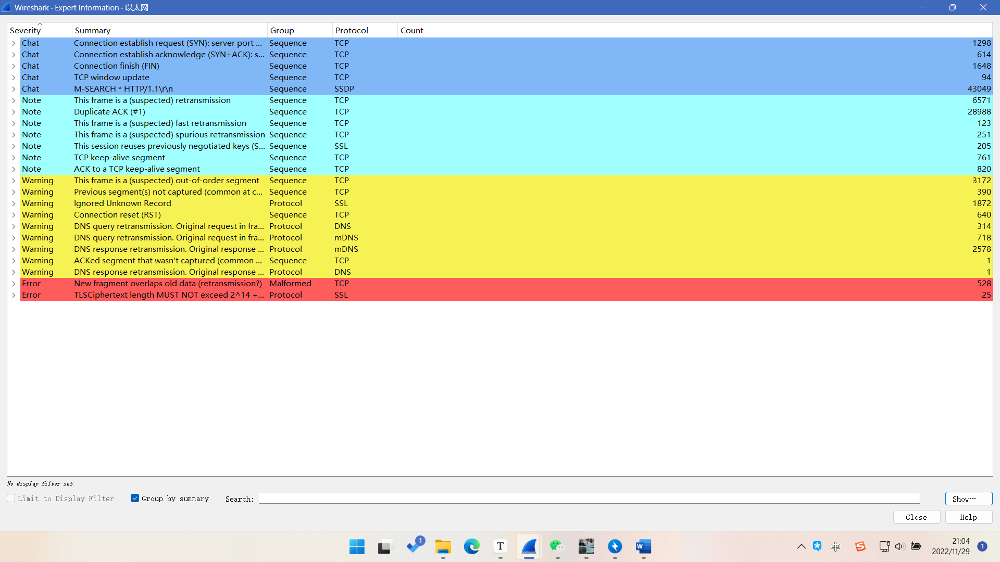
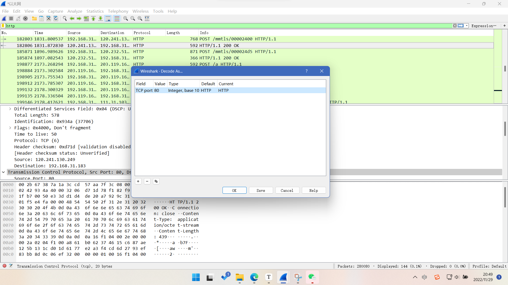

1. 对生成的文件进行统计分析
   1. 数据包长度分析
      1. 对于1280-2559，其传输数据基本为文件
      2. 40-79，其传输的数据基本为协议
   2. 数据包IO统计
      1. 可以分别设置不同的过滤器，对不同的过滤器使用不同的统计图样式，如颜色，线段样式（点，线）
   3. 数据流图：以数据为对象，进行分析
      1. 可以查看到数据在不同网络中的流传情况
   4. anlazy->export information
      1. 可以网络情况进行分析，比如出现错误和警告的情况，对这类信息可直接进行查看
2. 对于特殊的协议，由于协议的解析不同，有时可能会导致错误的结果，可手动对协议解析进行调整
   1. 选中协议，右键， decode as，进行之前协议到目标协议的更改