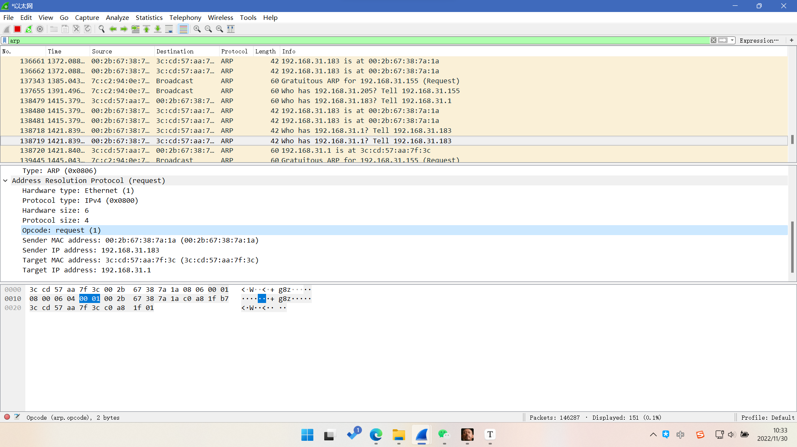
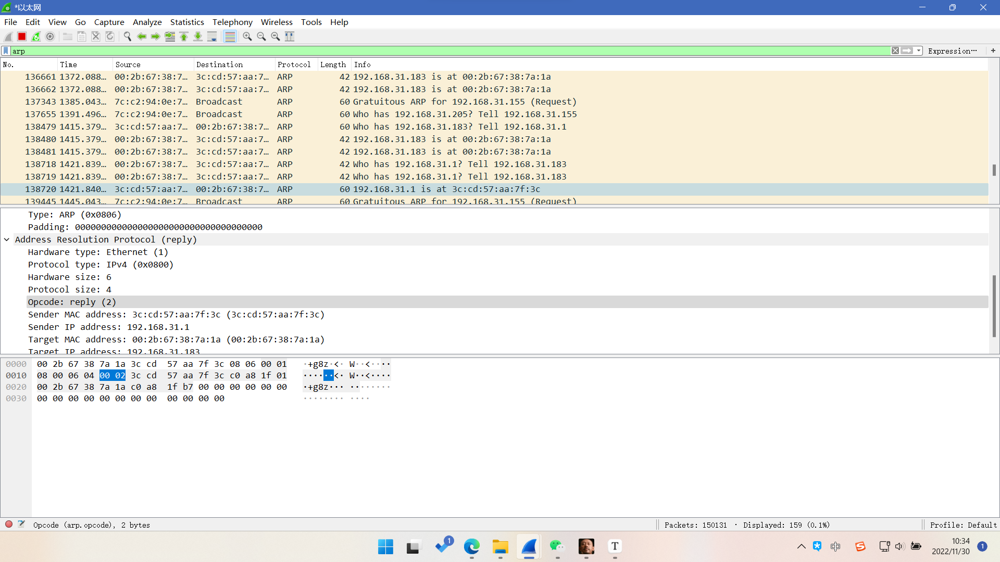
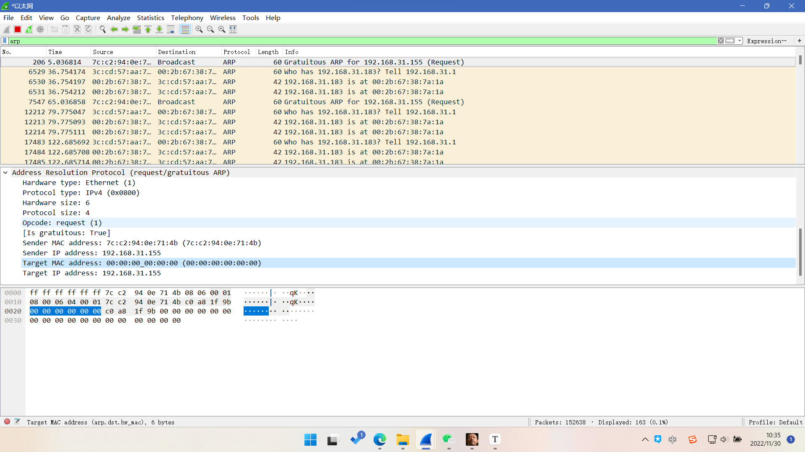
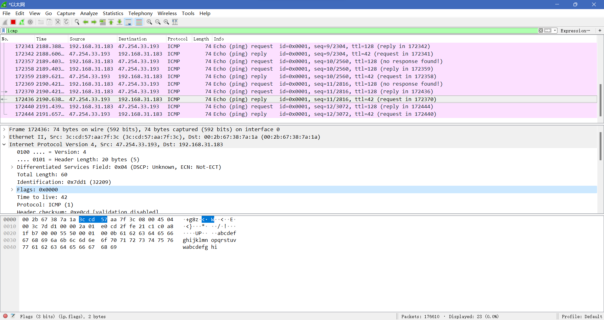

1. ARP协议
   1. 用途：为物理主机之间通过IP地址映射MAC地址的协议，当一个主机找寻一个ip地址时，向其子网发送询问广播，只有为这个ip地址的主机收到该广播才进行回复，最终在路由中形成一个ARP表，存活时间为120S。设备可向其他设备发送自己的arp表，来进行同步更新。其使用==tcp==进行数据的传输
   2. arp请求
      1. 请求为request（1），其源ip地址为本机地址，目的ip地址为待查询ip地址
   3. 回复
      1. 回复为replay（2）
   4. 免费arp协议
      1. source ip 与target ip均为本机ip，而发送mac为本地mac，接受mac为全零，相当于发送广播。
2. IP协议
   1. ttl最大路程节点，每进过一个节点（路由）ttl-1
   2. ICMP协议
      1. mtu最大传输单元，超过mtu进行分片，若在flag后为more fragment，则代表产生了分片，id代表数据包，offset代表在该数据包中的偏移量
3. TCP与UDP
   1. tcp
      1. 三次握手
      2. 四次挥手
         1. 当掉线时，使用rst进行连接终止
      3. 滑动窗口
         1. 最大缓存区，流水线传输
         2. len=0，表示数据部分长度为0，但是含有tcp头部
   2. udp
      1. 