**一、免费ARP概述**

网络世界纷繁复杂，除了各种[黑客攻击](https://so.csdn.net/so/search?q=%E9%BB%91%E5%AE%A2%E6%94%BB%E5%87%BB&spm=1001.2101.3001.7020)行为对网络能造成实际破坏之外，还有一类安全问题或泛安全问题，看上去问题不大，但其实仍然可以造成极大的杀伤力。今天跟大家探讨的，也是技术原理比较简单，但实际防范比较头疼的一个问题：**地址冲突**。

这个局域网中，大家所在IP[网段](https://so.csdn.net/so/search?q=%E7%BD%91%E6%AE%B5&spm=1001.2101.3001.7020)是192.168.1.0/24，PC1的地址是192.168.1.1，而PC2和PC3的地址发生冲突，都是192.168.1.2。那么，如果PC1需要将数据包发送给192.168.1.2，数据包最终到了PC2还是PC3手里？还是负载均衡？不管结果如何，这里的地址冲突肯定会对正常通信造成麻烦。

上面这个电脑/手机之间的地址冲突，大家可能觉得没什么太大的问题，那么接下来再看下面这个图片=>

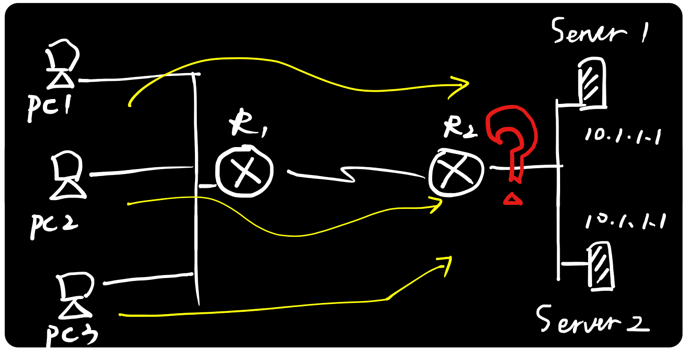

这里的Server1和Server2处在 \[服务集群\]中，提供着企业的某种服务，例如Web网站、邮箱系统、FTP文件服务器等，此时服务器的地址发生了冲突，都是10.1.1.1。这种地址冲突则会影响大规模的用户无法访问这个服务器，**若服务器承载的是核心业务，对于企业则会造成极大的影响**。

所以，**地址冲突问题可大可小，可能网络运维人员部署上的疏忽，也可能是普通电脑小白无意导致的，更有可能是主动的黑客行为**，例如攻击者制造地址冲突场景，扰乱正常业务，导致业务服务中断。

因此，**如何在IP地址冲突的时候及时检测，并且做出解决方案呢？**

**二、免费ARP原理**

**Gratuitous ARP，被翻译为『免费ARP』也被称为『无故ARP』，用于检测局域网内的IP地址冲突**，在一定程度上能够给用户和网络运维人员提供帮助。相比『免费』这个翻译，『无故』这个词其实会更加好理解："**在没有人问自己的情况下，无缘无故自问自答**"。

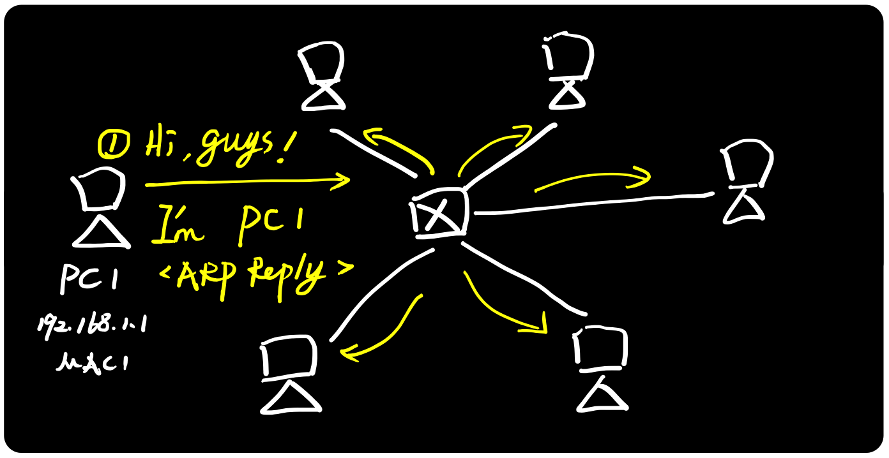

这项技术不需要电脑和服务器安装什么安全软件或产品例如防火墙之类的，也不需要交换机和路由器购买什么license，只要设备具备联网功能（有网卡）就内置了这项功能，由于免费[ARP](https://so.csdn.net/so/search?q=ARP&spm=1001.2101.3001.7020)本质是ARP协议的实现，所以只要有TCP/IP协议栈的网卡，就能支持。相比其他安全防御技术，**免费ARP是一项轻量级的"用户无感知"的技术。**

接下来，我们来回顾下之前的图片=>

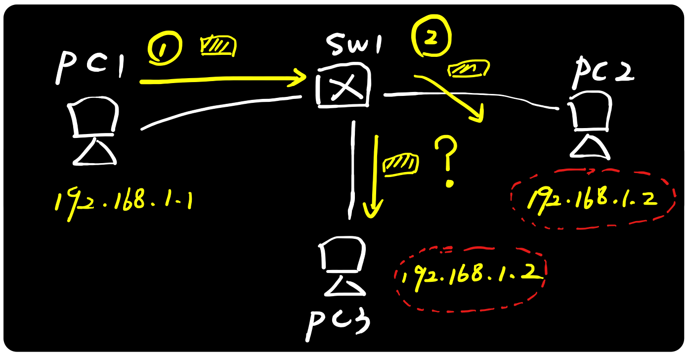

当用户发送数据包给192.168.1.2的时候，交换机会将数据包转发给谁呢？

①根据我们之前学过的ARP原理，交换机会拆开这个数据包，并且**根据目的MAC进行转发**；

②那么PC1在数据封装的时候，**目的MAC是封装PC2还是PC3的MAC**？

③**目标MAC则取决于电脑本地的ARP缓存表**，所以PC1最终把数据包给PC2还是PC3，则取决于收到的ARP回应，并且根据"**后到优先**"原则作出选择。

所以，若PC2提前回应ARP，则PC1一直发给PC3；若PC3提前回应ARP，则PC1一直发送给PC2。还有一种情况，PC2和PC3交替回应ARP，PC1有可能将部分数据给PC2，部分数据给PC3（而PC1则处于懵逼状态，因为关于192.168.1.2的MAC映射一直在变动）。这个更多是理论推导，**实际情况不同设备测试出来的效果有些差异，后面章节我会带大家做真实和虚拟网络的实验**。

我们来看看免费ARP是如何工作的并介入这场冲突的？

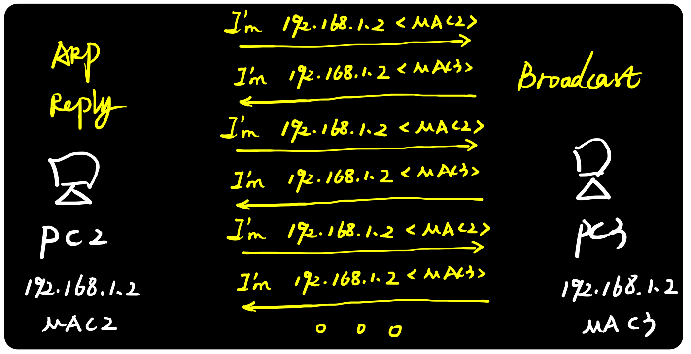

当电脑检测到自己的IP地址跟其他电脑冲突时，它们会相互发送**免费ARP（"互怼"）**，用来提醒对方：**你的IP地址跟我的冲突啦！** 这里要注意一点：免费ARP是**以ARP Request或Reply广播形式**发送，将IP和MAC地址信息绑定，并宣告到整个局域网。如果在宣告的过程中，其他电脑监听到，并且地址跟自己一样，也会直接参与这个**"互怼"**过程。 

上面PC2和PC3一直不停地对外发送免费ARP：我的地址是192.168.1.2，MAC是xxx。与此同时，同一局域网的其他主机，则根据这两个免费ARP信息不断的修改本地ARP表，192.168.1.2一会映射到MAC2，一会映射到MAC3。

那么，**这个混乱的争抢过程，会不会停下来呢？**

可能会持续一段时间，也可能一直持续下去（后面有实验验证）。冲突方之间可能会一直发送，直到有一边做出让步并修改IP地址。（不同系统解决方法不同）

很多人在这里开始有疑惑，即便免费ARP帮我们检测到了地址冲突，但是也是在协议底层在"互怼"，**我们作为"主人"，如何收到地址冲突提示，并且做出修改和让步呢？**因为无论是普通用户还是专业工程师，也不可能天天挂在wireshark这种抓包软件，时时刻刻盯着免费ARP包，判断是否有人跟我们地址冲突了。所以，这又涉及到电脑（操作系统）如何根据免费ARP的地址冲突检测，更好地提示或帮助用户了。

目前行业的解决方案是这样的：如果是**图形化**操作系统，例如Windows或者MacOS，是通过系统**弹框**的方式提示用户；而如果是**命令行**操作系统（交换机/路由器/防火墙），则通过**日志**报错信息提示用户。

也就是说，无论普通电脑还是专业的防火墙设备，通过免费ARP检测到地址冲突之后，设备都会弹出来跟他说：**喂，主人，你地址跟人家冲突了，该改改了！**

这是Windows和MacOS的地址冲突弹框告警，引导用户修改本机IP地址=>

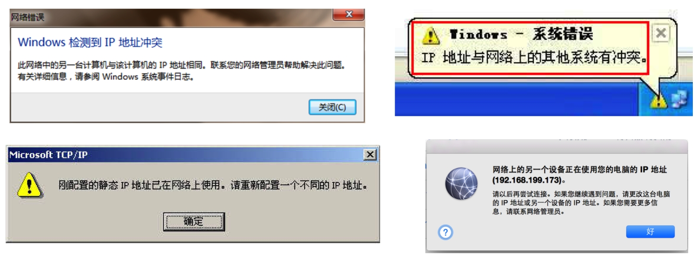

这是思科路由器IOS（网际操作系统）的地址冲突日志信息，引导网络运维人员修改IP地址=>

**%IP-4-DUPADDR: Duplicate address** 192.168.1.2 on FastEthernet0/0, sourced by cc02.394f.0000

所以，当地址发生冲突时，根据免费ARP引起的弹框和日志告警，用户或者管理员便可以对IP地址进行修改，从而解决通信问题。例如，下面的PC2和PC3，只要一方修改了地址即可 =>

**三、免费ARP实战指南**

免费ARP出现的场景非常多，例如**地址冲突时、地址修改或变更时、DHCP分发地址时、网关冗余协议交互时（例如HSRP）、TFTP传输数据时**…… 

不同的场景，抓到的免费ARP数据包，底层结构都会有所差异，可能是基于ARP请求广播发送的，也可能是基于ARP回应广播发送的（没看错！ARP回应这里是广播方式）

为了让大家"亲眼所见"，同时可跟着我一起实践，更好吸收这块的知识，这里我设计了真实和虚拟网络来进行实战，并抓取免费ARP数据包，通过数据包解构原理。

**（一）真实网络下 免费ARP实战**

**① 跟上一篇文章中代理ARP的真实网络一样，我的网络拓扑是这样的：**

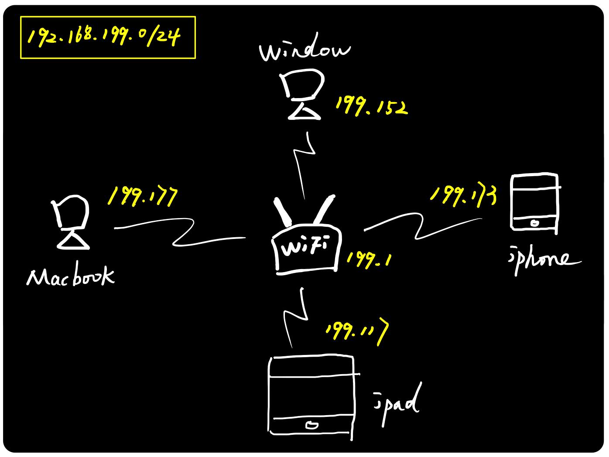

为了让这个实验更有通用性，我加入了一台Windows电脑。此时登录无线路由器（极路由）查看局域网主机列表：

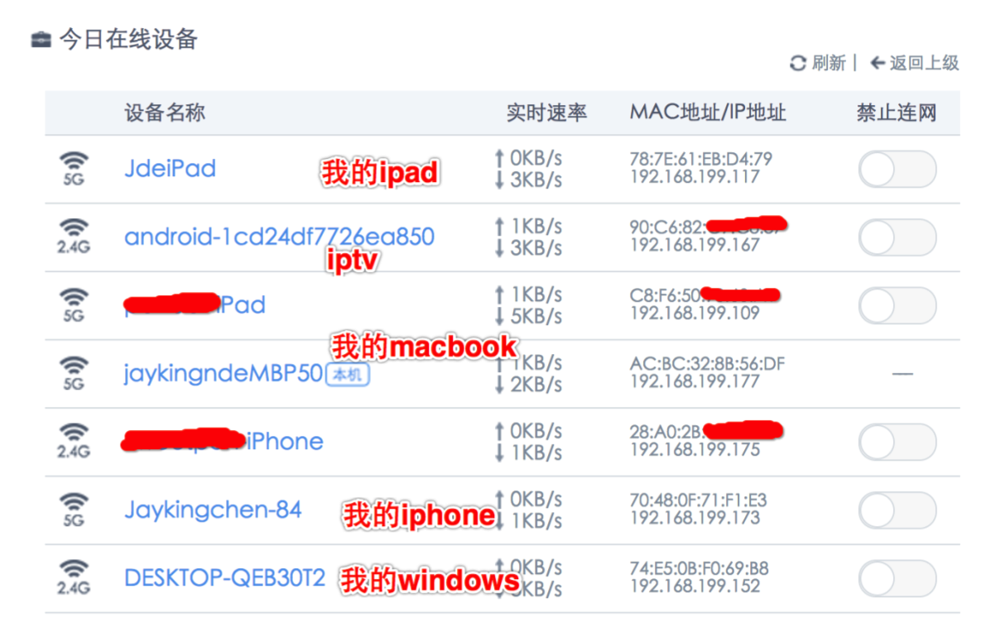

**还是原来的配方.... 苹果全家桶和一台Windows电脑。**实物图大概是这样的：

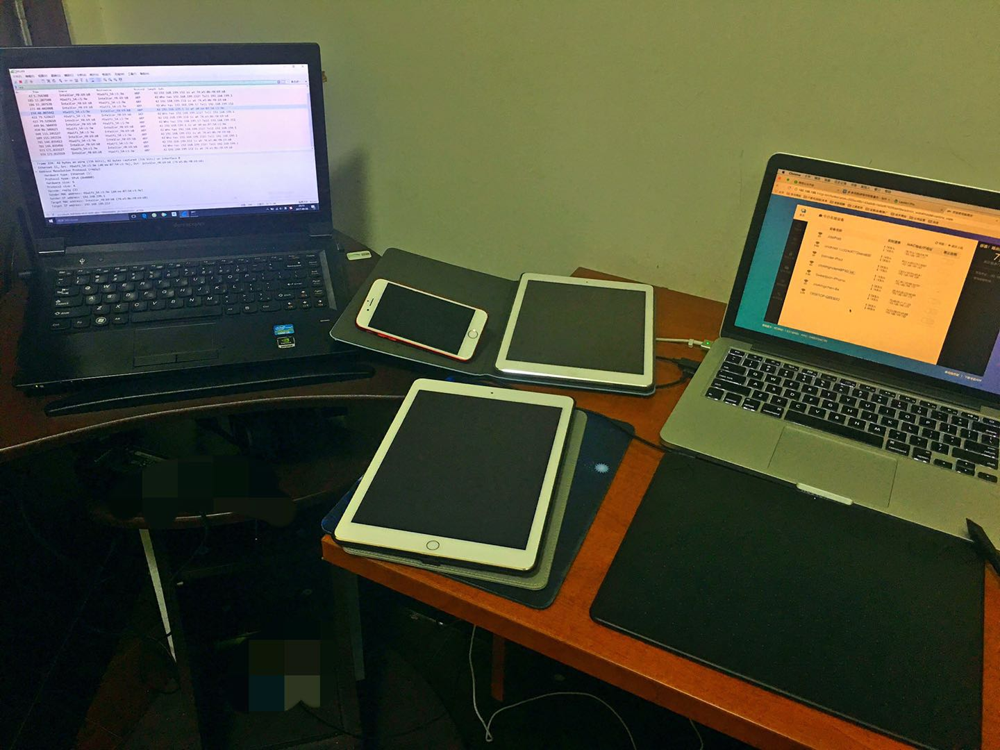

② 接下来，为了看到地址冲突时，免费ARP的数据包交互，我们在Windows和MacOS同时开启Wireshark并抓包本机电脑的数据包，设置arp过滤。

**macbook端截图如下：**

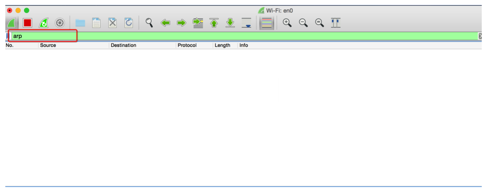

**Windows端截图如下：**（Windows 10跟无线路由器一直在交互）

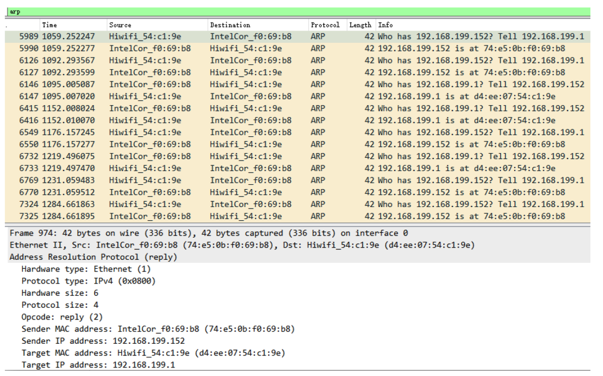

**③在Mac端，将IP地址设置为跟Windows地址一样**，**从192.168.199.177改为192.168.199.152**

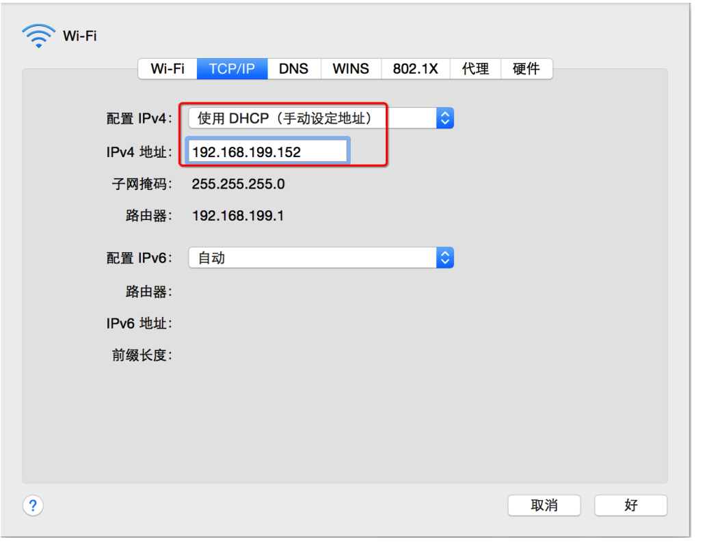

点击应用之后，开始观察两边电脑弹框和wireshark的ARP包交互过程=>

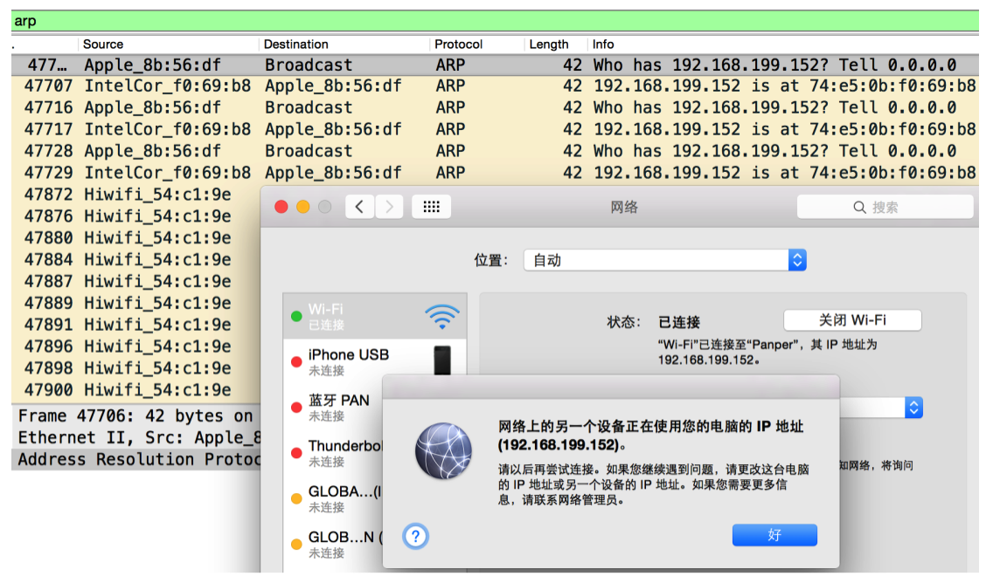

上图可以看到macbook的弹框告警了，接下来我们来分析下此时Mac和windows抓到的数据交互过程=>

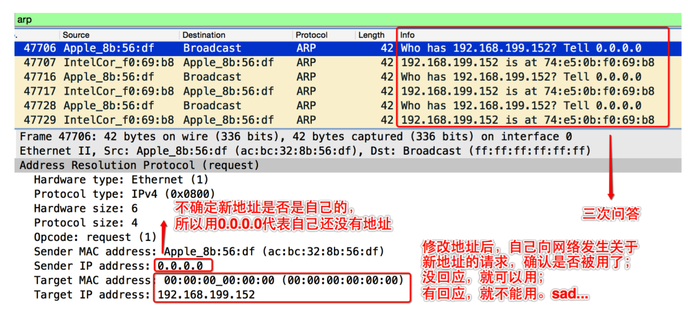

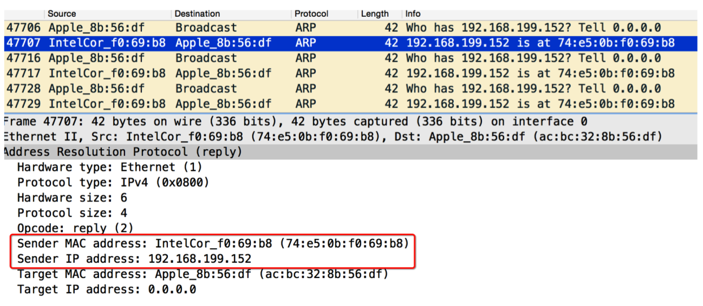我的windows电脑很明确的回应Mac电脑：**这个地址199.152，已经被我用了**。这个过程重复了3次。根据抓包，**这个过程后面还在不断的持续中，不管在win还是mac，都能抓到类似的问答过程**。

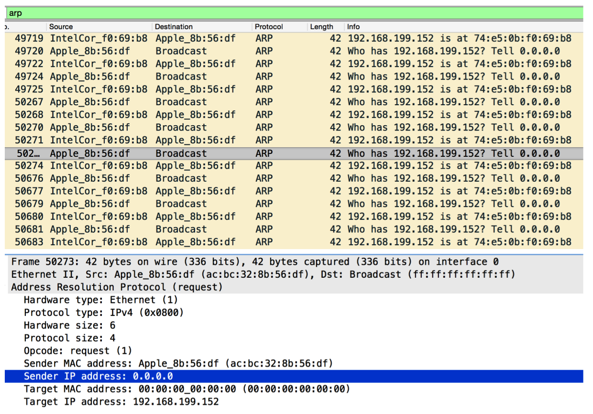

由于macbook电脑**此刻不能上网**，所以还"**不屈不挠**"地询问着，它在想：没准windows下线了，没有回应了呢？（如果windows没有回应，则说明它下线了或改为其他地址了，那么macbook就可以使用）

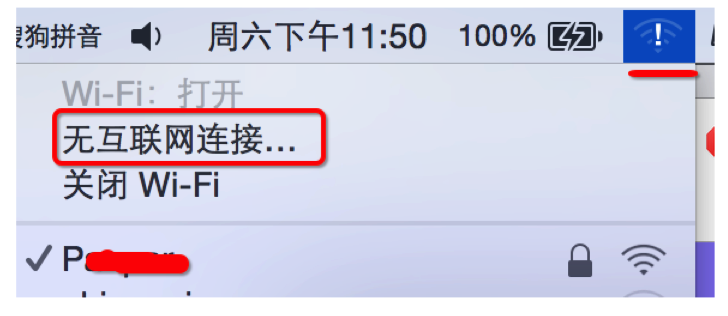

**④ 接下来，我们将windows的网络断开，然后在macbook这端观察arp交互和网络连接状态：**

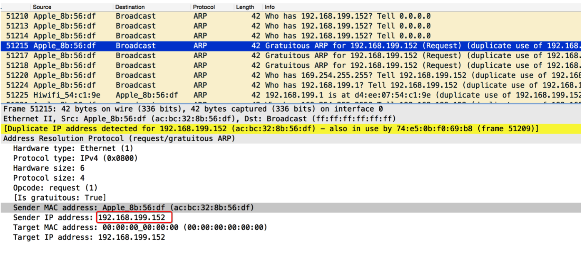

此时，macbook跟往常一样发生三个arp请求，询问152这个地址是否有人使用，**由于windows已经下线，所以三次都没有应答**。紧接着有三个gratuitous arp数据包，跟上面三个请求包几乎是一样的，只有一个区别，就是发送者的IP地址此时从0.0.0.0修改为192.168.199.152。这意味着**mac确认了152没有其他人使用，并且认为此刻自己有资格用上152这个地址了**。

从wireshark抓包来看，之前的arp请求好像没有标记**"gratuitous"**这个关键词，那么算不是是免费arp或者无故arp呢？这个其实也是比较多讨论和争议。如果从**"自己问自己的角度**"出发，这两种arp都算是免费arp，因为都是在问自己配置的这个新地址192.168.199.152，而且**目的都是一致的，都是为了检测是否地址可用是否存在冲突**。

当然，更严谨的的免费arp包，则是**需要"发送方ip"和"接收者ip"是一致的**，就是下面这种arp请求包，都有192.168.199.152这个地址。所以，这一小知识点的话，我个人觉得不用太纠结，通过数据包结构还原整个免费arp工作原理才是最重要的。

从wireshark截图可以看到，经过了上面这些免费ARP的请求之后，由于一直没有其他设备回应152这个地址，所以macbook电脑再次询问网关192.168.199.1的物理地址，拿到网关的ARP回应之后，我的macbook便可以正常通信了。

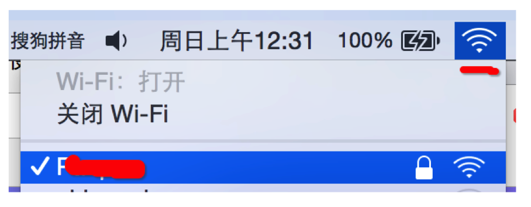

**⑤【接下来是拓展内容，涉及dhcp协议，新手的话可暂时忽略这一小段...】**

这个实验还可以继续深挖下来，此时**让windows电脑重新接入这个wifi网络**，之后同样会出现免费arp的交互过程，只不过多了一个dhcp协议交互，并且最终windows使用了192.168.199.153这个地址接入wifi网络。先整理下流程再截核心数据包=>

1. 当windows重新接入网络之后，会通过dhcp重新获取192.168.199.152这个地址（由于macbook的152这个地址是由我手工静态指定的而不是路由器分配，所有路由器仍然通过dhcp地址池分配）；
2. windows收到这个地址之后，第一时间便发送免费arp包进行地址检测，但是发现这个地址已经被macbook占用了！因此，通过dhcp decline数据包向无线路由器取消这个地址；
3. windows重新获取192.168.199.153这个地址，通过免费arp重新检测，发现没有人回应了，说明这个地址可用，后续用这个地址接入wifi网络。

**windows重新接入网络的dhcp交互包=>**

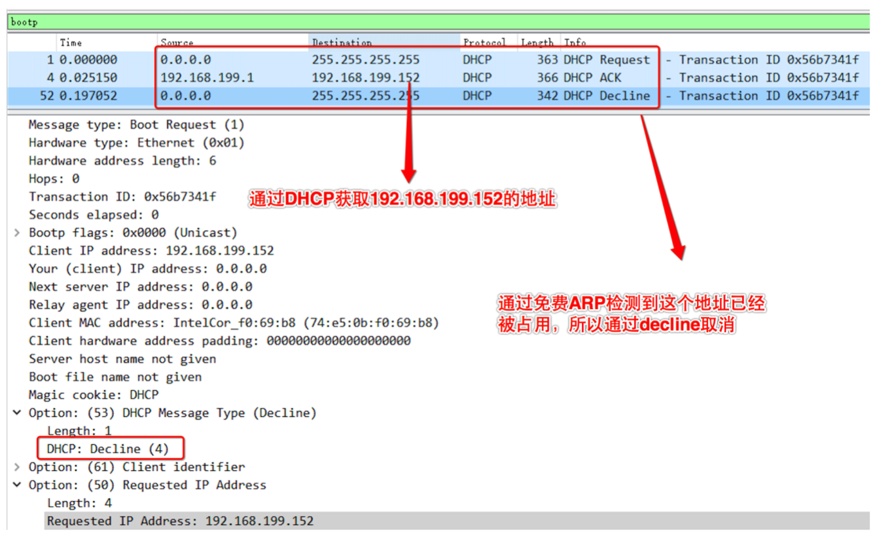

**windows获取地址后通过免费arp检测到macbook=>**

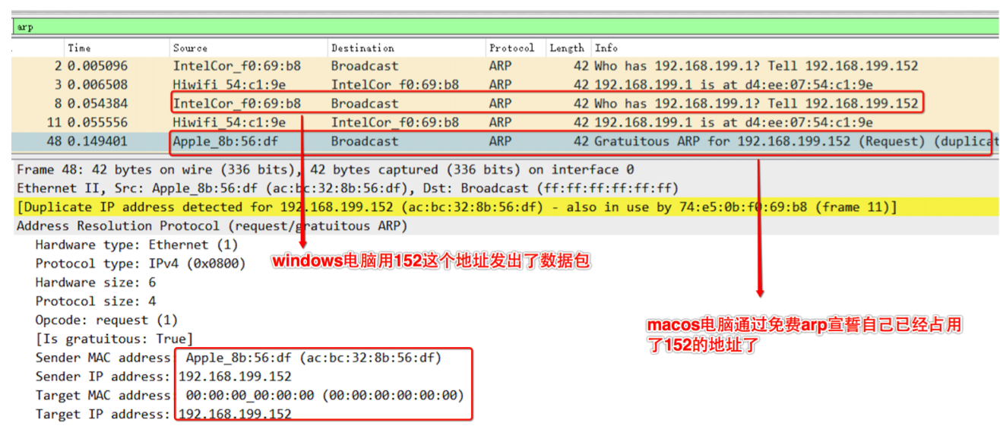

**windows通过dhcp decline放弃152，并重新获取153这个地址=>**

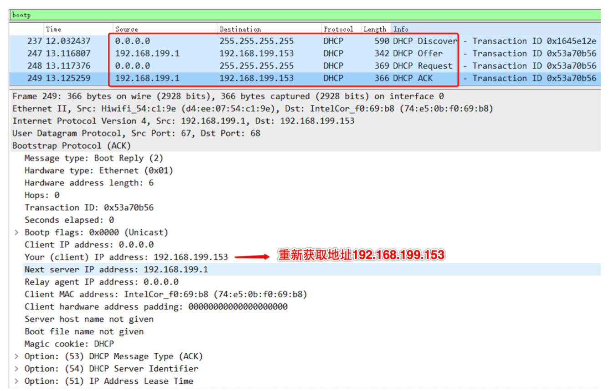

**windows通过免费arp检测，发现153地址没其他人用，所以接入了网络=>**

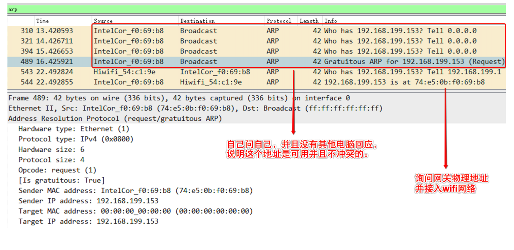

**总结：**通过这个真实网络，我们构造了windows和macbook地址冲突的环境，通过wireshark抓取免费arp数据包，学习了免费arp的地址检测功能以及数据包结构。

**①当电脑（手工）修改的地址跟局域网其他主机地址一样的时候，通过免费arp协议，电脑会弹框提醒并无法上网；**

**②当相同地址的电脑其中一台下线时，通过免费arp可以证明此地址可使用（没人争抢/回应），此时便可接入网络；**

**③当电脑通过DHCP获取地址时，会通过免费arp检测这个地址是否可用，若已经被使用，则重新通过dhcp获取新的地址，再接入互联网。**

**④这里抓取的免费ARP包是请求广播包，并且特征是"自己问自己"。**（"自己答自己"的回应广播包，在下面的实验有）

**（二）虚拟网络下 免费ARP实战**

网络拓扑采用GNS3搭建，采用C3640操作系统镜像=>

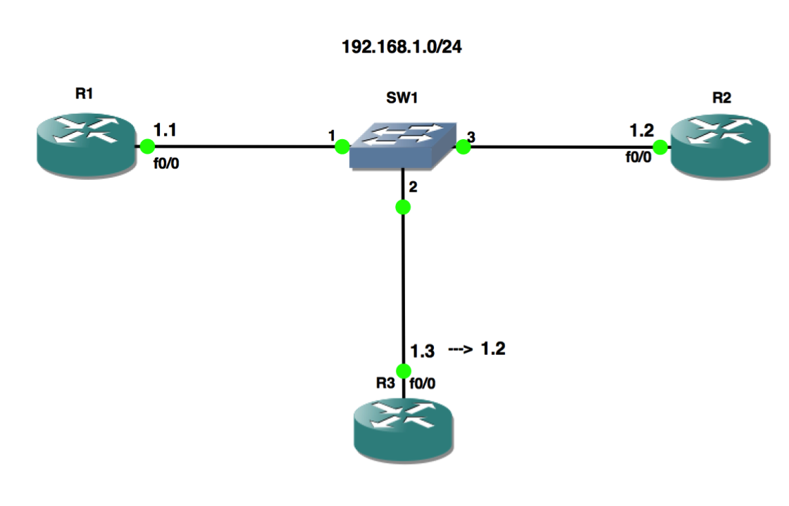

①为每个路由器配置IP地址，所在网段为192.168.1.0/24=>

R1(config)#int f0/0

R1(config-if)#no sh

R1(config-if)#**ip add 192.168.1.1 255.255.255.0**

R2(config)#int f0/0

R2(config-if)#no sh

R2(config-if)#**ip add 192.168.1.2 255.255.255.0**

R3(config)#int f0/0

R3(config-if)#no sh

R3(config-if)#**ip add 192.168.1.3 255.255.255.0**

②在路由器相连链路上抓包，路由器相互PING通，并查看ARP表=>

（这里用R1举例，其他类似）

**R1#ping 192.168.1.2**

Type escape sequence to abort.

Sending 5, 100-byte ICMP Echos to 192.168.1.2, timeout is 2 seconds:

!!!!!

Success rate is 100 percent (5/5), round-trip min/avg/max = 64/64/64 ms

**R1#ping 192.168.1.3**

Type escape sequence to abort.

Sending 5, 100-byte ICMP Echos to 192.168.1.3, timeout is 2 seconds:

!!!!!

Success rate is 100 percent (5/5), round-trip min/avg/max = 64/64/68 ms

**R1#show arp**

Protocol  Address          Age (min)  Hardware Addr   Type   Interface

Internet  192.168.1.1             -   cc00.394f.0000  ARPA   FastEthernet0/0

Internet  192.168.1.3             0   cc02.394f.0000  ARPA   FastEthernet0/0

Internet  192.168.1.2             0   cc01.394f.0000  ARPA   FastEthernet0/0

③让R3和R2的地址冲突，例如将R3的地址从192.168.1.3配置为192.168.1.2，在R2和R3上面开启arp调试"**debug arp**"，在R1上面查看ARP表，通过wireshark观察底层免费ARP包交互过程=>

**R3(config)#int f0/0**

**R3(config-if)#ip add 192.168.1.2 255.255.255.0**

一旦R3设置了上面的地址，跟R2冲突之后，此时R2和R3的命令行界面开始**不停断"刷屏"**\=>

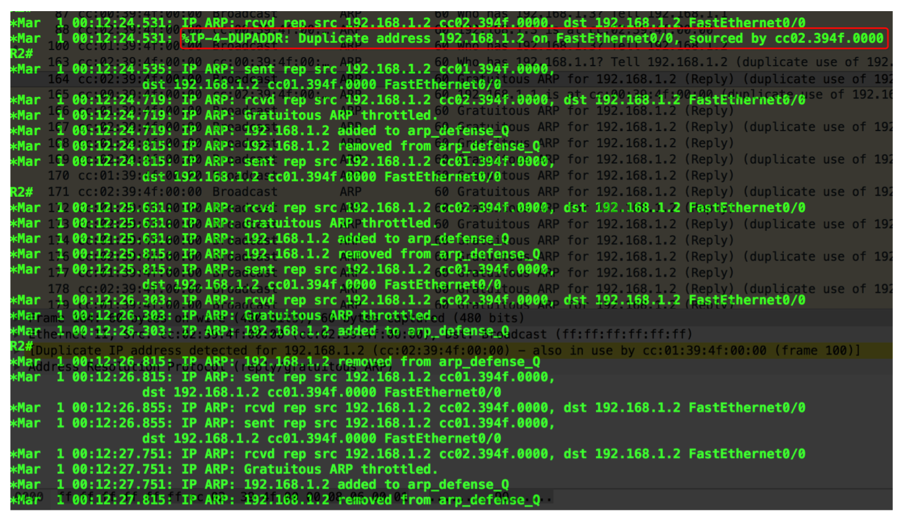

**核心日志信息：**

R2#

\*Mar  1 00:13:25.519: %IP-4-DUPADDR: **Duplicate address 192.168.1.2** on FastEthernet0/0, sourced by cc02.394f.0000

R2#

\*Mar  1 00:13:56.259: %IP-4-DUPADDR: **Duplicate address 192.168.1.2** on FastEthernet0/0, sourced by cc02.394f.0000

R2#

\*Mar  1 00:14:27.167: %IP-4-DUPADDR: **Duplicate address 192.168.1.2** on FastEthernet0/0, sourced by cc02.394f.0000

虽然网络设备没法像Windows或者Macos弹框告警，但是通过日志提示同样可以达到同样的目的，让网络运维人员作出修改。

Cisco IOS通过免费ARP检测到地址冲突之后，解决的方法**相对"暴力"**，例如，R2和R3直接会持续发送**免费ARP（reply广播包）**，直到地址冲突问题被解决掉。可以通过wireshark数据包观察=>

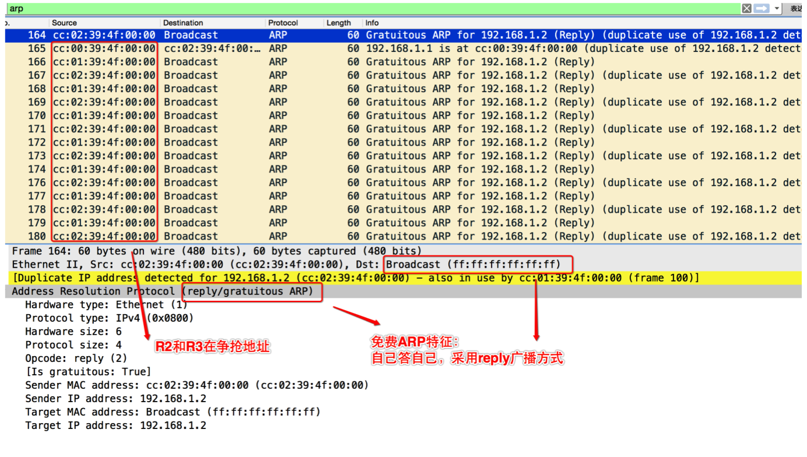

此时再观察R1上面的ARP表，关于192.168.1.2这个地址的映射信息：

R1#show arp

Protocol  Address          Age (min)  Hardware Addr   Type   Interface

Internet  192.168.1.1             -   cc00.394f.0000  ARPA   FastEthernet0/0

Internet  192.168.1.3             6   cc02.394f.0000  ARPA   FastEthernet0/0

**Internet  192.168.1.2             0   cc02.394f.0000  ARPA   FastEthernet0/0**

R1#show arp

Protocol  Address          Age (min)  Hardware Addr   Type   Interface

Internet  192.168.1.1             -   cc00.394f.0000  ARPA   FastEthernet0/0

Internet  192.168.1.3             6   cc02.394f.0000  ARPA   FastEthernet0/0

**Internet  192.168.1.2             0   cc01.394f.0000  ARPA   FastEthernet0/0**

R1#show arp

Protocol  Address          Age (min)  Hardware Addr   Type   Interface

Internet  192.168.1.1             -   cc00.394f.0000  ARPA   FastEthernet0/0

Internet  192.168.1.3             6   cc02.394f.0000  ARPA   FastEthernet0/0

**Internet  192.168.1.2             0   cc02.394f.0000  ARPA   FastEthernet0/0**

R1#show arp

Protocol  Address          Age (min)  Hardware Addr   Type   Interface

Internet  192.168.1.1             -   cc00.394f.0000  ARPA   FastEthernet0/0

Internet  192.168.1.3             6   cc02.394f.0000  ARPA   FastEthernet0/0

**Internet  192.168.1.2             0   cc01.394f.0000  ARPA   FastEthernet0/0**

……

可以看到，由于**免费ARP是一种广播的形式，所以R1同处一个局域网可以收到，并且ARP信息被不断修改，一会将192.168.1.2指向R2的MAC地址，一会指向R3的MAC地址**。

这个过程会一种持续下去，直到地址做了修改，这里我们将R3的IP地址重新修改为192.168.1.3，之后网络便恢复了平静。

**总结：**通过这个虚拟网络，我们构造了路由器地址冲突的环境，同样验证了免费ARP能够检测IP地址冲突的功能，当然，这里跟Windows和Macos的处理方式有一些差别，例如Cisco路由器检测到免费ARP之后，会保持非常**高频率的"互怼"过程**，然后不断报出错日志，督促管理员感觉修改地址。除此之外，数据包结构也有差异，**Windows和Macos是"自己问自己"的arp request包，而cisco ios是"自己答自己"的arp reply包**。

**四、总结：地址冲突了怎么办？**

①对于普通用户而言，当看到电脑弹框告警说明地址有冲突时，在不懂技术的情况下，可以**尝试重启家里的路由器**，这样可以重新为局域网的电脑分配地址；

②路由器不是自己的，接入的是租房网络、校园网络等第三方网络，当看到电脑弹框告警说明地址有冲突时并且无法管理路由器的时候，**可以尝试手工修改本机电脑的IP地址**，无论是Windows还是Macos，直接进入网卡设置修改即可，怎么做手工修改呢？例如电脑地址是192.168.1.1，提示冲突的话，那么**可以在原有数字的基础上递增1或者10，直到显示不冲突**，例如修改为192.168.1.2、192.168.1.3或者192.168.1.11、192.168.1.21，以此类推..... （这种方法未必能保证解决，但是在管理员介入之前，至少算是一种解决方案）；

③对于专业的网络和安全运维人员而言，当看到网络地址冲突，则需要**考虑自己的DHCP部署、IP地址规划有没有问题**，或者找出网络中是否有"捣蛋鬼"自己私设IP之类的；

 ④通过本章节的学习，我们掌握了免费ARP不同网络环境下的实现，例如"自己问自己"和"自己答自己"两种广播包方式，也了解了电脑和网络设备的不同机制。