# 5.1 导论

## 网络层功能

回顾:2个网络层功能:

- **转发:将分组从路由器的一数据平面**  
    **个输入端口移到合适的输出端口**
- **路由:确定分组从源到目标控制平面的路径**

2种构建网络控制平面功能的方法:

- **每个路由器控制功能实现（传统)**
  
- **逻辑上集中的控制功能实现(software defined networking)**
  

### 传统方式：每-[路由器](https://so.csdn.net/so/search?q=%E8%B7%AF%E7%94%B1%E5%99%A8&spm=1001.2101.3001.7020)(Per-router)控制平面

在每一个路由器中的单独路由器算法元件，在控制平面进行 交互

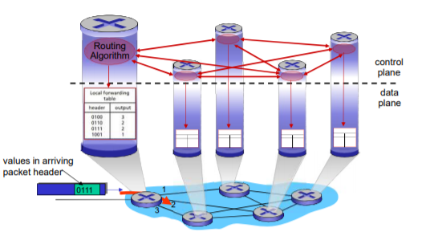

### SDN方式：逻辑上集中的控制平面

一个不同的（通常是远程的）控制器与本地控制代理（CAs） 交互.

上发状态，下发流表

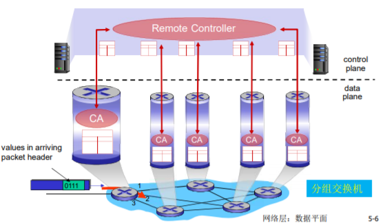

# 5.2 路由选择算法

 link state  distance vector

## 路由(route)的概念

- **路由:按照某种指标(传输延迟,所经过的站点数目等)找到一条从源节点到目标节点的较好路径**
  
    - 较好路径: 按照某种指标较小的路径
    - 指标:站数, 延迟,费用,队列长度等, 或者是一些单纯指标的加权平均
    - 采用什么样的指标,表示网络使用者希望网络在什么方面表现突出,什么指标网络使用者比较重视
- **以网络为单位进行路由（路由信息通告+路由计算）** **一个子网 一个子网 进行路由**
  
    - 网络为单位进行路由，路由信息传输、计算和匹配的代价低
    - 前提条件是：一个网络所有节点地址前缀相同，且物理上聚集
    - 路由就是：计算网络 到其他网络如何走的问题
- **网络到网络的路由= 路由器-路由器之间路由**
  
    - 网络对应的路由器 到 其他网络对应的路由器的路由
    - **在一个网络中：路由器-主机之间的通信，链路层解决**
- 到了这个路由器就是到了这个网络
  

### 网络的图抽象

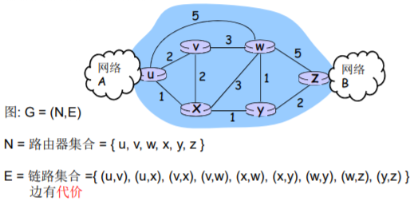

**N = 路由器集合 = { u, v, w, x, y, z }**  
**E = 链路集合 ={ (u,v), (u,x), (v,x), (v,w), (x,w), (x,y), (w,y), (w,z), (y,z) } 边有代价**

### 图抽象：边和路径的代价

• c(x,x’) = 链路的代价 (x,x’) - e.g., c(w,z) = 5  
•代价可能总为１  
•或是 链路带宽的倒数  
•或是 拥塞情况的倒数

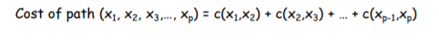

路由的输入：拓扑、边的代价、源节点  
输出的输出：源节点的汇集树

### 最优化原则(optimality principle)

- 汇集树(sink tree) —— Dijkstra算法、Bellman-Ford算法
    - **此节点到所有其它节点的最优路径形成的树** **(源节点)** 到源节点的最短距离
    - **路由选择算法就是为所有路由器找到并使用汇集树**

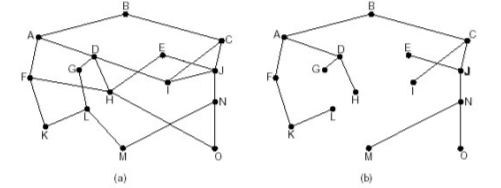

## 路由的原则

路由选择算法的原则

- 正确性(correctness):算法必须是正确的和完整的,使分 组一站一站接力，正确发向目标站；完整：目标所有的 站地址，在路由表中都能找到相应的表项；没有处理不 了的目标站地址；
- 简单性(simplicity):算法在计算机上应简单：最优但复杂 的算法，时间上延迟很大，不实用，不应为了获取路由 信息增加很多的通信量；
- 健壮性(robustness):算法应能适应通信量和网络拓扑的 变化：通信量变化，网络拓扑的变化算法能很快适应； 不向很拥挤的链路发数据，不向断了的链路发送数据；
- 稳定性(stability)：产生的路由不应该摇摆
- 公平性(fairness)：对每一个站点都公平
- 最优性(optimality)：某一个指标的最优，时间上，费用 上，等指标，或综合指标；实际上，获取最优的结果代价较高，可以是次优的

### 路由算法分类

全局或者局部路由信息?

全局:  
 所有的路由器拥有完整的拓和边的代价的信息  
 **“link state” 算法**

分布式:  
 路由器只知道与它有物理连接 关系的邻居路由器，和到相应 邻居路由器的代价值  
 叠代地与邻居交换路由信息、 计算路由信息  
 **“distance vector” 算法**

静态或者动态的?

- **静态:**  
    ** 路由随时间变化缓慢**  
    **非自适应算法(non-adaptive algorithm)： 不能适应网络拓扑和通信量的变化,路由表是事先计算好的**
- **动态:**  
    ** 路由变化很快**  
    ** 周期性更新**  
    ** 根据链路代价的变化而变化**  
    **自适应路由选择(adaptive algorithm)：能适应网络拓扑和通信量的变化** —— 网络拓扑状态和边的代价状态

## 路由选择算法 link state （全局）

### LS路由的工作过程

配置LS路由选择算法的路由工作过程

- 各点通过各种渠道获得整个网络拓扑, 网络中所有链路代价等信息\*\*（这部分和算法没关系，属于协议和实现）\*\*
- 使用LS路由算法,计算本站点到其它站点的最优路径(汇集树),得到路由表
- 按照此路由表转发分组(datagram方式)
    - 严格意义上说不是路由的一个步骤
    - 分发到输入端口的网络层

### 链路状态路由选择(link state routing)

LS路由的基本工作过程

1. **发现相邻节点,获知对方网络地址**
  
2. **测量到相邻节点的代价(延迟,开销)**
  
3. **组装一个LS分组,描述它到相邻节点的代价情况**
  
4. **将分组通过扩散的方法发到所有其它路由器 以上4步让每个路由器获得拓扑和边代价**
  
5. **通过Dijkstra算法找出最短路径（这才是路由算法）**
  
    1. 每个节点独立算出来到其他节点（路由器=网络）的最 短路径
      
    2. 迭代算法：第k步能够知道本节点到k个其他节点的最 短路径
      

[200\. 岛屿数量](https://leetcode-cn.com/problems/number-of-islands/) —— 类似泛洪 FloodFill 算法

1. 发现相邻节点,获知对方网络地址  
     **一个路由器上电之后,向所有线路发送HELLO分组**  
     **其它路由器收到HELLO分组,回送应答,在应答分组中,告知自己的名字(全局唯一)**  
     **在LAN中,通过广播HELLO分组,获得其它路由器的信息, 可以认为引入一个人工节点**

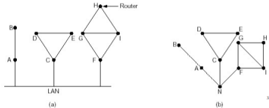

2. 测量到相邻节点的代价(延迟,开销)  
     **实测法,发送一个分组要求对方立即响应**  
     回送一个ECHO分组  
     通过测量时间可以估算出延迟情况
    
3. 组装一个分组,描述相邻节点的情况  
     **发送者名称**  
     序号,年龄  
     列表: 给出它相邻节点,和它到相邻节点的延迟
    

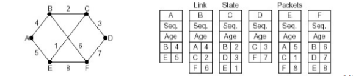

4. 将分组通过扩散的方法发到所有其它路由器
  
    - **顺序号:用于控制无穷的扩散,每个路由器都记录( 源路由器,顺序号),发现重复的或老的就不扩散**
      
        - 具体问题1: 循环使用问题
        - 具体问题2: 路由器崩溃之后序号从0开始
        - 具体问题3:序号出现错误
    - **解决问题的办法:年龄字段(age)**
      
        - **生成一个分组时,年龄字段不为0**
        - **每个一个时间段,AGE字段减1**
        - **AGE字段为0的分组将被抛弃**
    - 关于扩散分组的数据结构  
         **Source** :从哪个节点收到LS分组  
         **Seq,Age**:序号,年龄  
         **Send flags**:发送标记,必须向指定的哪些相邻站点转发LS分组  
         **ACK flags**:本站点必须向哪些相邻站点发送应答  
         **DATA**:来自source站点的LS分组
        
    - 节点B的数据结构
      
        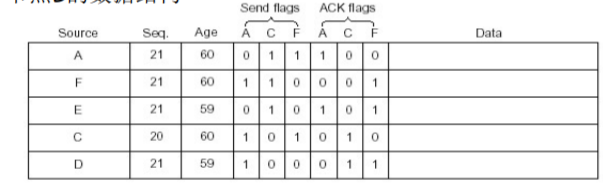
    
5. 通过Dijkstra算法找出最短路径
  
    1. 路由器获得各站点LS分组和整个网络的拓扑
    2. 通过Dijkstra算法计算出到其它各路由器的最短 路径(汇集树)
    3. 将计算结果安装到路由表中

### LS路由选择算法的工作原理

- LS (link state) 的应用情况
  
    - OSPF协议是一种LS协议,被用于Internet上
    - IS-IS(intermediate system- intermediate system): 被用于Internet主干中, Netware
- 符号标记:  
    c(i,j): 从节点i 到j链路代价(初始状态下非相邻节点之间的 链路代价为∞)  
    D(v): 从源节点到节点V的当前路径代价(节点的代价)  
    p(v): 从源到节点V的路径前序节点  
    N’: 当前已经知道最优路径的的节点集合(永久节点的集合)
    
    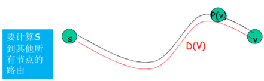
    
- LS路由选择算法的工作原理
  
    - 节点标记: 每一个节点使用(D(v),p(v)) 如： (3,B)标记
        - D(v)从源节点由已知最优路径到达本节点的距离
        - P(v)前序节点来标注
    - 2类节点
        - 临时节点(tentative node) :还没有找到从源 节点到此节点的最优路径的节点
        - 永久节点(permanent node) N’:已经找到了从 源节点到此节点的最优路径的节点
-  初始化
  
    - 除了源节点外,所有节点都为临时节点
    - 节点代价除了与源节点代价相邻的节点外,都为∞
-  **从所有临时节点中找到一个节点代价最小的临时节点,将 之变成永久节点(当前节点)W —— 选择**
  
-  **对此节点的所有在临时节点集合中的邻节点(V) —— 更新**
  
    -  如 D(v)>D(w) + c(w,v), 则重新标注此点, (D(W)+C(W,V), W)
    -  否则，不重新标注
-  **开始一个新的循环 —— 循环**
  

例子:

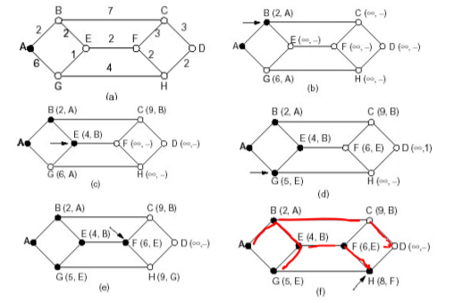

Dijkstra算法的例子

\[外链图片转存失败,源站可能有防盗链机制,建议将图片保存下来直接上传(img-tnnTCzZk-1633167453948)(C:\\Users\\20662\\AppData\\Roaming\\Typora\\typora-user-images\\image-20211002004517248.png)\]

### Dijkstra算法的讨论

算法复杂度: n节点  
 每一次迭代: 需要检查所有不在永久集合N中节点  
 n(n+1)/2 次比较: O(n2 )  
 有很有效的实现: O(nlogn)  
可能的震荡：  
 e.g.,链路代价=链路承载的流量  
路径改变次数过多

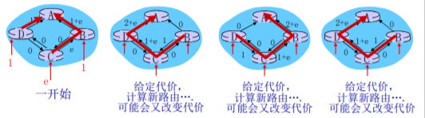

## 路由选择算法 distance vector （分布式）

### 距离矢量路由选择(distance vector routing)

动态路由算法之一

DV算法历史及应用情况

- 1957 Bellman, 1962 Ford Fulkerson
- 用于ARPANET, Internet(RIP) DECnet , Novell, ApplTalk

距离矢量路由选择的基本思想 **以每个点为中心 更新路由表**

- 各路由器维护一张路由表,结构如图(其它代价)
- 各路由器与相邻路由器交换路由表(待续) **邻居与邻居交换代价**
- 根据获得的路由信息,更新路由表(待续) **每个节点算出代价值，改变路径，更新路由表**

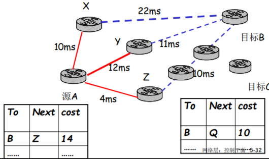

- 代价及相邻节点间代价的获得
    - **跳数(hops), 延迟(delay),队列长度**
    - **相邻节点间代价的获得：通过实测**
- 路由信息的更新
    - **根据实测 得到本节点A到相邻站点的代价（如:延迟）**
    - **根据各相邻站点声称它们到目标站点B的代价**
    - **计算出本站点A经过各相邻站点到目标站点B的代价**
    - **找到一个最小的代价，和相应的下一个节点Z，到达节点 B经过此节点Z，并且代价为A-Z-B的代价**
    - **其它所有的目标节点同样的计算方法**

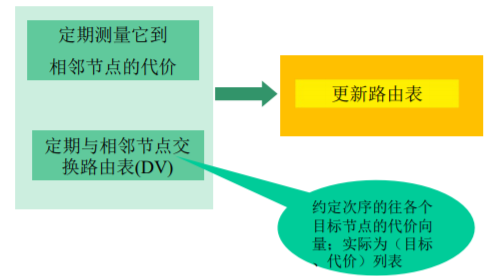

### 距离矢量路由：例子1

- 以当前节点J为例,相邻节点 A,I,H,K
- J测得到A,I,H,K的延迟为 8ms,10ms,12ms,6ms
- 通过交换DV, 从A,I,H,K获得到 它们到G的延迟为 18ms,31ms,6ms,31ms
- 因此从J经过A,I,H,K到G的延迟 为26ms,41ms,18ms, 37ms
- 将到G的路由表项更新为18ms, 下一跳为：H
- 其它目标一样，除了本节点J

### 距离矢量算法

递归风车

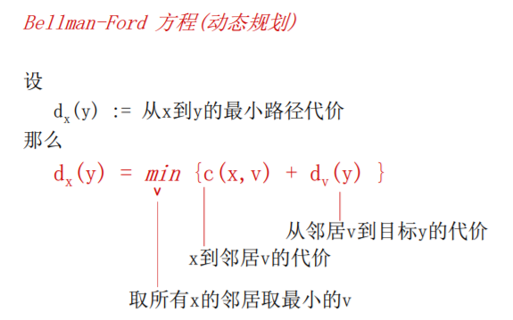

### [Bellman-Ford例子](https://www.bilibili.com/video/BV14x411H7x9?from=search&seid=2324818079252436290&spm_id_from=333.337.0.0)

SPFA —— 优化后的Bellman-Ford

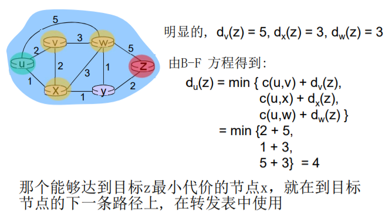

- Dx (y) = 节点x到y代价最小值的估计
    - x 节点维护距离矢量Dx = \[Dx (y): y є N \]
- 节点x:
    - 知道到所有邻居v的代价: c(x,v)
    - 收到并维护一个它邻居的距离矢量集
    - 对于每个邻居, x 维护 Dv = \[Dv (y): y є N \]

### 距离矢量算法特点和问题

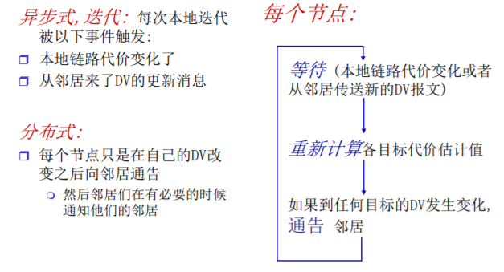

- DV的无穷计算问题
  
    - DV的特点
        - 好消息传的快 坏消息传的慢
    - 好消息的传播以每一个交换周期前进一个路由器 的速度进行
        - 好消息:某个路由器接入或有更短的路径
        - 举例  
            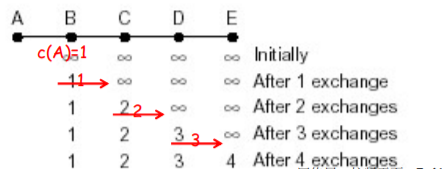
- DV的无穷计算问题
  
    - 坏消息的传播速度非常慢(无穷计算问题)
    - 例子:
        - 第一次交换之后, B从C处获得信息,C可以到达A(C-A, 要经过B本身),但是路径是2,因此B变成3,从C处走
        - 第二次交换,C从B处获得消息, B可以到达A,路径为3, 因此,C到A从B走,代价为3
        - 无限此之后, 到A的距离变成INF,不可达

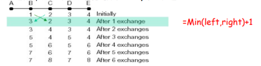

### 水平分裂(split horizon)算法

- 一种对无穷计算问题的解决办法 —— 结局坏消息传的慢的问题
    - **C知道要经过B才能到达A，所以C向B报告它到A的距离 为INF；C 告诉D它到A的真实距离**
    - D告诉E,它到A的距离,但D告诉C它通向A的距离为INF
    - 第一次交换: B通过测试发现到A的路径为INF,而C也告 诉B到A的距离为INF,因此,B到A的距离为INF
    - 第二次交换: C从B和D那里获知,到A的距离为INF,因此 将它到A的距离为INF
    - ……坏消息以一次交换一个节点的速度传播

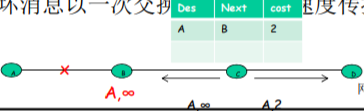

告诉B 无穷，D真实值

### 距离矢量算法例子

## LS 和 DV 算法的比较

**消息复杂度（DV胜出）** O(NE)

**收敛时间（LS胜出）** O(NlogN)

**健壮性（LS胜出）** 节点之间影响较小

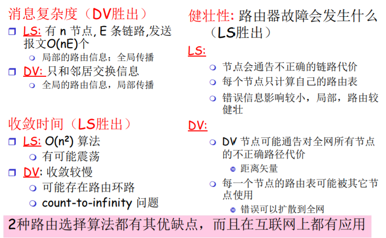

# 5.3 因特网中自治系统内部的路由选择 (实际的、内部的)

## RIP ( Routing Information Protocol)

在 1982年发布的BSD-UNIX 中实现

- **Distance vector 算法**
- 距离矢量:每条链路cost=1，# of hops (max = 15 hops) 跳数
- DV每隔30秒和邻居交换DV，通告
- 每个通告包括：最多25个目标子网

### RIP 通告（advertisements）

- DV: 在邻居之间每30秒交换通告报文
    - 定期，而且在改变路由的时候发送通告报文
    - 在对方的请求下可以发送通告报文
- 每一个通告: 至多AS内部的25个目标网络的 DV
    - 目标网络+跳数  
        一次公告最多25个 子网 最大跳数为16

### RIP: 例子

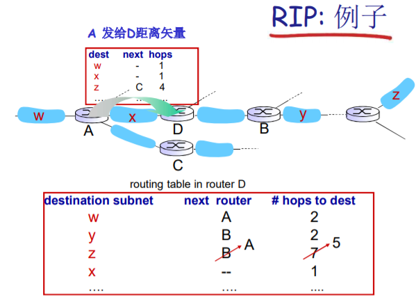

### RIP: 链路失效和恢复

如果180秒没有收到通告信息–>邻居或者链路失效

- 发现经过这个邻居的路由已失效
- 新的通告报文会传递给邻居
- 邻居因此发出新的通告 (如果路由变化的话)
- 链路失效快速(?)地在整网中传输
- 使用毒性逆转（poison reverse）阻止ping-pong回路 ( 不可达的距离：跳数无限 = 16 段)

### RIP 进程处理

- RIP 以应用进程的方式实现：route-d (daemon)
- 通告报文通过UDP报文传送，周期性重复
- 网络层的协议使用了传输层的服务，以应用层实体的 方式实现

## OSPF (Open Shortest Path First)

- “open”: 标准可公开获得
- **使用LS算法**
    - LS 分组在网络中（一个AS内部）分发
    - 全局网络拓扑、代价在每一个节点中都保持
    - 路由计算采用Dijkstra算法
- OSPF通告信息中携带：每一个邻居路由器一个表项
- 通告信息会传遍AS全部（通过泛洪）
    - 在IP数据报上直接传送OSPF报文 (而不是通过UDP和TCP)
- IS-IS路由协议：几乎和OSPF一样

### OSPF “高级” 特性(在RIP中的没有的)

- 安全:所有的OSPF报文都是经过认证的(防止恶意的攻击)
- 允许有多个代价相同的路径存在(在RIP协议中只有一个)
- 对于每一个链路，对于不同的TOS有多重代价矩阵
    - 例如:卫星链路代价对于尽力而为的服务代价设置比较低，对实  
        时服务代价设置的比较高
    - 支持按照不同的代价计算最优路径，如:按照时间和延迟分别计  
        算最优路径
- 对单播和多播的集成支持:
    - Multicast OSPF(MOSPF)使用相同的拓扑数据库，就像在OSPF中一样
- 在大型网络中支持层次性OSPF

### 层次化的OSPF路由

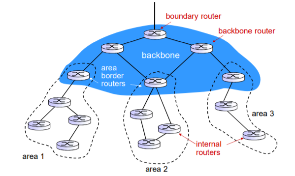

### 层次性的OSPF路由

- 2个级别的层次性: 本地, 骨干
    - 链路状态通告仅仅在本地区域Area范围内进行
    - 每一个节点拥有本地区域的拓扑信息；
- 关于其他区域，知道去它的方向，通过区域边界路 由器（最短路径）
- 区域边界路由器: “汇总（聚集）”到自己区域 内网络的距离, 向其它区域边界路由器通告.
- 骨干路由器: 仅仅在骨干区域内，运行OSPF路由
- 边界路由器: 连接其它的AS’s.

# 5.4 ISP之间的路由选择: BGP

## 层次路由

一个平面的路由

- 一个网络中的所有路 由器的地位一样
- 通过LS, DV，或者其 他路由算法，所有路 由器都要知道其他所 有路由器（子网）如 何走
- 所有路由器在一个平 面

平面路由的问题

- **规模巨大的网络中，路由信息的存储、传输和计算代价 巨大**
    - DV: 距离矢量很大，且不能够 收敛
    - LS：几百万个节点的LS分组 的泛洪传输，存储以及最短路 径算法的计算
- **管理问题：** （一个平面搞不定）
    - 不同的网络所有者希望按照自 己的方式管理网络
    - 希望对外隐藏自己网络的细节
    - 当然，还希望和其它网络互联

### 层次路由的实现

- 层次路由：将互联网 分成一个个AS(路由器 区域)
  
    - **某个区域内的路由器集 合，自治系统 “autonomous systems” (AS)**
    - 一个AS用AS Number （ASN)唯一标示
    - 一个ISP可能包括1个 或者多个AS
- 路由变成了: 2个层次路由
  
    - **AS内部路由：在同一个AS 内路由器运行相同的路由协议**
        - “intra-AS” routing protocol：内部网关协议
        - 不同的AS可能运行着不同的 内部网关协议
        - 能够解决规模和管理问题
        - 如：RIP,OSPF,IGRP
        - 网关路由器：AS边缘路由器 ，可以连接到其他AS
    - **AS间运行AS间路由协议**
        - **“inter-AS” routing protocol：外部网关协议**
        - **解决AS之间的路由问题，完成AS之间的互联互通**

### 层次路由的优点

- 解决了**规模问题**
    - **内部网关协议解决:AS内部数量有限的路由器相互到达的间题，AS内部规模可控**
        - 如AS节点太多，可分割AS，使得AS内部的节点数量有限
    - AS之间的路由的规模问题
        - 增加一个As，对于AS之间的路由从总体上来说，只是增加了一个节点=子网(每个AS可以用一个点来表示)
        - 对于其他AS来说只是增加了一个表项，就是这个新增的AS如何走的问题
        - **扩展性强:规模增大，性能不会减得太多**
- 解决了**管理问题**
    - **各个AS可以运行不 同的内部网关协议**
    - **可以使自己网络的细节不向外透露**

## 互联网AS间路由：BGP 边界网关协议

- BGP (Border Gateway Protocol):自治区域间路由协议"事实上的"标准  
    o **"将互联网各个AS粘在一起的胶水”**
- BGP提供给每个AS以以下方法:  
    o **eBGP:从相邻的ASes那里获得子网可达信息** —— 从外部获取  
    o **iBGP:将获得的子网可达信息传遍到AS内部的所有路由器** —— 向内部传  
    o **根据子网可达信息和策略来决定到达子网的"好"路径**
- 允许子网向互联网其他网络通告"我在这里”
- 基于距离矢量算法(路径矢量)  
    o不仅仅是距离矢量，还包括到达各个目标网络的详细路径（AS  
    序号的列表）能够避免简单DV算法的路由环路问题

### eBGP, iBGP 连接

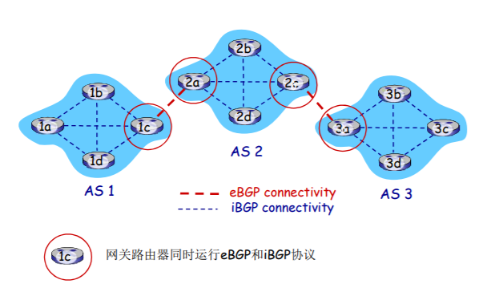

# 5.5 SDN控制平面

## Software defined networking (SDN)

-  互联网络网络层：历史上都是通过分布式、每个 路由器的实现
    -  单个路由器包含了：交换设备硬件、私有路由器OS（ 如：思科IOS）和其上运行的互联网标准协议(IP, RIP, IS-IS, OSPF, BGP)的私有实现
    -  需要不同的中间盒来实现不同网络层功能：防火墙， 负载均衡设备和NAT…

## SDN: 面临的挑战

- 强化控制平面：可信、可靠、性能可扩展性、 安全的分布式系统
    - 对于失效的鲁棒性： 利用为控制平面可靠分布式系 统的强大理论
    - 可信任，安全：从开始就进行铸造
- 网络、协议满足特殊任务的需求
    - e.g., 实时性，超高可靠性、超高安全性
- 互联网络范围内的扩展性
    - 而不是仅仅在一个AS的内部部署，全网部署

# 5.6 ICMP: 因特网控制报 文协议

## ICMP: Internet Control Message Protocol

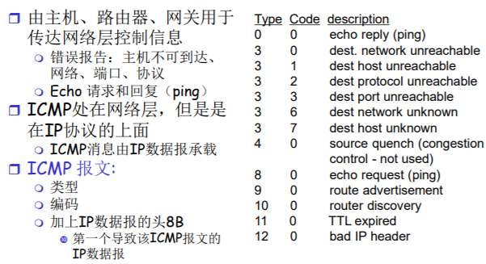

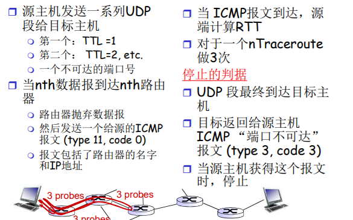

# 5.7 网络管理和[SNMP](https://so.csdn.net/so/search?q=SNMP&spm=1001.2101.3001.7020)(略）

## 什么是网络管理?

自治系统（autonomous systems, aka “network”): 1000多个 相互的软件和硬件部件

其他复杂系统也需要被监视和控制:  喷气飞机  核电站  其他例子？

> “网络管理”包括了硬件、软件和人类元素的设置，综合和协 调，以便监测，测试，轮询，配置，分析，评价和控制网络 和网元资源，用合理的成本满足实时性，运行能和服务质量 的要求；

性能管理:  
О性能(利用率、吞吐量)量化、测量、报告、分析和控制不同网络部件的性能  
o 涉及到的部件:单独部件（网卡，协议实体），端到端的路径故障管理:记录、检测和响应故障;  
○ 性能管理为长期监测设备性能

故障管理:突然发生的强度大的性能降低，强调对故障的响应配置管理:跟踪设备的配置，管理设备配置信息

账户管理:定义、记录和控制用户和设备访问网络资源  
o限额使用、给予使用的收费，以及分配资源访问权限

安全管理:定义安全策略，控制对网络资源的使用

## 网络管理架构

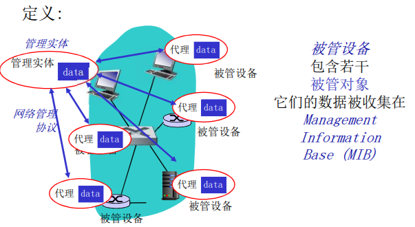

## SNMP协议

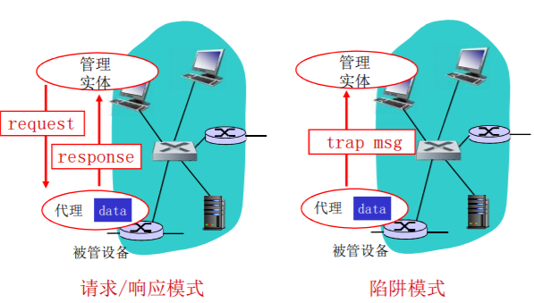

### SNMP 协议: 报文类型

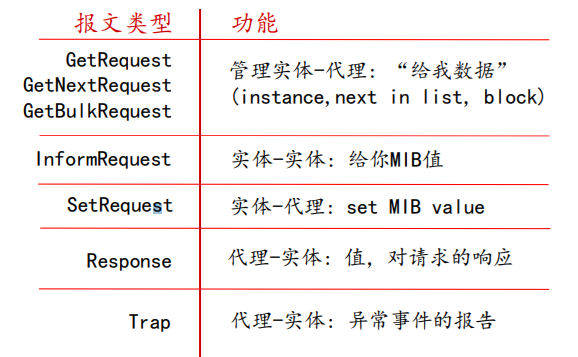

# 第五章：总结

- 网络层控制平面的方法  
    o\*\*每个路由器控制（传统方法)\*\*  
    o\*\*逻辑上集中的控制(software defined networking)\*\* SDN
- 传统路由选择算法  
    o\*\*在互联网上的实现:RIP，OSPF，BGP\*\*
- SDN控制器  
    o **实际中的实现:ODL,ONOS**
- Internet Control Message Protocol
- 网络管理和SNMP协议