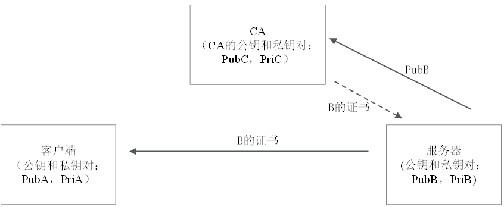

HTTPS 协议核心原理

> “安全”的四个特性
>
> - 机密性（加解密）
> - 完整性（摘要算法）
> - 身份认证（接收方确认身份）
> - 不可抵赖（发送方不能否认自己的行为）

**后两个通过私钥加密，公钥解密 以及 摘要算法实现的数字签名 进行实现**

## [对称加密](https://so.csdn.net/so/search?q=%E5%AF%B9%E7%A7%B0%E5%8A%A0%E5%AF%86&spm=1001.2101.3001.7020)

- 对称加密: 客户端和服务器共享同一个密钥，客户端给服务器发消息时，客户端用此密钥加密，服务器用此密钥解密；反过来，服务器给客户端发消息时，相反的过程。

这种加密方式在互联网上有两个问题：

\*\*1. [密钥](https://so.csdn.net/so/search?q=%E5%AF%86%E9%92%A5&spm=1001.2101.3001.7020)如何传输？\*\*密钥A的传输也需要另外一个密钥B，密钥B的传输又需要密钥C……如此循环，无解。。连环套问题

**2.** **密钥如何存储**？对于网页来说，都是明文的，肯定存储不了密钥（不能用另外一套对称加密进行加密）；对于Android/iOS客户端，即使能把密钥藏在安装包的某个位置，也很容易被破解。

这两个问题其实是一个问题。解决了密钥传输，就可以每次动态获取密钥，也就解决了密钥存储问题。

**目前常用的对称加密算法只有 AES 和 ChaCha20。**

## 双向非对称加密

1. **客户端为自己准备一对公私钥（PubA，PriA），服务器为自己准备一对公私钥（PubB，PriB）**
  
2. **公私钥的生成办法：**
  

（1）[私钥](https://so.csdn.net/so/search?q=%E7%A7%81%E9%92%A5&spm=1001.2101.3001.7020)就是一个随机生成的字符串

（2）公钥是通过私钥计算出来的，私钥确定，对应的公钥也就确定。但反过来，根据公钥计算不出私钥，计算过程不可逆！

3. **公钥，是公开的，不需要保密。客户端、服务器都把自己的公钥公开出去，自己保留私钥。这样一来客户端就知道了服务器的公钥，服务器也知道了客户端的公钥。**

> RSA（TLS 1.3舍弃） 可能是其中最著名的一个，几乎可以说是非对称加密的代名词，**它的安全性基于“整数分解”的数学难题，使用两个超大素数的乘积作为生成密钥的材料，想要从公钥推算出私钥是非常困难的。**
>
> ECC（Elliptic Curve Cryptography）是非对称加密里的“后起之秀”，它基于“椭圆曲线离散对数”的数学难题，使用特定的曲线方程和基点生成公钥和私钥，子算法 ECDHE 用于密钥交换，ECDSA 用于[数字签名](https://so.csdn.net/so/search?q=%E6%95%B0%E5%AD%97%E7%AD%BE%E5%90%8D&spm=1001.2101.3001.7020)。

### 操作

**签名和验签**

- 私钥签名，公钥验签，目的是防篡改。如果第三方截取到信息之后篡改，则接收方验签肯定过不了。同时也防抵赖，既然没有人可篡改，只可能是发送方自己发出的。（身份确认，不可抵赖）

**加密和解密**

- 公钥加密，私钥解密。目的是防止信息被第三方拦截和偷听。第三方即便能截获到信息，但如果没有私钥，也解密不了。

具体操作

1. **客户端给服务器发信息: 就用自己的私钥PriA签名，再用服务器的公钥PubB加密。所谓的“签名”，相当于自己盖了章，或者说签了字，证明这个信息是客户端发送的，客户端不能抵赖；用服务器的公钥PubB加密，意味着只有服务器B可以用自己的私钥PriB解密。即使这个信息被C截获了，C没有B的私钥，也无法解密这个信息。**
2. **服务器收到信息后，先用自己的私钥PriB解密，再用客户端的公钥验签（证明信息是客户端发出的）。**

**自己的私钥签名 + 对方的公钥加密 -》 自己的私钥解密 + 对方的公钥验签**

## **单向**非对称加密，互联网通信场景

- 在互联网上，网站对外是完全公开的，网站的提供者没有办法去验证每个客户端的合法性；只有客户端可以验证网站的合法性。比如用户访问百度或者淘宝的网站，需要验证所访问的是不是真的百度或者淘宝网，防止被钓鱼。
- **在这种情况下，客户端并不需要公钥和私钥对，只有服务器有一对公钥和私钥。**  
    **服务器把公钥给到客户端，客户端给服务器发送消息时，用公钥加密，然后服务器用私钥解密。反过来，服务器给客户端发送的消息，采用明文发送。**

假设PubB的传输过程是安全的，客户端知道了服务器的公钥。客户端就可以利用非对称加密通道给服务器发送一个对称加密的密钥，如图所示：

（1）客户端对服务器说：“Hi，我们的对称加密密钥是xxx，接下来就用这个密钥通信。”这句话是通过PubB加密的，所以只有服务器能用自己的PriB解密。

（2）服务器回复一句明文：“好的，我知道了。”虽然是明文，但没有任何密钥信息在里面，所以采用明文也没有关系。

（3）接下来，双方就可以基于对称加密的密钥进行通信了，这个密钥在内存里面，不会落地存储，所以也不存在被盗取的问题，而这就是SSL/TLS的原型。

## 摘要算法 与 数字签名

实现完整性的手段主要是**摘要算法**（Digest Algorithm），也就是常说的散列函数、哈希函数（Hash Function）。

> 你可以把摘要算法近似地理解成一种特殊的压缩算法，它能够把任意长度的数据“压缩”成固定长度、而且独一无二的“摘要”字符串，就好像是给这段数据生成了一个数字“指纹”。
>
> 因为摘要算法对输入具有“单向性”和“雪崩效应”，输入的微小不同会导致输出的剧烈变化，所以也被 TLS 用来生成伪随机数（PRF，pseudo random function）。

摘要算法保证了“数字摘要”和原文是完全等价的。所以，我们只要在原文后附上它的摘要，就能够保证数据的完整性。

不过摘要算法不具有机密性，如果明文传输，那么黑客可以修改消息后把摘要也一起改了，网站还是鉴别不出完整性。  
**所以，真正的完整性必须要建立在机密性之上，在混合加密系统里用会话密钥加密消息和摘要，这样黑客无法得知明文，也就没有办法动手脚了。**

**数字签名**

**使用私钥再加上摘要算法，就能够实现“数字签名”，同时实现“身份认证”和“不可否认”。**

数字签名的原理其实很简单，就是把公钥私钥的用法反过来，之前是公钥加密、私钥解密，现在是私钥加密、公钥解密。

但又因为非对称加密效率太低，所以私钥只加密原文的摘要，这样运算量就小的多，而且得到的数字签名也很小，方便保管和传输。

> 签名和公钥一样完全公开，任何人都可以获取。但这个签名只有用私钥对应的公钥才能解开，拿到摘要后，再比对原文验证完整性，就可以像签署文件一样证明消息确实是你发的。

**通过判断 原文生成的摘要(SHA-2) 比对 公钥解密后的摘要，进行身份认证**

## 中间人攻击问题 — 劫持公钥并篡改转发

非对称加密的前提是公钥可以在网络上安全传输。但如何保证公钥的传输不被拦截并篡改？

即：客户端拿到服务器的公钥，如何知道这个公钥真的就是服务器的呢？

1. **客户端本来是要把自己的公钥发给服务器：“Hi，我是客户端1，我的公钥是PubA。” 被中间人C劫持之后，C用自己的公钥替换客户端的公钥，然后发给服务器：“Hi，我是客户端1，我的公钥是PubC。”**
  
2. **反过来，服务器本来是要把自己的公钥发给客户端：“Hi，我是服务器，我的公钥是PubB。”被C劫持之后，C用自己的公钥替换服务器的公钥，然后发给客户端：“Hi，我是服务器，我的公钥是PubC。”**
  

\*\*最终结果是：客户端和服务器都以为自己是在和对方通信，但其实他们都是在和中间人C通信！\*\*接下来，客户端发给服务器的信息，会用PubC加密，C当然可以解密这个信息；同样，服务器发给客户端的信息也会被PubC加密，C也可以解密。

这个问题的根源是公钥是明文传输的。

如果把公钥用某个密钥加密再传输，又会出现最初的密钥传输的连环套问题。  
有什么办法能让客户端收到公钥之后，验证这个公钥的确是服务器发的呢？反过来也是。

## 数字证书和CA机构

1. 服务端给客户端不再发公钥，而是发“数字证书”，反过来也一样。数字证书是公钥的加强版。
  
2. 数字证书由CA机构颁发
  
3. 客户端拿到数字证书，找CA验证合法性。
  

反之亦然。

### 颁发与验证

**安全知识5：数字证书如何颁发？如何验证？**

 

**CA有一对自己的公钥和私钥对，私钥只有CA知道，公钥在网络上，谁都可以知道。服务器把个人信息 + 服务器的公钥发给CA，CA用自己的私钥为服务器生成一个数字证书。**

通俗地讲，服务器把自己的公钥发给CA，让CA加盖公章，之后别人就不能再伪造公钥了。如果被中间人伪造了，客户端拿着CA的公钥去验证这个证书，验证将无法通过。

**数字证书 = “盖了公章”的公钥（公章就是CA的私钥签名，可以拿CA的公钥验签）**

### CA是假的怎么办 —— CA信任链，根CA

**客户端和服务器都信任第3方CA服务器，把自己的公钥给CA，让其颁发证书。**

但CA如果是伪造的，谁来验证CA的合法性？

**4个实体：每个实体都有自己的证书，一级级颁发，一级级验证**

CA合法性的验证过程：

1. 客户端要验证服务器的合法性，需要拿着服务器的证书C3，到CA2处去验证==**（C3是CA2颁发的，验证方法是拿着CA2的公钥，去验证证书C3的有效性）；**\==
  
2. 客户端要验证CA2的合法性，需要拿着CA2的证书C2，到CA1处去验证（C2是CA1颁发的）；
  
3. 客户端要验证CA1的合法性，需要拿着CA1的证书C1，到CA0处去验证（C1是CA0颁发的）；
  
4. 而CA0呢，只能无条件信任。
  

怎么做到无条件信任呢？Root CA机构都是一些世界上公认的机构，在用户的操作系统、浏览器发布的时候，里面就已经嵌入了这些机构的Root证书。你信任这个操作系统，信任这个浏览器，也就信任了这些Root 证书。

### PKI

**颁发过程与验证过程刚好是逆向的，上一级CA给下一级CA颁发证书。**

根CA（CA0）开始，

CA0给CA1颁发证书，

CA1给CA2颁发证书，

CA2给应用服务器颁发证书。

最终，证书成为网络上每个通信实体的“身份证”，\*\*在网络上传输的都是证书，而不再是原始的那个公钥。\*\*把这套体系标准化之后，就是在网络安全领域经常见到的一个词，**PKI（Public Key Infrastructure）。**

### 证书链 - 例子

下面用IE浏览器访问百度的网站，来看它的数字证书：单击URL输入框中最右边锁形的图标，可以看到百度网站的证书路径，如图所示：整个证书路径有3级，

baidu.com是百度网站的证书；

CA机构是一个叫作Symantec Class 3 Secure Server的机构；

Root CA叫作VeriSign。

## SSL/TLS协议

SSL/TLS的历史几乎和互联网历史一样长：SSL（Secure Sockets Layer）的中文名称为安全套接层，TLS（Transport Layer Security）的中文名称为传输层安全协议。

### 四次握手 TLS 1.2

总结下TLS的握手过程：  
第一阶段：**C/S两端共享Client Random、Server Random 和 Server Params信息**

客户端—>服务器： 客户端的版本号、支持的密码套件，还有一个随机数（Client Random）

服务端—>客户端： 客户端的版本号、选择的客户端列表的密码套件如：TLS\_ECDHE\_RSA\_WITH\_AES\_256\_GCM\_SHA384、随机数随机数（Server Random）

服务端—>客户端： **服务端证书（Server Certificate）**

服务端—>客户端： 发送Server Key Exchange类型的请求，携带椭圆曲线的**公钥**（Server Params）用以实现密钥交换算法，**另附私钥签名**

服务端—>客户端： 发送完毕

第二阶段：**证书验证**

**前验条件：客户端证书链逐级验证、证书公钥验证签名，服务端身份验证成功（证书合法）**

**客户端—>服务端 发送Client Key Exchange类型的请求，携带椭圆曲线的公钥（Client Params）用以实现秘钥交换算法**

第三阶段：**主密钥生成**

**客户端、服务端分别使用Client Params、Server Params通过ECDHE算法计算出随机值pre-master，然后用 Client Random、Server Random 和 Pre-Master三个值作为原材料，用PRF伪随机数函数（利用密码套件的摘要算法再次强化结果 值maser secert的随机性）**

计算出主密钥Master Secret， 主密钥并不是会话秘钥，还会再用PRF扩展出更多的密钥，比如客户端发送用的会话密钥（client\_write\_key）、服务器发送用的会话密钥（server\_write\_key）

客户端—>服务端: **客户端发一个“Change Cipher Spec”，然后再发一个“Finished”消息，把之前所有发送的数据做个摘要，再加密一下，让服务器做个验证.**

服务端—>客户端： **服务器也是同样的**

### 三次握手 TLS1.3的握手

**TLS1.3舍弃了RSA的协商过程，然后基于ECDH的算法优化了整个过程。（这里提下ECDHE，多的这个E是extemporaneous，临时的意思，临时的是ECC证书中的随机数，每次都会重新生成，也是是b\*G中的b）。**

> 其实具体的做法还是利用了扩展。客户端在“Client Hello”消息里直接用“supported\_groups”带上支持的曲线，比如 P-256、x25519，用“key\_share”带上曲线对应的客户端公钥参数，用“signature\_algorithms”带上签名算法。
>
> 服务器收到后在这些扩展里选定一个曲线和参数，再用“key\_share”扩展返回服务器这边的公钥参数，就实现了双方的密钥交换，后面的流程就和 1.2 基本一样了。
>
> TLS 1.2 版本 前两次握手 只交换了 Client Random、Server Random 和 Server Params
>
> TLS 1.3 版本 前两次握手 交换了 Client Random 和 Server Random、Client Params 和 Server Params  
> **Params 曲线的一些参数 （公钥）**

(1) TCP连接建立。

(2) SSL/TLS四次握手协商出对称加密的密钥。

(3) 基于密钥，在TCP连接上对所有的HTTP Request/Response进行加密和解密。

> 其中阶段(1)和阶段(2)只在连接建立时做1次，之后只要连接不关闭，每个请求只需要经过阶段(3)，因此相比HTTP，性能没有太大损失。

单向https: 单向非对称加密。只客户端验证服务器的合法性，大部分网站都如此

双向https: 双向非对称加密。客户端验证服务器合法性，服务器也要验证客户端的合法性