# 1.1 计算机网络在信息时代的作用

- 计算机网络已经由一种**通信基础设施**发展成为一种重要的**信息服务基础设施**。
- 计算机网络已经成为我们生活中**不可或缺**的一部分。

计算机网络的**定义**：

- 地理上分散的设备
- 通过通讯介质互联
- 以资源共享为目的
- 工作原理：协议

# 1.2 因特网概述

## 1.2.1 网络、互联网和因特网

- 网络：

    由若干

    节点

    （Node）和连接这些节点的

    链路

    （Link）组成。节点可以是计算机、集线器、交换机、路由器等。

    

- **互联网：** 多个网络通过路由器互连起来，这样就构成了一个覆盖范围更大的网络，即互联网，因此互联网是**网络的网络**。

- **因特网：**是世界上最大的互联网络。

**Tips：**

internet是一个通用名词，泛指由多个计算机网络互联而成的网络，这些网络之间的通信协议是**任意**的。

Internet是一个专用名词，指当前世界最大的、开放的、由众多网络互联而成的特定计算机网络，采用TCP/IP协议族作为通信的规则，其前身为美国的ARPANET。

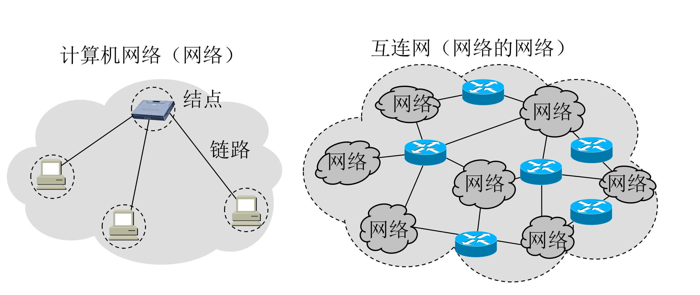

## 1.2.2 因特网发展阶段

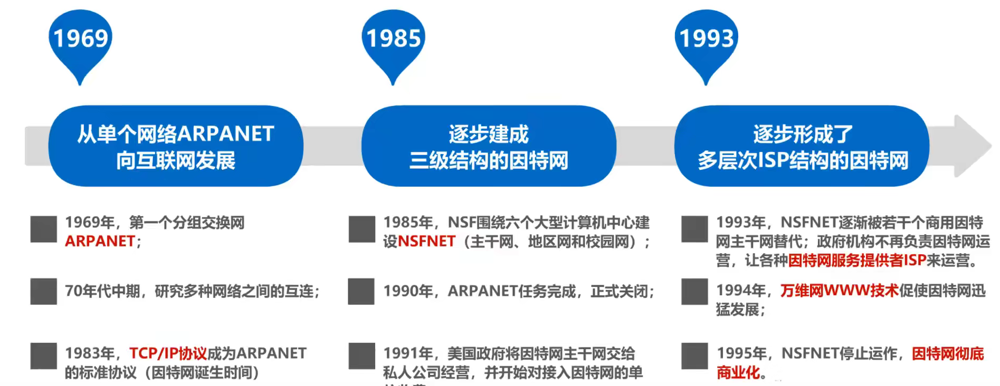

**因特网服务提供者ISP：**

ISP可以从互联网管理机构申请到很多IP地址，同时拥有通信线路和路由器等联网设备，用户向ISP交纳费用即可获得所需IP的使用权并且可以通过ISP连入互联网。ISP分为三个层次：主干ISP、地区ISP和本地ISP。

## 1.2.3 因特网的标准化工作

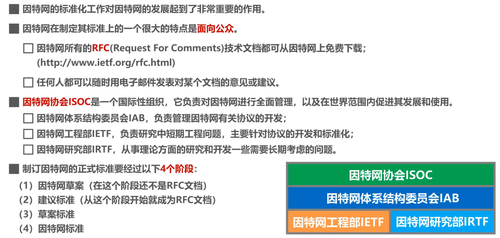

## 1.2.4 互联网的组成

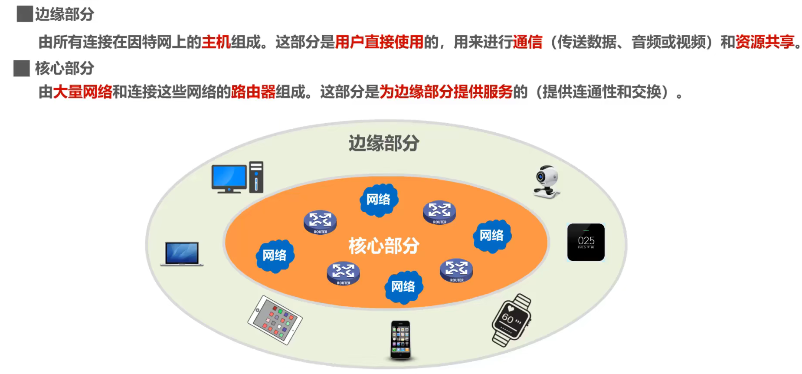

# 1.3 三种交换方式

## 1.3.1 电路交换（Circuit Switching）

要让所有的电话机都两两相连是不现实的，若有 n 部电话则需要 n∗(n−1)2 根电话线，于是便采用交换机的方式（如下图c所示）。

- 电话交换机接通电话线的方式称为电路交换。
- 从通信资源的分配角度来看，交换就是按照某种方式动态地分配传输线路的资源。

- 电路交换的三个步骤：
    1. 建立连接（分配通信资源）
    2. 通话（**一直占用**通信资源）
    3. 释放连接（归还通信资源）

电路交换的传输效率太低，不作为计算机数据的传输方式。

## 1.3.2 分组交换（Packet Switching）

- **报文：** 发送的整块数据成为一个报文（message）
- **分组：** 在发送报文之前，将较长的报文分解成更小的等长数据段，每个数据段前加上一些额外的控制信息组成的首部（header），就组成了一个分组（packet），分组又称为**包**，分组的首部称为**包头**。

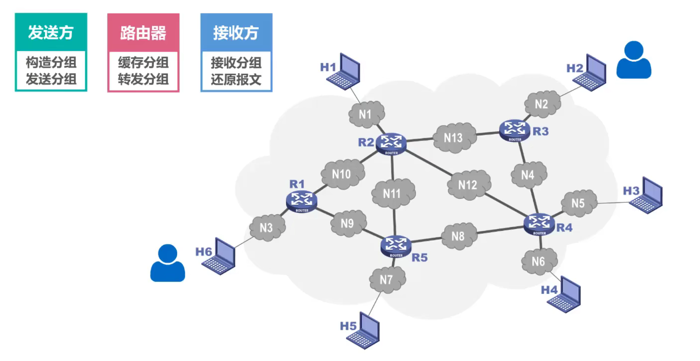

## 1.3.3 三种交换方式的对比

# 1.4 计算机网络的定义和分类（重点）

## 1.4.1 计算机网络的定义

- 最简单的定义：一些互相连接的、自治的计算机的集合。

    - 互联：计算机之间可以通过有线或者无线的方式进行数据通信。
    - 自治：指独立的计算机，它有自己的硬件和软件，可以单独运行使用。
    - 集合：至少需要两台计算机。

- 计算机网络的较好的定义是:

    计算机网络主要是由一些**通用的、可编程的硬件**互连而成的，而这些硬件并非专门用来实现某一特定目的（例如，传送数据或视频信号)。这些可编程的硬件能够用来**传送多种不同类型的数据**，并能**支持广泛的和日益增长的应用**。

## 1.4.2 计算机网络的分类

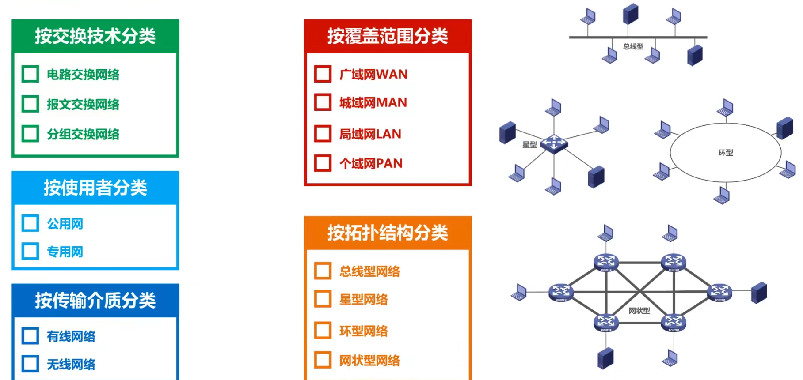

**Tips：**按照覆盖范围分类的根本依据是数据传输的方式，根据数据传输的距离调制成不同的波。

# 1.5 计算机网络的性能指标（重点）

## 1.5.1 速率

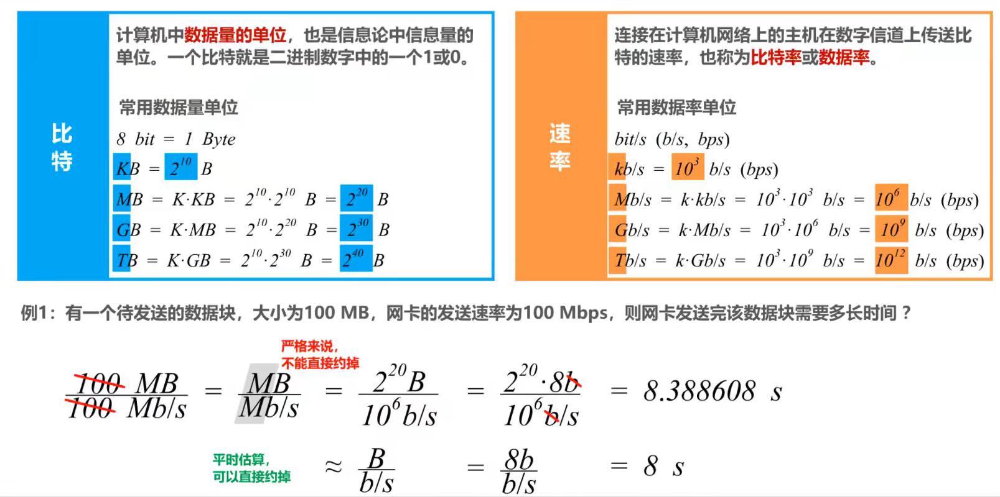

## 1.5.2 带宽

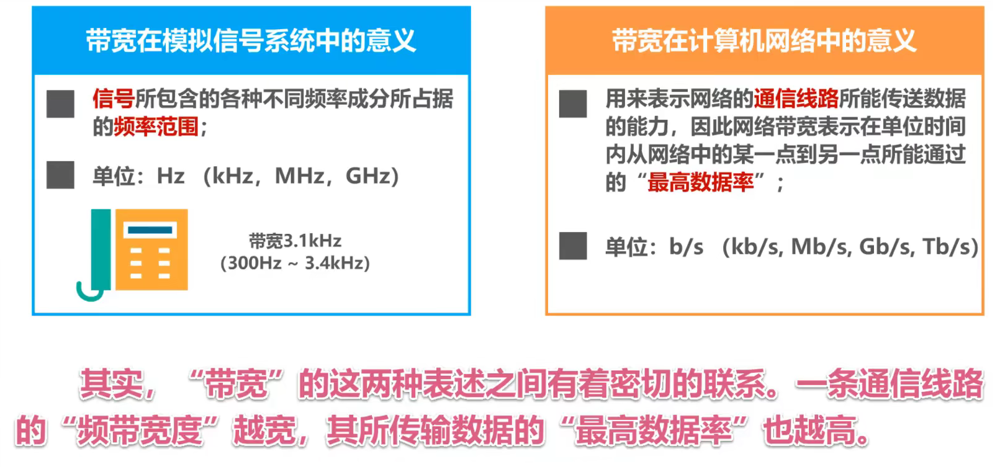

**Tips：** 带宽指的是线路上允许的最高速率，类比高速公路，速率就是高速公路上汽车行驶的速度，带宽就是这条高速公路的限速值。

## 1.5.3 吞吐量

## 1.5.4 时延

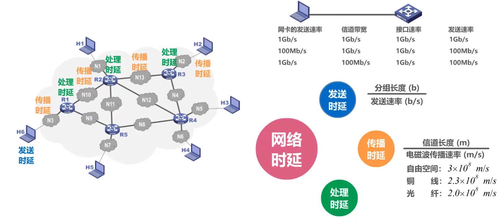

**排队时延：**

分组在路由器输入输出队列中排队等待处理和转发所经历的时延。排队时延的长短往往取决于网络中当时的通信量。当网络的通信量很大时会发生队列溢出，使分组丢失，这相当于排队时延为无穷大。

**四种时延产生的地方如下：**

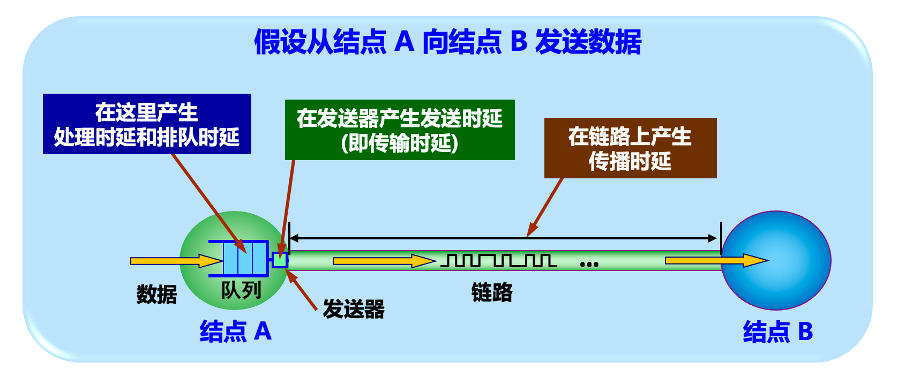

**计算例题：**

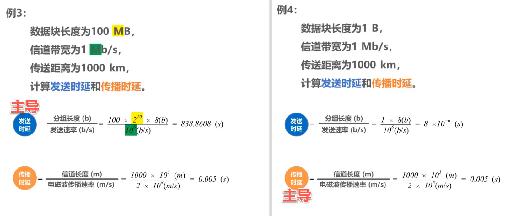

Tips：一般计算时延时，电磁波传播速率取2∗108，为在金属介质中的传播速度。

## 1.5.5 时延带宽积（略去）

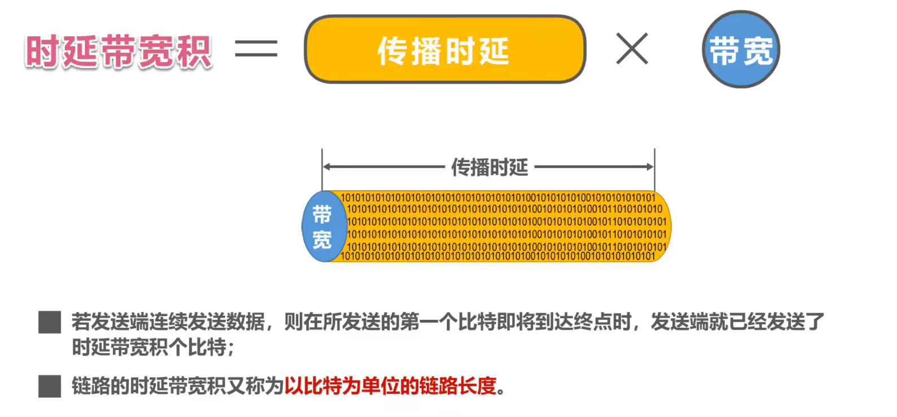

## 1.5.6 往返时间

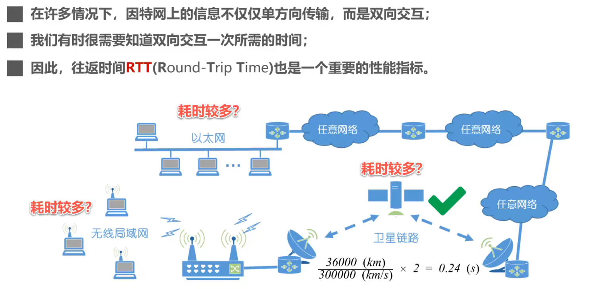

## 1.5.7 利用率（略去）

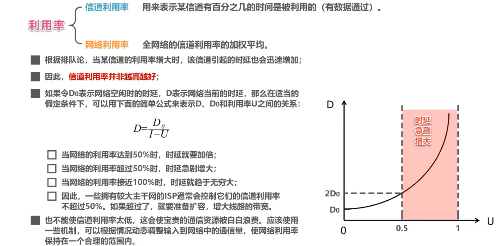

## 1.5.8 丢包率（略去）

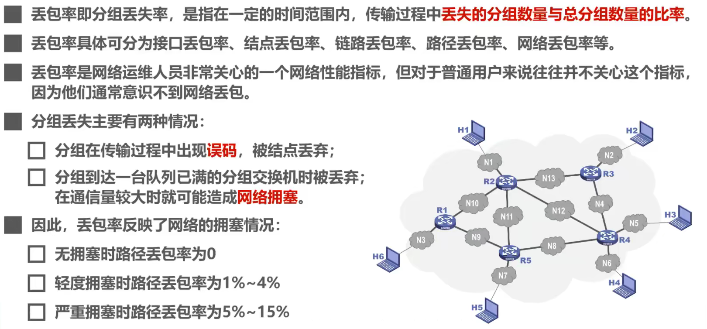

# 1.6 计算机网络体系结构（重点）

## 1.6.1 常见的计算机网络体系结构

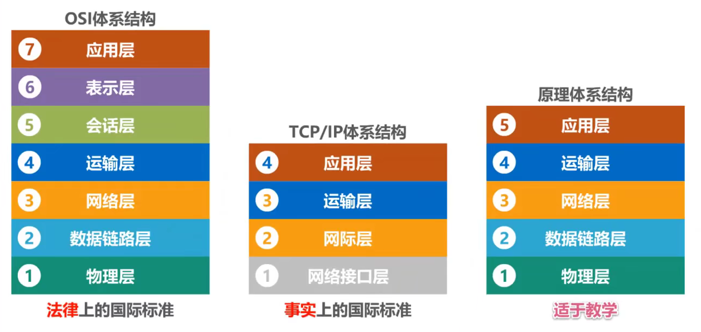

### OSI体系结构内容

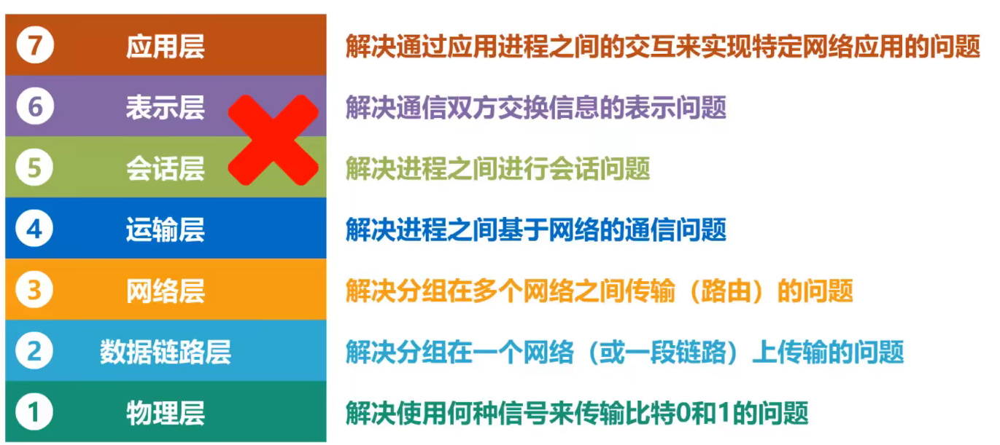

7层网络体系结构记忆方法：

- 上三层（资源子网）：

    - 应用层
    - 表示层
    - 会话层

- 核心层：运输层

    

- 下三层（通信子网）：

    - 网络层
    - 数据链路层：网络由链路连接而成
    - 物理层：决定数据传输的硬件

### TCP/IP体系结构内容

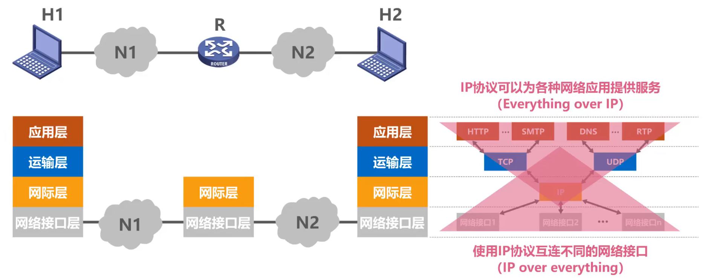

## 1.6.2 计算机网络体系结构分层的必要性

- **计算机网络是一个非常复杂的系统，**早在ARPANET设计时就提出了分层的设计理念。
- **“分层”**可将庞大而复杂的问题，转化为若干较小的局部问题，而这些较小的局部问题就比较易于研究和处理，下面按照简单到复杂的顺序，将实现计算机网络面临的主要问题划分到相应的层次中：

### 物理层

- 采用怎样的传输媒体（比如网线）
- 采用怎样的物理接口（PC端的网口）
- 使用怎样的信号表示比特0和1

### 数据链路层（网络内部）

- 如何识别网线中的各主机（主机编址问题，例如MAC地址）
- 如何从信号所表示的一串比特流中区分出地址和数据
- 如何协调各主机争用总线（主线形式的网络现在基本已经淘汰）

### 网络层（多个网络之间）

- 如何标识各网络以及网络中的各主机（网络和主机共同编织的问题，例如IP地址）
- 路由器如何转发分组，如何进行路由选择

### 运输层

- 如何标识进程之间网络通信的问题，即解决对于服务器发来的信息，交给哪个进程处理的问题。
- 出现传输错误时（丢包、误码），如何处理。

### 应用层

- 制定各种应用层协议，并按照协议标准来编写各种应用，如支持万维网的HTTP协议，支持电子邮件的SMTP协议等。

    

- 通过应用进程间的交互来完成特定的网络应用。

### 总结

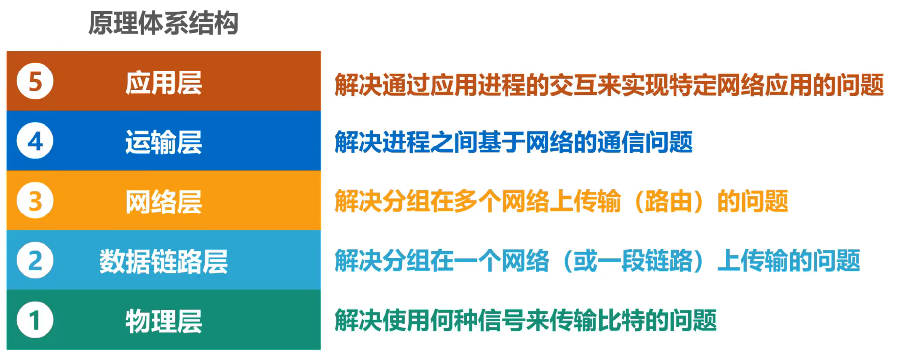

## 1.6.3 计算机网络体系结构分层思想举例

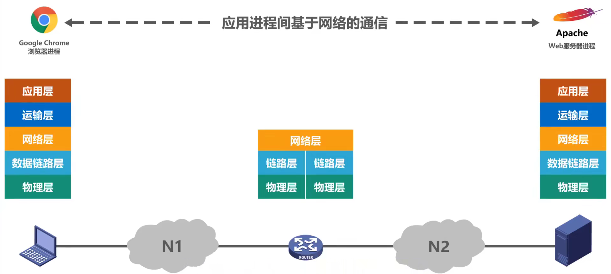

如上图所示，主机与N1网络相连，服务器与N2网络相连，N1和N2通过路由器相连，下面用分层的思想模拟主机进程发送请求给服务器，服务器处理后返回信息再由主机进程接受的过程：

- 应用层按照HTTP协议构建一个HTTP请求报文

    

    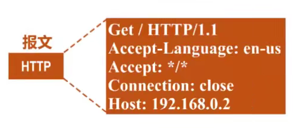

    

- 运输层给HTTP报文添加一个TCP首部，称为TCP报文段，报文段内容如下：

    

    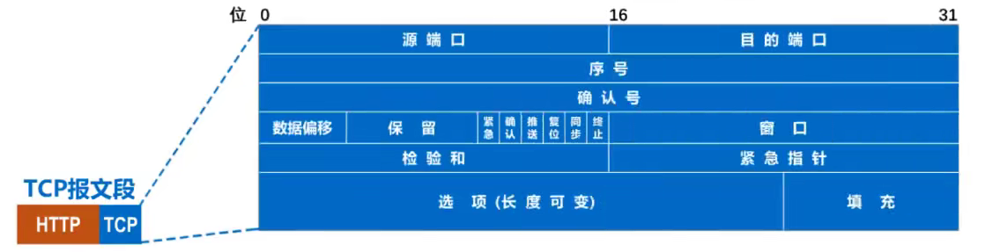

    

- 网络层给TCP报文添加一个IP首部，成为IP数据报，主要是使得数据报可以在互联网中传输，即被路由器转发，IP数据报内容如下：

    

    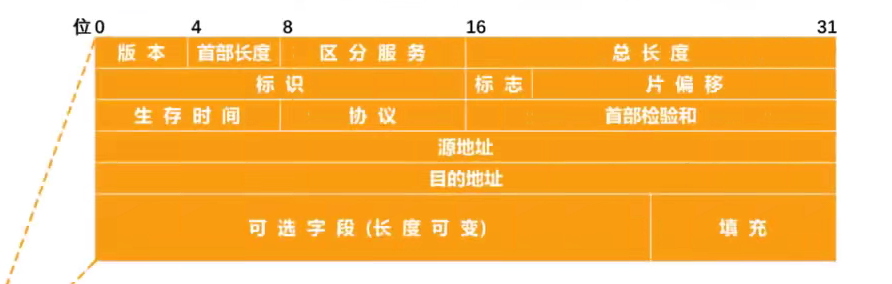

    

- 数据链路层给IP数据报添加一个首部和一个尾部成为帧，首部使得帧可以在一段链路上传输，可以被目的主机接收，尾部用于让目的主机检查是否有误码

- 物理层将帧转换成比特流，如果网络是以太网，还会在比特流前加入前导码，用于让目的主机做好接收的准备，最后将比特流转换成相应的信号发送到传输媒体 ，信号通过传输媒体到达路由器的物理层。

- 路由器中物理层将信号转换为比特流，然后去掉前导码并将帧交给链路层

- 链路层去掉帧的首部和尾部变成IP数据报交给网络层

- 网络层解析IP数据报的首部，提取出目的网络的地址，然后查找自身的路由表确定转发端口，准备转发

- 网络层再将IP数据报交给链路层，链路层加上首部和尾部形成帧

- 物理层接收帧并转换为比特流，同时加入前导码，转换为信号发送到传输媒体，信号通过传输媒体到达服务器的物理层。

- 服务器的物理层接收信号转换为比特流，然后再逐层处理最后得到HTTP响应报文

- 服务器对HTTP响应报文进行处理并给主机发送HTTP相应报文，流程和上述类似。

## 1.6.4 计算机网络体系结构中的专业术语

### 实体

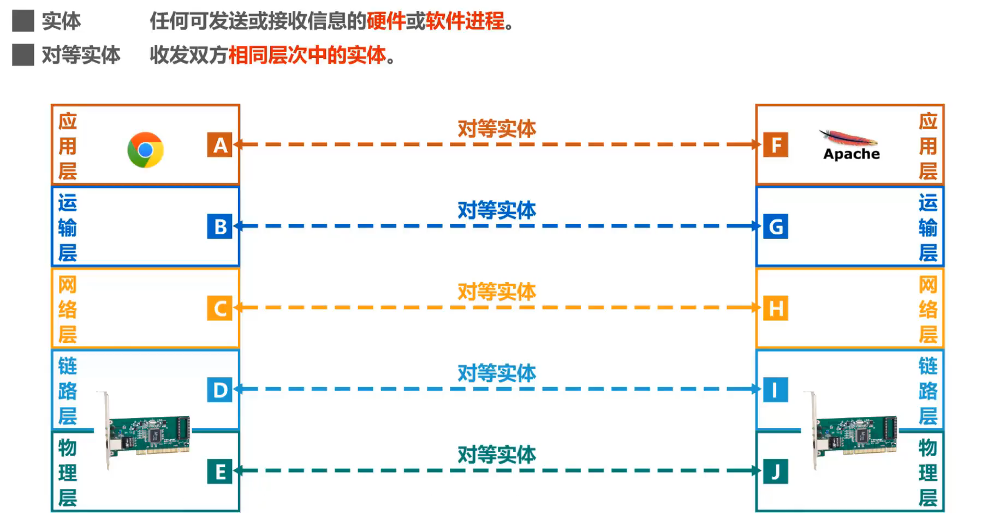

### 协议

- 协议：控制两个对等实体进行逻辑通信的规则的集合。逻辑通信实际并不存在，是一种假设的通信，便于单独研究某一层的通信。

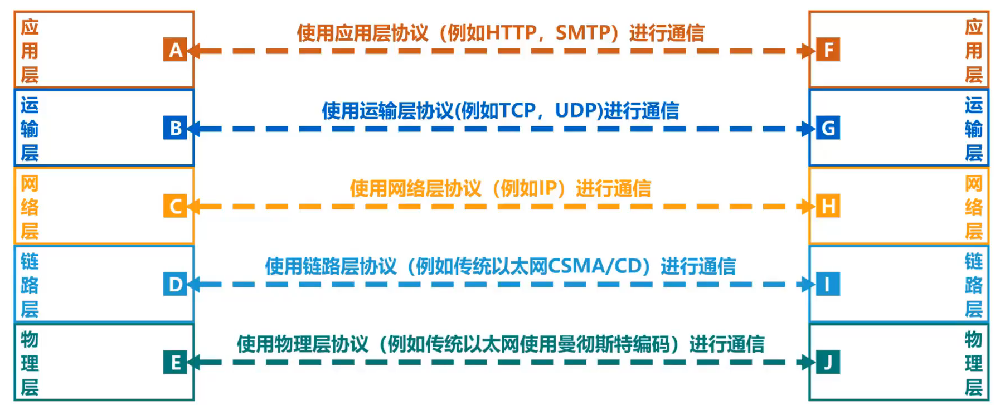

- 协议的三要素：

    - 语法：定义所交换信息的格式，下图示IP数据报的格式，每个格子称为字段或者域，语法定义了这些小格子的长度和顺序。

    

    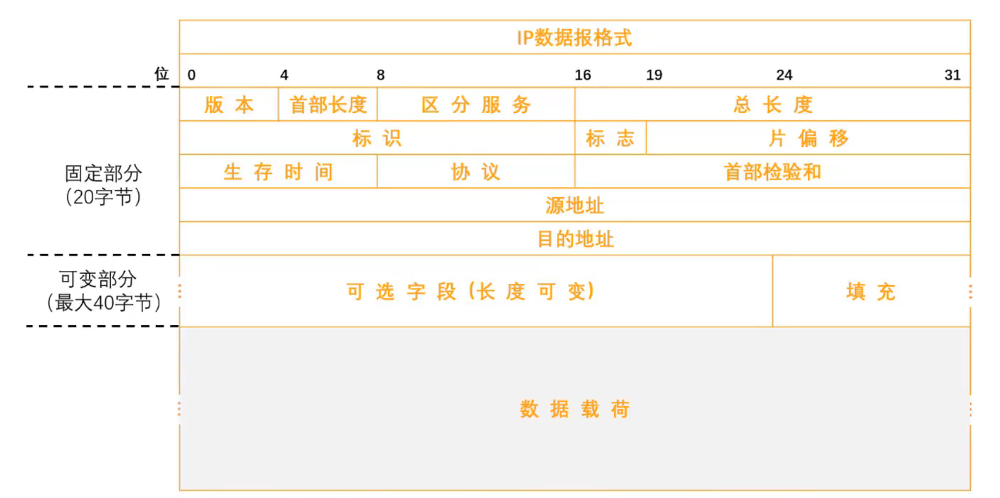

    

    - 语义：定义收发双方所要完成的操作

        

    - 同步：定义双方的时序关系，如下图就是TCP收发双方的时序关系

    

    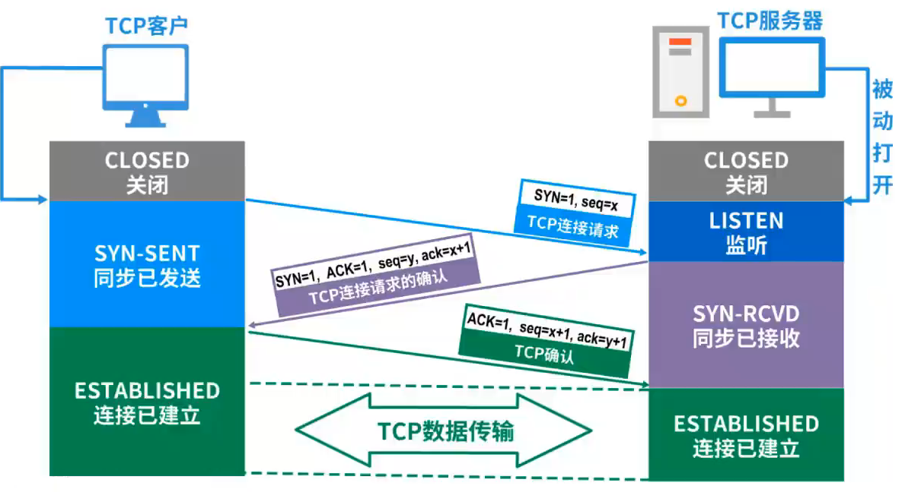

    

### 服务

- 在协议的控制下，两个对等实体间的逻辑通信使得本层能够向上一层提供服务。

- 要实现本层协议，还需要使用下面一层所提供的服务。

- **协议是“水平的”，服务是“垂直的”。**

- 实体看得见相邻下层所提供的服务，但是并不知道实现该服务的具体协议。也就是说，下面的协议对上面的实体是“透明”的。

- 在同一系统中相邻两层的实体进行交互（即交换信息） 的地方，通常称为**服务访问点 SAP (Service Access Point)**。SAP 是一个抽象的概念，它实际上就是一个逻辑接口。

- 服务访问点：在同一系统中

    相邻两层的实体交换信息的逻辑接口

    ，用于区分不同的服务类型。

    - 数据链路层的服务访问点为帧的“类型”字段。
    - 网络层的服务访问点为IP数据报首部中的“协议字段”。
    - 运输层的服务访问点为“端口号”。

- 服务原语：上层使用下层所提供的服务必须通过下层**交换一些命令**，这些称为服务原语。

- **协议数据单元PDU**：对等层次之间传送的数据包称为该层的协议数据单元。

- **服务数据单元SDU**：同一系统内，层与层之间交换的数据包称为服务数据单元。

- 多个SDU可以合成为一个PDU；一个SDU也可以划分为几个PDU。

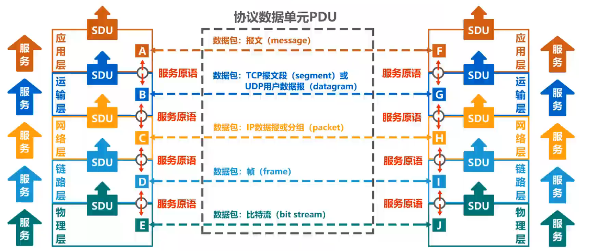

# 1.7 小结

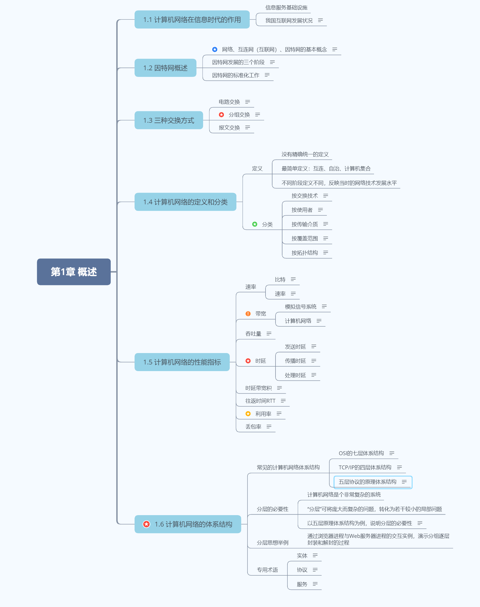

# 1.8 相关习题

## 1.8.1 体系结构相关习题

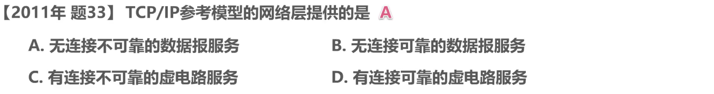

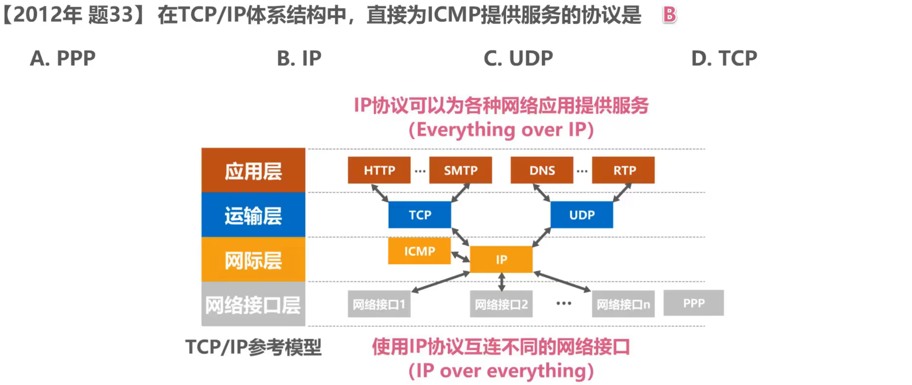

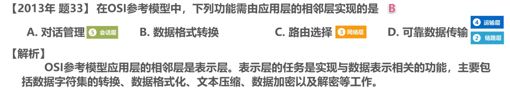

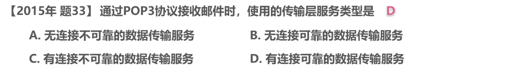

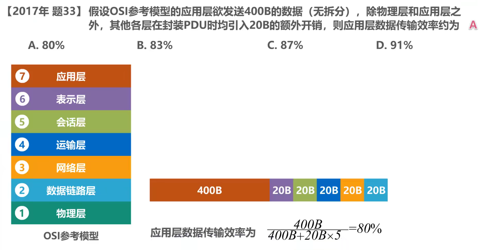

## 1.8.2 时延相关习题

时延主要计算传播时延和发送时延，传播时延是指在线路上传播所耗费的时间，主要由线路长度和信号在线路上的传播速率决定。发送时延是指主机发送数据所需要的的时间，主要区间于发送数据分组的大小和主机的带宽。如下图所示，链路带宽为1Mb/s，则发送一个比特所用的时间为1微秒，发送完一个比特后，这个比特在链路中的信号头部已经到达了200m的位置，这是由传播速率决定的。

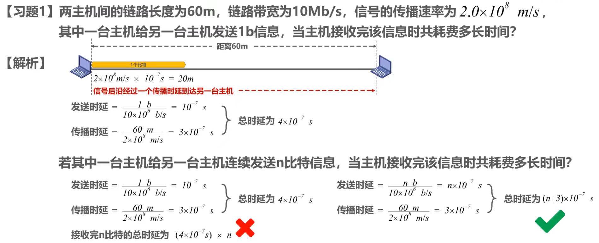

