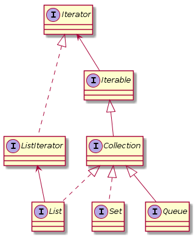

## [迭代器模式](https://duhouan.github.io/Java/#/JavaContainer/2_容器中的设计模式?id=迭代器模式)




Collection 继承了 Iterable 接口，其中的 iterator() 方法能够产生一个 Iterator 对象，通过这个对象就可以迭代遍历 Collection 中的元素。

从 **JDK 1.5 之后可以使用 foreach 方法**来遍历实现了 Iterable 接口的聚合对象。

```java
List<String> list = new ArrayList<>();
list.add("a");
list.add("b");
for (String item : list) {
    System.out.println(item);
}Copy to clipboardErrorCopied
```

## [适配器模式](https://duhouan.github.io/Java/#/JavaContainer/2_容器中的设计模式?id=适配器模式)

java.util.Arrays#asList() 可以把数组类型转换为 List 类型。

```java
@SafeVarargs
public static <T> List<T> asList(T... a)Copy to clipboardErrorCopied
```

应该注意的是 asList() 的参数为泛型的变长参数，不能使用基本类型数组作为参数，只能使用相应的**包装类型数组**。

```java
Integer[] arr = {1, 2, 3};
List list = Arrays.asList(arr);Copy to clipboardErrorCopied
```

也可以使用以下方式调用 asList()：

```java
List list = Arrays.asList(1, 2, 3);
```