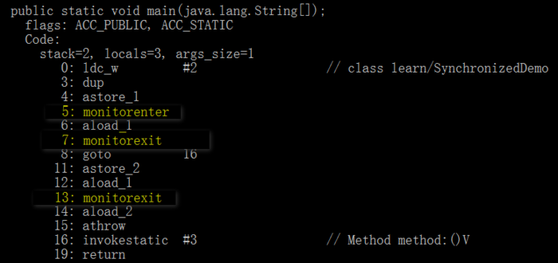

# [并发关键字](https://duhouan.github.io/Java/#/Java_Concurrency/3_并发关键字?id=并发关键字)

## [关键字一：volatile](https://duhouan.github.io/Java/#/Java_Concurrency/3_并发关键字?id=关键字一：volatile)

可以这样说，volatile 关键字是 Java 虚拟机提供的**轻量级的同步机制**。

### [功能](https://duhouan.github.io/Java/#/Java_Concurrency/3_并发关键字?id=功能)

volatile 有 2 个主要功能：

- **可见性**。一个线程对共享变量的修改，其他线程能够立即得知这个修改。普通变量不能做到这一点，普通变量的值在线程间传递需要通过主内存来完成。
- **禁止指令重排序**。

### [底层原理](https://duhouan.github.io/Java/#/Java_Concurrency/3_并发关键字?id=底层原理)

加入 volatile 关键字时，会多出 **lock 前缀指令**， 该 lock 前缀指令相当于内存屏障，内存屏障会提供 3 个功能：

- 在执行到内存屏障这句指令时，在其前面的操作都已完成了
- 强制将**处理器行的数据**缓存写回内存
- 一个处理器的缓存回写到内存会导致其他工作内存中的缓存失效

### [应用场景](https://duhouan.github.io/Java/#/Java_Concurrency/3_并发关键字?id=应用场景)

- 状态标记

    volatile + boolean

- DCL 单例模式 （Double Check Lock，双重校验锁）

    ```java
    public class Singleton {
    
        private volatile static Singleton singleton=null;
    
        private Singleton(){}
    
        public static Singleton getSingleton(){
            if(singleton==null){
                synchronized (Singleton.class){
                    if(singleton==null){
                        singleton=new Singleton();
                    }
                }
            }
            return singleton;
        }
    }Copy to clipboardErrorCopied
    ```

## [关键字二：synchronized](https://duhouan.github.io/Java/#/Java_Concurrency/3_并发关键字?id=关键字二：synchronized)

**线程安全问题**:

- 存在共享数据（临界资源）
- 存在多条线程共同操作这些共享数据

解决：**同步机制**。

同一时刻有且只有一个线程在操作共享数据，其他线程必须等到该线程处理完数据后再对共享数据进行操作。

同步的前提：

- 多个线程
- 多个线程使用的是同一个锁对象

同步的弊端：

当线程相当多时，因为每个线程都会去判断同步上的锁，这是很耗费资源的，无形中会降低程序的运行效率。

### [功能](https://duhouan.github.io/Java/#/Java_Concurrency/3_并发关键字?id=功能-1)

使用 synchroinzed 进行同步，可以保证原子性（保证每个时刻只有一个线程执行同步代码）和可见性（对一个变量执行 unlock 操作之前，必须把变量值同步回主内存）。

### [使用](https://duhouan.github.io/Java/#/Java_Concurrency/3_并发关键字?id=使用)

synchronized 修饰的对象有几种：

- 修饰一个类。

    作用范围是 synchronized 后面括号括起来的部分

    作用对象是这个类的所有对象

    ```java
    class ClassName {
       public void method() {
          synchronized(ClassName.class) {
             // todo
          }
       }
    }Copy to clipboardErrorCopied
    ```

- 修饰一个方法：被修饰的方法称为同步方法。

    作用范围是整个方法

    作用对象是调用这个方法的对象

    ```java
    public synchronized void method(){
       // todo
    }Copy to clipboardErrorCopied
    ```

- 修饰一个静态的方法。

    作用的范围是整个方法

    作用对象是这个类的所有对象

    ```java
    public synchronized static void method() {
       // todo
    }Copy to clipboardErrorCopied
    ```

- 修饰一个代码块：被修饰的代码块称为同步语句块

    作用范围是大括号 {} 括起来的代码块

    作用对象是调用这个代码块的对象

注意：**如果锁的是类对象的话，尽管new多个实例对象，但他们仍然是属于同一个类依然会被锁住，即线程之间保证同步关系**。

### [原理](https://duhouan.github.io/Java/#/Java_Concurrency/3_并发关键字?id=原理)

```java
public class SynchronizedDemo {
    public static void main(String[] args) {
        synchronized (SynchronizedDemo.class) { //锁住类对象
        }
        method();
    }

    private synchronized static void method() { //锁住类对象
    }
}Copy to clipboardErrorCopied
```



任意一个对象都拥有自己的 Monitor，当这个对象由同步块或者同步方法调用时， 执行方法的线程必须先获取该对象的 Monitor 才能进入同步块和同步方法， 如果没有获取到 Monitor 的线程将会被阻塞在同步块和同步方法的入口处，进入到 BLOCKED 状态。

synchronized 同步语句块的实现使用的是 monitorenter 和 monitorexit 指令。

**monitorenter 指令指向同步代码块的开始位置，monitorexit 指令则指明同步代码块的结束位置。**

使用 synchronized 进行同步，其关键就是必须要对对象的 Monitor 进行获取， 当**线程获取 Monitor 后才能继续往下执行，否则就只能等待**。 而这个获取的过程是**互斥**的，即**同一时刻只有一个线程能够获取到 Monitor**。

上面的 SynchronizedDemo 中在执行完同步代码块之后紧接着再会去执行一个静态同步方法，而这个方法锁的对象依然就这个类对象， 那么这个正在执行的线程还需要获取该锁吗？

答案是不必的，从上图中就可以看出来， 执行静态同步方法的时候就只有一条 monitorexit 指令，并没有monitorenter 获取锁的指令。 这就是**锁的重入性**， 即在同一线程中，线程不需要再次获取同一把锁。 synchronized 先天具有重入性。 每个对象拥有一个**计数器**，当线程获取该对象锁后，计数器就会 +1，释放锁后就会将计数器 -1。

synchronized 修饰的方法并没有 monitorenter 指令和 monitorexit 指令，取得代之的是 `ACC_SYNCHRONIZED` 标识，该标识指明了该方法是一个同步方法，JVM 通过该 `ACC_SYNCHRONIZED` 访问标志来辨别一个方法是否声明为同步方法，从而执行相应的同步调用。

### [锁优化策略](https://duhouan.github.io/Java/#/Java_Concurrency/3_并发关键字?id=锁优化策略)

JDK 1.6 之后对 synchronized 进行优化。

锁的 4 种状态：无锁、偏向锁、轻量级锁、重量级锁。

#### [1. 自旋锁](https://duhouan.github.io/Java/#/Java_Concurrency/3_并发关键字?id=_1-自旋锁)

在很多应用上，**共享数据的锁定状态只会持续很短一段时间**。自旋锁的思想是让一个线程在请求一个共享数据的锁时执行忙循环（自旋）一段时间，如果在这段时间内能获得锁，就可以避免进入阻塞状态。

自旋锁虽然能避免进入阻塞状态从而减少开销，但是它需要进行忙循环操作占用 CPU 时间，它只适用于共享数据的锁定状态很短的场景。

在 JDK 1.6 中引入了**自适应的自旋锁**。自适应意味着自旋的次数不再固定了，而是由前一次在同一个锁上的自旋次数及锁的拥有者的状态来决定。

#### [2. 锁消除](https://duhouan.github.io/Java/#/Java_Concurrency/3_并发关键字?id=_2-锁消除)

锁消除是指对于**被检测出不可能存在竞争的共享数据的锁进行消除**。

锁消除主要是通过**逃逸分析来支持**，如果堆上的共享数据不可能逃逸出去被其它线程访问到，那么就可以把它们当成私有数据对待，也就可以将它们的锁进行消除。

对于一些看起来没有加锁的代码，其实隐式的加了很多锁。例如下面的字符串拼接代码就隐式加了锁：

```java
public static String concatString(String s1, String s2, String s3) {
    return s1 + s2 + s3;
}Copy to clipboardErrorCopiedCopy to clipboardErrorCopied
```

String 是一个不可变的类，编译器会对 String 的拼接自动优化。在 JDK 1.5 之前，会转化为 StringBuffer 对象的连续 append() 操作：

```java
public static String concatString(String s1, String s2, String s3) {
    StringBuffer sb = new StringBuffer();
    sb.append(s1);
    sb.append(s2);
    sb.append(s3);
    return sb.toString();
}Copy to clipboardErrorCopiedCopy to clipboardErrorCopied
```

每个 append() 方法中都有一个同步块。虚拟机观察变量 sb，很快就会发现它的动态作用域被限制在concatString() 方法内部。也就是说，sb 的所有引用永远不会逃逸到 concatString() 方法之外，其他线程无法访问到它，因此可以进行消除。

#### [3. 锁粗化](https://duhouan.github.io/Java/#/Java_Concurrency/3_并发关键字?id=_3-锁粗化)

**如果一系列的连续操作都对同一个对象反复加锁和解锁，频繁的加锁操作就会导致性能损耗**。

上一节的示例代码中连续的 append() 方法就属于这类情况。如果虚拟机探测到由这样的一串零碎的操作都对同一个对象加锁，将会把加锁的范围扩展（粗化）到整个操作序列的外部。对于上一节的示例代码就是扩展到第一个 append() 操作之前直至最后一个 append() 操作之后，这样只需要加锁一次就可以了。

#### [4. 偏向锁](https://duhouan.github.io/Java/#/Java_Concurrency/3_并发关键字?id=_4-偏向锁)

在大多数情况下，**锁不仅不存在多线程竞争，而且总是由同一个线程多次获得**。偏向锁的思想是偏向于第一个获取锁对象的线程，这个线程在之后获取该锁就不再需要进行同步操作，甚至连 CAS 操作也不再需要。

#### [5. 轻量级锁](https://duhouan.github.io/Java/#/Java_Concurrency/3_并发关键字?id=_5-轻量级锁)

轻量级锁是由偏向锁升级而来，偏向锁运行在一个线程进入同步块的情况下，当第二个线程加入锁争用的时候，偏向锁就会升级为轻量级锁。

**对于绝大部分的锁，在整个同步周期内都是不存在竞争的**，因此也就不需要都使用互斥量进行同步，可以**先采用 CAS 操作进行同步**，如果 CAS 失败了再改用互斥量进行同步。

## [volatile 与 synchronized 比较](https://duhouan.github.io/Java/#/Java_Concurrency/3_并发关键字?id=volatile-与-synchronized-比较)

- volatile 是 JVM 轻量级的同步机制，所以性能比 synchronized 要好

- volatile 只能修饰变量

    synchronized 可以修饰代码块或者方法

- 多线程访问 volatile 不会出现阻塞

    synchronized 会出现阻塞

- volatile 只能保证可见性，不能保证原子性

    synchroinzed 能保证原子性，也间接保证了可见性

- volatile 修饰的变量不会被编译器优化

    synchronized 修饰的变量可以被编译器优化