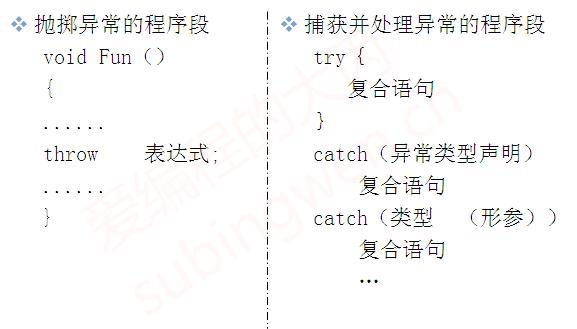

# 1\. 异常

异常通常用于处理逻辑上可能发生的错误，在 C++98 中为我们提供了一套完善的异常处理机制，我们可以直接在程序中将各种类型的异常抛出，从而强制终止程序的运行。

## 1.1 基本语法

关于异常的基本语法如下：

c++

<table><tbody><tr><td class="gutter"><pre>1 2 3 4 5 6 7 8 9 10 11 12 13 </pre></td><td class="code"><pre>int main() {      try     {         throw -1;      }      catch (int e)     {          cout &lt;&lt; "int exception, value: " &lt;&lt; e &lt;&lt; endl;      }      cout &lt;&lt; "That's ok!" &lt;&lt; endl;      return 0;  } </pre></td></tr></tbody></table>

异常被抛出后，从进入 try 块起，到异常被抛掷前，这期间在栈上构造的所有对象，都会被自动析构。析构的顺序与构造的顺序相反。这一过程称为栈的解旋。

## 1.2 异常接口声明

为了加强程序的可读性，可以在函数声明中列出可能抛出的所有异常类型，常用的有如下三种书写方式：

1. 显示指定可以抛出的异常类型
   
    c++
    
    <table><tbody><tr><td class="gutter"><pre>1 2 3 4 5 6 7 8 9 10 11 12 13 14 15 16 17 18 19 20 21 22 23 24 25 26 27 28 29 30 31 32 33 </pre></td><td class="code"><pre>struct MyException {     MyException(string s) :msg(s) {}     string msg; };  double divisionMethod(int a, int b) throw(MyException, int) {     if (b == 0)     {         throw MyException("division by zero!!!");         // throw 100;     }     return a / b; }  int main() {     try     {	         double v = divisionMethod(100, 0);         cout &lt;&lt; "value: " &lt;&lt; v &lt;&lt; endl;     }     catch (int e)     {         cout &lt;&lt; "catch except: "  &lt;&lt; e &lt;&lt; endl;     }     catch (MyException e)     {         cout &lt;&lt; "catch except: " &lt;&lt; e.msg &lt;&lt; endl;     }     return 0; } </pre></td></tr></tbody></table>
    
    第 7 行代码在 `divisionMethod` 函数后添加了 `throw` 异常接口声明，其参数表示可以抛出的异常类型，分别为 int 和 MyException 类型。
    
2. 抛出任意异常类型
   
    c++
    
    <table><tbody><tr><td class="gutter"><pre>1 2 3 4 5 6 7 8 9 10 11 12 13 14 15 </pre></td><td class="code"><pre>struct MyException {     MyException(string s) :msg(s) {}     string msg; };  double divisionMethod(int a, int b) {     if (b == 0)     {         throw MyException("division by zero!!!");         // throw 100;     }     return a / b; } </pre></td></tr></tbody></table>
    
    第 7 行代码在 `divisionMethod 没有添加异常接口声明`，表示在该函数中`可以抛出任意类型的异常`。
    
3. 不抛出任何异常
   
    c++
    
    <table><tbody><tr><td class="gutter"><pre>1 2 3 4 5 6 7 8 9 10 11 12 13 14 </pre></td><td class="code"><pre>struct MyException {     MyException(string s) :msg(s) {}     string msg; };  double divisionMethod(int a, int b) throw() {     if (b == 0)     {         cout &lt;&lt; "division by zero!!!" &lt;&lt; endl;     }     return a / b; } </pre></td></tr></tbody></table>
    
    第 7 行代码在 `divisionMethod` 函数后添加了 `throw` 异常接口声明，其`参数列表为空`，表示该函数==不允许抛出异常==。
    

温馨提示：以上程序在 VS 上的测试结果和在 Linux 上基于 G++ 的测试结果是不同的，如果违反了规则 VS 只会给出警告，而 G++ 则会直接终止程序的运行。（PS：VS 使用的不是 G++ 编译器）

1. throw声明
   1. void GetTag() throw(int);                     // 表示只抛出int类型异常
   2. void GetTag() throw(int，char);         // 表示抛出in，char类型异常
      1. 可以自定义抛出异常类型
   3. void GetTag() throw();                         // 表示不会抛出任何类型异常
      1. 但若在函数中尝试抛出异常，若直接将常量进行抛出，如throw（1），则报错，若抛出变量int i，throw（i）则可抛出，==无法抛出字面量常量可抛出变量==
      2. ==throw（）并不严格，若使用noexcept，则无论什么异常都无法抛出==
   4. void GetTag() throw(...);                      // 表示抛出任何类型异常

# 2\. noexcept

上面的例子中，在 `divisionMethod` 函数声明之后，我们定义了一个动态异常声明 `throw(MyException, int)`，该声明指出了 `divisionMethod` 可能抛出的异常的类型。事实上，该特性很少被使用，因此在 C++11 中被弃用了 ，而表示函数不会抛出异常的动态异常声明 `throw()` 也被新的 noexcept 异常声明所取代。


noexcept 形如其名， 表示其修饰的函数不会抛出异常 。不过与 \`throw ()\` 动态异常声明不同的是，\`在 C++11 中如果 noexcept 修饰的函数抛出了异常，编译器可以选择直接调用 std::terminate () 函数来终止程序的运行，这比基于异常机制的 throw () 在效率上会高一些\`。这是因为异常机制会带来一些额外开销，比如函数抛出异常，会导致函数栈被依次地展开（栈解旋），并自动调用析构函数释放栈上的所有对象。

因此对于不会抛出异常的函数我们可以这样写:

c++

<table><tbody><tr><td class="gutter"><pre>1 2 3 4 5 6 7 8 9 </pre></td><td class="code"><pre>double divisionMethod(int a, int b) noexcept {     if (b == 0)     {         cout &lt;&lt; "division by zero!!!" &lt;&lt; endl;         return -1;     }     return a / b; } </pre></td></tr></tbody></table>

从语法上讲，`noexcept` 修饰符有两种形式：

1. 简单地在函数声明后加上 noexcept 关键字
   
2. 可以接受一个常量表达式作为参数，如下所示∶
   
    c++
    
    <table><tbody><tr><td class="gutter"><pre>1 </pre></td><td class="code"><pre>double divisionMethod(int a, int b) noexcept(常量表达式); </pre></td></tr></tbody></table>
    
    常量表达式的结果会被转换成一个 bool 类型的值：
    
    - 值为 true，表示函数不会抛出异常
    - 值为 false，表示有可能抛出异常这里
    - 不带常量表达式的 noexcept 相当于声明了 noexcept（true），即不会抛出异常。