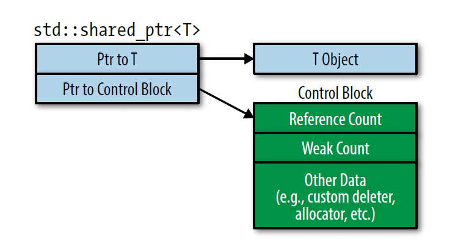
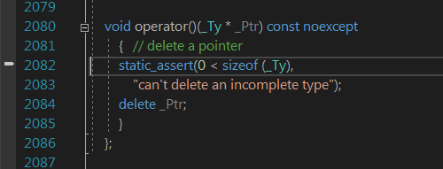

* 原始指针的缺陷有：
  * 声明中未指出指向的是单个对象还是一个数组
  * 没有提示使用完对象后是否需要析构，从声明中无法看出指针是否拥有对象
  * 不知道析构该使用 delete 还是其他方式（比如传入一个专门用于析构的函数）
  * 即使知道了使用 delete，也不知道 delete 的是单个对象还是数组（使用 delete[]）
  * 难以保证所有路径上只产生一次析构
  * 没有检查空悬指针的办法
* 智能指针解决了这些问题，它封装了原始指针，行为看起来和原始指针类似但大大减少了犯错的可能
* C++17 中有三种智能指针：[std::shared_ptr](https://en.cppreference.com/w/cpp/memory/shared_ptr)、[std::unique_ptr](https://en.cppreference.com/w/cpp/memory/unique_ptr)、[std::weak_ptr](https://en.cppreference.com/w/cpp/memory/weak_ptr)

## 18 用 [std::unique_ptr](https://en.cppreference.com/w/cpp/memory/unique_ptr) 管理所有权唯一的资源

* 使用智能指针时一般首选 [std::unique_ptr](https://en.cppreference.com/w/cpp/memory/unique_ptr)，默认情况下它和原始指针尺寸相同
* [std::unique_ptr](https://en.cppreference.com/w/cpp/memory/unique_ptr) 对资源拥有唯一所有权，因此它是 move-obly 类型，不允许拷贝。它常用作工厂函数的返回类型，这样工厂函数生成的对象在需要销毁时会被自动析构，而不需要手动析构

```cpp
class A {};

std::unique_ptr<A> makeA() { return std::unique_ptr<A>{new A}; }

auto p = makeA();
```

* [std::unique_ptr](https://en.cppreference.com/w/cpp/memory/unique_ptr)的析构默认通过 delete 内部的原始指针完成，但也可以自定义删除器，删除器需要一个 [std::unique_ptr](https://en.cppreference.com/w/cpp/memory/unique_ptr) 内部指针类型的参数

```cpp
class A {};

auto f = [](A* p) {
  std::cout << "destroy\n";
  delete p;
};

std::unique_ptr<A, decltype(f)> makeA() {
  std::unique_ptr<A, decltype(f)> p{new A, f};
  return p;
}
```

* 使用 C++14 的 auto 返回类型，可以将删除器的 lambda 定义在工厂函数内，封装性更好一些

```cpp
class A {};

auto makeA() {
  auto f = [](A* p) {
    std::cout << "destroy\n";
    delete p;
  };
  std::unique_ptr<A, decltype(f)> p{new A, f};
  return p;
}
```

* 可以进一步扩展成支持继承体系的工厂函数

```cpp
class A {
 public:
  virtual ~A() {
  }  // 删除器对任何对象调用的是基类的析构函数，因此必须声明为虚函数
};
class B : public A {
};  // 基类的析构函数为虚函数，则派生类的析构函数默认为虚函数
class C : public A {};
class D : public A {};

auto makeA(int i) {
  auto f = [](A* p) {
    std::cout << "destroy\n";
    delete p;
  };
  std::unique_ptr<A, decltype(f)> p{nullptr, f};
  if (i == 1) {
    p.reset(new B);
  } else if (i == 2) {
    p.reset(new C);
  } else {
    p.reset(new D);
  }
  return p;
}
```

* 默认情况下，[std::unique_ptr](https://en.cppreference.com/w/cpp/memory/unique_ptr) 和原始指针尺寸相同，如果自定义删除器则 [std::unique_ptr](https://en.cppreference.com/w/cpp/memory/unique_ptr) 会加上删除器的尺寸。一般无状态的函数对象（如无捕获的 lambda）不会浪费任何内存，作为删除器可以节约空间

```cpp
class A {};

auto f = [](A* p) { delete p; };
void g(A* p) { delete p; }
struct X {
  void operator()(A* p) const { delete p; }
};

std::unique_ptr<A> p1{new A};
std::unique_ptr<A, decltype(f)> p2{new A, f};
std::unique_ptr<A, decltype(g)*> p3{new A, g};
std::unique_ptr<A, decltype(X())> p4{new A, X{}};

assert(sizeof(p1) == sizeof(nullptr));  // 默认尺寸，即一个原始指针的尺寸
assert(sizeof(p2) == sizeof(nullptr));  // 无捕获 lambda 不会浪费尺寸
assert(sizeof(p3) == sizeof(nullptr) * 2);  // 函数指针占一个原始指针尺寸
assert(sizeof(p4) == sizeof(nullptr));  // 无状态的函数对象，但如果函数对象存储了状态（如数据成员、虚函数）就会增加尺寸
```

* [std::unique_ptr](https://en.cppreference.com/w/cpp/memory/unique_ptr) 作为返回类型的另一个方便之处是，可以转为 [std::shared_ptr](https://en.cppreference.com/w/cpp/memory/shared_ptr)

```cpp
// std::make_unique 的返回类型是 std::unique_ptr
std::shared_ptr<int> p = std::make_unique<int>(42);
```

* [std::unique_ptr](https://en.cppreference.com/w/cpp/memory/unique_ptr) 针对数组提供了一个特化版本，此版本提供 [operator[]](https://en.cppreference.com/w/cpp/memory/unique_ptr/operator_at)，但不提供[单元素版本的 `operator*` 和 `operator->`](https://en.cppreference.com/w/cpp/memory/unique_ptr/operator*)，这样对其指向的对象就不存在二义性

```cpp
std::unique_ptr<int[]> p{new int[3]{1, 2, 3}};
for (int i = 0; i < 3; ++i) {
  std::cout << p[i];  // 123
}
```

## 19 用 [std::shared_ptr](https://en.cppreference.com/w/cpp/memory/shared_ptr) 管理所有权可共享的资源

* [std::shared_ptr](https://en.cppreference.com/w/cpp/memory/shared_ptr) 内部有一个引用计数，用来存储资源被共享的次数。因为内部多了一个指向引用计数的指针，所以 [std::shared_ptr](https://en.cppreference.com/w/cpp/memory/shared_ptr) 的尺寸是原始指针的两倍

```cpp
int* p = new int{42};
auto q = std::make_shared<int>(42);
assert(sizeof(p) == sizeof(nullptr));
assert(sizeof(q) == sizeof(nullptr) * 2);
```

* [std::shared_ptr](https://en.cppreference.com/w/cpp/memory/shared_ptr) 保证线程安全，因此引用计数的递增和递减是原子操作，原子操作一般比非原子操作慢
* [std::shared_ptr](https://en.cppreference.com/w/cpp/memory/shared_ptr) 默认析构方式和 [std::unique_ptr](https://en.cppreference.com/w/cpp/memory/unique_ptr) 一样，也是 delete 内部的原始指针，同样可以自定义删除器，不过不需要在模板参数中指明删除器类型

```cpp
class A {};
auto f = [](A* p) { delete p; };

std::unique_ptr<A, decltype(f)> p{new A, f};
std::shared_ptr<A> q{new A, f};
```

* 模板参数中不含删除器的设计为接口提供了更好的灵活度

```cpp
std::shared_ptr<A> p{new A, f};
std::shared_ptr<A> q{new A, g};
// 使用不同的删除器但具有相同的类型，因此可以放进同一容器
std::vector<std::shared_ptr<A>> v{p, q};
```

* 删除器不影响 [std::shared_ptr](https://en.cppreference.com/w/cpp/memory/shared_ptr) 的尺寸，因为删除器不是 [std::shared_ptr](https://en.cppreference.com/w/cpp/memory/shared_ptr) 的一部分，而是位于堆上或自定义分配器的内存位置。[std::shared_ptr](https://en.cppreference.com/w/cpp/memory/shared_ptr) 有一个 control block，它包含了引用计数的指针和自定义删除器的拷贝，以及一些其他数据（比如弱引用计数）



* [std::shared_ptr](https://en.cppreference.com/w/cpp/memory/shared_ptr) 内部实现如下

```cpp
template <typename T>
struct sp_element {
  using type = T;
};

template <typename T>
struct sp_element<T[]> {
  using type = T;
};

template <typename T, std::size_t N>
struct sp_element<T[N]> {
  using type = T;
};

template <typename T>
class shared_ptr {
  using elem_type = typename sp_element<T>::type;
  elem_type* px;    // 内部指针
  shared_count pn;  // 引用计数
  template <typename U>
  friend class shared_ptr;
  template <typename U>
  friend class weak_ptr;
};

class shared_count {
  sp_counted_base* pi;
  int shared_count_id;
  friend class weak_count;
};

class weak_count {
  sp_counted_base* pi;
};

class sp_counted_base {
  int use_count;   // 引用计数
  int weak_count;  // 弱引用计数
};

template <typename T>
class sp_counted_impl_p : public sp_counted_base {
  T* px;  // 删除器
};
```

* control block 在创建第一个 [std::shared_ptr](https://en.cppreference.com/w/cpp/memory/shared_ptr) 时确定，因此 control block 的创建发生在如下时机
  * 调用 [std::make_shared](https://en.cppreference.com/w/cpp/memory/shared_ptr/make_shared) 时：调用时生成一个新对象，此时显然不会有关于该对象的 control block
  * 从 [std::unique_ptr](https://en.cppreference.com/w/cpp/memory/unique_ptr) 构造 [std::shared_ptr](https://en.cppreference.com/w/cpp/memory/shared_ptr) 时：因为 [std::unique_ptr](https://en.cppreference.com/w/cpp/memory/unique_ptr) 没有 control block
  * 用原始指针构造 [std::shared_ptr](https://en.cppreference.com/w/cpp/memory/shared_ptr) 时
* 这意味着用同一个原始指针构造多个 [std::shared_ptr](https://en.cppreference.com/w/cpp/memory/shared_ptr)，将创建多个 control block，即有多个引用指针，当引用指针变为零时就会出现多次析构的错误

```cpp
int main() {
  {
    int* i = new int{42};
    std::shared_ptr<int> p{i};
    std::shared_ptr<int> q{i};
  }  // 错误
}
```

* 使用 [std::make_shared](https://en.cppreference.com/w/cpp/memory/shared_ptr/make_shared) 就不会有这个问题

```cpp
auto p = std::make_shared<int>(42);
```

* 但 [std::make_shared](https://en.cppreference.com/w/cpp/memory/shared_ptr/make_shared) 不支持自定义删除器，这时应该直接传递 new 的结果

```cpp
auto f = [](int*) {};
std::shared_ptr<int> p{new int(42), f};
```

* 用类的 this 指针构造 [std::make_shared](https://en.cppreference.com/w/cpp/memory/shared_ptr/make_shared) 时，`*this` 的所有权不会被共享

```cpp
class A {
 public:
  std::shared_ptr<A> f() { return std::shared_ptr<A>{this}; }
};

auto p = std::make_shared<A>();
auto q = p -> f();
assert(p.use_count() == 1);
assert(q.use_count() == 1);
```

* 为了解决这个问题，需要继承 [std::enable_shared_from_this](https://en.cppreference.com/w/cpp/memory/enable_shared_from_this)，通过其提供的 [shared_from_this](https://en.cppreference.com/w/cpp/memory/enable_shared_from_this/shared_from_this) 获取 `*this` 的所有权

```cpp
class A : public std::enable_shared_from_this<A> {
 public:
  std::shared_ptr<A> f() { return shared_from_this(); }
};

auto p = std::make_shared<A>();
auto q = p->f();
assert(p.use_count() == 2);
assert(q.use_count() == 2);
```

* [shared_from_this](https://en.cppreference.com/w/cpp/memory/enable_shared_from_this/shared_from_this) 的原理是为 `*this` 的 control block 创建一个新的 [std::shared_ptr](https://en.cppreference.com/w/cpp/memory/shared_ptr)，因此 `*this` 必须有一个已关联的 control block，即有一个指向 `*this` 的 [std::shared_ptr](https://en.cppreference.com/w/cpp/memory/shared_ptr)，否则行为未定义，抛出 [std::bad_weak_ptr](https://en.cppreference.com/w/cpp/memory/bad_weak_ptr) 异常

```cpp
class A : public std::enable_shared_from_this<A> {
 public:
  std::shared_ptr<A> f() { return shared_from_this(); }
};

auto p = new A;
auto q = p -> f();  // 抛出 std::bad_weak_ptr 异常
```

* 为了只允许创建用 [std::shared_ptr](https://en.cppreference.com/w/cpp/memory/shared_ptr) 指向的对象，可以将构造函数放进 private 作用域，并提供一个返回 [std::shared_ptr](https://en.cppreference.com/w/cpp/memory/shared_ptr) 对象的工厂函数

```cpp
class A : public std::enable_shared_from_this<A> {
 public:
  static std::shared_ptr<A> create() { return std::shared_ptr<A>(new A); }
  std::shared_ptr<A> f() { return shared_from_this(); }

 private:
  A() = default;
};

auto p = A::create();  // 构造函数为 private，auto p = new A 将报错
auto q = p -> f();     // OK
```

## 20 用 [std::weak_ptr](https://en.cppreference.com/w/cpp/memory/weak_ptr) 观测 [std::shared_ptr](https://en.cppreference.com/w/cpp/memory/shared_ptr) 的内部状态
* [std::weak_ptr](https://en.cppreference.com/w/cpp/memory/weak_ptr) 不能解引用，它不是一种独立的智能指针，而是 [std::shared_ptr](https://en.cppreference.com/w/cpp/memory/shared_ptr) 的一种扩充，它用 [std::shared_ptr](https://en.cppreference.com/w/cpp/memory/shared_ptr) 初始化，共享对象但不改变引用计数，主要作用是观察 [std::shared_ptr](https://en.cppreference.com/w/cpp/memory/shared_ptr) 的内部状态

```cpp
std::weak_ptr<int> w;

void f(std::weak_ptr<int> w) {
  if (auto p = w.lock()) {
    std::cout << *p;
  } else {
    std::cout << "can't get value";
  }
}

int main() {
  {
    auto p = std::make_shared<int>(42);
    w = p;
    assert(p.use_count() == 1);
    assert(w.expired() == false);
    f(w);  // 42
    auto q = w.lock();
    assert(p.use_count() == 2);
    assert(q.use_count() == 2);
  }
  f(w);  // can't get value
  assert(w.expired() == true);
  assert(w.lock() == nullptr);
}
```

* [std::weak_ptr](https://en.cppreference.com/w/cpp/memory/weak_ptr) 的另一个作用是解决循环引用问题

```cpp
class B;
class A {
 public:
  std::shared_ptr<B> b;
  virtual ~A() { std::cout << "destroy A\n"; }
};

class B {
 public:
  std::weak_ptr<A> a;
  virtual ~B() { std::cout << "destroy B\n"; }
};

int main() {
  {
    auto p = std::make_shared<A>();
    p->b = std::make_shared<B>();
    p->b->a = p;
    assert(p.use_count() == 1);
  }  // p.use_count() 由 1 减为 0，从而正常析构
  // 若将 weak_ptr 改为 shared_ptr，p.use_count() 为 2，此处减为 1，不会析构
  // 此时 p->b 也不会析构，导致两次内存泄漏
}
```

## 21 用 [std::make_unique](https://en.cppreference.com/w/cpp/memory/unique_ptr/make_unique)（[std::make_shared](https://en.cppreference.com/w/cpp/memory/shared_ptr/make_shared)） 创建 [std::unique_ptr](https://en.cppreference.com/w/cpp/memory/unique_ptr)（[std::shared_ptr](https://en.cppreference.com/w/cpp/memory/shared_ptr)）

* C++14 提供了 [std::make_unique](https://en.cppreference.com/w/cpp/memory/unique_ptr/make_unique)，C++11 可以手动实现一个基础功能版

```cpp
template <typename T, typename... Ts>
std::unique_ptr<T> make_unique(Ts&&... args) {
  return std::unique_ptr<T>{new T{std::forward<Ts>(args)...}};
}
```

* 这个基础函数不支持数组和自定义删除器，但这些不难实现。从这个基础函数可以看出，make 函数把实参完美转发给构造函数并返回构造出的智能指针。除了 [std::make_shared](https://en.cppreference.com/w/cpp/memory/shared_ptr/make_shared) 和 [std::make_unique](https://en.cppreference.com/w/cpp/memory/unique_ptr/make_unique)，还有一个 make 函数是 [std::allocate_shared](https://en.cppreference.com/w/cpp/memory/shared_ptr/allocate_shared)，它的行为和 [std::make_shared](https://en.cppreference.com/w/cpp/memory/shared_ptr/make_shared) 一样，只不过第一个实参是分配器对象
* 优先使用 make 函数的一个明显原因就是只需要写一次类型

```cpp
auto p = std::make_unique<int>(42);
std::unique_ptr<int> q{new int{42}};
```

* 另一个原因与异常安全相关

```cpp
void f(std::shared_ptr<A> p, int n) {}
int g() { return 1; }
f(std::shared_ptr<A>{new A}, g());  // 潜在的内存泄露隐患
// g 可能运行于 new A 还未返回给 std::shared_ptr 的构造函数时
// 此时如果 g 抛出异常，则 new A 就发生了内存泄漏
f(std::make_shared<A>(), g());  // 不会发生内存泄漏，且只需要一次内存分配
```

* make 函数有两个限制，一是它无法定义删除器

```cpp
auto f = [](A* p) { delete p; };
std::unique_ptr<A, decltype(f)> p{new A, f};
std::shared_ptr<A> q{new A, f};
```

* 使用自定义删除器，但又想避免内存泄漏，解决方法是单独用一条语句来创建 [std::shared_ptr](https://en.cppreference.com/w/cpp/memory/shared_ptr)

```cpp
auto d = [](A* p) { delete p; };
std::shared_ptr<A> p{new A, d};  // 如果发生异常，删除器将析构 new 创建的对象
f(std::move(p), g());
```

* make 函数的第二个限制是，make  函数中的完美转发使用的是小括号初始化，在持有 [std::vector](https://en.cppreference.com/w/cpp/container/vector) 类型时，设置初始化值不如大括号初始化方便。一个不算直接的解决方法是，先构造一个 [std::initializer_list](https://en.cppreference.com/w/cpp/utility/initializer_list) 再传入

```cpp
auto p = std::make_unique<std::vector<int>>(3, 6);  // vector中是 3 个 6
auto q = std::make_shared<std::vector<int>>(3, 6);  // vector中是 3 个 6

auto x = {1, 2, 3, 4, 5, 6};
auto p2 = std::make_unique<std::vector<int>>(x);
auto q2 = std::make_shared<std::vector<int>>(x);
```

* [std::make_unique](https://en.cppreference.com/w/cpp/memory/unique_ptr/make_unique) 只存在这两个限制，但 [std::make_shared](https://en.cppreference.com/w/cpp/memory/shared_ptr/make_shared) 和 [std::allocate_shared](https://en.cppreference.com/w/cpp/memory/shared_ptr/allocate_shared) 还有两个限制
  * 如果类重载了 [operator new](https://en.cppreference.com/w/cpp/memory/new/operator_new) 和 [operator delete](https://en.cppreference.com/w/cpp/memory/new/operator_delete)，其针对的内存尺寸一般为类的尺寸，而 [std::shared_ptr](https://en.cppreference.com/w/cpp/memory/shared_ptr) 还要加上 control block 的尺寸，因此 [std::make_shared](https://en.cppreference.com/w/cpp/memory/shared_ptr/make_shared) 不适用重载了 [operator new](https://en.cppreference.com/w/cpp/memory/new/operator_new) 和 [operator delete](https://en.cppreference.com/w/cpp/memory/new/operator_delete) 的类
  * [std::make_shared](https://en.cppreference.com/w/cpp/memory/shared_ptr/make_shared) 使 [std::shared_ptr](https://en.cppreference.com/w/cpp/memory/shared_ptr) 的 control block 和管理的对象在同一内存上分配（比用 new 构造智能指针在尺寸和速度上更优的原因），对象在引用计数为0时被析构，但其占用的内存直到 control block 被析构时才被释放，比如 [std::weak_ptr](https://en.cppreference.com/w/cpp/memory/weak_ptr) 会持续指向 control block（为了检查引用计数以检查自身是否失效），control block 直到最后一个 [std::shared_ptr](https://en.cppreference.com/w/cpp/memory/shared_ptr) 和 [std::weak_ptr](https://en.cppreference.com/w/cpp/memory/weak_ptr) 被析构时才释放
* 假如对象尺寸很大，且最后一个 [std::shared_ptr](https://en.cppreference.com/w/cpp/memory/shared_ptr) 和 [std::weak_ptr](https://en.cppreference.com/w/cpp/memory/weak_ptr)析构之间的时间间隔不能忽略，就会产生对象析构和内存释放之间的延迟

```cpp
auto p = std::make_shared<ReallyBigType>();
…  // 创建指向该对象的多个 std::shared_ptr 和 std::weak_ptr 并做一些操作
…  // 最后一个 std::shared_ptr 被析构，但 std::weak_ptr 仍存在
…  // 此时，大尺寸对象占用内存仍未被回收
…  // 最后一个 std::weak_ptr 被析构，control block 和对象占用的同一内存块被释放
```

* 如果 new 构造 [std::shared_ptr](https://en.cppreference.com/w/cpp/memory/shared_ptr)，最后一个 [std::shared_ptr](https://en.cppreference.com/w/cpp/memory/shared_ptr) 被析构时，内存就能立即被释放

```cpp
std::shared_ptr<ReallyBigType> p(new ReallyBigType);
…  // 创建指向该对象的多个 std::shared_ptr 和 std::weak_ptr 并做一些操作
…  // 最后一个 std::shared_ptr 被析构，std::weak_ptr 仍存在，但 ReallyBigType 占用的内存立即被释放
…  // 此时，仅 control block 内存处于分配而未回收状态
…  // 最后一个 std::weak_ptr 被析构，control block 的内存块被释放
```

## 22 用 [std::unique_ptr](https://en.cppreference.com/w/cpp/memory/unique_ptr) 实现 [pimpl 手法](https://en.cppreference.com/w/cpp/language/pimpl)必须在 .cpp 文件中提供析构函数定义

* [pimpl 手法](https://en.cppreference.com/w/cpp/language/pimpl)就是把数据成员提取到类中，用指向该类的指针替代原来的数据成员。因为数据成员会影响内存布局，将数据成员用一个指针替代可以减少编译期依赖，保持 ABI 兼容
* 比如对如下类

```cpp
// A.h
#include <string>
#include <vector>

class A {
 private:
  int i;
  std::string s;
  std::vector<double> v;
};
```

* 使用 [pimpl 手法](https://en.cppreference.com/w/cpp/language/pimpl)后

```cpp
// A.h
class A {
 public:
  A();
  ~A();

 private:
  struct X;
  X* x;
};

// A.cpp
#include <string>
#include <vector>

#include "A.h"


struct A::X {
  int i;
  std::string s;
  std::vector<double> v;
};

A::A() : x(new X) {}
A::~A() { delete x; }
```

* 现在使用 [std::unique_ptr](https://en.cppreference.com/w/cpp/memory/unique_ptr) 替代原始指针，不再需要使用析构函数释放指针

```cpp
// A.h
#include <memory>

class A {
 public:
  A();

 private:
  struct X;
  std::unique_ptr<X> x;
};

// A.cpp
#include <string>
#include <vector>

#include "A.h"


struct A::X {
  int i;
  std::string s;
  std::vector<double> v;
};

A::A() : x(std::make_unique<X>()) {}
```

* 但调用上述代码会出错

```cpp
// main.cpp
#include "A.h"

int main() {
  A a;  // 错误：A::X 是不完整类型
}
```

* 原因在于 [std::unique_ptr](https://en.cppreference.com/w/cpp/memory/unique_ptr) 析构时会在内部调用默认删除器，默认删除器的 delete 语句之前会用 [static_assert](https://en.cppreference.com/w/cpp/language/static_assert) 断言指针指向的不是非完整类型

```cpp
// 删除器的实现
template <class T>
struct default_delete {  // default deleter for unique_ptr
  constexpr default_delete() noexcept = default;

  template <class U, enable_if_t<is_convertible_v<U*, T*>, int> = 0>
  default_delete(const default_delete<U>&) noexcept {}

  void operator()(T* p) const noexcept {
    static_assert(0 < sizeof(T), "can't delete an incomplete type");
    delete p;
  }
};
```



* 解决方法就是让析构 [std::unique_ptr](https://en.cppreference.com/w/cpp/memory/unique_ptr) 的代码看见完整类型，即让析构函数的定义位于要析构的类型的定义之后

```cpp
// A.h
#include <memory>

class A {
 public:
  A();
  ~A();

 private:
  struct X;
  std::unique_ptr<X> x;
};

// A.cpp
#include <string>
#include <vector>

#include "A.h"


struct A::X {
  int i;
  std::string s;
  std::vector<double> v;
};

A::A() : x(std::make_unique<X>()) {}
A::~A() = default;  // 必须位于 A::X 的定义之后
```

* 使用 [pimpl 手法](https://en.cppreference.com/w/cpp/language/pimpl)的类自然应该支持移动操作，但定义析构函数会阻止默认生成移动操作，因此会想到添加默认的移动操作声明

```cpp
// A.h
#include <memory>

class A {
 public:
  A();
  ~A();
  A(A&&) = default;
  A& operator=(A&&) = default;

 private:
  struct X;
  std::unique_ptr<X> x;
};

// A.cpp
#include <string>
#include <vector>

#include "A.h"


struct A::X {
  int i;
  std::string s;
  std::vector<double> v;
};

A::A() : x(std::make_unique<X>()) {}
A::~A() = default;  // 必须位于A::X的定义之后
```

* 但调用移动操作会出现相同的问题

```cpp
// main.cpp
#include "A.h"

int main() {
  A a;
  A b(std::move(a));   // 错误：使用了未定义类型 A::X
  A c = std::move(a);  // 错误：使用了未定义类型 A::X
}
```

* 原因也一样，移动操作会先析构原有对象，调用删除器时触发断言。解决方法也一样，让移动操作的定义位于要析构的类型的定义之后

```cpp
// A.h
#include <memory>

class A {
 public:
  A();
  ~A();
  A(A&&);
  A& operator=(A&&);

 private:
  struct X;
  std::unique_ptr<X> x;
};

// A.cpp
#include <string>
#include <vector>

#include "A.h"


struct A::X {
  int i;
  std::string s;
  std::vector<double> v;
};

A::A() : x(std::make_unique<X>()) {}
A::A(A&&) = default;
A& A::operator=(A&&) = default;
A::~A() = default;
```

* 编译器不会为 [std::unique_ptr](https://en.cppreference.com/w/cpp/memory/unique_ptr) 这类 move-only 类型生成拷贝操作，即使可以生成也只是拷贝指针本身（浅拷贝），因此如果要提供拷贝操作，则需要自己编写

```cpp
// A.h
#include <memory>

class A {
 public:
  A();
  ~A();
  A(A&&);
  A& operator=(A&&);
  A(const A&);
  A& operator=(const A&);

 private:
  struct X;
  std::unique_ptr<X> x;
};

// A.cpp
#include <string>
#include <vector>

#include "A.h"

struct A::X {
  int i;
  std::string s;
  std::vector<double> v;
};

A::A() : x(std::make_unique<X>()) {}
A::A(A&&) = default;
A& A::operator=(A&&) = default;
A::~A() = default;
A::A(const A& rhs) : x(std::make_unique<X>(*rhs.x)) {}
A& A::operator=(const A& rhs) {
  *x = *rhs.x;
  return *this;
}
```

* 如果使用 [std::shared_ptr](https://en.cppreference.com/w/cpp/memory/shared_ptr)，则不需要关心上述所有问题

```cpp
// A.h
#include <memory>

class A {
 public:
  A();

 private:
  struct X;
  std::shared_ptr<X> x;
};

// A.cpp
#include <string>
#include <vector>

#include "A.h"

struct A::X {
  int i;
  std::string s;
  std::vector<double> v;
};

A::A() : x(std::make_shared<X>()) {}
```

* 实现 [pimpl 手法](https://en.cppreference.com/w/cpp/language/pimpl)时，[std::unique_ptr](https://en.cppreference.com/w/cpp/memory/unique_ptr) 尺寸更小，运行更快一些，但必须在实现文件中指定特殊成员函数，[std::shared_ptr](https://en.cppreference.com/w/cpp/memory/shared_ptr) 开销大一些，但不需要考虑因为删除器引发的一系列问题。但对于 [pimpl 手法](https://en.cppreference.com/w/cpp/language/pimpl)来说，主类和数据成员类之间是专属所有权的关系，[std::unique_ptr](https://en.cppreference.com/w/cpp/memory/unique_ptr) 更合适。如果在需要共享所有权的特殊情况下，[std::shared_ptr](https://en.cppreference.com/w/cpp/memory/shared_ptr) 更合适
