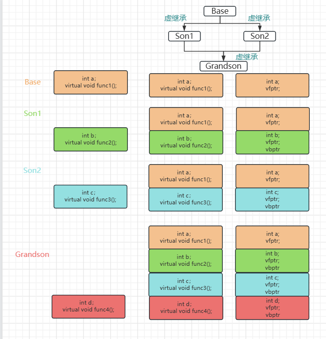
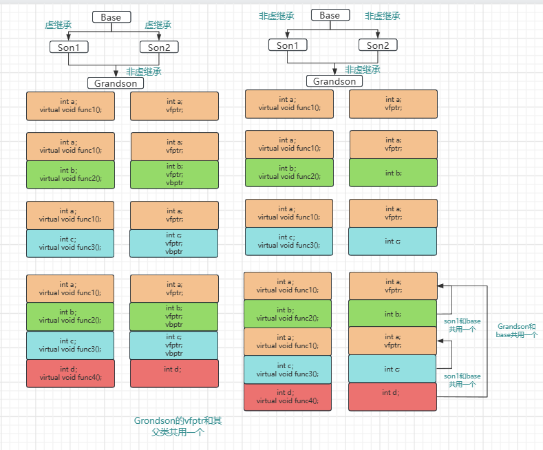
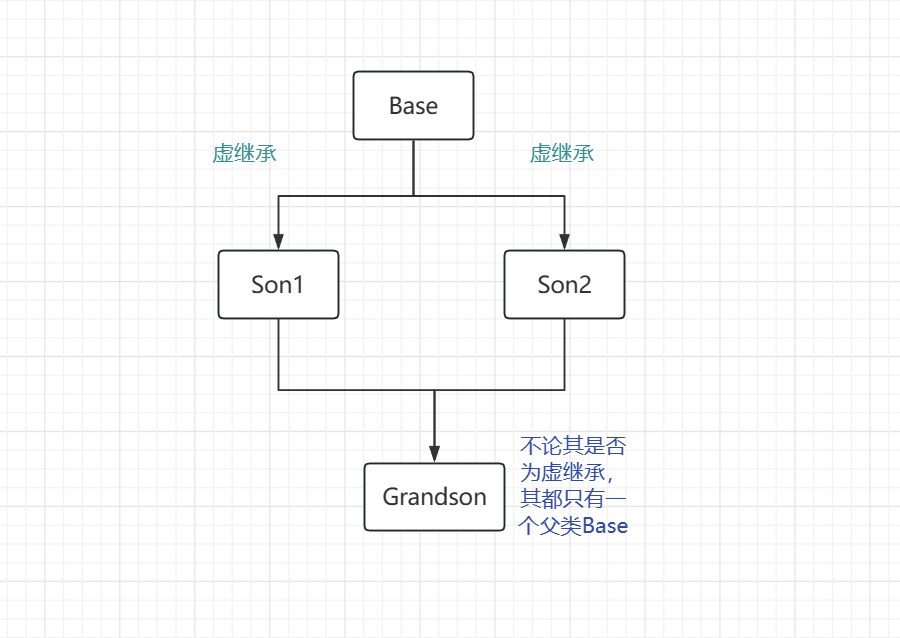

## 

## 1.不含虚函数和虚继承

子类大小 = 子类数据成员 + 父类大小

## 2.含有虚函数和非虚继承

1. 若其父类有虚函数表，则子类的虚函数会并到其父类的虚函数表中，共享一个虚函数指针。	
    1. 子类大小 = 子类数据成员 + 父类大小
2. 否则子类拥有一个虚函数指针
    1. 子类大小 = 子类数据成员 + 子类虚函数表指针 + 父类大小

## 3.只含有虚继承

多一个vbtable，指向基类表的指针

子类大小 + 指向基类表的指针 + 父类大小

## 4.含有虚函数和虚继承

子类大小 = 子类数据成员 + 子类虚函数表指针 + 父类大小

若子类进行了对父类虚函数的重载，则其该虚函数会替代其子类对象中该该虚函数所在对象的的虚函数的位置，

如grandson中重载base的fun1，则fun1在base的fptr指向的虚函数表中

## 注意

关于虚基类只有一个实例