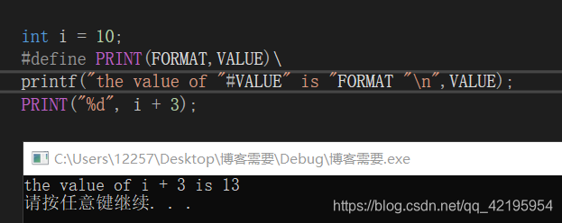
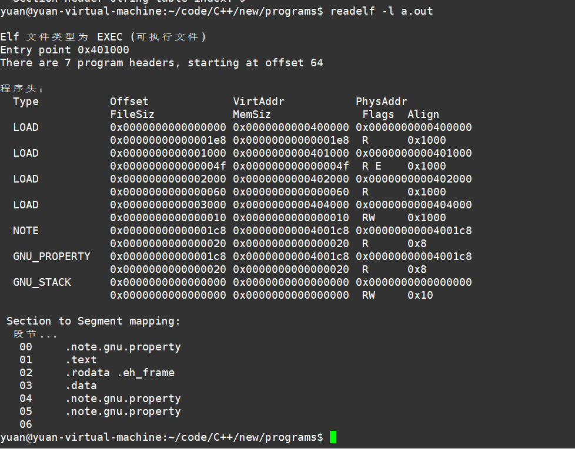

1. 编译过程

    1. 预编译 

        1. 将头文件引入

        2. 宏

            1. 允许把参数替换到文本中，这种实现通常称为宏或定义宏。

                **1.#define 定义标识符**

                例如：#define name stuff

                如果是多行替换的话，必须每行后面加上续行符 ’ \ ’ ,因为宏只会替换后面的一行而已。

                例如：

                ```c
                #define DEBUG_PRINT printf("file:%s\tline:%d\t  \
                                           date:%s\ttime:%s\n" ,\
                                           __FILE__,__LINE__ ,  \
                	                       __DATE__,__TIME__ )
                1234
                ```

                注意：在定义宏时，应尽可能地多使用括号，避免临近操作符之间的相互作用。

                **2.宏替换**

                1. 在调用宏时，首先对参数进行检查，看看是否包含任何由#define定义的符号。如果是，它们首先被替换。
                2. 替换文本随后被插入到程序中原来文本的位置。对于宏，参数名被它们的值替换。
                3. 最后，再次对结果文件进行扫描，重复1号过程。

                注意：宏参数和#define定义中可以出现其他#define定义的变量，宏不能出现递归。当处理器搜索#define定义的符号时，字符串常量不被搜索。

                **3.#和##**

                **#：把一个宏参数变成对应的字符串。**

                例如：
                
                **##：可以把位于它两边的符号合成一个符号。它允许宏定义从分离的文本片段创建标识符。**

                例如：

                ```c
                #define ADD_TO_SUM(num,value)\
                sum##num+=value;
                ADD_TO_SUM(3, 7);// 给sum3增加7
                123
                ```

                **4.宏和函数**

                **宏的优势：**

                - 宏比函数在程序的规模和速度方面更胜一筹。
                - 宏与类型无关。

                **宏的劣势：**

                - 长的宏会增加代码篇幅。
                - 宏没法调试。
                - 宏与类型无关，不够严谨。
                - 宏会有优先级问题。

        3. 并非所有带#号的都在预编译完成

            1. #program lib 指定当前程序库，在链接阶段，预处理不处理
            2. #program link 指定开始的函数

    2. 编译 asm

        1. 生成汇编代码
        2. 将内联函数展开

    3. 汇编  .obj

        1. 生成二进制可重定位的目标文件.obj
        2. 符号表的输出
        3. 机器码

2. 链接过程

    1. 链接所有的编译完成的.o文件，所有.o + 静态库文件（动态库在运行时才加载）
    
    2. 步骤
        1. 所有的.o文件段的合并，符号表合并后，进行符号解析
        2. 段合并，将所有obj文件中的段进行合并，同时生成全局的符号表
            1. 对符号的引用都要找到符号定义的地方
                1. 定义没找到 报错符号未定义
                2. 定义找到读个 符号重定义
        3. 符号的重定位，重定向（将原来的在当个文件中的地址转化为整个程序中的地址，同时该地址采用虚拟地址，相对定位，给每一个变量一个专属的地址
        4. 符号解析后，符号表分配地址，给每个外部的全局变量分配地址
        5. 符号的重定向
            1. 将符号在代码中的地址重新修改为符号的实际地址
        
    3. 生成 可执行程序
        1. win .exe
        
        2. linux .out
            1. 通过 -o 生成可执行程序的名称
        
                ## .out 和 .o 文件的区别
        
                1. 可执行文件比二进制文件多了一个程序头
                    1. program head
                        1. 程序头行和下面的段节照应，用于显示那些段需要加载到内存中，load表示需要加载
                2. elf header 程序的入口地址

​			


可执行文件添加到内存中后，cpu虚拟地址做一个地址映射，若页面异常则进行获取地址映射界面的异常处理程序，分配物理内存