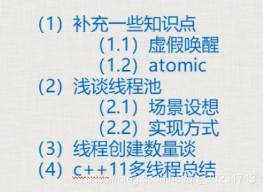

## 第十三章 补充知识、[线程池](https://so.csdn.net/so/search?q=%E7%BA%BF%E7%A8%8B%E6%B1%A0&spm=1001.2101.3001.7020)浅谈、数量谈、总结



**一、补充一些知识点**  
_1.1 虚假唤醒：_  
notify\_one或者notify\_all唤醒wait()后，实际有些线程可能不满足唤醒的条件，就会造成虚假唤醒，可以在wait中再次进行判断解决虚假唤醒。  
解决：wait中要有第二个参数（[lambda](https://so.csdn.net/so/search?q=lambda&spm=1001.2101.3001.7020)），并且这个lambda中要正确判断所处理的公共数据是否存在。

_2.2 atomic：_

```cpp
std::atomic<int> atm = 0;
 
cout << atm << endl;
```

这里只有读取atm是原子操作，但是整个这一行代码 cout << atm << endl; 并不是原子操作，导致最终显示在屏幕上的值是一个“曾经值”。

```cpp
std::atomic<int> atm = 0;
 
auto atm2 = atm; //不可以
```

这种拷贝初始化不可以，会报错。

```cpp
atomic<int> atm2(atm.load());
```

load()：以原子方式读atomic对象的值。

```cpp
atm2.store(12);
```

原子操作实质上是：不允许在进行原子对象操作时进行CPU的上下文切换。

**二、浅谈线程池：**  
场景设想：服务器程序， 每来一个客户端，就创建一个新线程为这个客户提供服务。

问题：

1、2万个玩家，不可能给每个玩家创建一个新线程，此程序写法在这种场景下不通。

2、程序稳定性问题：编写代码中，“时不时地突然”创建一个线程，这种写法，一般情况下不会出错，但是不稳定的；

线程池：把一堆线程弄到一起，统一管理。这种统一管理调度，循环利用的方式，就叫做线程池。

实现方式：程序启动时，一次性创建好一定数量的线程。这种方式让人更放心，觉得程序代码更稳定。

**三、线程创建数量谈：**

1、线程创建的数量极限的问题

一般来讲，2000个线程基本就是极限；再创建就会崩溃。

2、线程创建数量建议

a、采用某些计数开发程序提供的建议，遵照建议和指示来确保程序高效执行。

b、创建[多线程](https://so.csdn.net/so/search?q=%E5%A4%9A%E7%BA%BF%E7%A8%8B&spm=1001.2101.3001.7020)完成业务；考虑可能被阻塞的线程数量，创建多余最大被阻塞线程数量的线程，如100个线程被阻塞再充值业务，开110个线程就是很合适的

c、线程创建数量尽量不要超过500个，尽量控制在200个之内；