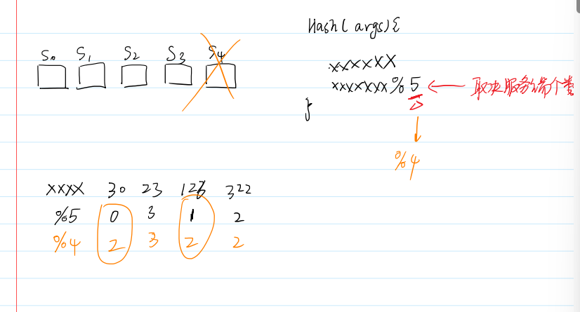
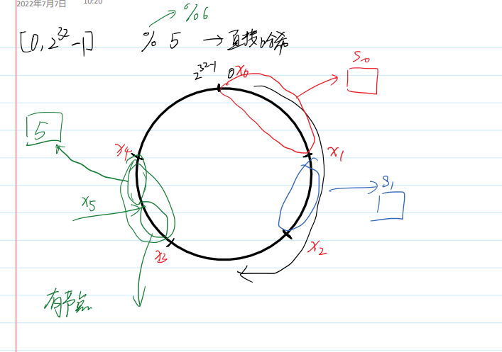
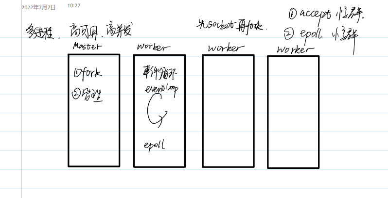

## 反向代理

1. 缓存雪崩

    1. 由一点引起
    2. 当本来资源就非常紧张时，由于一处的资源缓存失效，导致原本访问cdn的请求到达服务器，使原本紧张的服务器承受大量的请求，造成服务器崩溃，侧面导致与其相连的其他cdn失效

2. 轮询

    1. ### [nginx](https://so.csdn.net/so/search?q=nginx&spm=1001.2101.3001.7020)作为负载均衡服务的调度算法

        | 调度算法     | 作用                                                         |
        | ------------ | ------------------------------------------------------------ |
        | 轮询（默认） | 按时间顺序逐一分配到不同的后端服务器                         |
        | 加权轮询     | weight值越大，分配到的访问几率越高                           |
        | ip\_hash     | 每个请求按访问IP的hash结果分配，这样来自同一个Ip访问一个后端服务器 |
        | url\_hash    | 按照访问的URL的hash结果来分配请求，使每个URL定向到同一个后端服务器 |
        | least\_coon  | 最少连接数，哪个后端服务器连接数少就分发到哪个后端服务器     |
        | hash关键数值 | hash自定义的key                                              |

    2. 哈希策略

        1. 只有使用url_hash才可以使用到缓存，访问一个资源都去一个服务器，其他方案不可以
        2. 直接哈希：
            1. 
            2. 当一台CND挂掉，原本访问的规则也要进行修改，原本%5变成%4，其他服务器上的资源与新的策略不符，造成重新配置，缓存雪崩
        3. 一致性哈希
            1. 圆形数组，再加一层抽象，节点等分，通过控制节点中数据的数量，尽量使每个服务器中所有节点的数据差不多。当添加服务器时，与负担较重的服务器进行分担，若删除服务器，则让其他负担较小的服务器承担原本其任务
            2. 
        4. nginx架构
            1. 多进程 高并发 高可用
                1. 
                2. 先socket，再fork
                    1. 每个子进程都共享其socket
                        1. 问题：惊群
                            1. 一个socket连接，导致所有子进程就绪，造成并发问题
                            2. accept惊群
                                1. linux在内核维持一个epoll队列，没次只有一个子进程被唤醒
                            3. epoll惊群
                                1. 全局锁，性能差
                                2. 新版本使用一个套接字选项，SO_REUSEPORT，实现负载均衡（根据tcp连接数实现）
                                3. epoll队列，nginx内部维持，SO_REUSEPORT
                        2. 
            2. master
                1. 负责管理work的存活
            3. work
                1. 负责具体的请求
                2. 事件循环
            4. 

