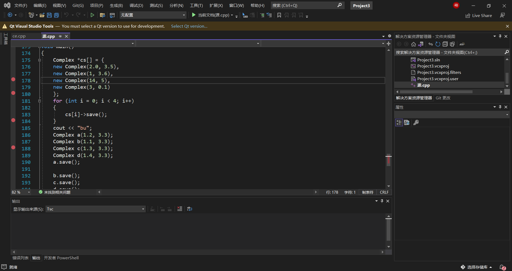
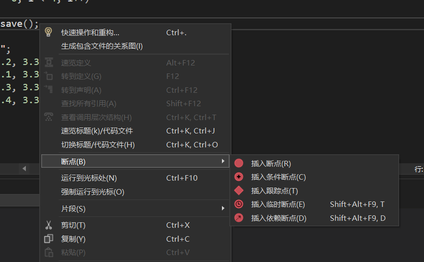
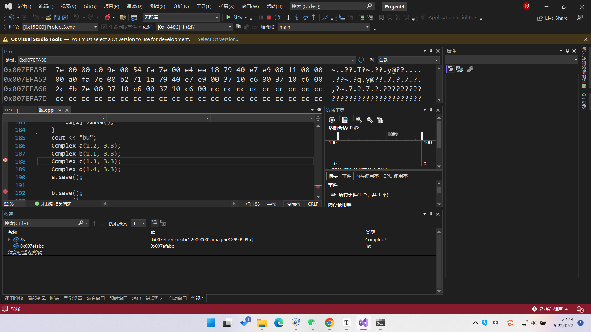
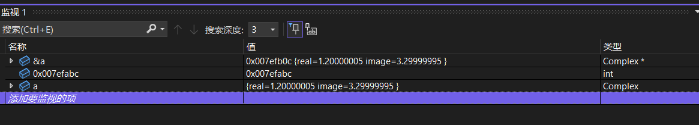
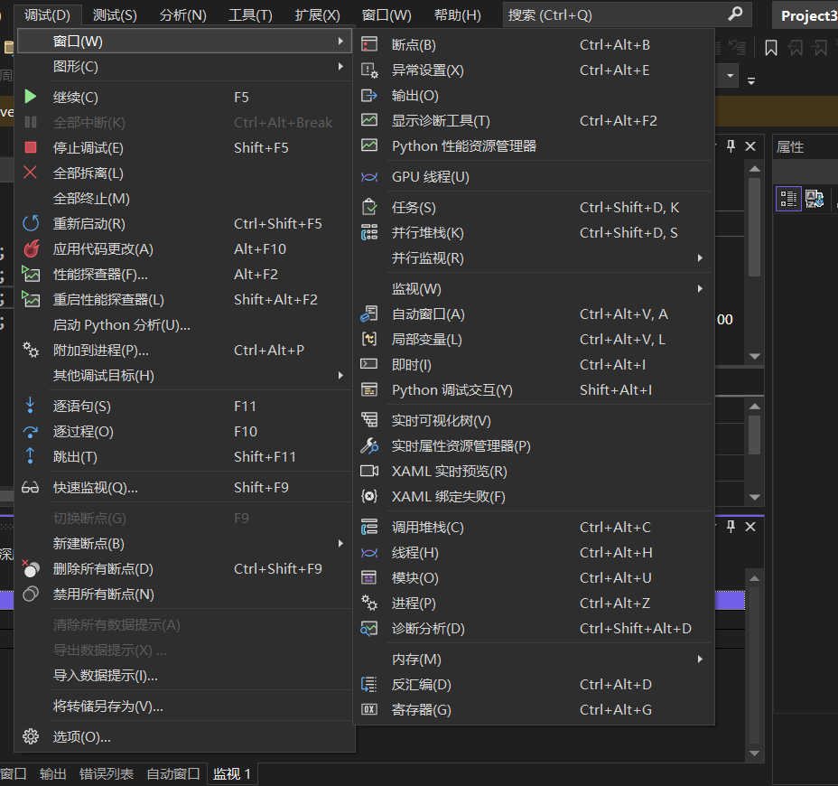

1. 设置断点
   1. 断点类型：
      1. 普通断点
      2. 条件断点：等于该条件时才在该语句中断
      3. 跟踪点
      4. 临时断点：不进行第二次保存
      5. 依赖点
   2. 继续调试
      1. 逐语句：一次执行一条语句
      2. 逐过程：一次执行main函数里的一条语句，尽管某条语句可能是一个函数，但是并不进入该函数，而逐语句需要进入该函数并进行执行
2. 调试界面
   1. 上方为内存地址，在输入框输入内存地址即可查看该地址对应的内容
   2. 堆栈窗口：查看程序函数调用的过程
   3. 局部变量：出现的变量类型以及其当前内容
   4. 断点：设置的断点
   5. 监视窗口：可以监视内存地址，变量，变量地址
3. 调试界面窗口设置
   1. 通过点击调试里的窗口，可以设置主界面上不同的子界面，可设置所需的界面