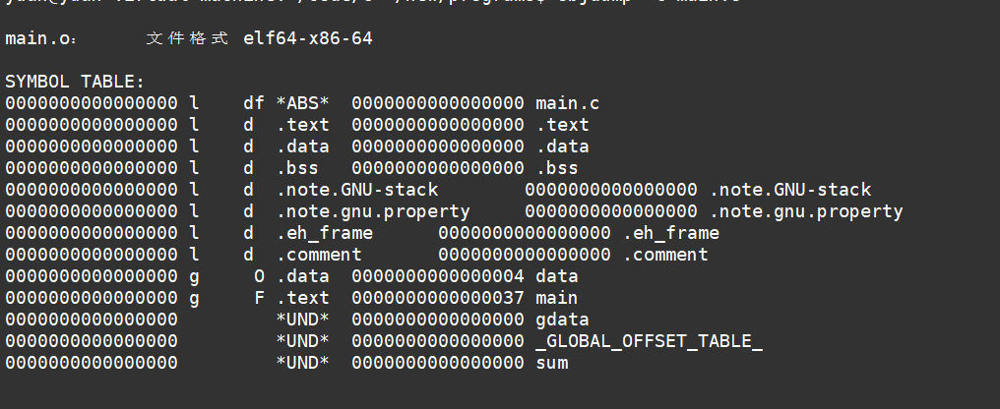
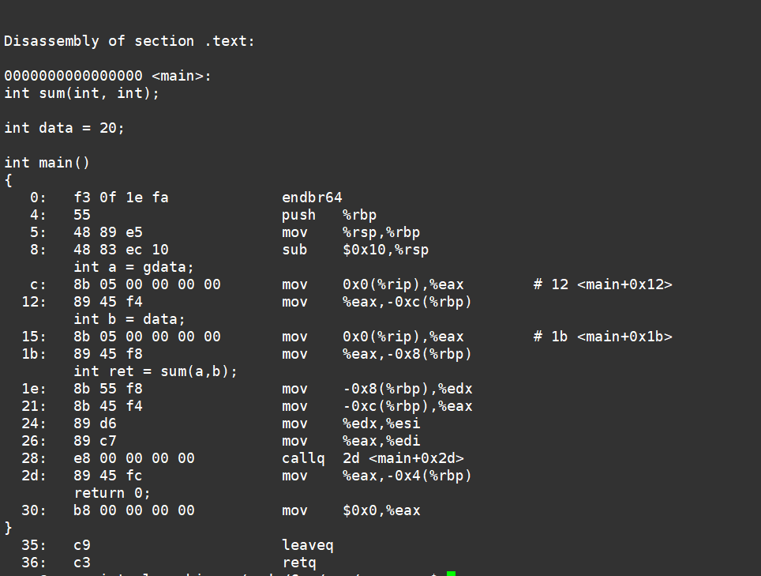

`objdump` 是一个用于分析二进制目标文件的命令行工具，通常与GNU Binutils套件一起提供。它可以显示目标文件的各种信息，包括汇编代码、符号表、段信息等，对于调试和分析二进制文件非常有用。`objdump`的一般用法如下：

```bash
objdump [选项] 目标文件
```

以下是一些常见的 `objdump` 选项和用法：

1. **查看汇编代码**：`-d` 选项用于显示目标文件中的汇编代码。例如，要查看可执行文件的汇编代码：

   ```bash
   objdump -d myprogram
   ```

2. **显示符号表**：`-t` 选项用于显示目标文件中的符号表，包括函数、变量等信息。例如：

   ```bash
   objdump -t myprogram
   ```

   1. 
      1. 局部全局
         1. l
            1. 局部变量，连接器看不到，对连接器透明

         2. g
            1. 全局变量，连接器先在本文件中查找，若未查找到定义，则在其他文件的全局变量中查找

      2. 段
         1. 

3. **显示段信息**：`-h` 选项用于显示目标文件的段（section）信息，包括段名称、大小等。例如：

   ```bash
   objdump -h myprogram
   ```

4. **以16进制格式显示数据**：`-x` 选项用于以16进制格式显示数据。例如，可以查看可执行文件的16进制内容：

   ```bash
   objdump -x myprogram
   ```

5. **反汇编特定函数**：你还可以使用 `objdump` 来反汇编特定函数。例如，要反汇编名为 `main` 的函数：

   ```bash
   objdump -S -main.c
   ```

1. 
    1. 在访问外部的全局变量时，在编译阶段此时其地址均为0，当链接时，才将其地址进行替换
    2. 

`objdump` 提供了许多选项，可以用于分析和检查目标文件的各个部分，以帮助调试和了解程序的内部结构。你可以使用 `objdump --help` 命令查看所有可用选项的详细信息。

关于符号表字段下面直接只介绍部分常用的：

- .text：已编译程序的机器代码。
- .rodata：只读数据，比如printf语句中的格式串和开关（switch）语句的跳转表。
    - const char *message = "Hello, World!"; 定义在全局的常量字符串
- .data：已初始化的全局C变量。局部C变量在运行时被保存在栈中，既不出现在.data中，也不出现在.bss节中。
- .bss：未初始化的全局C变量。在目标文件中这个节不占据实际的空间，它仅仅是一个占位符。目标文件格式区分初始化和未初始化变量是为了空间效率在：在目标文件中，未初始化变量不需要占据任何实际的磁盘空间。
- .symtab：一个符号表（symbol table），它存放在程序中被定义和引用的函数和全局变量的信息。一些程序员错误地认为必须通过-g选项来编译一个程序，得到符号表信息。实际上，每个可重定位目标文件在.symtab中都有一张符号表。然而，和编译器中的符号表不同，.symtab符号表不包含局部变量的表目。
- .rel.text：当链接噐把这个目标文件和其他文件结合时，.text节中的许多位置都需要修改。一般而言，任何调用外部函数或者引用全局变量的指令都需要修改。另一方面调用本地函数的指令则不需要修改。注意，可执行目标文件中并不需要重定位信息，因此通常省略，除非使用者显式地指示链接器包含这些信息。
- .rel.data：被模块定义或引用的任何全局变量的信息。一般而言，任何已初始化全局变量的初始值是全局变量或者外部定义函数的地址都需要被修改。
- .debug：一个调试符号表，其有些表目是程序中定义的局部变量和类型定义，有些表目是程序中定义和引用的全局变量，有些是原始的C源文件。只有以-g选项调用编译驱动程序时，才会得到这张表。
- .line：原始C源程序中的行号和.text节中机器指令之间的映射。只有以-g选项调用编译驱动程序时，才会得到这张表。