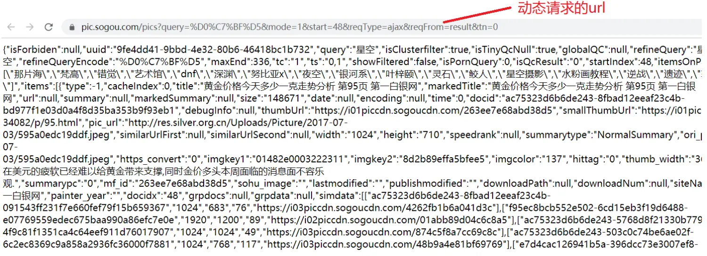
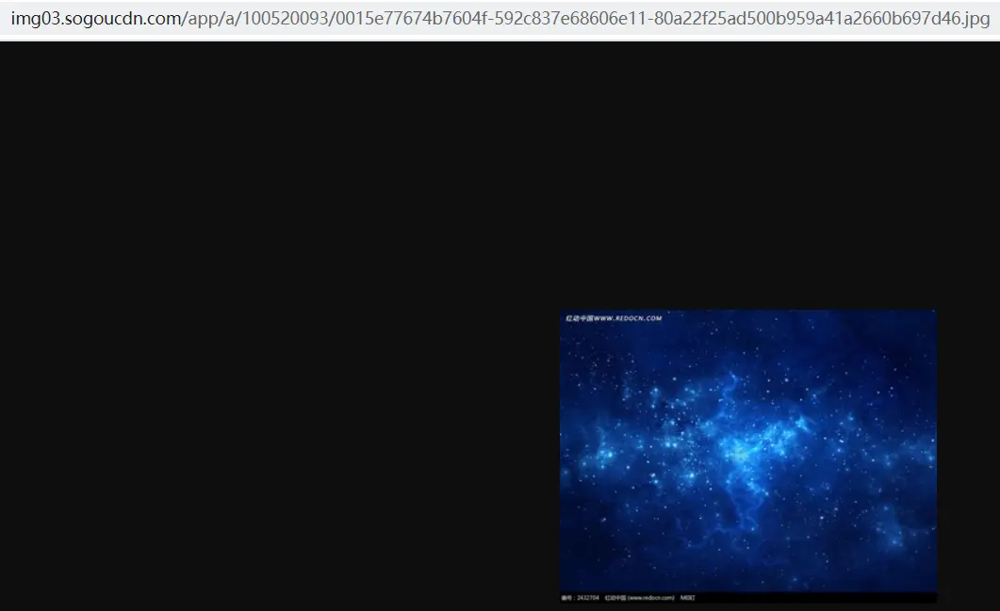

作为一个初学爬虫的小白,还是决定开始写一些文章来纪念自己的学习过程,希望自己能有进步.

前几周学习了python基础模块urlllib的使用, 有很多功能实现起来都很复杂, 直到现在学了第三方模块requests后惊叹于它的简洁性与实用性, 但是requests模块的底层实现还是调用了urllib的有关模块的.  不扯远了, 下面是我用requests库抓取搜狗图片的详细过程:

一般浏览器发起的请求有两种: get请求和 post请求, 根据我们的需要使用 get请求就可以实现这个功能了.  这里稍微区分下get和post: get一般是把发送给服务器的信息放在请求头中, 它的请求有长度限制, 而且不可以处理敏感数据, 因为它的 传输是不加密的 , 所以我们在模拟登录请求时候一般用的都是post.  post一般是把发送给服务器的信息放在http消息主体中, 请求长度是没有限制的, 同时post信息是加密传输的, 所以可以用来模拟登录.. . 粗略介绍了下 get 和 post. 

然后我的想法就是实现一个能根据输入关键词爬取图片的python程序, 那么在传给搜狗服务的请求参数中就需要添加这个关键词, 请求长度不是特别长而且可以明文传输, 我们用get足矣.  

1\. 首先打开搜狗图片首页我们需要在里面找到我们的目标url:

(1). 访问主页页面:

很显然我们要输入关键字的话直接用这个url肯定是不行的, 我们首先尝试下人工搜索, 看看地址栏url有什么变化(我们首先需要明确一点: 爬虫是灰色产业, 也就是说既不能说不违法, 也不能说违法(不要太过分就好). 那么为什么说它不违法呢? --- 爬虫只能访问用户可以访问到的内容, 比如爱奇艺 VIP视频 , 你普通用户是看不了的, 那有人问用爬虫可不可以爬VIP视频呢? 答案是可以的, 但是有个前提 -> 你必须要用VIP的身份去登陆它的网站再进行爬取. )

这里说这个的意思是, 你爬一个东西前, 最好人工去访问下你想要爬的内容, 如果你人工都访问不了, 那么你还是放弃吧! 爬虫也爬不了的 (如果强行获取用户访问不了的数据 -> 那就是黑客了, 是犯法了. 我们是spider, 不是 hacker...) 

人工模拟搜索:

上面的url我复制过来是这个: 

[https://pic.sogou.com/pics?query=%D0%C7%BF%D5&w=05009900&p=&\_asf=pic.sogou.com&\_ast=1585124780&sc=index&sut=12529&sst0=1585124779974](https://links.jianshu.com/go?to=https%3A%2F%2Fpic.sogou.com%2Fpics%3Fquery%3D%25D0%25C7%25BF%25D5%26w%3D05009900%26p%3D%26_asf%3Dpic.sogou.com%26_ast%3D1585124780%26sc%3Dindex%26sut%3D12529%26sst0%3D1585124779974)

这个一看就知道是个get请求, 也就是主url 加上若干个参数的拼接, 其中参数用&分开, 我们发现一共有6个参数:

query, w, p, \_asf, \_ast, sc, sut, ssto  这些参数中肯定有我们有用的, 也肯定有我们不需要的, 我们来分析下, 首先query的意思是查询, 它其实就是我们要查询的关键字, %D0%C7%BF%D5 的意思是星空, 只不过是特殊的url编码表示的"星空", 一般是一种urlencoded格式(用于网络信息传输). 我们可以验证下:

  

结果是

发现不是我们想要的, 其实这是utf-8和gbk格式数据的差异, 我们看看搜狗图片网站的编码: 

发现它是gbk格式的, 那么传输数据的转换格式也应该用gbk, 我们用gbk试试:

结果:

完全一致,那我们的猜想就对了 query 对应的确实是查询关键字, 那么其他关键字呢? 在这里我们可以采取"控制变量法" 去"试", 尝试去掉某些关键字看网页是否有所改变, 最后我们发现其他关键字都去掉了网页还是不变:

下一步是分析网页构造:

我们首先选定一张图片, 右键点击它, 选择复制图片地址, 然后我们用Google提供的查看网页源代码功能, 在源代码界面按 ctrl + F 查找元素, 然后粘贴图片地址: 

然后根据匹配项(橙色部分)前面的属性值确定图片是放在哪里的, 这里图片是放在 "thumbUrl"这个属性里面, 我们再用同样的方法搜索这个属性名, 看看有几个匹配项:

这里有48个图片, 也就是48个匹配项, 48张图片, 我们来检查下是不是一一对应的: 

然后在新窗口中输入这个url:

发现确实是对的, 我们属性也找对了. 现在来说说两个"问题":

一 : 我们发现, 搜狗图片的显示好像是"无穷无尽"的, 为什么我们这个源代码页面只有48个? 其实当我们把滑条向下拉动时会一直有新的图片出来, 没有"下一页"的选项, 这里其实用到了web开发一种技术: AJAX, 我们不需要具体去学AJAX, 我们只要知道它是啥东西就行了, AJAX技术实现了网页的动态加载(网页不是一次性加载出全部资源, 而是动态加载资源, 避免了因为网页过于臃肿而影响加载速度). 我们如何从动态加载的网页中找出"目标url"? --> 这个就是我们的目的.  这里我们可以借助Google浏览器的开发者工具: 

打开开发者工具的快捷键是 ctrl + shift + i (或者 ctrl + shift + c), 进到开发者工具后我们点击 network选项:

里面就会有网页所有的元素, 这里我们需要关注的是一个XHR的选项:

XHR全程XMLHttpRequest, 意思是可扩展超文本传输请求, XHR对象可以在不向服务器提交整个页面的情况下实现局部更新网页. 当页面全部加载完毕后, 客户端通过该对象向服务器请求数据, 服务器端接收数据并处理后向客户端反馈数据, XHR对象提供了对HTTP协议的完全访问, 包括POST和HEAD请求以及普通的GET请求的能力, XHR可以同步或异步返回web服务器的响应, 能以文本或DOM文档的形式返回内容.......... 

不说远了, 它对我们完成程序至关重要, 现在我们的XHR里面的内容是空的:

是因为我们在打开开发者工具抓包前它已经返回了请求的数据, 所以这里抓包没抓到, 我们可以在保持开发者工具打开的情况下刷新下网页来获得初始数据, Google浏览器按ctrl + r或点击左上角的刷新按钮实现刷新:

现在XHR里面已经有了一个数据, 我们来看看它是什么:

首先左键点击它:

在这里选择Preview或者左键连点两次可以打开在新标签页打开服务器返回的数据(可能更方便查找数据).

我们右键在新标签页打开这个url:

我们首先跟上面一样, 第一步分析url结构:

这样得到一个url: [https://pic.sogou.com/pics?query=%D0%C7%BF%D5&mode=1&start=48&reqType=ajax&reqFrom=result&tn=0](https://links.jianshu.com/go?to=https%3A%2F%2Fpic.sogou.com%2Fpics%3Fquery%3D%25D0%25C7%25BF%25D5%26mode%3D1%26start%3D48%26reqType%3Dajax%26reqFrom%3Dresult%26tn%3D0)

我们还是可以找出这个get请求由哪些关键词组成: query, mode, start, reqType, reqFrom, tn

我们继续用"控制变量法"分析它, query肯定需要, 是查询的关键词, 分析过程如下:

一: 先把出了query的关键词全部去掉: [https://pic.sogou.com/pics?query=%D0%C7%BF%D5](https://links.jianshu.com/go?to=https%3A%2F%2Fpic.sogou.com%2Fpics%3Fquery%3D%25D0%25C7%25BF%25D5%26mode%3D1%26start%3D48%26reqType%3Dajax%26reqFrom%3Dresult%26tn%3D0), 

发现它跳到了这个界面,不是我们需要的数据:

然后我们可以保留一个关键词,例如start , 猜测它是很有用的:[https://pic.sogou.com/pics?query=%D0%C7%BF%D5&start=48](https://links.jianshu.com/go?to=https%3A%2F%2Fpic.sogou.com%2Fpics%3Fquery%3D%25D0%25C7%25BF%25D5%26mode%3D1%26start%3D48%26reqType%3Dajax%26reqFrom%3Dresult%26tn%3D0), 

发现它还是跳到了一个图片网站, 只是起始图片不同了:

证明它是有用的, 可以告诉服务器从第几张图片开始返回, 我们保留它, 剩下的关键词我们猜测reqType是有用的, 因为它等于AJAX, 正好是前面讲的一种web开发技术, 我们试试这个url: [https://pic.sogou.com/pics?query=%D0%C7%BF%D5&start=48&reqType=ajax](https://links.jianshu.com/go?to=https%3A%2F%2Fpic.sogou.com%2Fpics%3Fquery%3D%25D0%25C7%25BF%25D5%26mode%3D1%26start%3D48%26reqType%3Dajax%26reqFrom%3Dresult%26tn%3D0):

我们检验下这个页面的第一个图片:

发现不是最初页面的第一张, 然后我们刚刚不是分析了start吗? 我们可以尝试修改start=0, 试试返回的第一张应该就是最初页面的第一张图了:

验证下,果然就是第一张图:

到这里我们分析差不多结束了, 我们分析得到的最终url类似这样:

[https://pic.sogou.com/pics?query=%D0%C7%BF%D5&start=0&reqType=ajax](https://links.jianshu.com/go?to=https%3A%2F%2Fpic.sogou.com%2Fpics%3Fquery%3D%25D0%25C7%25BF%25D5%26start%3D0%26reqType%3Dajax)

这里我说明下,其他参数什么意思我也不知道, 但是不影响我们爬图片, 其实加上也可以, 没必要去试, 就把所有的参数都带上, 省时间.  

经过前面的分析, 怎么爬取多个图片? 好像我们每次请求, 他只返回给我们48张图片(不管我们的start变成多少), 这里我们怎么办呢? 很简单 ---- > 我们可以在python代码里面循环更改start的值, 就可以从不同的起始图开始爬取数据了 . 比如,  我们可以让start 最初为 0 , 然后爬取完一组数据后让start += 48 , 就可以啦 .. 为什么要加48, emmm,  因为搜狗服务器一次只返回给我们48张....  

综上所述, url,也找出来了,  结果也分析出来了,  本来我们可以开始代码了, 但是我后来代码写完才发现爬取到的图片好小,  根本不是那种特别清晰的,  总之比起我们单击搜狗图片里面某个图片后打开的图片来说完全就是"缩小版", 

像这样:

左边的是我们爬到的, 右边的是点开图片后搜狗图片展示的, 我们怎么办? --> 我们肯定要追求最好是不? 然后我果断选择继续: 我首先就在搜狗图片详情页复制了下图片地址然后去返回的请求里找看有没有:

详情页就是这个页面(单机图片后的):

我们最后找到了, 而且还有好几个匹配的项:

  

我们发现这个属性名不是前面那个"thumbUrl", 但是它们确实都在同一个页面, 只不过是在属性名不同的值里面, 我们最后只要稍微修改下代码就好了. 

注意点:

  

  

  

这里我代码里面是把所有的参数都拼接上去了, 其实只需要下面两个参数即可, 一个query, 一个start,  这是我们分析出来的.   url  就是去掉所有参数后剩下的, user-agent 用来辨别用户身份, 如果不自己修改的话, 最后的请求头python会自动给你加上 带有python字样的user-agent,  那别人就很容易知道你是爬虫来处理你. 所以每次爬的时候都要带上.  然后请求数据就两行:

  

这里讲下用response的好处, 我们之前不是看到 关键词 "星空" 在url里是有着urlencoded格式的特殊类型, 所以本来我们在请求的时候需要将url里不符合规范的格式全部改成urlencoded格式(在urllib底层库里我们需要手动改),  当然在第三方模块 requests中 它会自动将不是标准格式的url改成标准格式, 很方便, 而且相比urllib的请求, requests多了个 params参数:

它可以自动将python字典,元组组成的列表或者bytes类型转化为标准格式并拼接到url后面, 也是很方便. 

这里最后说下返回值的问题: 我们打开请求网页也看到了, 服务器返回给我们的其实是一个json对象, 遇到这种情况, 我们也不需要将返回的改成字符串然后用正则或者xpath去解析, 直接将它转化为json对象(在python代码里表现为字典格式), 然后直接从字典去找需要的元素. 怎么转换成json格式, 有两种方法, 第一种就是利用强大的requests模块的json方法:

def json(self,\*\*kwargs):

    r"""Returns the json-encoded content of a response, if any.

:param \\\*\\\*kwargs: Optional arguments that \`\`json.loads\`\` takes.

:raises ValueError: If the response body does not contain valid json.

    """

这是源码里的, 就是如果返回的response对象包含一个合法的json, 就可以直接将返回对象转换成json格式(也就是个字典); 第二种方法就是, import json  然后将返回值转换成字符串或者bytes 然后用 response = json.loads(response.content(或者response.text)), 也可以实现, 原理是一样的, 只不过requests别人帮我们封装好了. 

之后就没啥难点了, 就是保存文件是用二进制将返回的数据保存到本地, 原理是所有mp4, mp3, jpg, mkv, png等等等等 都是将视频,音乐等对象用不同的压缩算法将它们压缩成计算机能保存的(0, 1流)二进制文件, 自然我们只要取得这二进制文件完全相同的所有字节就相当于"下载" 了. 

  

-

运行结果如下:

-

(从第50张开始下是因为之前下过前50张, 不会重复下)

  

