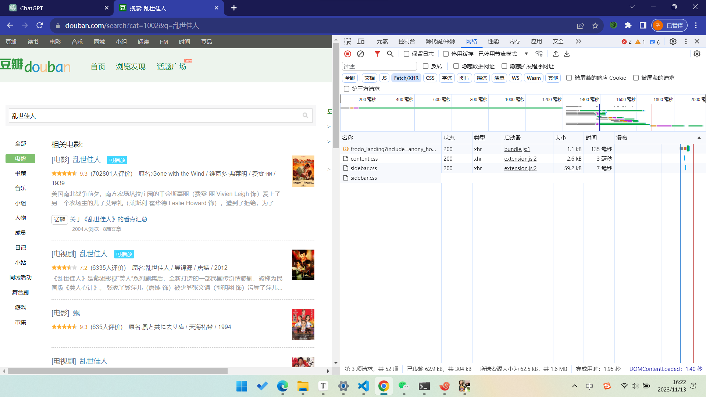
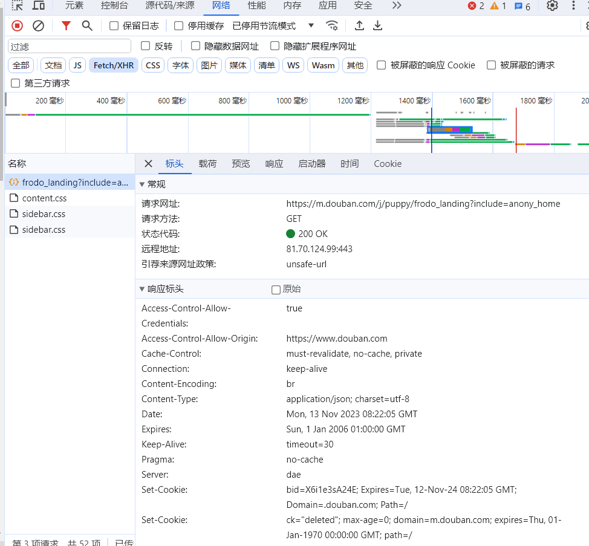
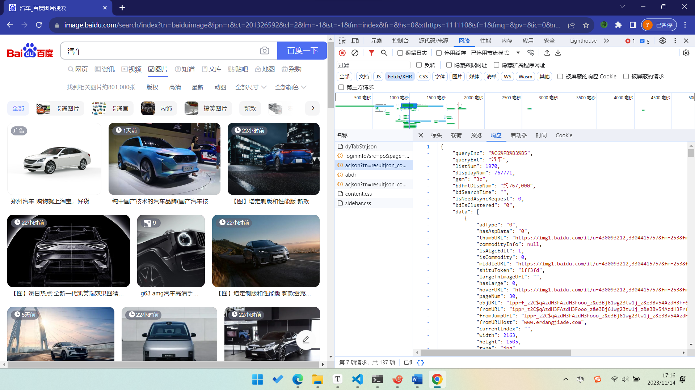
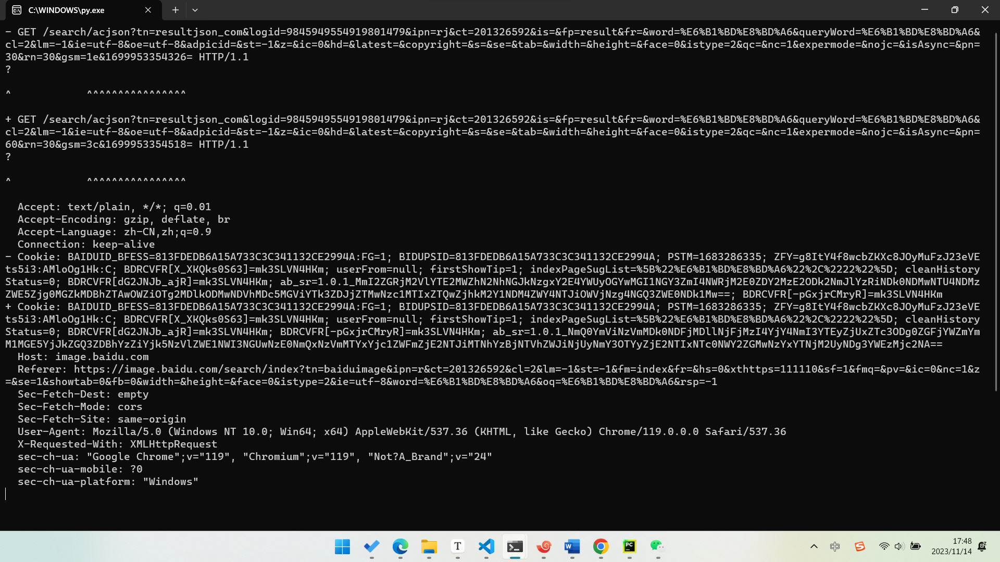
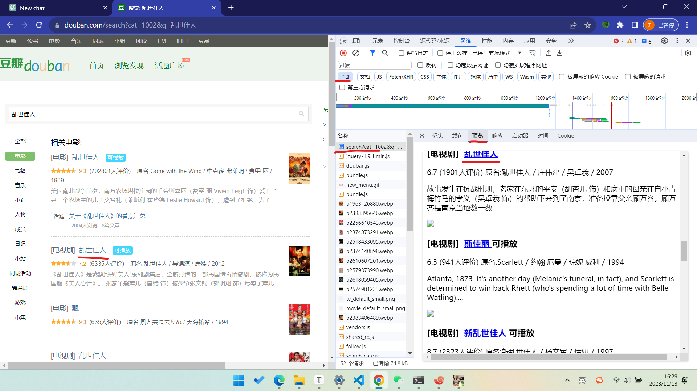

## 1.运行逻辑

1. 获取基本信息
    1. 获取目标网站信息
    2. 了解查询协议
2. 编写python
    1. 设计报文
    2. 发送请求
    3. 处理结果

## 获取基本信息


1. 获取目标网站信息
    1. 首先打开目标网站，比如要爬取豆瓣上名字为 乱世佳人的电影，则进入查询，同时打开谷歌浏览器检查，调到network模式
        1. 
    2. 设置筛选选项为 Fetch/XHR，代表着xml格式请求
    3. 点开请求，.js 、.css 一般不是目标文件，
        1. 
        2. 标头是请求的内容
        3. 载荷是传递的数据
        4. 预览是将收到的内容以界面显示
        5. 相应是收到的源代码
    4. ==两种情况==
        1. 一种在 Fetch/XHR 中可以看到，返回的是json
            1. 
            2. 找到请求，分析请求
                1. 对于不同的参数，可以分别对比两次不同的请求，看其不同点，==若有页数改变页数，若没有向下滑动，看请求头内容改变==
                    1. 
                    2. 通过对比，可以看到，pn的值不一样，而且每次增加30，可以判断这个可能是每页30个，还有一个gsm，看到其长度很长，可以猜测这个对结果没用
            3. 找到返回数据，分析返回数据
        2. 看不到的是返回的html界面，在界面上可以看到
            1. 
            2. 此时筛选选择全部，然后选择预览，看哪个匹配，一般是第一个
    
2. 了解查询协议
    1. 当找到自己发送的数据包时，再点击标头，将其复制后，将head设置为其内容，将请求url单独设为url，剩余的部分设置为head
    
        1. ```
            GET /search?cat=1002&q=%E4%B9%B1%E4%B8%96%E4%BD%B3%E4%BA%BA HTTP/1.1
            Accept: text/html,application/xhtml+xml,application/xml;q=0.9,image/avif,image/webp,image/apng,*/*;q=0.8,application/signed-exchange;v=b3;q=0.7
            Accept-Encoding: gzip, deflate, br
            Accept-Language: zh-CN,zh;q=0.9
            Cache-Control: max-age=0
            Connection: keep-alive
            Cookie: bid=23BRbMTgerg; _pk_id.100001.8cb4=c3c707aece592ae4.1699844054.; __utmc=30149280; __utmz=30149280.1699844054.1.1.utmcsr=(direct)|utmccn=(direct)|utmcmd=(none); ll="118237"; _pk_ses.100001.8cb4=1; ap_v=0,6.0; __utma=30149280.1638595014.1699844054.1699844054.1699863724.2; __utmt=1; __utmb=30149280.1.10.1699863724
            Host: www.douban.com
            Referer: https://www.douban.com/search?cat=1002&q=%E7%AC%94%E4%BB%99
            Sec-Fetch-Dest: document
            Sec-Fetch-Mode: navigate
            Sec-Fetch-Site: same-origin
            Sec-Fetch-User: ?1
            Upgrade-Insecure-Requests: 1
            User-Agent: Mozilla/5.0 (Windows NT 10.0; Win64; x64) AppleWebKit/537.36 (KHTML, like Gecko) Chrome/119.0.0.0 Safari/537.36
            sec-ch-ua: "Google Chrome";v="119", "Chromium";v="119", "Not?A_Brand";v="24"
            sec-ch-ua-mobile: ?0
            sec-ch-ua-platform: "Windows"
            ```
    
            1. 如上所示，将GET /search?cat=1002&q=%E4%B9%B1%E4%B8%96%E4%BD%B3%E4%BA%BA HTTP/1.1 转变为
    
                ```
                url = 'https://www.douban.com/search'
                ```
    
                1. 再将参数分别使用 params = { 'cat': '1002', 'q': q_variable,} 填入后面。
    
            2. ==注意事项==：
    
                1. Accept-Encoding: gzip, deflate, br 表示服务器将内容压缩后发送给客户端，python不支持自动解码，收到后会显示乱码，需要将这一行删除，
                2. Cookie:可以删除
    
        2. 相关代码如下
    
            1. ```python
                import requests
                import chardet
                from bs4 import BeautifulSoup
                
                url = 'https://www.douban.com/search'
                headers = {
                    'Accept': 'text/html,application/xhtml+xml,application/xml;q=0.9,image/avif,image/webp,image/apng,*/*;q=0.8,application/signed-exchange;v=b3;q=0.7',
                    'Accept-Encoding': 'gzip, deflate, br',
                    'Accept-Language': 'zh-CN,zh;q=0.9',
                    'Cache-Control': 'max-age=0',
                    'Connection': 'keep-alive',
                    'Cookie': 'bid=23BRbMTgerg; _pk_id.100001.8cb4=c3c707aece592ae4.1699844054.; __utmc=30149280; __utmz=30149280.1699844054.1.1.utmcsr=(direct)|utmccn=(direct)|utmcmd=(none); ll="118237"; _pk_ses.100001.8cb4=1; ap_v=0,6.0; __utma=30149280.1638595014.1699844054.1699844054.1699863724.2; __utmt=1; __utmb=30149280.1.10.1699863724',
                    'Host': 'www.douban.com',
                    'Referer': 'https://www.douban.com/search?cat=1002&q=%E7%AC%94%E4%BB%99',
                    'Sec-Fetch-Dest': 'document',
                    'Sec-Fetch-Mode': 'navigate',
                    'Sec-Fetch-Site': 'same-origin',
                    'Sec-Fetch-User': '?1',
                    'Upgrade-Insecure-Requests': '1',
                    'User-Agent': 'Mozilla/5.0 (Windows NT 10.0; Win64; x64) AppleWebKit/537.36 (KHTML, like Gecko) Chrome/119.0.0.0 Safari/537.36',
                    'sec-ch-ua': '"Google Chrome";v="119", "Chromium";v="119", "Not?A_Brand";v="24"',
                    'sec-ch-ua-mobile': '?0',
                    'sec-ch-ua-platform': '"Windows"',
                }
                
                # 设置一个变量，代表 q 的内容
                q_variable = '乱世佳人'
                
                params = {
                    'cat': '1002',
                    'q': q_variable,
                }
                
                response = requests.get(url, headers=headers, params=params)
                
                if response.status_code == 200:
                
                    # 将解码后的内容保存到 HTML 文件
                    with open('output.html', 'w', encoding='utf-8') as html_file:
                        html_file.write(response.text)
                
                    print("HTML 文件已保存成功！")
                
                
                else:
                    print(f'Error: {response.status_code}')
                
                ```
                
                ## 编写python
                
                1. 设计报文
                    1. 
                
                2. 发送请求
                
                3. 处理结果
                
                    1. html格式：
                
                        1. 找到其中的目标div块名，通过 result_blocks = soup.select('.result') 将其中所有名字为 result的类获取到==不需要关注其类的层级目录，只要保证不冲突即可==
                
                        2. 再分别提取这个result块中的内容
                
                            1. 获取块中的信息
                
                                1. ```
                                    title_element = result_block.select_one('.title h3 a')
                                        title = title_element.get_text(strip=True) if title_element else "No title found"
                                    ```
                
                                2. 表示获取.title 类下的 h3 中的 a 中的内容
                
                                3. result_block.select_one 将 内容转化为一个类，但是若html文件中该类不存在则为空，因此需要判断其是否非空
                
                                4. title = title_element.get_text(strip=True) if title_element else "No title found" 表示若不为空，则其=title_element.get_text(strip=True) ，否则等于"No title found"
                
                        3. 将其转化为json
                
                            1. 首先需要将分别获取到的值加入一个字典对象，再将这个对象转化为json，再传入列表
                
                            2. 转化为字典
                
                                1. ```python
                                        # 转化为字典
                                        movie_info = {
                                        "Title": title,
                                        "Rating": rating,
                                        "Votes": votes,
                                        "Cast": cast
                                        }
                                    ```
                
                            3. 转化为json
                
                                1. ```
                                        #将其转化为json
                                        json_data = json.dumps(movie_info, ensure_ascii=False)
                                    ```
                
                            4. 传入列表
                
                                1. ```
                                        #将json加入列表
                                        result_list.append(json_data)
                                    ```
                
                                    
                
                        4. 主要代码
                
                            1. ```python
                                import json
                                from bs4 import BeautifulSoup
                                soup = BeautifulSoup(response.text, 'html.parser')
                                
                                # 初始化结果列表
                                result_list = []
                                
                                # 选择所有 class 为 "result" 的 div 元素
                                result_blocks = soup.select('.result')
                                
                                # 遍历每个 result 块，提取内容
                                for result_block in result_blocks:
                                    # 检查是否存在标题元素
                                    title_element = result_block.select_one('.title h3 a')
                                    title = title_element.get_text(strip=True) if title_element else "No title found"
                                
                                    # 提取评分信息
                                    rating_info = result_block.select_one('.rating-info')
                                    if rating_info:
                                      rating = rating_info.select_one('.rating_nums').get_text(strip=True) if rating_info.select_one('.rating_nums') else "No rating found"
                                      votes = rating_info.select_one('.rating-info span:last-child').get_text(strip=True) if rating_info.select_one('.rating-info span:last-child') else "No votes found"
                                    else:
                                        rating = "No rating found"
                                        votes = "No votes found"
                                
                                    # 提取演员信息
                                    cast_element = rating_info.select_one('.subject-cast')
                                    cast = cast_element.get_text(strip=True) if cast_element else "No cast found"
                                    
                                    # 转化为字典
                                    movie_info = {
                                    "Title": title,
                                    "Rating": rating,
                                    "Votes": votes,
                                    "Cast": cast
                                    }
                                
                                    #将其转化为json
                                    json_data = json.dumps(movie_info, ensure_ascii=False)
                                    
                                    #将json加入列表
                                    result_list.append(json_data)
                                for i in result_list:
                                    print(i)
                                ```
                
                                

## 保存请求图片

```python
import requests
import os
import urllib

class GetImage():
    def __init__(self,keyword='鲜花',paginator=1):
        # self.url: 链接头
        self.url = 'http://image.baidu.com/search/acjson?'
        self.headers = {
            'User-Agent': 'Mozilla/5.0 (Windows NT10.0; WOW64) AppleWebKit/537.36(KHTML, like Gecko) Chrome/69.0.3497.81 Safari/537.36'
            }
        self.keyword = keyword      # 定义关键词
        self.paginator = paginator  # 定义要爬取的页数

    def get_param(self):
        # 将中文关键词转换为符合规则的编码
        keyword = urllib.parse.quote(self.keyword)
        params = []
        # 为爬取的每页链接定制参数
        for i in range(1, self.paginator + 1):
            params.append(
                'tn=resultjson_com&ipn=rj&ct=201326592&is=&fp=result&queryWord={}&cl=2&lm=-1&ie=utf-8&oe=utf-8&adpicid=&st=-1&z=&ic=&hd=1&latest=0&copyright=0&word={}&s=&se=&tab=&width=&height=&face=0&istype=2&qc=&nc=1&fr=&expermode=&force=&cg=star&pn={}&rn=30&gsm=78&1557125391211='.format(keyword, keyword, 30 * i))
        return params   # 返回链接参数
    
    def get_urls(self, params):
        urls = []
        for param in params:
            # 拼接每页的链接
            urls.append(self.url + param)
        return urls   # 返回每页链接

    def get_image_url(self, urls):
        image_url = []
        for url in urls:
            json_data = requests.get(url, headers=self.headers).json()
            json_data = json_data.get('data') # 返回爬取结果图像的信息列表
            for i in json_data:
                if i:
                    image_url.append(i.get('thumbURL')) # 获取图像下载url
            
        return image_url

    def get_image(self, image_url):
        """
        根据图片url，在本地目录下新建一个以搜索关键字命名的文件夹，然后将每一个图片存入。
        :param image_url:
        :return:
        """
        file_name = os.path.join('.', self.keyword)
        print(file_name)
        if not os.path.exists(file_name):
            os.mkdir(file_name)
        for index, url in enumerate(image_url, start=1):
            with open(file_name+'/{}.jpg'.format(index), 'wb') as f:
                f.write(requests.get(url,headers=self.headers).content)
            if index != 0 and index % 30 == 0:
                print('第{}页下载完成'.format(index/30))

    def __call__(self, *args, **kwargs):
        params = self.get_param()  # 获取链接参数
        urls = self.get_urls(params)
        image_url = self.get_image_url(urls)
        self.get_image(image_url)

if __name__ == '__main__':
    spider = GetImage('ipad', 3)
    spider()
```

