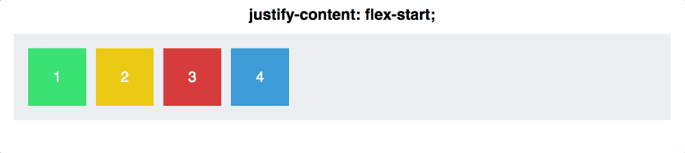
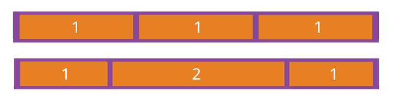

# [弹性布局（display:flex;）属性详解](https://www.cnblogs.com/hellocd/p/10443237.html)

> Flexbox 是 flexible box 的简称（注：意思是“灵活的盒子容器”），是 CSS3 引入的新的布局模式。它决定了元素如何在页面上排列，使它们能在不同的屏幕尺寸和设备下可预测地展现出来。

**它之所以被称为 Flexbox ，是因为它能够扩展和收缩 flex 容器内的元素，以最大限度地填充可用空间**。与以前布局方式（如 table 布局和浮动元素内嵌块元素）相比，Flexbox 是一个更强大的方式：

- **在不同方向排列元素**
- **重新排列元素的显示顺序**
- **更改元素的对齐方式**
- **动态地将元素装入容器**
- ==多行布局方式只有在允许换行时才能使用wrap==

## 一、基本概念

采用 Flex 布局的元素，称为 Flex 容器（flex container），简称"容器"。它的所有子元素自动成为容器成员，称为 Flex 项目（flex item），简称"项目"。

在 Flexbox 模型中，有三个核心概念：  
– flex 项（注：也称 flex 子元素），需要布局的元素  
– flex 容器，其包含 flex 项  
– 排列方向（direction），这决定了 flex 项的布局方向

==项和内容==

1. 根据内容布局和根据项布局不同

##  二、容器属性

### 2.1  flex-direction:

- row（默认值）：主轴为水平方向，起点在左端。
- row-reverse：主轴为水平方向，起点在右端。
- column：主轴为垂直方向，起点在上沿。
- column-reverse：主轴为垂直方向，起点在下沿。

### 2.2   flex-wrap:

- nowrap（默认）：不换行。
- wrap：换行，第一行在上方。
- wrap-reverse：换行，第一行在下方。

### 2.3  justify-content:  ==主轴==

- flex-start（默认值）：左对齐
- flex-end：右对齐
- center： 居中
- space-between：两端对齐，项目之间的间隔都相等。
- space-around：每个项目两侧的间隔相等。所以，项目之间的间隔比项目与边框的间隔大一倍。

### 2.4  align-items:==另一轴==

- flex-start：交叉轴的起点对齐。
- flex-end：交叉轴的终点对齐。
- center：交叉轴的中点对齐。
- baseline: 项目的第一行文字的基线对齐。
- stretch（默认值）：如果项目未设置高度或设为auto，将占满整个容器的高度。

### 2.5  align-content:==内容（文本）==

定义了多根轴线的对齐方式，如果项目只有一根轴线，那么该属性将不起作用==前提设置了换行显示==

- flex-start：与交叉轴的起点对齐。
- flex-end：与交叉轴的终点对齐。
- center：与交叉轴的中点对齐。
- space-between：与交叉轴两端对齐，轴线之间的间隔平均分布。
- space-around：每根轴线两侧的间隔都相等。所以，轴线之间的间隔比轴线与边框的间隔大一倍。
- stretch（默认值）：轴线占满整个交叉轴。

### 结合 `justify-content`和` align-items`，看看在 `flex-direction` 两个不同属性值的作用下，轴心有什么不同：

##  三、项目属性

## 3.1 order属性

## 3.2 flex-grow属性

`flex-grow`属性定义项目的放大比例，默认为`0`，即如果存在剩余空间，也不放大。

如果所有项目的`flex-grow`属性都为1，则它们将等分剩余空间（如果有的话）。如果一个项目的`flex-grow`属性为2，其他项目都为1，则前者占据的剩余空间将比其他项多一倍。

## 3.3 flex-shrink属性

`flex-shrink`属性定义了项目的缩小比例，默认为1，即如果空间不足，该项目将缩小。

.item { flex-shrink: <number>; /\* default 1 \*/
}

如果所有项目的`flex-shrink`属性都为1，当空间不足时，都将等比例缩小。如果一个项目的`flex-shrink`属性为0，其他项目都为1，则空间不足时，前者不缩小。

负值对该属性无效。

## 3.4 align-self属性

`align-self`属性允许单个项目有与其他项目不一样的对齐方式，可覆盖`align-items`属性。默认值为`auto`，表示继承父元素的`align-items`属性，如果没有父元素，则等同于`stretch`。

.item { align-self: auto | flex-start | flex-end | center | baseline | stretch;
}

**弹性布局默认不改变项目的宽度，但是它默认改变项目的高度。如果项目没有显式指定高度，就将占据容器的所有高度。**