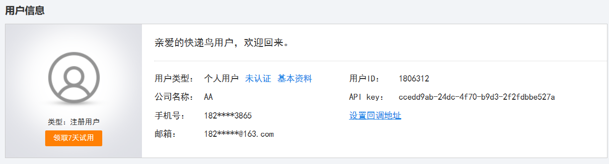
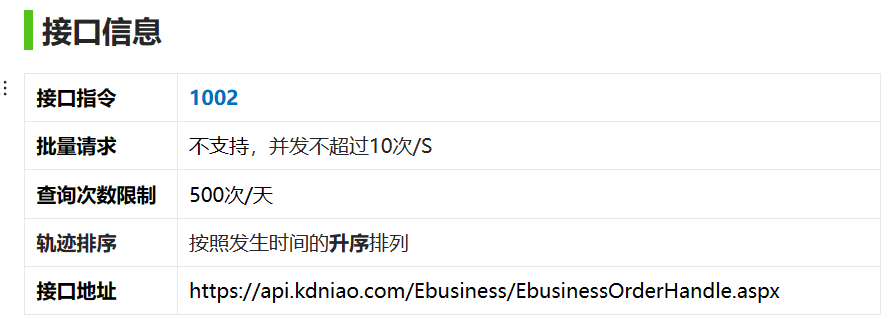
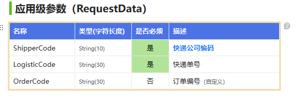
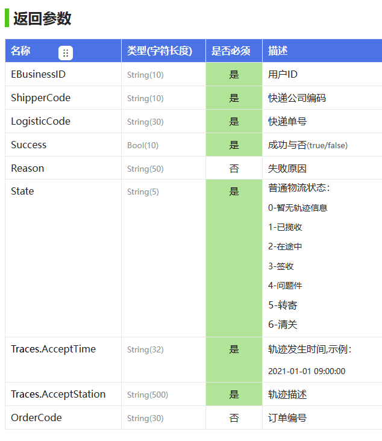
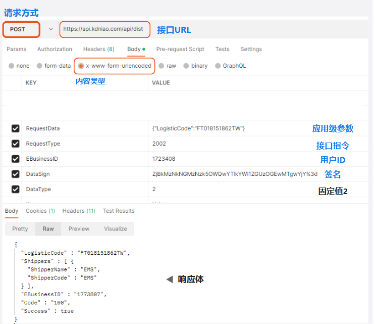
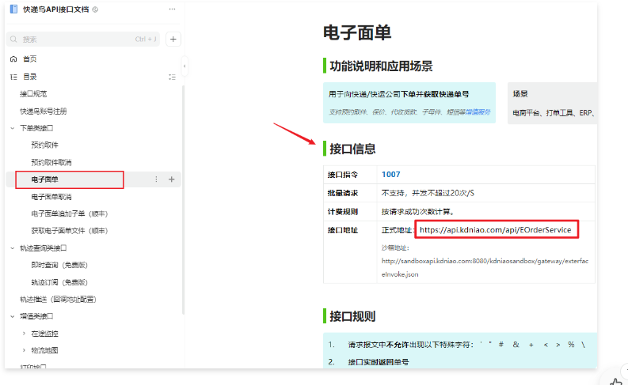
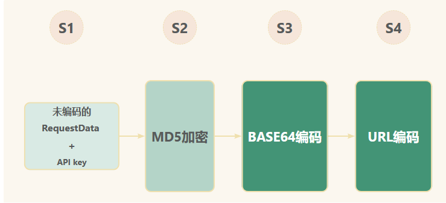
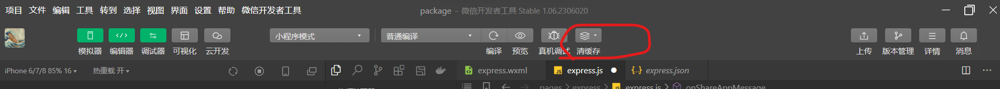

## 1.界面

| 新标签 | 旧标签 | 说明 |
| ------ | ------ | ---- |
| text   | span   | 文本 |
| view   | div    | 块   |
|        |        |      |

1. 在界面中使用data中的变量不需要使用this.data.变量调用，但是在js文件中必须这样调用

## 2.设置事件

1. 点击事件：bindtap
    1. 标签里 bindtap=“函数名”，再在js中进行编写函数
2. 绑定
    1. 单向
        1. 只能由外部往input里赋值
    2. 双向
        1. 向input里输入数据同时能保存到data中的变量中
        2. model：value=“{{}}”

## 3.js

1. 整体结构：

    1. data：{}
        1. 其中用以存储数据，所有需要使用的数据均在其中进行使用
        2. 使用键值对存储
            1. 值有数据类型，带引号为string，不带为int
    2. data之外的为自定义函数，全局函数

2. 自定义函数

    1. 对界面data数据修改

        1. 若需要对界面数据进行修改，需要先在data中保存一份数据，再再自定义函数中，使用this.setData({变量名：变量值})

        2. 在使用this.setData({变量名：变量值})时，需要注意其所在的函数，若是在自定义函数的最外层，则可以使用，否则需要在自定义函数的最外层首先将this保存起来，再在自定义函数的内部通过调用该变量指向的this调用

        3. eg

            ```js
              getCode(){
                //调用微信扫描二维码API
                let that = this
                
                wx.scanCode({
                 success:function(res){
                  that.setData({myLogistiCode:res.result})      
                 }
                })
              },
            ```

    2. 进行变量赋值

        1. let 变量= value

3. 其中规定的变量对象

    1. res 返回值
    2. e 事件对象
        1. target：事件源组件对象
        2. currentTarget：当前组件对象

    ## 4.调用外部API

    ### 4.1 查看API格式

    1. 要拥有一个API key

        1. 

    2. 查看请求示例

        1. 接口信息

            1. 

        2. 请求示例

            1. ```json
                {
                	"RequestData": {
                     "ShipperCode": "STO",
                     "LogisticCode": "638650888018"
                	},
                	"DataType": "2",
                	"EBusinessID": "1000000",
                	"DataSign": "M2JmNjI5mYWZkZTFmOTUxNWYwMZTQzOTQyNjczZThTM=",
                	"RequestType": "1002"
                }
                ```

                

        3. 应用级参数

            1. 

    3. 查看返回示例

        1. 返回参数

            1. 

        2. 返回示例

            1. 无轨迹

                1. 

                ```json
                {
                    "EBusinessID": "1237100",
                    "Traces": [],
                    "State": "0",
                    "ShipperCode": "STO",
                    "LogisticCode": "638650888018",
                    "Success": true,
                    "Reason": "暂无轨迹信息"
                }
                ```

            2. 有轨迹

                1. ```json
                    {
                        "EBusinessID": "1237100",
                        "OrderCode": "",
                        "ShipperCode": "STO",
                        "LogisticCode": "638650888018",
                        "Success": true,
                        "State": 3,
                        "Traces": [  
                            {
                                "AcceptTime": "2014-06-24 20:18:58",
                                "AcceptStation": "已收件[深圳市]"
                            },
                            {
                                "AcceptTime": "2014-06-24 20:55:28",
                                "AcceptStation": "快件在 深圳 ,准备送往下一站 深圳集散中心 [深圳市]"
                            },
                            {
                                "AcceptTime": "2014-06-25 10:23:03",
                                "AcceptStation": "派件已签收[深圳市]"
                            },
                            {
                                "AcceptTime": "2014-06-25 10:23:03",
                                "AcceptStation": "签收人是：已签收[深圳市]"
                            }
                        ]
                    }
                    ```

        3. 参数示意图

            1. 总览

                1. 

            2. 接口URL：不同功能产品，接口URL不同，见于对应文档中的接口信息-接口地址

                1. 

            3. 签名

                1. **系统级字段：DataSign（**数据内容签名**）**

                    1. 用于传输数据**加密**和**校验**用户身份

                2. **签名创建方式**

                    1. 把(**请求体**(未编码)+**ApiKey**)进行**MD5加密**（32位小写），然后**Base64编码**，最后进行**URL(utf-8)编码**

                3. 签名示例

                    1. 

                    2. ```
                        S1={"OrderCode": "","CustomerName": "5195","ShipperCode": "SF","LogisticCode": "SF1613099010320"}56da2cf8-c8a2-44b2-b6fa-476cd7d1ba17
                        S2=163a3039adb3f204c78f3fb6feccb0fa
                        S3=MTYzYTMwMzlhZGIzZjIwNGM3OGYzZmI2ZmVjY2IwZmE=
                        S4=MTYzYTMwMzlhZGIzZjIwNGM3OGYzZmI2ZmVjY2IwZmE%3D
                        S4=DataSign
                        ```

                        

        4. 这些信息均使用post进行传递，这些数据均保存在json串中，进行传递

        ## 4.2请求API

        1. 首先编写post请求函数，包括post请求头，post数据

            1.  method:"POST",  
                1. 方法设置post请求
            2.  header:{"content-type":"application/x-www-form-urlencoded;charset=utf-8"},
                1. 请求头设置传递格式
            3.  url: 'https://api.kdniao.com/Ebusiness/EbusinessOrderHandle.aspx',
                1. 设置请求地址
            4. data:this.getParamters(logistiCode,shipperCode),
                1. 设置post中的数据，使用函数进行封装

        2. 再编写post中data  ，根据接口进行编写

            1. ```js
                  getParamters(logistiCode,shipperCode){
                    //请求指令码
                    const RequestType = "1002"
                    // APPIkey
                    const APIKey = "ccedd9ab-24dc-4f70-b9d3-2f2fdbbe527a"
                    // 用户ID
                    const EBusinessID="1806312"
                    // 请求参数
                    const RequestData = {
                      "ShipperCode": shipperCode,
                      "LogisticCode":logistiCode
                   }
                   // md4加密 base64编码
                    //3.3数据加密(先md5，在base64)
                    const DataSign = base64.encode(md5.hexMD5(JSON.stringify(RequestData) + APIKey))
                    const reqParmaters={
                      RequestType,
                      EBusinessID,
                      DataSign,
                      RequestData:JSON.stringify(RequestData),
                      DataType: "2",
                
                
                    }
                    return reqParmaters
                  }
                ```

        1. 整体流程，先进行变量声明，将不同变量的实际内容计算出来，再将需要的变量使用一个结构体包含起来，在这个结构体中，普通变量相当于一个键值对，对于一个变量是结构体的，需要将该结构体转化为键值对形式，如

        2.     const RequestData = {
                  "ShipperCode": shipperCode,
                  "LogisticCode":logistiCode
                  }
               

        ### 设置成功处理函数

        1. ```js
                  success(res)
                  {
                    wx.hideLoading()
                    console.log(res)
                    if(res.statusCode == 200)  //查询返回成功
                    {
                      if(res.data.Traces!=undefined && res.data.Traces.length>0) // 查询数据不为空
                      {
                      }
                      else{  //查询数据为空
                        wx.showModal({
                          title: '温馨提示',
                          content: '查询出错',
                          showCancel:false
                        
                        })
                        return
                      }
                    }
                    else{  //未查询到数据
                      wx.showModal({
                        title: '温馨提示',
                        content: '查询出错',
                        showCancel:false
                      
                      })
                      return
                    }
                  }
                })
            ```

            

## 5.常见问题

1. 第一次成功之后失败
    1. 尝试清除缓存
    2. 
2. button按钮大小无法调整
    1. 将app.js中的 版本删除，v2版本不支持调节

