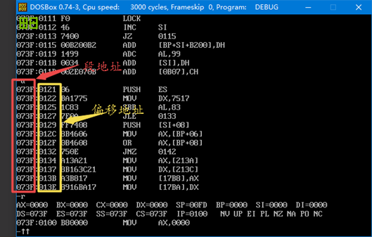

                               

存放段地址的：段地址寄存器

存放偏移地址的：偏移地址寄存器

 

段地址寄存器 : 偏移地址寄存器

DS            SP

ES            BP

SS            SI

CS            DI

​              IP

​              BX

 

8086CPU 有20根地址线     0000 0000 0000 0000 0000 ~ 1111 1111 1111 111 1111     0~FFFFF H

 

地址线的数量决定了CPU的寻址能力

地址加法器  è 地址的计算方式

计算方法：

**物理地址 = 段地址 x 16(10H) + 偏移地址**

**基础地址 = 段地址 x 16(10H)**

**物理地址 = 基础地址 + 偏移地址**