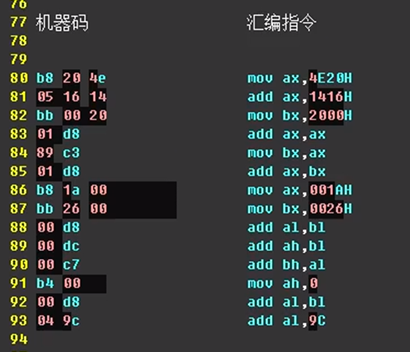

u指令 à 将某个内存地址 开始的字节 全部当作 指令

d指令 à 将某个内存地址 开始的字节 全部当作 数据

 

CPU 中怎么表示内存地址的？

通过段地址寄存器和偏移地址寄存器

 

**8086CPU中，在任意时刻，CPU将CS:IP所指向的全部当作指令来执行**

 

在内存中，指令和数据是没有任何区别的。二者都是二进制信息，CPU只有在工作的时候才将有的信息当作指令，有的信息当作数据。

 

CPU根据什么将内存汇总的信息当作指令？

​    **CPU将CS：IP开始指向的内存单元中的内容当作指令**

 

​                               

 

将上面的机器码用 e 指令输入到2000:0这个位置

【内存也是内存，翻译成汇编指令 被当作指令来执行】

 

指令和数据在内存中有区别吗？   没有

**CPU****中的CS段地址和IP偏移地址寄存器组合的时候从中读取内容，当作指令执行！！**

**使用：-r CS 指令可以修改CS指向的地址**

​     **-r IP** **修改IP指向的地址**

 

**总结：**

**CPU** **任意时刻将 段寄存器CS 和 偏移地址寄存器 IP 组合出来的地址 从中读取出来的内容当作指令**