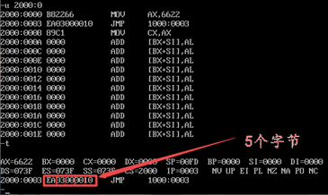

关系：指令是有长度的 一条指令可以由多个字节构成

 

**指令的执行过程：**

**1.**   **CPU****从CS：IP所指向的内存单元中读取指令，存放到 指令缓存器 中**

**2.**   **IP = IP +** **所读指令的长度，从而指向下一条指令**

**3.**   **执行 指令缓存器 中的内容，回到步骤1**

 

**汇编指令：jmp – jump的简写**

**jmp** **è** **转移指令，可以修改CS和IP这两个寄存器，决定了CPU从哪里读取指令**

​    -a jmp 2000:0 à 将CS：IP替换为2000:0

​    -a jmp 寄存器，比如jmp ip, ax à 将**IP**中的内容替换为ax中的内容

-a jmp 寄存器，比如jmp bx à 将**IP**中的内容替换为bx中的内容

Call 转移指令 – 会把当前地址暂存起来，类似于PUSH？            存疑

Ret 转移指令 – 取回call暂存的指令到IP中，类似于POP？         存疑

 

**【上机测试】测试：**

​                                 假设CS = 2000H，IP = 0000 写出下列指令的执行过程

A 2000:0           CS = 2000   IP = 0

MOV AX, 6622H     CS = 2000   IP = 0 + 3 = 3D

JMP 1000:3         CS = 2000   IP = 3 + 5 = 8D 

MOV CX, AX

 

A 1000:0           CS = 1000   IP = 3D

MOV AX, 0123H     

MOV AX, 0         CS = 1000   IP = 3 + 3 = 6D

MOV BX, AX        CS = 1000   IP = 6 + 2 = 8D

JMP BX            CS = 1000   IP = 8 + 2 = 10D

MOV CX, 0

