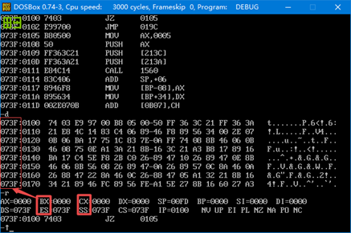

内存编号为什么是 073F:02CE 这样的形式？

内存编号为什么是从0开始？

 

端口号：CPU也给鼠标键盘，麦克风，音响 编了号，通过这些编号可以读取设备状态

CPU通过内存地址访问内存空间

 

RAM – 断电丢失指令和数据      允许读取和写入

ROM – 断电存在               只允许写入

 

GPU – 图形处理芯片     很久以前没有这玩意    现在对图形要求越来越高，需要分工，GPU专门对图形处理

GPU有专门的编程语言去编程 需要比较强的物理和数学知识 è 果断放弃

从B800:0000 400 开始当做显存就可以

 

汇编语言是针对CPU的，针对CPU 的地址线，数据线，控制线

CPU中一定有可以存放 地址信息 数据信息的地方è寄存器

汇编程序员就是通过汇编语中的汇编指令去修改寄存器中的内容，从而控制CPU，从而控制整个计算机

 

MOV AX,0005       AX-数据寄存器

 

​                               

DS ES SS CS 都是冒号左边的一种地址信息      IP比较像